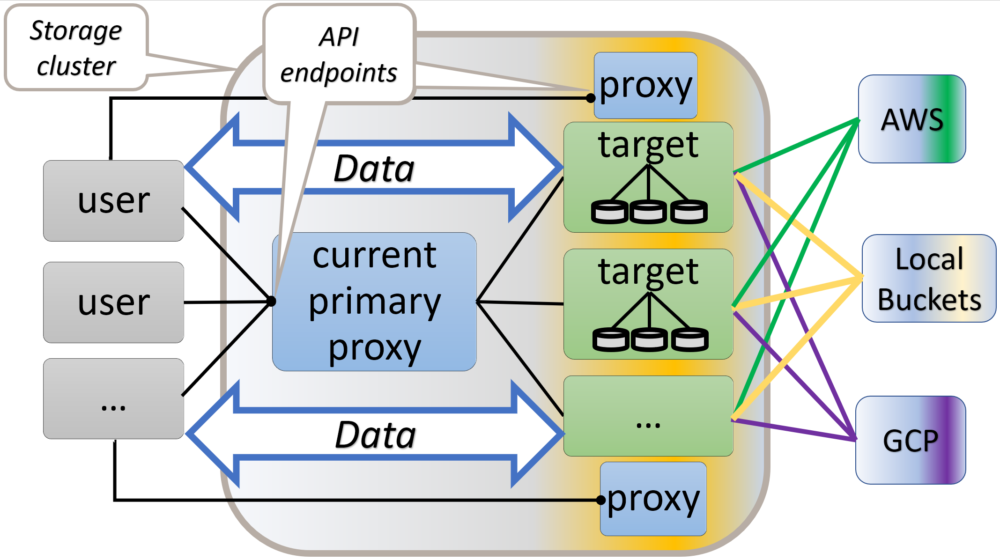
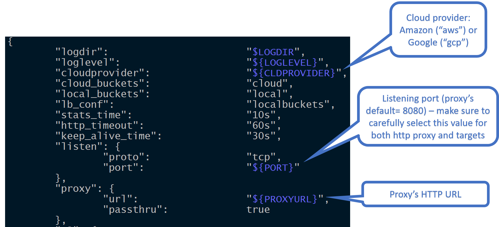
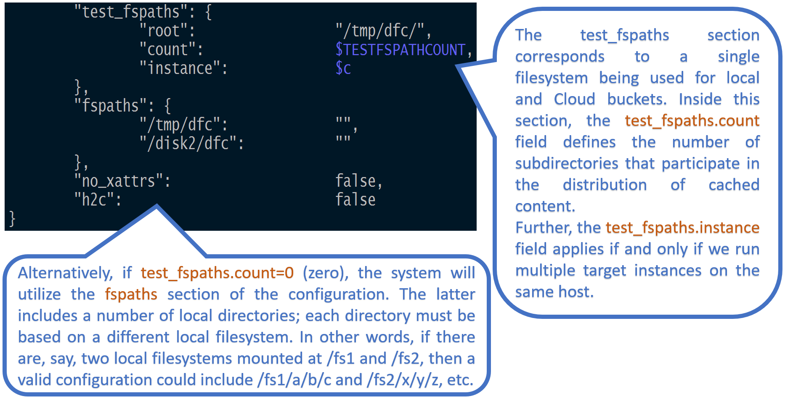
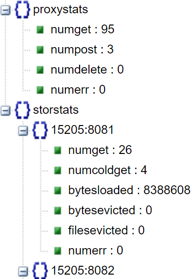
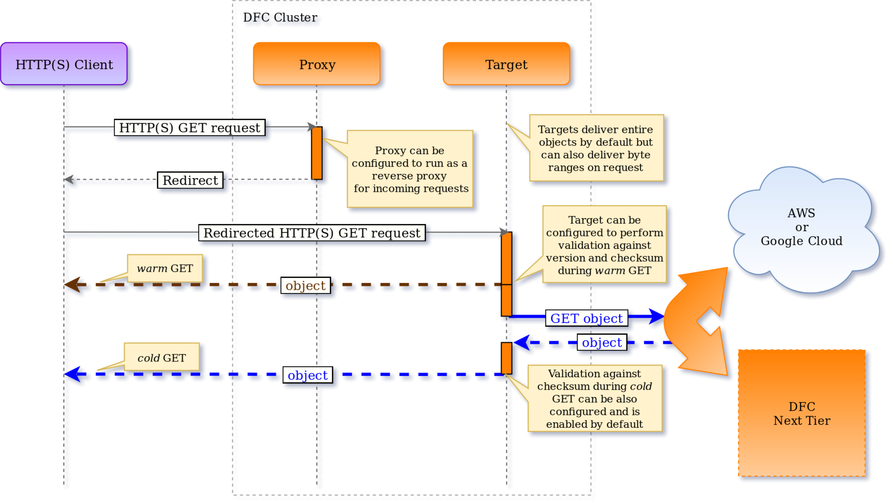
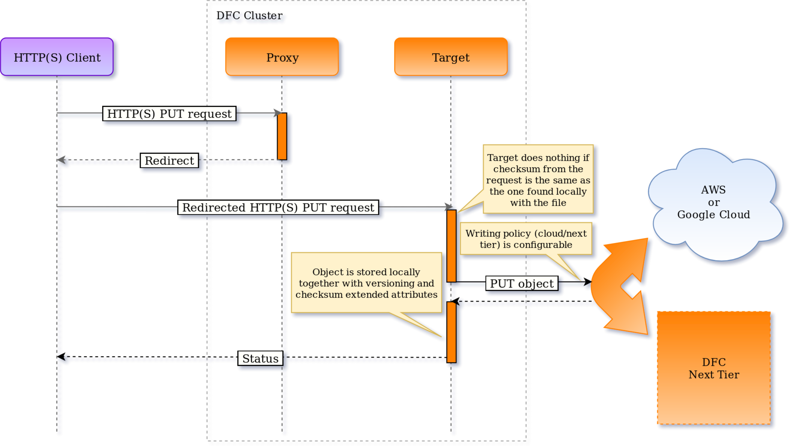
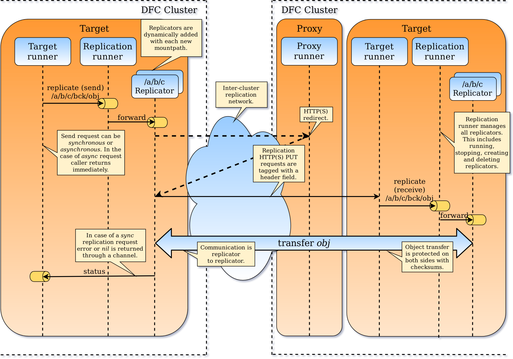
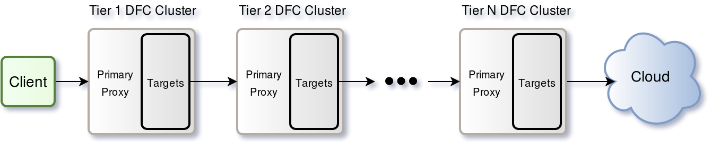

DFC: Distributed File Cache with Amazon and Google Cloud Backends
-----------------------------------------------------------------

## Overview

DFC is a simple distributed caching service written in Go. The service consists of an arbitrary numbers of gateways (realized as HTTP **proxy** servers) and storage **targets** utilizing local disks:



Users connect to the proxies and execute RESTful commands. Data then moves directly between storage targets (that store or cache this data) and the requesting HTTP or HTTPS clients. All DFC proxies/gateways provide API endpoints and are identical, functionality-wise, as far as user-accessible control and data planes.


## Table of Contents

- [Overview](#overview)
- [Table of Contents](#table-of-contents)
- [Prerequisites](#prerequisites)
- [Getting Started](#getting-started)
    - [Quick trial start with Docker](#quick-trial-start-with-docker)
    - [Quick trial start with DFC as an HTTP proxy](#quick-trial-start-with-dfc-as-an-http-proxy)
    - [Regular installation](#regular-installation)
    - [A few tips](#a-few-tips)
- [Helpful Links: Go](#helpful-links-go)
- [Helpful Links: AWS](#helpful-links-aws)
- [Configuration](#configuration)
    - [Runtime configuration](#runtime-configuration)
    - [Managing filesystems](#managing-filesystems)
    - [Disabling extended attributes](#disabling-extended-attributes)
    - [Enabling HTTPS](#enabling-https)
    - [Filesystem Health Checker](#filesystem-health-checker)
    - [Networking](#networking)
    - [Reverse proxy](#reverse-proxy)
- [Performance tuning](#performance-tuning)
- [Performance testing](#performance-testing)
- [REST Operations](#rest-operations)
    - [Querying information](#querying-information)
    - [Example: querying runtime statistics](#example-querying-runtime-statistics)
- [Read and Write Data Paths](#read-and-write-data-paths)
    - [`GET`](#get)
    - [`PUT`](#put)
- [List Bucket](#list-bucket)
        - [properties-and-options](#properties-and-options)
        - [Example: listing local and Cloud buckets](#example-listing-local-and-cloud-buckets)
        - [Example: Listing all pages](#example-listing-all-pages)
- [Cache Rebalancing](#cache-rebalancing)
- [List/Range Operations](#listrange-operations)
        - [List](#list)
        - [Range](#range)
        - [Examples](#examples)
- [Joining a Running Cluster](#joining-a-running-cluster)
- [Highly Available Control Plane](#highly-available-control-plane)
    - [Bootstrap](#bootstrap)
    - [Election](#election)
    - [Non-electable gateways](#non-electable-gateways)
    - [Metasync](#metasync)
- [WebDAV](#webdav)
- [Extended Actions (xactions)](#extended-actions-xactions)
    - [Throttling of Xactions](#throttling-of-xactions)
- [Replication](#replication)
- [Multi-tiering](#multi-tiering)
- [Bucket-specific Configuration](#bucket-specific-configuration)
    - [Checksumming](#checksumming)
    - [LRU](#lru)
- [Object checksums: brief theory of operations](#object-checksums-brief-theory-of-operations)
- [Command-line Load Generator](#command-line-load-generator)
- [Metrics with StatsD](#metrics-with-statsd)
        - [Proxy metrics:](#proxy-metrics)
        - [Target Metrics](#target-metrics)
        - [Disk Metrics](#disk-metrics)
        - [Keepalive Metrics](#keepalive-metrics)
        - [dfcloader Metrics](#dfcloader-metrics)


## Prerequisites

* Linux (with sysstat and attr packages)
* [Go 1.9 or later](https://golang.org/dl/)
* Optionally, extended attributes (xattrs)
* Optionally, Amazon (AWS) or Google Cloud (GCP) account

Some Linux distributions do not include sysstat and/or attr packages - to install, use 'apt-get' (Debian), 'yum' (RPM), or other applicable package management tool, e.g.:

```shell
$ apt-get install sysstat
$ apt-get install attr
```

The capability called [extended attributes](https://en.wikipedia.org/wiki/Extended_file_attributes), or xattrs, is currently supported by all mainstream filesystems. Unfortunately, xattrs may not always be enabled in the OS kernel configurations - the fact that can be easily found out by running setfattr (Linux) or xattr (macOS) command as shown in this [single-host local deployment script](dfc/setup/deploy.sh).

If this is the case - that is, if you happen not to have xattrs handy, you can configure DFC not to use them at all (section **Configuration** below).

To get started, it is also optional (albeit desirable) to have access to an Amazon S3 or GCP bucket. If you don't have or don't want to use Amazon and/or Google Cloud accounts - or if you simply deploy DFC as a non-redundant object store - you can use so called *local buckets* as illustrated:

a) in the [REST Operations](#rest-operations) section below, and
b) in the [test sources](dfc/tests/regression_test.go)

Note that local and Cloud-based buckets support the same API with minor exceptions (only local buckets can be renamed, for instance).

## Getting Started

### Quick trial start with Docker

To get started quickly with a containerized, one-proxy, one-target deployment of DFC, see [Getting started quickly with DFC using Docker](docker/quick_start/README.md).

### Quick trial start with DFC as an HTTP proxy

1. Set the field `rproxy` to `cloud` or `target` in  [the configuration](dfc/setup/config.sh) prior to deployment.
2. Set the environment variable `http_proxy` (supported by most UNIX systems) to the primary proxy URL of your DFC cluster.

```shell
$ export http_proxy=<PRIMARY-PROXY-URL>
```

When these two are set, DFC will act as a reverse proxy for your outgoing HTTP requests. _Note that this should only be used for a quick trial of DFC, and not for production systems_.

### Regular installation

If you've already installed [Go](https://golang.org/dl/), getting started with DFC takes about 30 seconds:

```shell
$ cd $GOPATH/src
$ go get -v github.com/NVIDIA/dfcpub/dfc
$ cd github.com/NVIDIA/dfcpub/dfc
$ make deploy
$ BUCKET=<your bucket name> go test ./tests -v -run=down -numfiles=2
```

The `go get` command will install the DFC source code and all its versioned dependencies under your configured [$GOPATH](https://golang.org/cmd/go/#hdr-GOPATH_environment_variable).

The `make deploy` command deploys DFC daemons locally (for details, please see [the script](dfc/setup/deploy.sh)). If you'd want to enable optional DFC authentication server, execute instead:

```shell
$ CREDDIR=/tmp/creddir AUTHENABLED=true make deploy

```
For information about AuthN server, please see [AuthN documentation](./authn/README.md).

Finally, for the last command in the sequence above to work, you'll need to have a name - the bucket name.
The bucket could be an Amazon or GCP based one, **or** a DFC-own *local bucket*.

Assuming the bucket exists, the `go test` command above will download two objects.

Similarly, assuming there's a bucket called "myS3bucket", the following command:


```shell
$ BUCKET=myS3bucket go test ./tests -v -run=download -args -numfiles=100 -match='a\d+'
```

downloads up to 100 objects from the bucket called myS3bucket, whereby names of those objects
will match 'a\d+' regex.

For more testing commands and command line options, please refer to the corresponding
[README](dfc/tests/README.md) and/or the [test sources](dfc/tests/).

For other useful commands, see the [Makefile](dfc/Makefile).

### A few tips

The following sequence downloads up to 100 objects from the bucket called "myS3bucket" and then finds the corresponding cached objects locally, in the local and Cloud bucket directories:

```shell
$ cd $GOPATH/src/github.com/NVIDIA/dfcpub/dfc/tests
$ BUCKET=myS3bucket go test -v -run=down
$ find /tmp/dfc -type f | grep local
$ find /tmp/dfc -type f | grep cloud
```

This, of course, assumes that all DFC daemons are local and non-containerized (don't forget to run `make deploy` to make it happen) - and that the "test_fspaths" sections in their respective configurations point to the /tmp/dfc.

To show all existing buckets, run:

```shell
$ cd $GOPATH/src/github.com/NVIDIA/dfcpub
$ BUCKET=x go test ./dfc/tests -v -run=bucketnames
```

Note that the output will include both local and Cloud bucket names.

Further, to locate DFC logs, run:

```shell
$ find $LOGDIR -type f | grep log
```

where $LOGDIR is the configured logging directory as per [DFC configuration](dfc/setup/config.sh).


To terminate a running DFC service and cleanup local caches, run:
```shell
$ make kill
$ make rmcache
```

## Helpful Links: Go

* [How to write Go code](https://golang.org/doc/code.html)

* [How to install Go binaries and tools](https://golang.org/doc/install)

* [The Go Playground](https://play.golang.org/)

* [Go language support for Vim](https://github.com/fatih/vim-go)
  (note: if you are a VIM user vim-go plugin is invaluable)

* [Go lint tools to check Go source for errors and warnings](https://github.com/alecthomas/gometalinter)

## Helpful Links: AWS

* [AWS Command Line Interface](https://docs.aws.amazon.com/cli/latest/userguide/cli-chap-getting-started.html)

* [AWS S3 Tutorial For Beginners](https://www.youtube.com/watch?v=LfBn5Y1X0vE)


## Configuration

DFC configuration is consolidated in a single [JSON file](dfc/setup/config.sh) where all of the knobs must be self-explanatory and the majority of those, except maybe just a few, have pre-assigned default values. The notable exceptions include:



and



As shown above, the "test_fspaths" section of the configuration corresponds to a single local filesystem being partitioned between both local and Cloud buckets. In production deployments, we use the (alternative) "fspaths" section that includes a number of local directories, whereby each directory is based on a different local filesystem. An example of 12 fspaths (and 12 local filesystems) follows below:


### Runtime configuration

In most cases restart of the node is required after changing any of its configuration options. But a number of options can be modified on the fly using [REST API](#rest-operations).

Each option can be set for an individual daemon, by sending a request to the daemon URL /v1/daemon or, for the entire cluster, by sending a request to the URL /v1/cluster of any proxy or gateway. In the latter case the primary proxy broadcasts the new value to all proxies and targets after it updates its local configuration.

Both a proxy and a storage target support the same set of runtime options but a proxy uses only a few of them. The list of options which affect proxy includes `loglevel`, `vmodule`, `dest_retry_time`, `default_timeout`, and `default_long_timeout`.

Warning: as of the version 1.2, all changes done via REST API(below) are not persistent. The default values are also all as of version 1.2 and are subject to change in next versions.

| Option | Default value | Description |
|---|---|---|
| loglevel | 3 | Set global logging level. The greater number the more verbose log output |
| vmodule | "" | Overrides logging level for a given modules.<br>{"name": "vmodule", "value": "target\*=2"} sets log level to 2 for target modules |
| stats_time | 10s | A node periodically does 'housekeeping': updates internal statistics, remove old logs, and executes extended actions prefetch and LRU waiting in the line |
| dont_evict_time | 120m | LRU does not evict an object which was accessed less than dont_evict_time ago |
| disk_util_low_wm | 60 | Operations that implement self-throttling mechanism, e.g. LRU, do not throttle themselves if disk utilization is below `disk_util_low_wm` |
| disk_util_high_wm | 80 | Operations that implement self-throttling mechanism, e.g. LRU, turn on maximum throttle if disk utilization is higher than `disk_util_high_wm` |
| capacity_upd_time | 10m | Determines how often DFC updates filesystem usage |
| dest_retry_time | 2m | If a target does not respond within this interval while rebalance is running the target is excluded from rebalance process |
| send_file_time | 5m | Timeout for getting object from neighbor target or for sending an object to the correct target while rebalance is in progress |
| default_timeout | 30s | Default timeout for quick intra-cluster requests, e.g. to get daemon stats |
| default_long_timeout | 30m | Default timeout for long intra-cluster requests, e.g. reading an object from neighbor target while rebalancing |
| lowwm | 75 | If filesystem usage exceeds `highwm` LRU tries to evict objects so the filesystem usage drops to `lowwm` |
| highwm | 90 | LRU starts immediately if a filesystem usage exceeds the value |
| lru_enabled | true | Enables and disabled the LRU |
| rebalancing_enabled | true | Enables and disables automatic rebalance after a target receives the updated cluster map. If the(automated rebalancing) option is disabled, you can still use the REST API(`PUT {"action": "rebalance" v1/cluster`) to initiate cluster-wide rebalancing operation |
| validate_checksum_cold_get | true | Enables and disables checking the hash of received object after downloading it from the cloud or next tier |
| validate_checksum_warm_get | false | If the option is enabled, DFC checks the object's version (for a Cloud-based bucket), and an object's checksum. If any of the values(checksum and/or version) fail to match, the object is removed from local storage and (automatically) with its Cloud or next DFC tier based version |
| checksum | xxhash | Hashing algorithm used to check if the local object is corrupted. Value 'none' disables hash sum checking. Possible values are 'xxhash' and 'none' |
| versioning | all | Defines what kind of buckets should use versioning to detect if the object must be redownloaded. Possible values are 'cloud', 'local', and 'all' |
| fschecker_enabled | true | Enables and disables filesystem health checker (FSHC) |

### Managing filesystems

Configuration option `fspaths` specifies the list of local directories where storage targets store objects. An `fspath` aka `mountpath` (both terms are used interchangeably) is, simply, a local directory serviced by a local filesystem.

NOTE: there must be a 1-to-1 relationship between `fspath` and an underlying local filesystem. Note as well that this may be not the case for the development environments where multiple mountpaths are allowed to coexist within a single filesystem (e.g., tmpfs).

DFC REST API makes it possible to list, add, remove, enable, and disable a `fspath` (and, therefore, the corresponding local filesystem) at runtime. Filesystem's health checker (FSHC) monitors the health of all local filesystems: a filesystem that "accumulates" I/O errors will be disabled and taken out, as far as the DFC built-in mechanism of object distribution. For further details about FSHC and filesystem REST API, please [see FSHC readme](./health/fshc.md).

Warning: as of the version 1.2, all changes done via REST API are not persistent.

### Disabling extended attributes

To make sure that DFC does not utilize xattrs, configure "checksum"="none" and "versioning"="none" for all targets in a DFC cluster. This can be done via the [common configuration "part"](dfc/setup/config.sh) that'd be further used to deploy the cluster.

### Enabling HTTPS

To switch from HTTP protocol to an encrypted HTTPS, configure "use_https"="true" and modify "server_certificate" and "server_key" values so they point to your OpenSSL cerificate and key files respectively (see [DFC configuration](dfc/setup/config.sh)).

### Filesystem Health Checker

Default installation enables filesystem health checker component called FSHC. FSHC can be also disabled via section "fschecker" of the [configuration](dfc/setup/config.sh).

When enabled, FSHC gets notified on every I/O error upon which it performs extensive checks on the corresponding local filesystem. One possible outcome of this health-checking process is that FSHC disables the faulty filesystems leaving the target with one filesystem less to distribute incoming data.

Please see [FSHC readme](./health/fshc.md) for further details.

### Networking

In addition to user-accessible public network, DFC will optionally make use of the two other networks: internal (or intra-cluster) and replication. If configured via the [netconfig section of the configuration](dfc/setup/config.sh), the intra-cluster network is utilized for latency-sensitive control plane communications including keep-alive and [metasync](#metasync). The replication network is used, as the name implies, for a variety of replication workloads.

All the 3 (three) networking options are enumerated [here](common/network.go).

### Reverse proxy

DFC gateway can act as a reverse proxy vis-à-vis DFC storage targets. As of the v1.2, this functionality is restricted to GET requests only and must be used with caution and consideration. Related [configuration variable](dfc/setup/config.sh) is called "rproxy" - see sub-section "http" of the section "netconfig". To eliminate HTTP redirects, simply set the "rproxy" value to "target" ("rproxy": "target").

## Performance tuning

DFC utilizes local filesystems, which means that under pressure a DFC target will have a significant number of open files. This is often the case when running stress tests that perform highly-intensive, concurrent object PUT operations. In the event that errors stating `too many open files` are encountered, system settings must be changed. To overcome the system's default `ulimit`, have the following 3 lines in each target's `/etc/security/limits.conf`:

```
root             hard    nofile          10240
ubuntu           hard    nofile          1048576
ubuntu           soft    nofile          1048576
```
After restarting, confirm that the limits have been increased accordingly using 
```shell
ulimit -n
```

If you find that the result is still lower than expected, take the additional steps of modifying
both `/etc/systemd/system.conf` and `/etc/systemd/user.conf` to change the value of `DefaultLimitNOFILE` to the desired limit. If that line does not exist, append it under the `Manager` section of those two files as such:
```
DefaultLimitNOFILE=$desiredLimit
```

Additionally, add the following line to the end of `/etc/sysctl.conf`:
```
fs.file-max=$desiredLimit
```

After a restart, verify using the same command, `ulimit -n`, that the limit for the number of open files has been increased accordingly.

For more information, refer to this [link](https://ro-che.info/articles/2017-03-26-increase-open-files-limit).

Generally, configuring a DFC cluster to perform under load is a vast topic that would be outside the scope of this README. The usual checklist includes (but is not limited to):

1. Setting MTU = 9000 (aka Jumbo frames)

2. Following instruction guidelines for the Linux distribution that you deploy, e.g.:
    - [Ubuntu Performance Tuning](https://wiki.mikejung.biz/Ubuntu_Performance_Tuning)
    - [Red Hat Enterprise Linux 7 Performance Tuning](https://access.redhat.com/documentation/en-us/red_hat_enterprise_linux/7/pdf/performance_tuning_guide/Red_Hat_Enterprise_Linux-7-Performance_Tuning_Guide-en-US.pdf)

3. Tuning TCP stack - in part, increasing the TCP send and receive buffer sizes:

```shell
$ sysctl -a | grep -i wmem
$ sysctl -a | grep -i ipv4
```

And more.

Virtualization overhead may require a separate investigation. It is strongly recommended that a (virtualized) DFC storage node (whether it's a gateway or a target) would have a direct and non-shared access to the (CPU, disk, memory and network) resources of its bare-metal host. Ensure that DFC VMs do not get swapped out when idle.

DFC storage node, in particular, needs to have a physical resource in its entirety: RAM, CPU, network and storage. The underlying hypervisor must "resort" to the remaining minimum that is absolutely required.

And, of course, make sure to use PCI passthrough for all local hard drives given to DFC.

Finally, to ease troubleshooting, consider the usual and familiar load generators such as `fio` and `iperf`, and observability tools: `iostat`, `mpstat`, `sar`, `top`, and more. For instance, `fio` and `iperf` may appear to be almost indispensable in terms of validating and then tuning performances of local storages and clustered networks, respectively. Goes without saying that it does make sense to do this type of basic checking-and-validating prior to running DFC under stressful workloads.

## Performance testing

[Command-line load generator](#command-line-load-generator) is a good tool to test overall DFC performance. But it does not show what local subsystem - disk or network one - is a bottleneck. DFC provides a way to switch off disk and/or network IO to test their impact on performance. It can be done by passing command line arguments or by setting environment variables. The environment variables have higher priority: if both a command line argument and an environment variable are defined then DFC uses the environment variable.

If any kind of IO is disabled then DFC sends a warning to stderr and turns off some internal features including object checksumming, versioning, atime and extended attributes management.

Warning: as of version 1.2, disabling and enabling IO on the fly is not supported, it must be done at target's startup.

| CLI argument | Environment variable | Default value | Description |
|---|---|---|---|
| nodiskio | DFCNODISKIO | false | true - disables disk IO. For GET requests a storage target does not read anything from disks - no file stat, file open etc - and returns an in-memory object with predefined size (see DFCDRYOBJSIZE variable). For PUT requests it reads the request's body to /dev/null.<br>Valid values are true or 1, and falseor 0 |
| nonetio | DFCNONETIO | false | true - disables HTTP read and write. For GET requests a storage target reads the data from disks but does not send bytes to a caller. It results in that the caller always gets an empty object. For PUT requests, after opening a connection, DFC reads the data from in-memory object and saves the data to disks.<br>Valid values are true or 1, and false or 0 |
| dryobjsize | DFCDRYOBJSIZE | 8m | A size of an object when a source is a 'fake' one: disk IO disabled for GET requests, and network IO disabled for PUT requests. The size is in bytes but suffixes can be used. The following suffixes are supported: 'g' or 'G' - GiB, 'm' or 'M' - MiB, 'k' or 'K' - KiB. Default value is '8m' - the size of an object is 8 megabytes |

Example of deploying a cluster with disk IO disabled and object size 256KB:

```
/opt/dfcpub/dfc$ DFCNODISKIO=true DFCDRYOBJSIZE=256k make deploy
```

Warning: the command-line load generator shows 0 bytes throughput for GET operations when network IO is disabled because a caller opens a connection but a storage target does not write anything to it. In this case the throughput can be calculated only indirectly by comparing total number of GETs or latency of the current test and those of previous test that had network IO enabled.

## REST Operations


DFC supports a growing number and variety of RESTful operations. To illustrate common conventions, let's take a look at the example:

```shell
$ curl -X GET http://localhost:8080/v1/daemon?what=config
```

This command queries the DFC configuration; at the time of this writing it'll result in a JSON output that looks as follows:

> {"smap":{"":{"node_ip_addr":"","daemon_port":"","daemon_id":"","direct_url":""},"15205:8081":{"node_ip_addr":"localhost","daemon_port":"8081","daemon_id":"15205:8081","direct_url":"http://localhost:8081"},"15205:8082":{"node_ip_addr":"localhost","daemon_port":"8082","daemon_id":"15205:8082","direct_url":"http://localhost:8082"},"15205:8083":{"node_ip_addr":"localhost","daemon_port":"8083","daemon_id":"15205:8083","direct_url":"http://localhost:8083"}},"version":5}

Notice the 4 (four) ubiquitous elements in the `curl` command line above:

1. HTTP verb aka method.

In the example, it's a GET but it can also be POST, PUT, and DELETE. For a brief summary of the standard HTTP verbs and their CRUD semantics, see, for instance, this [REST API tutorial](http://www.restapitutorial.com/lessons/httpmethods.html).

2. URL path: hostname or IP address of one of the DFC servers.

By convention, a RESTful operation performed on a DFC proxy server usually implies a "clustered" scope. Exceptions include querying
proxy's own configuration via `?what=config` query string parameter.

3. URL path: version of the REST API, resource that is operated upon, and possibly more forward-slash delimited specifiers.

For example: /v1/cluster where 'v1' is the currently supported API version and 'cluster' is the resource.

4. Control message in the query string parameter, e.g. `?what=config`.

> Combined, all these elements tell the following story. They specify the most generic action (e.g., GET) and designate the target aka "resource" of this action: e.g., an entire cluster or a given daemon. Further, they may also include context-specific and query string encoded control message to, for instance, distinguish between getting system statistics (`?what=stats`) versus system configuration (`?what=config`).

Note that 'localhost' in the examples below is mostly intended for developers and first time users that run the entire DFC system on their Linux laptops. It is implied, however, that the gateway's IP address or hostname is used in all other cases/environments/deployment scenarios.

| Operation | HTTP action | Example |
|--- | --- | ---|
| Unregister storage target | DELETE /v1/cluster/daemon/daemonID | `curl -i -X DELETE http://localhost:8080/v1/cluster/daemon/15205:8083` |
| Register storage target | POST /v1/cluster/register | `curl -i -X POST -H 'Content-Type: application/json' -d '{"node_ip_addr": "172.16.175.41", "daemon_port": "8083", "daemon_id": "43888:8083", "direct_url": "http://172.16.175.41:8083"}' http://localhost:8083/v1/cluster/register` |
| Set primary proxy forcefully(primary proxy)| PUT /v1/daemon/proxy/proxyID | `curl -i -X PUT -G http://localhost:8083/v1/daemon/proxy/23ef189ed  --data-urlencode "frc=true" --data-urlencode "can=http://localhost:8084"`  <sup id="a8">[8](#ft8)</sup>|
| Update individual DFC daemon (proxy or target) configuration | PUT {"action": "setconfig", "name": "some-name", "value": "other-value"} /v1/daemon | `curl -i -X PUT -H 'Content-Type: application/json' -d '{"action": "setconfig","name": "stats_time", "value": "1s"}' http://localhost:8081/v1/daemon`<br>Please see [runtime configuration](#runtime-configuration) for the option list |
| Set cluster-wide configuration (proxy) | PUT {"action": "setconfig", "name": "some-name", "value": "other-value"} /v1/cluster | `curl -i -X PUT -H 'Content-Type: application/json' -d '{"action": "setconfig","name": "stats_time", "value": "1s"}' http://localhost:8080/v1/cluster`<br>Please see [runtime configuration](#runtime-configuration) for the option list |
| Shutdown target/proxy | PUT {"action": "shutdown"} /v1/daemon | `curl -i -X PUT -H 'Content-Type: application/json' -d '{"action": "shutdown"}' http://localhost:8082/v1/daemon` |
| Shutdown cluster (proxy) | PUT {"action": "shutdown"} /v1/cluster | `curl -i -X PUT -H 'Content-Type: application/json' -d '{"action": "shutdown"}' http://localhost:8080/v1/cluster` |
| Rebalance cluster (proxy) | PUT {"action": "rebalance"} /v1/cluster | `curl -i -X PUT -H 'Content-Type: application/json' -d '{"action": "rebalance"}' http://localhost:8080/v1/cluster` |
| Get object (proxy) | GET /v1/objects/bucket-name/object-name | `curl -L -X GET http://localhost:8080/v1/objects/myS3bucket/myobject -o myobject` <sup id="a1">[1](#ft1)</sup> |
| Read range (proxy) | GET /v1/objects/bucket-name/object-name?offset=&length= | `curl -L -X GET http://localhost:8080/v1/objects/myS3bucket/myobject?offset=1024&length=512 -o myobject` |
| Put object (proxy) | PUT /v1/objects/bucket-name/object-name | `curl -L -X PUT http://localhost:8080/v1/objects/myS3bucket/myobject -T filenameToUpload` |
| Get bucket names | GET /v1/buckets/\* | `curl -X GET http://localhost:8080/v1/buckets/*` <sup>[6](#ft6)</sup> |
| List objects in bucket | POST {"action": "listobjects", "value":{  properties-and-options... }} /v1/buckets/bucket-name | `curl -X POST -L -H 'Content-Type: application/json' -d '{"action": "listobjects", "value":{"props": "size"}}' http://localhost:8080/v1/buckets/myS3bucket` <sup id="a2">[2](#ft2)</sup> |
| Rename/move object (local buckets) | POST {"action": "rename", "name": new-name} /v1/objects/bucket-name/object-name | `curl -i -X POST -L -H 'Content-Type: application/json' -d '{"action": "rename", "name": "dir2/DDDDDD"}' http://localhost:8080/v1/objects/mylocalbucket/dir1/CCCCCC` <sup id="a3">[3](#ft3)</sup> |
| Copy object | PUT /v1/objects/bucket-name/object-name?from_id=&to_id= | `curl -i -X PUT http://localhost:8083/v1/objects/mybucket/myobject?from_id=15205:8083&to_id=15205:8081` <sup id="a4">[4](#ft4)</sup> |
| Delete object | DELETE /v1/objects/bucket-name/object-name | `curl -i -X DELETE -L http://localhost:8080/v1/objects/mybucket/mydirectory/myobject` |
| Evict object from cache | DELETE '{"action": "evict"}' /v1/objects/bucket-name/object-name | `curl -i -X DELETE -L -H 'Content-Type: application/json' -d '{"action": "evict"}' http://localhost:8080/v1/objects/mybucket/myobject` |
| Create local bucket (proxy) | POST {"action": "createlb"} /v1/buckets/bucket-name | `curl -i -X POST -H 'Content-Type: application/json' -d '{"action": "createlb"}' http://localhost:8080/v1/buckets/abc` |
| Destroy local bucket (proxy) | DELETE {"action": "destroylb"} /v1/buckets/bucket-name | `curl -i -X DELETE -H 'Content-Type: application/json' -d '{"action": "destroylb"}' http://localhost:8080/v1/buckets/abc` |
| Rename local bucket (proxy) | POST {"action": "renamelb"} /v1/buckets/bucket-name | `curl -i -X POST -H 'Content-Type: application/json' -d '{"action": "renamelb", "name": "newname"}' http://localhost:8080/v1/buckets/oldname` |
| Set bucket props (proxy) | PUT {"action": "setprops"} /v1/buckets/bucket-name | `curl -i -X PUT -H 'Content-Type: application/json' -d '{"action":"setprops", "value": {"next_tier_url": "http://localhost:8082", "cloud_provider": "dfc", "read_policy": "cloud", "write_policy": "next_tier"}}' 'http://localhost:8080/v1/buckets/abc'` |
| Prefetch a list of objects | POST '{"action":"prefetch", "value":{"objnames":"[o1[,o]]"[, deadline: string][, wait: bool]}}' /v1/buckets/bucket-name | `curl -i -X POST -H 'Content-Type: application/json' -d '{"action":"prefetch", "value":{"objnames":["o1","o2","o3"], "deadline": "10s", "wait":true}}' http://localhost:8080/v1/buckets/abc` <sup>[5](#ft5)</sup> |
| Prefetch a range of objects| POST '{"action":"prefetch", "value":{"prefix":"your-prefix","regex":"your-regex","range","min:max" [, deadline: string][, wait:bool]}}' /v1/buckets/bucket-name | `curl -i -X POST -H 'Content-Type: application/json' -d '{"action":"prefetch", "value":{"prefix":"__tst/test-", "regex":"\\d22\\d", "range":"1000:2000", "deadline": "10s", "wait":true}}' http://localhost:8080/v1/buckets/abc` <sup>[5](#ft5)</sup> |
| Delete a list of objects | DELETE '{"action":"delete", "value":{"objnames":"[o1[,o]]"[, deadline: string][, wait: bool]}}' /v1/buckets/bucket-name | `curl -i -X DELETE -H 'Content-Type: application/json' -d '{"action":"delete", "value":{"objnames":["o1","o2","o3"], "deadline": "10s", "wait":true}}' http://localhost:8080/v1/buckets/abc` <sup>[5](#ft5)</sup> |
| Delete a range of objects| DELETE '{"action":"delete", "value":{"prefix":"your-prefix","regex":"your-regex","range","min:max" [, deadline: string][, wait:bool]}}' /v1/buckets/bucket-name | `curl -i -X DELETE -H 'Content-Type: application/json' -d '{"action":"delete", "value":{"prefix":"__tst/test-", "regex":"\\d22\\d", "range":"1000:2000", "deadline": "10s", "wait":true}}' http://localhost:8080/v1/buckets/abc` <sup>[5](#ft5)</sup> |
| Evict a list of objects | DELETE '{"action":"evict", "value":{"objnames":"[o1[,o]]"[, deadline: string][, wait: bool]}}' /v1/buckets/bucket-name | `curl -i -X DELETE -H 'Content-Type: application/json' -d '{"action":"evict", "value":{"objnames":["o1","o2","o3"], "dea1dline": "10s", "wait":true}}' http://localhost:8080/v1/buckets/abc` <sup>[5](#ft5)</sup> |
| Evict a range of objects| DELETE '{"action":"evict", "value":{"prefix":"your-prefix","regex":"your-regex","range","min:max" [, deadline: string][, wait:bool]}}' /v1/buckets/bucket-name | `curl -i -X DELETE -H 'Content-Type: application/json' -d '{"action":"evict", "value":{"prefix":"__tst/test-", "regex":"\\d22\\d", "range":"1000:2000", "deadline": "10s", "wait":true}}' http://localhost:8080/v1/buckets/abc` <sup>[5](#ft5)</sup> |
| Get bucket props | HEAD /v1/buckets/bucket-name | `curl -L --head http://localhost:8080/v1/buckets/mybucket` |
| Get object props | HEAD /v1/objects/bucket-name/object-name | `curl -L --head http://localhost:8080/v1/objects/mybucket/myobject` |
| Check if an object is cached | HEAD /v1/objects/bucket-name/object-name | `curl -L --head http://localhost:8080/v1/objects/mybucket/myobject?check_cached=true` |
| Set primary proxy (primary proxy only)| PUT /v1/cluster/proxy/new primary-proxy-id | `curl -i -X PUT http://localhost:8080/v1/cluster/proxy/26869:8080` |
| Disable mountpath in target | POST {"action": "disable", "value": "/existing/mountpath"} /v1/daemon/mountpaths | `curl -X POST -L -H 'Content-Type: application/json' -d '{"action": "disable", "value":"/mount/path"}' http://localhost:8083/v1/daemon/mountpaths`<sup>[7](#ft7)</sup> |
| Enable mountpath in target | POST {"action": "enable", "value": "/existing/mountpath"} /v1/daemon/mountpaths | `curl -X POST -L -H 'Content-Type: application/json' -d '{"action": "enable", "value":"/mount/path"}' http://localhost:8083/v1/daemon/mountpaths`<sup>[7](#ft7)</sup> |
| Add mountpath in target | PUT {"action": "add", "value": "/new/mountpath"} /v1/daemon/mountpaths | `curl -X PUT -L -H 'Content-Type: application/json' -d '{"action": "add", "value":"/mount/path"}' http://localhost:8083/v1/daemon/mountpaths` |
| Remove mountpath from target | DELETE {"action": "remove", "value": "/existing/mountpath"} /v1/daemon/mountpaths | `curl -X DELETE -L -H 'Content-Type: application/json' -d '{"action": "remove", "value":"/mount/path"}' http://localhost:8083/v1/daemon/mountpaths` |
___
<a name="ft1">1</a>: This will fetch the object "myS3object" from the bucket "myS3bucket". Notice the -L - this option must be used in all DFC supported commands that read or write data - usually via the URL path /v1/objects/. For more on the -L and other useful options, see [Everything curl: HTTP redirect](https://ec.haxx.se/http-redirects.html).

<a name="ft2">2</a>: See the List Bucket section for details. [↩](#a2)

<a name="ft3">3</a>: Notice the -L option here and elsewhere. [↩](#a3)

<a name="ft4">4</a>: Advanced usage only. [↩](#a4)

<a name="ft5">5</a>: See the List/Range Operations section for details.

<a name="ft6">6</a>: Query string parameter `?local=true` can be used to retrieve just the local buckets.

<a name="ft7">7</a>: The request returns an HTTP status code 204 if the mountpath is already enabled/disabled or 404 if mountpath was not found.

<a name="ft8">8</a>: Advanced usage only. Use it when the cluster is in split-brain mode. E.g, if the original primary proxy's network gets down for a while, the rest proxies vote and select new primary. After network is back the original proxy does not join the new primary automatically. It results in two primary proxies in a cluster. [↩](#a8)

### Querying information

DFC provides an extensive list of RESTful operations to retrieve cluster current state:

| Operation | HTTP action | Example |
|--- | --- | ---|
| Get cluster map | GET /v1/daemon | `curl -X GET http://localhost:8080/v1/daemon?what=smap` |
| Get proxy or target configuration| GET /v1/daemon | `curl -X GET http://localhost:8080/v1/daemon?what=config` |
| Get proxy/target info | GET /v1/daemon | `curl -X GET http://localhost:8083/v1/daemon?what=daemoninfo` |
| Get cluster statistics (proxy) | GET /v1/cluster | `curl -X GET http://localhost:8080/v1/cluster?what=stats` |
| Get target statistics | GET /v1/daemon | `curl -X GET http://localhost:8083/v1/daemon?what=stats` |
| Get rebalance statistics (proxy) | GET /v1/cluster | `curl -X GET 'http://localhost:8080/v1/cluster?what=xaction&props=rebalance'` |
| Get prefetch statistics (proxy) | GET /v1/cluster | `curl -X GET 'http://localhost:8080/v1/cluster?what=xaction&props=prefetch'` |
| Get list of target's filesystems (target) | GET /v1/daemon?what=mountpaths | `curl -X GET http://localhost:8084/v1/daemon?what=mountpaths` |
| Get list of all targets' filesystems (proxy) | GET /v1/cluster?what=mountpaths | `curl -X GET http://localhost:8080/v1/cluster?what=mountpaths` |
| Get target bucket list | GET /v1/daemon | `curl -X GET http://localhost:8083/v1/daemon?what=bucketmd` |

### Example: querying runtime statistics

```shell
$ curl -X GET http://localhost:8080/v1/cluster?what=stats
```

This single command causes execution of multiple `GET ?what=stats` requests within the DFC cluster, and results in a JSON-formatted consolidated output that contains both http proxy and storage targets request counters, as well as per-target used/available capacities. For example:



More usage examples can be found in the [the source](dfc/tests/regression_test.go).

## Read and Write Data Paths

`GET object` and `PUT object` are by far the most common operations performed by a DFC cluster.
As far as I/O processing pipeline, the first few steps of the GET and, respectively, PUT processing are
very similar if not identical:

1. Client sends a `GET` or `PUT` request to any of the DFC proxies/gateways.
2. The proxy determines which storage target to redirect the request to, the steps including:
    1. extract bucket and object names from the request;
    2. select storage target as an HRW function of the (cluster map, bucket, object) triplet,
       where HRW stands for [Highest Random Weight](https://en.wikipedia.org/wiki/Rendezvous_hashing);
       note that since HRW is a consistent hashing mechanism, the output of the computation will be
       (consistently) the same for the same `(bucket, object)` pair and cluster configuration.
    3. redirect the request to the selected target.
3. Target parses the bucket and object from the (redirected) request and determines whether the bucket
   is a DFC local bucket or a Cloud-based bucket.
4. Target then determines a `mountpath` (and therefore, a local filesystem) that will be used to perform
   the I/O operation. This time, the target computes HRW(configured mountpaths, bucket, object) on the
   input that, in addition to the same `(bucket, object)` pair includes all currently active/enabled mountpaths.
5. Once the highest-randomly-weighted `mountpath` is selected, the target then forms a fully-qualified name
   to perform the local read/write operation. For instance, given a `mountpath`  `/a/b/c`, the fully-qualified
   name may look as `/a/b/c/local/<bucket_name>/<object_name>` for a local bucket,
   or `/a/b/c/cloud/<bucket_name>/<object_name>` for a Cloud bucket.

Beyond these 5 (five) common steps the similarity between `GET` and `PUT` request handling ends, and the remaining steps include:

### `GET`

5. If the object already exists locally (meaning, it belongs to a DFC local bucket or the most recent version of a Cloud-based object is cached
   and resides on a local disk), the target optionally validates the object's checksum and version.
   This type of `GET` is often referred to as a "warm `GET`".
6. Otherwise, the target performs a "cold `GET`" by downloading the newest version of the object from the next DFC tier or from the Cloud.
7. Finally, the target delivers the object to the client via HTTP(S) response.



### `PUT`

5. If the object already exists locally and its checksum matches the checksum from the `PUT` request, processing stops because the object hasn't
   changed.
6. Target streams the object contents from an HTTP request to a temporary work file.
7. Upon receiving the last byte of the object, the target sends the new version of the object to the next DFC tier or the Cloud.
8. The target then writes the object to the local disk replacing the old one if it exists.
9. Finally, the target writes extended attributes that include the versioning and checksum information, and thus commits the PUT transaction.



## List Bucket

The ListBucket API returns a page of object names (and, optionally, their properties including sizes, creation times, checksums, and more), in addition to a token allowing the next page to be retrieved.

#### properties-and-options
The properties-and-options specifier must be a JSON-encoded structure, for instance '{"props": "size"}' (see examples). An empty structure '{}' results in getting just the names of the objects (from the specified bucket) with no other metadata.

| Property/Option | Description | Value |
| --- | --- | --- |
| props | The properties to return with object names | A comma-separated string containing any combination of: "checksum","size","atime","ctime","iscached","bucket","version","targetURL". <sup id="a6">[6](#ft6)</sup> |
| time_format | The standard by which times should be formatted | Any of the following [golang time constants](http://golang.org/pkg/time/#pkg-constants): RFC822, Stamp, StampMilli, RFC822Z, RFC1123, RFC1123Z, RFC3339. The default is RFC822. |
| prefix | The prefix which all returned objects must have | For example, "my/directory/structure/" |
| pagemarker | The token identifying the next page to retrieve | Returned in the "nextpage" field from a call to ListBucket that does not retrieve all keys. When the last key is retrieved, NextPage will be the empty string |
| pagesize | The maximum number of object names returned in response | Default value is 1000. GCP and local bucket support greater page sizes. AWS is unable to return more than [1000 objects in one page](https://docs.aws.amazon.com/AmazonS3/latest/API/RESTBucketGET.html). |\b

 <a name="ft6">6</a>: The objects that exist in the Cloud but are not present in the DFC cache will have their atime property empty (""). The atime (access time) property is supported for the objects that are present in the DFC cache. [↩](#a6)

#### Example: listing local and Cloud buckets

To list objects in the smoke/ subdirectory of a given bucket called 'myBucket', and to include in the listing their respective sizes and checksums, run:

```shell
$ curl -X POST -L -H 'Content-Type: application/json' -d '{"action": "listobjects", "value":{"props": "size, checksum", "prefix": "smoke/"}}' http://localhost:8080/v1/buckets/myBucket
```

This request will produce an output that (in part) may look as follows:


For many more examples, please refer to the [test sources](dfc/tests/) in the repository.

#### Example: Listing all pages

The following Go code retrieves a list of all of object names from a named bucket (note: error handling omitted):

```go
// e.g. proxyurl: "http://localhost:8080"
url := proxyurl + "/v1/buckets/" + bucket

msg := &api.ActionMsg{Action: dfc.ActListObjects}
fullbucketlist := &dfc.BucketList{Entries: make([]*dfc.BucketEntry, 0)}
for {
    // 1. First, send the request
    jsbytes, _ := json.Marshal(msg)
    r, _ := http.DefaultClient.Post(url, "application/json", bytes.NewBuffer(jsbytes))

    defer func(r *http.Response){
        r.Body.Close()
    }(r)

    // 2. Unmarshal the response
    pagelist := &dfc.BucketList{}
    respbytes, _ := ioutil.ReadAll(r.Body)
    _ = json.Unmarshal(respbytes, pagelist)

    // 3. Add the entries to the list
    fullbucketlist.Entries = append(fullbucketlist.Entries, pagelist.Entries...)
    if pagelist.PageMarker == "" {
        // If PageMarker is the empty string, this was the last page
        break
    }
    // If not, update PageMarker to the next page returned from the request.
    msg.GetPageMarker = pagelist.PageMarker
}
```

Note that the PageMarker returned as a part of pagelist is for the next page.

## Cache Rebalancing

DFC rebalances its cached content based on the DFC cluster map. When cache servers join or leave the cluster, the next updated version (aka generation) of the cluster map gets centrally replicated to all storage targets. Each target then starts, in parallel, a background thread to traverse its local caches and recompute locations of the cached items.

Thus, the rebalancing process is completely decentralized. When a single server joins (or goes down in a) cluster of N servers, approximately 1/Nth of the content will get rebalanced via direct target-to-target transfers.

## List/Range Operations

DFC provides two APIs to operate on groups of objects: List, and Range. Both of these share two optional parameters:

| Parameter | Description | Default |
|--- | --- | --- |
| deadline | The amount of time before the request expires formatted as a [golang duration string](https://golang.org/pkg/time/#ParseDuration). A timeout of 0 means no timeout.| 0 |
| wait | If true, a response will be sent only when the operation completes or the deadline passes. When false, a response will be sent once the operation is initiated. When setting wait=true, ensure your request has a timeout at least as long as the deadline. | false |

#### List

List APIs take a JSON array of object names, and initiate the operation on those objects.

| Parameter | Description |
| --- | --- |
| objnames | JSON array of object names |

#### Range

Range APIs take an optional prefix, a regular expression, and a numeric range. A matching object name will begin with the prefix and contain a number that satisfies both the regex and the range as illustrated below.


| Parameter | Description |
| --- | --- |
| prefix | The prefix that all matching object names will begin with. Empty prefix ("") will match all names. |
| regex | The regular expression, represented as an escaped string, to match the number embedded in the object name. Note that the regular expression applies to the entire name - the prefix (if provided) is not excluded. |
| range | Represented as "min:max", corresponding to the inclusive range from min to max. Either or both of min and max may be empty strings (""), in which case they will be ignored. If regex is an empty string, range will be ignored. |

#### Examples

| Prefix | Regex |  Escaped Regex | Range | Matches<br>(the match is highlighted) | Doesn't Match |
| --- | --- | --- | --- | --- | --- |
| "__tst/test-" | `"\d22\d"` | `"\\d22\\d"` | "1000:2000" | "__tst/test-`1223`"<br>"__tst/test-`1229`-4000.dat"<br>"__tst/test-1111-`1229`.dat"<br>"__tst/test-`1222`2-40000.dat" | "__prod/test-1223"<br>"__tst/test-1333"<br>"__tst/test-2222-4000.dat" |
| "a/b/c" | `"^\d+1\d"` | `"^\\d+1\\d"` | ":100000" | "a/b/c/`110`"<br>"a/b/c/`99919`-200000.dat"<br>"a/b/c/`2314`video-big" | "a/b/110"<br>"a/b/c/d/110"<br>"a/b/c/video-99919-20000.dat"<br>"a/b/c/100012"<br>"a/b/c/30331" |

## Joining a Running Cluster

DFC clusters can be deployed with an arbitrary number of DFC proxies. Each proxy/gateway provides full access to the clustered objects and collaborates with all other proxies to perform majority-voted HA failovers (section [Highly Available Control Plane](#highly-available-control-plane) below).

Not all proxies are equal though. Two out of all proxies can be designated via [DFC configuration](dfc/setup/config.sh)) as an "original" and a "discovery." The "original" one (located at the configurable "original_url") is expected to point to the primary at the cluster initial deployment time.

Later on, when and if an HA event triggers automated failover, the role of the primary will be automatically assumed by a different proxy/gateway, with the corresponding cluster map (Smap) update getting synchronized across all running nodes.

A new node, however, could potentially experience a problem when trying to join an already deployed and running cluster - simply because its configuration may still be referring to the old primary. The "discovery_url" (see [DFC configuration](dfc/setup/config.sh)) is precisely intended to address this scenario.

Here's how a new node joins a running DFC cluster:

- first, there's the primary proxy/gateway referenced by the current cluster map (Smap) and/or - during the cluster deployment time - by the configured "primary_url" (see [DFC configuration](dfc/setup/config.sh))

- if joining via the "primary_url" fails, then the new node goes ahead and tries the alternatives:
  - "discovery_url"
  - "original_url"
- but only if those are defined and different from the previously tried.

## Highly Available Control Plane

DFC cluster will survive a loss of any storage target and any gateway including the primary gateway (leader). New gateways and targets can join at any time – including the time of electing a new leader. Each new node joining a running cluster will get updated with the most current cluster-level metadata.
Failover – that is, the election of a new leader – is carried out automatically on failure of the current/previous leader. Failback on the hand – that is, administrative selection of the leading (likely, an originally designated) gateway – is done manually via DFC REST API (section [REST Operations](#rest-operations)).

It is, therefore, recommended that DFC cluster is deployed with multiple proxies aka gateways (the terms that are interchangeably used throughout the source code and this README).

When there are multiple proxies, only one of them acts as the primary while all the rest are, respectively, non-primaries. The primary proxy's (primary) responsibility is serializing updates of the cluster-level metadata (which is also versioned and immutable).

Further:

- Each proxy/gateway stores a local copy of the cluster map (Smap)
- Each Smap instance is immutable and versioned; the versioning is monotonic (increasing)
- Only the current primary (leader) proxy distributes Smap updates to all other clustered nodes

### Bootstrap

The proxy's bootstrap sequence initiates by executing the following three main steps:

- step 1: load a local copy of the cluster map and try to use it for the discovery of the current one;
- step 2: use the local configuration and the local Smap to perform the discovery of the cluster-level metadata;
- step 3: use all of the above _and_ the environment setting "DFCPRIMARYPROXY" to figure out whether this proxy must keep starting up as a primary (otherwise, join as a non-primary).

Further, the (potentially) primary proxy executes more steps:

- (i)    initialize empty Smap;
- (ii)   wait a configured time for other nodes to join;
- (iii)  merge the Smap containing newly joined nodes with the Smap that was previously discovered;
- (iiii) and use the latter to rediscover cluster-wide metadata and resolve remaining conflicts, if any.

If during any of these steps the proxy finds out that it must be joining as a non-primary then it simply does so.

### Election

The primary proxy election process is as follows:

- A candidate to replace the current (failed) primary is selected;
- The candidate is notified that an election is commencing;
- After the candidate (proxy) confirms that the current primary proxy is down, it broadcasts vote requests to all other nodes;
- Each recipient node confirms whether the current primary is down and whether the candidate proxy has the HRW (Highest Random Weight) according to the local Smap;
- If confirmed, the node responds with Yes, otherwise it's a No;
- If and when the candidate receives a majority of affirmative responses it performs the commit phase of this two-phase process by distributing an updated cluster map to all nodes.

### Non-electable gateways

DFC cluster can be *stretched* to collocate its redundant gateways with the compute nodes. Those non-electable local gateways ([DFC configuration](dfc/setup/config.sh)) will only serve as access points but will never take on the responsibility of leading the cluster.

### Metasync

By design DFC does not have a centralized (SPOF) shared cluster-level metadata. The metadata consists of versioned objects: cluster map, buckets (names and properties), authentication tokens. In DFC, these objects are consistently replicated across the entire cluster – the component responsible for this is called [metasync](dfc/metasync.go). DFC metasync makes sure to keep cluster-level metadata in-sync at all times.

## WebDAV

WebDAV aka "Web Distributed Authoring and Versioning" is the IETF standard that defines HTTP extension for collaborative file management and editing. DFC WebDAV server is a reverse proxy (with interoperable WebDAV on the front and DFC's RESTful interface on the back) that can be used with any of the popular [WebDAV-compliant clients](https://en.wikipedia.org/wiki/Comparison_of_WebDAV_software).

For information on how to run it and details, please refer to the [WebDAV README](webdav/README.md).

## Extended Actions (xactions)

Extended actions (xactions) are the operations that may take seconds, sometimes minutes or even hours, to execute. Xactions run asynchronously, have one of the enumerated kinds, start/stop times, and xaction-specific statistics.

Extended actions throttle themselves based on xaction-specific configurable watermarks and local system utilizations. Extended action that runs LRU-based evictions, for instance, will perform the "balancing act" (of running faster or slower) by taking into account remaining free local capacity as well as the current target's utilization.

Examples of the supported extended actions include:

* Cluster-wide rebalancing
* LRU-based eviction
* Prefetch
* Consensus voting when electing a new leader
* Object re-checksumming

At the time of this writing the corresponding RESTful API (section [REST Operations](#rest-operations)) includes support for querying two xaction kinds: "rebalance" and "prefetch". The following command, for instance, will query the cluster for an active/pending rebalancing operation (if presently running), and report associated statistics:

```shell
$ curl -X GET http://localhost:8080/v1/cluster?what=xaction&props=rebalance
```

### Throttling of Xactions
DFC supports throttling Xactions based on disk utilization. This is governed by two parameters in the [configuration file](dfc/setup/config.sh) - 'disk_util_low_wm' and 'disk_util_high_wm'. If the disk utilization is below the low watermark then the xaction is not throttled; if it is above the watermark, the xaction is throttled with a sleep duration which increases or decreases linearly with the disk utilization. The throttle duration maxes out at 1 second.

At the time of this writing, only LRU and re-checksumming support throttling.

## Replication

Object replication (service) sends and receives objects via HTTP(S). Each replicating worker (aka _replicator_) is associated with a single configured local filesystem and is tasked with queuing and subsequent FIFO processing of *replication requests*. To isolate the, potentially, massive replication traffic from all other intra- and inter-cluster workloads, the service can be configured to utilize a separate network. Replication transfers themselves are end-to-end protected by checksums.

The picture below illustrates some of the aspects of replication service as far as its design and data flows.



**Note:** The service is currently in its prototype stage and is not yet available.

## Multi-tiering

DFC can be deployed with multiple consecutive DFC clusters aka "tiers" sitting behind a primary tier. This provides the option to use a multi-level cache architecture.



Tiering is configured at the bucket level by setting bucket properties, for example:

```shell
$ curl -i -X PUT -H 'Content-Type: application/json' -d '{"action":"setprops", "value": {"next_tier_url": "http://localhost:8082", "read_policy": "cloud", "write_policy": "next_tier"}}' 'http://localhost:8080/v1/buckets/<bucket-name>'
```

The following fields are used to configure multi-tiering:

* `next_tier_url`: an absolute URI corresponding to the primary proxy of the next tier configured for the bucket specified
* `read_policy`: `"next_tier"` or `"cloud"` (defaults to `"next_tier"` if not set)
* `write_policy`: `"next_tier"` or `"cloud"` (defaults to `"cloud"` if not set)

For the `"next_tier"` policy, a tier will read or write to the next tier specified by the `next_tier_url` field. On failure, it will read or write to the cloud (aka AWS or GCP).

For the `"cloud"` policy, a tier will read or write to the cloud (aka AWS or GCP) directly from that tier.

Currently, the endpoints which support multi-tier policies are the following:

* GET /v1/objects/bucket-name/object-name
* PUT /v1/objects/bucket-name/object-name

## Bucket-specific Configuration
Global configuration of buckets is done by default using the fields provided in `config.sh`, but certain bucket properties pertaining to checksumming and LRU can be specified at a more granular level - namely, on a per bucket basis.

### Checksumming

Checksumming on bucket level is configured by setting bucket properties:

* `cksum_config.checksum`: `"none"`,`"xxhash"` or `"inherit"` configure hashing type. Value
`"inherit"` indicates that the global checksumming configuration should be used.
* `cksum_config.validate_checksum_cold_get`: `true` or `false` indicate
whether to perform checksum validation during cold GET.
* `cksum_config.validate_checksum_warm_get`: `true` or `false` indicate
whether to perform checksum validation during warm GET.
* `cksum_config.enable_read_range_checksum`: `true` or `false` indicate whether to perform checksum validation during byte serving.

Value for the `checksum` field (see above) *must* be provided *every* time the bucket properties are updated, otherwise the request will be rejected.

Example of setting bucket properties:
```shell
$ curl -i -X PUT -H 'Content-Type: application/json' -d '{"action":"setprops", "value": {"cksum_config": {"checksum": "xxhash", "validate_checksum_cold_get": true, "validate_checksum_warm_get": false, "enable_read_range_checksum": false}}}' 'http://localhost:8080/v1/buckets/<bucket-name>'
```

### LRU

Overriding the global configuration can be achieved by specifying the fields of the `LRUProps` instance of the `lruconfig` struct that encompasses all LRU configuration fields.

* `lru_props.lowwm`: integer in the range [0, 100], representing the capacity usage low watermark
* `lru_props.highwm`: integer in the range [0, 100], representing the capacity usage high watermark
* `lru_props.atime_cache_max`: positive integer representing the maximum number of entries
* `lru_props.dont_evict_time`: string that indicates eviction-free period [atime, atime + dont]
* `lru_props.capacity_upd_time`: string indicating the minimum time to update capacity
* `lru_props.lru_enabled`: bool that determines whether LRU is run or not; only runs when true

**NOTE**: In setting bucket properties for LRU, any field that is not explicitly specified is defaulted to the data type's zero value.
Example of setting bucket properties:
```shell
$ curl -i -X PUT -H 'Content-Type: application/json' -d '{"action":"setprops","value":{"cksum_config":{"checksum":"none","validate_checksum_cold_get":true,"validate_checksum_warm_get":true,"enable_read_range_checksum":true},"lru_props":{"lowwm":1,"highwm":100,"atime_cache_max":1,"dont_evict_time":"990m","capacity_upd_time":"90m","lru_enabled":true}}}' 'http://localhost:8080/v1/buckets/<bucket-name>'
```

To revert a bucket's entire configuration back to use global parameters, use `"action":"resetprops"` to the same PUT endpoint as above as such:
```shell
$ curl -i -X PUT -H 'Content-Type: application/json' -d '{"action":"resetprops"}' 'http://localhost:8080/v1/buckets/<bucket-name>'
```

## Object checksums: brief theory of operations

1. objects are stored in the cluster with their content checksums and in accordance with their bucket configurations.

2. xxhash is the system-default checksum.

3. user can override the system default on a bucket level, by setting checksum=none.

4. bucket (re)configuration can be done at any time. Bucket's checksumming option can be changed from xxhash to none and back, potentially multiple times and with no limitations.

5. an object with a bad checksum cannot be retrieved (via GET) and cannot be replicated or migrated. Corrupted objects get eventually removed from the system.

6. GET and PUT operations support an option to validate checksums. The validation is done against a checksum stored with an object (GET), or a checksum provided by a user (PUT).

7. object replications and migrations are always checksum-protected. If an object does not have checksum (see #3 above), the latter gets computed on the fly and stored with the object, so that subsequent replications/migrations could reuse it.

8. when two objects in the cluster have identical (bucket, object) names and checksums, they are considered to be full replicas of each other - the fact that allows optimizing PUT,replication, and object migration in a variety of use cases.

## Command-line Load Generator

`dfcloader` is a command-line tool that is included with DFC and that can be immediately used to generate load and evaluate cluster performance.

For usage, run `$ dfcloader -help` or see [the source](cmd/dfcloader/main.go) for usage examples.

## Metrics with StatsD

In DFC, each target and proxy communicates with a single [StatsD](https://github.com/etsy/statsd) local daemon listening on a UDP port `8125` (which is currently fixed). If a target or proxy cannot connect to the StatsD daemon at startup, the target (or proxy) will run without StatsD.

StatsD publishes local statistics to a compliant backend service (e.g., [graphite](https://graphite.readthedocs.io/en/latest/)) for easy but powerful stats aggregation and visualization.

Please read more on StatsD [here](https://github.com/etsy/statsd/blob/master/docs/backend.md).

All metric tags (or simply, metrics) are logged using the following pattern:

`prefix.bucket.metric_name.metric_value|metric_type`,

where `prefix` is one of: `dfcproxy.<daemon_id>`, `dfctarget.<daemon_id>`, or `dfcloader.<ip>.<loader_id>` and `metric_type` is `ms` for a timer, `c` for a counter, and `g` for a gauge.

Metrics that DFC generates are named and grouped as follows:

#### Proxy metrics:

* `dfcproxy.<daemon_id>.get.count.1|c`
* `dfcproxy.<daemon_id>.get.latency.<value>|ms`
* `dfcproxy.<daemon_id>.put.count.1|c`
* `dfcproxy.<daemon_id>.put.latency.<value>|ms`
* `dfcproxy.<daemon_id>.delete.count.1|c`
* `dfcproxy.<daemon_id>.list.count.1|c`
* `dfcproxy.<daemon_id>.list.latency.<value>|ms`
* `dfcproxy.<daemon_id>.rename.count.1|c`
* `dfcproxy.<daemon_id>.cluster_post.count.1|c`

#### Target Metrics

* `dfctarget.<daemon_id>.get.count.1|c`
* `dfctarget.<daemon_id>.get.latency.<value>|ms`
* `dfctarget.<daemon_id>.get.cold.count.1|c`
* `dfctarget.<daemon_id>.get.cold.bytesloaded.<value>|c`
* `dfctarget.<daemon_id>.get.cold.vchanged.<value>|c`
* `dfctarget.<daemon_id>.get.cold.bytesvchanged.<value>|c`
* `dfctarget.<daemon_id>.put.count.1|c`
* `dfctarget.<daemon_id>.put.latency.<value>|ms`
* `dfctarget.<daemon_id>.delete.count.1|c`
* `dfctarget.<daemon_id>.list.count.1|c`
* `dfctarget.<daemon_id>.list.latency.<value>|ms`
* `dfctarget.<daemon_id>.rename.count.1|c`
* `dfctarget.<daemon_id>.evict.files.1|c`
* `dfctarget.<daemon_id>.evict.bytes.<value>|c`
* `dfctarget.<daemon_id>.rebalance.receive.files.1|c`
* `dfctarget.<daemon_id>.rebalance.receive.bytes.<value>|c`
* `dfctarget.<daemon_id>.rebalance.send.files.1|c`
* `dfctarget.<daemon_id>.rebalance.send.bytes.<value>|c`
* `dfctarget.<daemon_id>.error.badchecksum.xxhash.count.1|c`
* `dfctarget.<daemon_id>.error.badchecksum.xxhash.bytes.<value>|c`
* `dfctarget.<daemon_id>.error.badchecksum.md5.count.1|c`
* `dfctarget.<daemon_id>.error.badchecksum.md5.bytes.<value>|c`

Example of how these metrics show up in a grafana dashboard:


#### Disk Metrics

* `dfctarget.<daemon_id>.iostat_*.gauge.<value>|g`

#### Keepalive Metrics

* `<prefix>.keepalive.heartbeat.<id>.delta.<value>|g`
* `<prefix>.keepalive.heartbeat.<id>.count.1|c`
* `<prefix>.keepalive.average.<id>.delta.<value>|g`
* `<prefix>.keepalive.average.<id>.count.1|c`
* `<prefix>.keepalive.average.<id>.reset.1|c`

#### dfcloader Metrics

* `dfcloader.<ip>.<loader_id>.get.pending.<value>|g`
* `dfcloader.<ip>.<loader_id>.get.count.1|c`
* `dfcloader.<ip>.<loader_id>.get.latency.<value>|ms`
* `dfcloader.<ip>.<loader_id>.get.throughput.<value>|c`
* `dfcloader.<ip>.<loader_id>.get.latency.proxyconn.<value>|ms`
* `dfcloader.<ip>.<loader_id>.get.latency.proxy.<value>|ms`
* `dfcloader.<ip>.<loader_id>.get.latency.targetconn.<value>|ms`
* `dfcloader.<ip>.<loader_id>.get.latency.target.<value>|ms`
* `dfcloader.<ip>.<loader_id>.get.latency.posthttp.<value>|ms`
* `dfcloader.<ip>.<loader_id>.get.latency.proxyheader.<value>|ms`
* `dfcloader.<ip>.<loader_id>.get.latency.proxyrequest.<value>|ms`
* `dfcloader.<ip>.<loader_id>.get.latency.proxyresponse.<value>|ms`
* `dfcloader.<ip>.<loader_id>.get.latency.targetheader.<value>|ms`
* `dfcloader.<ip>.<loader_id>.get.latency.targetrequest.<value>|ms`
* `dfcloader.<ip>.<loader_id>.get.latency.targetresponse.<value>|ms`
* `dfcloader.<ip>.<loader_id>.get.error.1|c`
* `dfcloader.<ip>.<loader_id>.put.pending.<value>|g`
* `dfcloader.<ip>.<loader_id>.put.count.<value>|g`
* `dfcloader.<ip>.<loader_id>.put.latency.<value>|,s`
* `dfcloader.<ip>.<loader_id>.put.throughput.<value>|c`
* `dfcloader.<ip>.<loader_id>.put.error.1|c`
* `dfcloader.<ip>.<loader_id>.getconfig.count.1|c`
* `dfcloader.<ip>.<loader_id>.getconfig.latency.<value>|ms`
* `dfcloader.<ip>.<loader_id>.getconfig.latency.proxyconn.<value>|ms`
* `dfcloader.<ip>.<loader_id>.getconfig.latency.proxy.<value>|ms`
