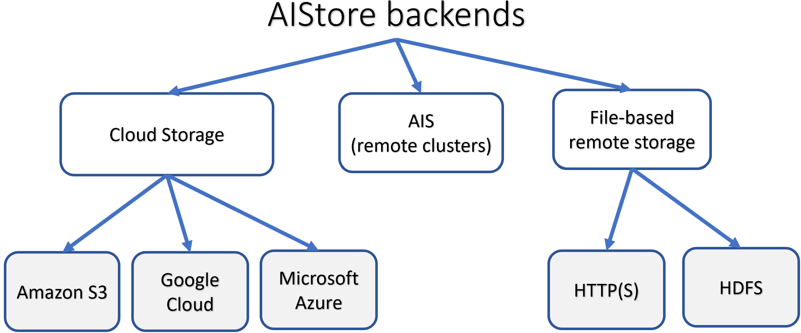

**AIStore is a lightweight object storage system with the capability to linearly scale-out with each added storage node and a special focus on petascale deep learning.**

AIStore (AIS for short) is a built from scratch, lightweight storage stack tailored for AI apps. AIS consistently shows balanced I/O distribution and linear scalability across arbitrary numbers of clustered servers, producing performance charts that look as follows:

> The picture above *comprises* 120 HDDs.

The ability to scale linearly with each added disk was, and remains, one of the main incentives behind AIStore. Much of the development is also driven by the ideas to offload dataset transformation and other I/O intensive stages of the ETL pipelines.

## Features

* scale-out with no downtime and no limitation;
* arbitrary number of extremely lightweight access points;
* highly-available control and data planes, end-to-end data protection, self-healing, n-way mirroring, k/m erasure coding;
* comprehensive native HTTP REST to GET and PUT objects, create, destroy, list, transform, copy and configure buckets, and more;
* [Amazon S3 API](/docs/s3compat.md) to run unmodified S3 clients and apps;
* easy-to-use [CLI](https://www.youtube.com/watch?v=VPIhQm2sMD8&ab_channel=AIStore) based on [auto-completions](/docs/cli.md);
* automated cluster rebalancing upon: any changes in cluster membership, drive failures and attachments, bucket renames;
* [ETL offload](/docs/etl.md) - the capability to run extract-transform-load workloads on (and by) storage cluster (and close to data); offline (dataset to dataset) and inline transformations via both user-defined containers and functions are also supported.

Also, AIStore:

* can be deployed on any commodity hardware - effectively, on any Linux with a disk;
* supports single-command infrastructure and software deployment on Google Cloud Platform via [ais-k8s GitHub repo](https://github.com/NVIDIA/ais-k8s);
* supports Amazon S3, Google Cloud, and Microsoft Azure backends (and all S3, GCS, and Azure-compliant object storages);
* can ad-hoc attach and "see" (read, write, list, cache, evict) datasets hosted by other AIS clusters;
* natively supports reading, writing, and listing [archives](/docs/cli/archive.md) - objects formatted as TAR, TGZ, ZIP;
* provides unified global namespace across multiple backends:

* can be deployed as LRU-based fast cache for remote buckets; can be populated on-demand and/or via `prefetch` and `download` APIs;
* can be used as a standalone highly-available protected storage;
* includes MapReduce extension for massively parallel resharding of very large datasets;
* supports existing [PyTorch](https://storagetarget.files.wordpress.com/2019/12/deep-learning-large-scale-phys-poster-1.pdf) and [TensorFlow](https://www.youtube.com/watch?v=r9uw1BNt2x8&feature=youtu.be)-based training models.

AIS runs natively on Kubernetes and features open format - thus, the freedom to copy or move your data from AIS at any time using the familiar Linux `tar(1)`, `scp(1)`, `rsync(1)` and similar.

For AIStore **white paper** and design philosophy, for introduction to large-scale deep learning and the most recently added features, please see [AIStore Overview](/docs/overview.md) (where you can also find six alternative ways to work with existing datasets). Videos and **animated presentations** can be found at [videos](/docs/videos.md).

Finally, [getting started](/docs/getting_started.md) with AIS takes only a few minutes.

## Deployment options

There is a vast spectrum of possible deployments - primarily due to the fact that the essential prerequisites boil down to having Linux with a disk.
This results in a practically unlimited set of options from all-in-one (AIS gateway + AIS target) docker container to a petascale bare-metal cluster of any size, and from a single development VM or workstation to multiple racks of high-end servers.

The table below contains a few concrete examples:

| Deployment option | Targeted audience and objective |
| --- | ---|
| [Local playground](/docs/getting_started.md#local-playground) | AIS developers and development, Linux or Mac OS |
| Minimal production-ready deployment | This option utilizes preinstalled docker image and is targeting first-time users or researchers (who could immediately start training their models on smaller datasets) |
| [Easy automated GCP/GKE deployment](/docs/getting_started.md#kubernetes-deployments) | Developers, first-time users, AI researchers |
| [Large-scale production deployment](https://github.com/NVIDIA/ais-k8s) | Requires Kubernetes and is provided (documented, automated) via a separate repository: [ais-k8s](https://github.com/NVIDIA/ais-k8s) |

Further, there's the capability referred to as [global namespace](/docs/providers.md#remote-ais-cluster). Simply put, as long as there’s HTTP connectivity, AIS clusters can be easily interconnected to “see” - i.e., *list*, *read*, *write*, *cache*, *evict* - each other's datasets. This ad-hoc capability, in turn, makes it possible to start small and gradually/incrementally build high-performance shared storage comprising petabytes.

> For detailed discussion on supported deployments, please refer to [Getting Started](/docs/getting_started.md).

## Guides and References

- API
  - [Native RESTful API](/docs/http_api.md)
  - [S3 compatibility](/docs/s3compat.md)
  - [Go API/SDK](/docs/http_api.md)
- [CLI](/docs/cli.md)
  - [Create, destroy, list, copy, rename, transform, configure, evict buckets](/docs/cli/bucket.md)
  - [GET, PUT, APPEND, PROMOTE, and other operations on objects](/docs/cli/object.md)
  - [Cluster and node management](/docs/cli/cluster.md)
  - [Mountpath (disk) management](/docs/cli/storage.md)
  - [Attach, detach, and monitor remote clusters](/docs/cli/cluster.md)
  - [Start, stop, and monitor downloads](/docs/cli/download.md)
  - [Distributed shuffle](/docs/cli/dsort.md)
  - [User account and access management](/docs/cli/auth.md)
  - [Job (aka `xaction`) management](/docs/cli/job.md)
- Tutorials
  - [Tutorials](/docs/tutorials/README.md)
  - [Videos](/docs/videos.md)
- Benchmarking and tuning Performance
  - [AIS Load Generator: integrated benchmark tool](/docs/aisloader.md)
  - [How to benchmark](/docs/howto_benchmark.md)
  - [Performance tuning and testing](/docs/performance.md)
- Buckets and Backend Providers
  - [Backend providers](/docs/providers.md)
  - [Buckets](/docs/bucket.md)
- Storage Services
  - [Storage Services](/docs/storage_svcs.md)
  - [Checksumming: brief theory of operations](/docs/checksum.md)
  - [S3 compatibility](/docs/s3compat.md)
- Power tools and extensions
  - [Distributed Shuffle](/docs/dsort.md)
  - [Downloader](/docs/downloader.md)
  - [Extract, Transform, Load](/docs/etl.md)
  - Reading, writing, and listing *archives* (objects formatted as TAR, TGZ, ZIP, etc.)
  - [Tools and utilities](/docs/tools.md)
- Cluster Management
  - [Joining AIS cluster](/docs/join_cluster.md)
  - [Leaving AIS cluster](/docs/leave_cluster.md)
  - [Global Rebalance](/docs/rebalance.md)
  - [Troubleshooting](/docs/troubleshooting.md)
- Configuration
  - [Configuration](/docs/configuration.md)
  - [CLI to view and update cluster and node config](/docs/cli/config.md)
- Observability
  - [Observability](/docs/metrics.md)
  - [Prometheus](/docs/prometheus.md)
- For developers
  - [Getting started](/docs/getting_started.md)
  - [Docker](/docs/docker_main.md)
  - [Useful scripts](/docs/development.md)
  - Profiling, race-detecting, and more
- Batch operations
  - [Batch operations](/docs/batch.md)
  - [eXtended Actions (xactions)](/xaction/README.md)
  - [CLI: job management](/docs/cli/job.md)
- Topics
  - [System files](/docs/sysfiles.md)
  - [`aisnode` command line](/docs/command_line.md)
  - [Traffic patterns](/docs/traffic_patterns.md)
  - [Highly available control plane](/docs/ha.md)
  - [File access](/docs/aisfs.md)
  - [Downloader](/docs/downloader.md)
  - [On-disk layout](/docs/on_disk_layout.md)
  - [AIS Buckets: definition, operations, properties](/docs/bucket.md#bucket)

## License

MIT

## Author

Alex Aizman (NVIDIA)
