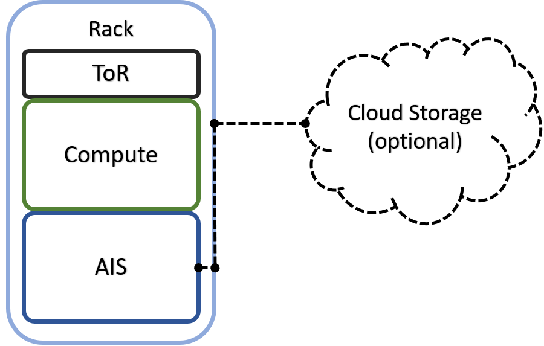
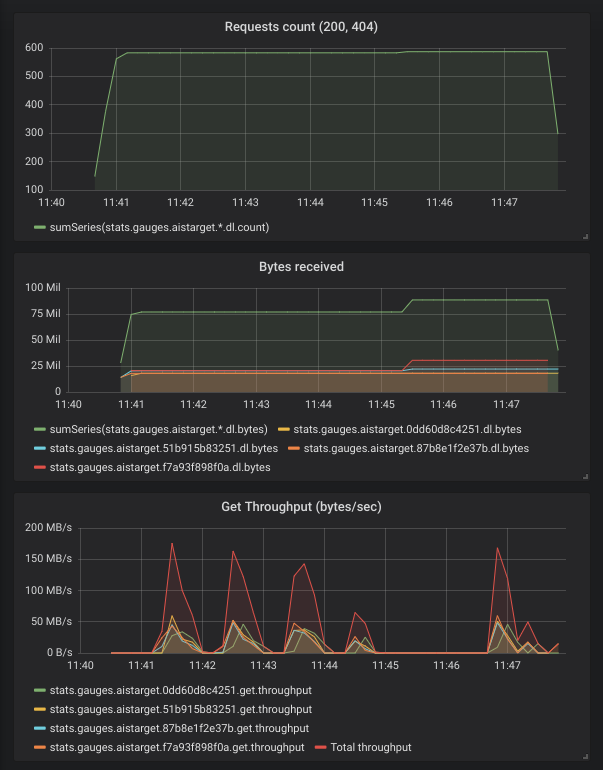

# AIStore: scalable storage for AI applications

AIStore (AIS for short) is a built from scratch storage solution for AI applications. At its core, it's open-source object storage with extensions tailored for AI and, specifically, for petascale deep learning.

As a storage system, AIS is a distributed object store with a [RESTful S3-like API](docs/http_api.md), and the gamut of capabilities that one would normally expect from an object store: eventual consistency, flat namespace, versioning, and all the usual read/write and control primitives to read and write objects and create, destroy, list, and configure [buckets](docs/bucket.md#bucket) that contain those objects.

## AIS Design Philosophy
AIS is a *specialized* storage system. The design philosophy behind AIS is based on the simple truth that AI datasets are pre-sharded. More exactly, AI datasets (in particular, very large datasets) are pre-sharded, post-sharded, and otherwise transformed to facilitate training, inference, and simulation by the AI apps.

The corollary of this statement is two-fold:

- Breaking objects into pieces (often called chunks but also slices, segments, fragments, and blocks) and the related functionality does not necessarily belong to an AI-optimized storage system per se;
- Instead of breaking the objects in pieces (and then reassembling them with the help of a carefully maintained metadata), the storage system must better focus on providing assistance to simplify and accelerate dataset transformations.

## Key Concepts and Diagrams
In this section: high-level diagrams that introduce key concepts and architecture, as well as possible deployment options.

AIS cluster *comprises* arbitrary (and not necessarily equal) numbers of **gateways** and **storage targets**. Targets utilize local disks while gateways are HTTP **proxies** that provide most of the control plane and never touch the data.

> The terms *gateway* and *proxy* are used interchangeably throughout this README and other sources in the repository.

Both **gateways** and **targets** are userspace daemons that join (and, by joining, form) a storage cluster at their respective startup times, or upon user request. AIStore can be deployed on any commodity hardware with pretty much any Linux distribution (although we do recommend 4.x kernel). There are no designed-in size/scale type limitations. There are no dependencies on special hardware capabilities. The code itself is free, open, and MIT-licensed.

The diagram depicting AIS clustered node follows below, and makes the point that gateways and storage targets can be colocated in a single machine (or a VM) but not necessarily:


AIS can be deployed as a self-contained standalone persistent storage cluster - and/or as a fast tier in front of existing Amazon S3 and Google Cloud (GCP) storage. There's a built-in caching mechanism that provides least-recently-used eviction on a per-bucket basis based on the monitored capacity and configurable high/low watermarks (see [LRU](docs/storage_svcs.md#lru)). AWS/GCP integration is *turnkey* and boils down to provisioning AIS targets with credentials to access Cloud-based buckets.

If (compute + storage) rack is a *unit of deployment*, it may as well look as follows:



Finally, AIS target provides a number of storage services with [S3-like RESTful API](docs/http_api.md) on top and a MapReduce layer that we call [dSort](#dsort).


> Terminology: AIS differentiates between **Cloud-based buckets** and those buckets that do not serve as a cache or tier in front of any Cloud storage. For shortness sake, the latter are referred to as **local buckets** or AIS buckets. Cloud-based and local buckets support the same API. AIS (local) buckets are distributed, content-wise, across the entire cluster and all the [supported storage services](docs/storage_svcs.md) equally apply to both kinds of the buckets with a few exceptions: as of v2.0, only local buckets can be renamed and erasure (en)coded.

> If (and only when) a cloud-based and a local bucket share the same exact name and are simultaneously accessible, users can explicitly let AIS know which bucket to use via [the API](docs/bucket.md).

## Table of Contents
- [Overview](#overview)
    - [Open Format](#open-format)
    - [Existing Datasets](#existing-datasets)
    - [Data Protection](#data-protection)
    - [Scale-Out](#scale-out)
    - [HA](#ha)
    - [Fast Tier](#fast-tier)
    - [Other Services](#other-services)
    - [dSort](#dsort)
    - [Python Client](#python-client)
    - [AIS Limitations](#ais-limitations)
- [Prerequisites](#prerequisites)
- [Getting Started](#getting-started)
    - [Local non-Containerized](#local-non-containerized)
    - [Local Docker-Compose](#local-docker-compose)
    - [Local Kubernetes](#local-kubernetes)
    - [Performance Monitoring](#performance-monitoring)
- [Guides and References](#guides-and-references)
- [Selected Package READMEs](#selected-package-readmes)

## Overview
In AIS, all inter- and intra-cluster networking is based on HTTP/1.1 (with HTTP/2 option currently under development). HTTP(S) clients execute RESTful operations vis-à-vis AIS gateways and data then moves **directly** between the clients and storage targets with no metadata servers and no extra processing in-between:


> MDS in the diagram above stands for the metadata server(s) or service(s).

In the picture, a client on the left side makes an I/O request which is then fully serviced by the *left* target - one of the nodes in the AIS cluster (not shown). Symmetrically, the *right* client engages with the *right* AIS target for its own GET or PUT object transaction. In each case, the entire transaction is executed via a single TCP session that connects the requesting client directly to one of the clustered nodes. As far as the datapath is concerned, there are no extra hops in the line of communications.

> For detailed read and write sequence diagrams, please refer to [this readme](docs/datapath.md).

Distribution of objects across AIS cluster is done via (lightning fast) two-dimensional consistent-hash whereby objects get distributed across all storage targets and, within each target, all local disks.

### Open Format

As of the v2.0, AIS targets utilize local Linux filesystems - examples including (but not limited to) xfs, ext4, and openzfs. User data is stored *as is* without any alteration. AIS on-disk format is, therefore, fully defined by the local filesystem chosen at AIS deployment time. The implication is that you can access your data with and without AIS, and without any need to *convert* or *export/import*, etc.

> Your own data is [unlocked](https://en.wikipedia.org/wiki/Vendor_lock-in) and immediately available at all times.

### Existing Datasets

One common way to start making use of AIStore includes the two most basic steps:

1. Populate AIS with an existing dataset
2. Read and write this dataset directly from/to AIStore

To this end, AIS provides 4 (four) easy ways to accomplish the first step:

1. [Cold GET](#existing-datasets-cold-get)
2. [Prefetch](#existing-datasets-batch-prefetch)
3. [Internet Downloader](#existing-datasets-internet-downloader)
4. [Reverse Proxy](#existing-datasets-reverse-proxy)

More precisely:

#### Existing Datasets: Cold GET
If the dataset in question is accessible via S3-like object API, start working with it via GET primitive of the [AIS API](docs/http_api.md). Just make sure to provision AIS with the corresponding credentials to access the dataset's bucket in the Cloud.

> As far as supported S3-like backends, AIS currently supports Amazon S3 and Google Cloud.

> AIS executes *cold GET* from the Cloud if and only if the object is not stored (by AIS), **or** the object has a bad checksum, **or** the object's version is outdated.

In all other cases, AIS will service the GET request without going to Cloud.

#### Existing Datasets: Batch Prefetch

Alternatively or in parallel, you can also *prefetch* a flexibly-defined *list* or *range* of objects from any given Cloud bucket, as described in [this readme](docs/batch.md).

#### Existing Datasets: Internet Downloader

But what if the dataset exists in the form of (vanilla) HTTP/HTTPS URLs? If this is the case, use [downloader](downloader/README.md) - the integrated tool that can populate AIStore directly from the Internet.

#### Existing Datasets: Reverse Proxy

Finally, AIS can be designated as HTTP proxy vis-à-vis 3rd party object storages. As of the v2.0, this mode of operation is limited to Google Cloud Storage (GCS) and requires two things:

1. HTTP(s) client side: set the `http_proxy` (`https_proxy` - for HTTPS) environment
2. AIS configuration: set `rproxy=cloud` in the [configuration](ais/setup/config.sh)

Note that `http_proxy` is supported by most UNIX systems and is recognized by most (but not all) HTTP clients:

```shell
$ export http_proxy=<AIS proxy IPv4 or hostname>
```

In combination, these two settings have an effect of redirecting all **unmodified** client-issued HTTP(S) requests to the AIS proxy/gateway with subsequent execution transparently from the client perspective.

Further details and examples are available [in this readme](docs/rproxy.md).

### Data Protection
AIS [supports](docs/storage_svcs.md) end-to-end checksum protection, 2-way local mirroring, and Reed-Solomon [erasure coding](docs/storage_svcs.md#erasure-coding) - thus providing for arbitrary user-defined levels of cluster-wide data redundancy and space efficiency.

### Scale-Out
The scale-out category includes balanced and fair distribution of objects where each storage target will store (via a variant of the consistent hashing) 1/Nth of the entire namespace where (the number of objects) N is unlimited by design.

> AIS cluster capability to **scale-out is truly unlimited**. The real-life limitations can only be imposed by the environment - capacity of a given Data Center, for instance.

Similar to the AIS gateways, AIS storage targets can join and leave at any moment causing the cluster to rebalance itself in the background and without downtime.

### HA
AIS features a [highly-available control plane](docs/ha.md) where all gateways are absolutely identical in terms of their (client-accessible) data and control plane [APIs](docs/http_api.md). Gateways can be ad hoc added and removed, deployed remotely and/or locally to the compute clients (the latter option will eliminate one network roundtrip to resolve object locations).

## Fast Tier
AIS can be deployed as a fast tier in front of existing Amazon S3 and Google Cloud (GCP) storage.

As a fast tier, AIS populates itself on demand (via *cold* GETs) and/or via its own *prefetch* API (see [List/Range Operations](docs/batch.md#listrange-operations)) that runs in the background to download batches of objects. In addition, AIS can cache and tier itself (as of 2.0, native tiering is *experimental*).

### Other Services

The (quickly growing) list of services includes (but is not limited to):
* [health monitoring and recovery](health/fshc.md)
* [range read](docs/http_api.md)
* [dry-run (to measure raw network and disk performance)](docs/performance.md#performance-testing)
* performance and capacity monitoring with full observability via StatsD/Grafana
* load balancing

> As of the 2.0, load balancing consists in optimal selection of a local object replica and, therefore, requires buckets configured for [local mirroring](docs/storage_svcs.md#local-mirroring-and-load-balancing).

Most notably, AIStore provides **[dSort](dsort/README.md)** - a MapReduce layer that performs a wide variety of user-defined merge/sort *transformations* on large datasets used for/by deep learning applications.

### dSort

DSort “views” AIS objects as named shards that comprise archived key/value data. In its 1.0 realization, dSort supports tar, zip, and tar-gzip formats and a variety of built-in sorting algorithms; it is designed, though, to incorporate other popular archival formats including tf.Record and tf.Example ([TensorFlow](https://www.tensorflow.org/tutorials/load_data/tf-records)) and [MessagePack](https://msgpack.org/index.html). The user runs dSort by specifying an input dataset, by-key or by-value (i.e., by content) sorting algorithm, and a desired size of the resulting shards. The rest is done automatically and in parallel by the AIS storage targets, with no part of the processing that’d involve a single-host centralization and with dSort stage and progress-within-stage that can be monitored via user-friendly statistics.

By design, dSort tightly integrates with the AIS-object to take full advantage of the combined clustered CPU and IOPS. Each dSort job (note that multiple jobs can execute in parallel) generates a massively-parallel intra-cluster workload where each AIS target communicates with all other targets and executes a proportional "piece" of a job. Which ultimately results in a *transformed* dataset optimized for subsequent training and inference by deep learning apps.

### Python Client

AIStore provides an easy way to generate a python client package for simplified integration. The user can, after following a few simple steps, import the generated package and start communicating with AIS via its [RESTful API](docs/http_api.md). The generated package will cover the entire functionality of the API.

> Background: [OpenAPI Generator](https://github.com/openapitools/openapi-generator) is a tool that generates python client packages for simplified integration with RESTful APIs. We use OpenAPI Generator to generate the python client package using the [OpenAPI Specification](https://swagger.io/docs/specification/about/) file located [here](openapi/openapi.yaml).

To get started with the python client package, you need to first generate the client package. These instuctions can also be found [here](openapi/README.md#how-to-generate-package).

1. Obtain the latest, as of v2.0, openapi-generator jar by running the following command:

    ```shell
    wget http://central.maven.org/maven2/org/openapitools/openapi-generator-cli/3.3.4/openapi-generator-cli-3.3.4.jar -O openapi-generator-cli.jar
    ```

2. Run the following commands:

    ```shell
    cd <path_to_repo>
    java -jar </path/to/openapi-generator-cli.jar> generate -i openapi/openapi.yaml -g python -o ./python-client/
    ```

3. Install `pip` - a package management system used to install and manage software packages written in Python. Visit the [installation page](https://pip.pypa.io/en/stable/installing/) for instructions on how to install `pip`.

4. Install required Python packages using `pip` and requirement files located in `python-client` directory:

    ```shell
    pip install -r python-client/requirements.txt
    pip install -r python-client/test-requirements.txt
    ```

These steps should produce the python client package, which will be located [here](python-client).

Should you have any difficulty generating the python client package with these instructions, please open a ticket, and we will provide further assistance.

Once the package is generated, it can be installed as follows, these commands can also be found [here](openapi/README.md#how-to-install).

```shell
cd <path_to_repo>/python-client
pip uninstall openapi_client #uninstalls any previous versions
pip install .
```

Now you're ready to import the package in python and use it to communicate with AIS.

For example, this script will display a map of your AIS cluster.

```shell
import openapi_client
# Some aliases for functions in the package
openapi_models = openapi_client.models
openapi_params = openapi_models.InputParameters
openapi_actions = openapi_models.Actions

configuration = openapi_client.Configuration()
configuration.debug = False
proxy_url = 'localhost:8080' #Change this to the ip of any proxy in your AIS cluster, ex: 172.50.0.2:8080
configuration.host = 'http://%s/v1/' % proxy_url
proxyClient = openapi_client.ApiClient(configuration)

daemon_api = openapi_client.api.daemon_api.DaemonApi(proxyClient)
print(daemon_api.get(openapi_models.GetWhat.SMAP))
```

There's a lot more that the python client package can do. Be sure to read [the complete guide on using the package](openapi/README.md#how-to-use-package).

### AIS Limitations
There are no designed-in limitations on the:

* object sizes
* total number of objects and buckets in AIS cluster
* number of objects in a single AIS bucket
* numbers of gateways and storage targets in AIS cluster

Ultimately, limit on the object size may be imposed by the local filesystem of choice and the physical disk capacity. While limit on the cluster size - by the capacity of the hosting AIStore Data Center. But as far as AIS itself, it does not impose any limitations whatsoever.

## Prerequisites

* Linux (with gcc, sysstat and attr packages, and kernel 4.x or later)
* [Go 1.10 or later](https://golang.org/dl/)
* Extended attributes (xattrs - see below)
* Optionally, Amazon (AWS) or Google Cloud Platform (GCP) account

Depending on your Linux distribution you may or may not have `gcc`, `sysstat`, and/or `attr` packages - to install, use `apt-get` (Debian), `yum` (RPM), or other applicable package management tool, e.g.:

```shell
$ apt-get install sysstat
```

The capability called [extended attributes](https://en.wikipedia.org/wiki/Extended_file_attributes), or xattrs, is a long time POSIX legacy and is supported by all mainstream filesystems with no exceptions. Unfortunately, extended attributes (xattrs) may not always be enabled (by the Linux distribution you are using) in the Linux kernel configurations - the fact that can be easily found out by running `setfattr` command.

> If disabled, please make sure to enable xattrs in your Linux kernel configuration.

## Getting Started

AIStore runs on commodity Linux machines with no special hardware requirements.

> It is expected, though, that all AIS target machines are identical, hardware-wise.

The implication is that the number of possible deployment options is practically unlimited.
This section covers 3 (three) ways to deploy AIS on a single Linux machine and is intended for developers and development, and/or for a quick trial.

### Local non-Containerized

Assuming that [Go](https://golang.org/dl/) is already installed, the remaining getting-started steps are:

```shell
$ cd $GOPATH/src
$ go get -v github.com/NVIDIA/aistore/ais
$ cd github.com/NVIDIA/aistore/ais
$ make deploy
$ go test ./tests -v -run=Mirror
```
The `go get` command installs AIS sources and all the versioned dependencies under your configured [$GOPATH](https://golang.org/cmd/go/#hdr-GOPATH_environment_variable).

The `make deploy` command deploys AIStore daemons locally based on a few prompted Q&A. The example shown below deploys 10 targets (each with 2 local simulated filesystems) and 3 gateways, and will not require (or expect) to access Cloud storage (notice the "Cloud Provider" prompt below):

```shell
# make deploy
Enter number of storage targets:
10
Enter number of proxies (gateways):
3
Number of local cache directories (enter 0 to use preconfigured filesystems):
2
Select Cloud Provider:
1: Amazon Cloud
2: Google Cloud
3: None
Enter your choice:
3
```

> To enable optional AIStore authentication server, execute instead `$ CREDDIR=/tmp/creddir AUTHENABLED=true make deploy`. For information on AuthN server, please see [AuthN documentation](authn/README.md).

Finally, the `go test` (above) will create a local bucket, configure it as a two-way mirror, generate thousands of random objects, read them all several times, and then destroy the replicas and eventually the bucket as well.

Alternatively, if you happen to have Amazon and/or Google Cloud account, make sure to specify the corresponding bucket name when running `go test` For example, the following will download objects from your (presumably) S3 bucket and distribute them across AIStore:

```shell
$ BUCKET=myS3bucket go test ./tests -v -run=download
```

Here's a minor variation of the above:

```shell
$ BUCKET=myS3bucket go test ./tests -v -run=download -args -numfiles=100 -match='a\d+'
```

This command runs test that matches the specified string ("download"). The test then downloads up to 100 objects from the bucket called myS3bucket, whereby the names of those objects match 'a\d+' regex.

> For more testing commands and command line options, please refer to the corresponding [README](ais/tests/README.md) and/or the [test sources](ais/tests/).
> For other useful commands, see the [Makefile](ais/Makefile).

> For tips and help pertaining to local non-containerized deployment, please see [the tips](docs/local-tips.md).

> For helpful links and background on Go, AWS, GCP, and Deep Learning, please see [helpful links](docs/helpful-links.md).

### Local Docker-Compose

The 2nd option to run AIS on your local machine requires [Docker](https://docs.docker.com/) and [Docker-Compose](https://docs.docker.com/compose/overview/). It also allows for multi-clusters deployment with multiple separate networks. You can deploy a simple AIS cluster within seconds or deploy a multi-container cluster for development.

> AIS 2.0 supports up to 3 (three) logical networks: user (or public), intra-cluster control and intra-cluster data networks.

To get started with AIStore and Docker, see: [Getting started with Docker](docs/docker_main.md).

#### Docker playground

Following is a super-simple presentation to showcase some of the AIS capabilities.

In [Docker playground](deploy/dev/docker/playground), you can find the scripts to download different popular AI datasets (e.g., MNIST and ImageNet). The datasets are downloaded with the AIS-integrated [Downloader](downloader/README.md) that stores all downloaded objects directly into the AIStore.

During the download, you can monitor:

 * number of requests made
 * number of requests failed
 * number of bytes transferred

In the example below, AIS downloads a handful of ImageNet images and collects/visualizes the corresponding statistics:

```shell
$ cd path_to/deploy/dev/docker
$ ./deploy_docker.sh -d=2 -p=2 -t=4 -c=1 -grafana -nocloud # start 2 proxies and 4 targets
$ ./playground/download_imagenet.sh # download some of ImageNet images into AIS and show stats
$ # once Downloader will save the files...
$ ./playground/stress_get.sh imagenet # do gets on saved files (requires jq command)
$ ./stop_docker.sh -l # stop docker
```



### Local Kubernetes

The 3rd and final local-deployment option makes use of [Kubeadm](https://kubernetes.io/docs/reference/setup-tools/kubeadm/kubeadm/) and is documented [here](deploy/dev/kubernetes).

### Performance Monitoring

AIS has out of the box support for [StatsD](https://github.com/etsy/statsd) - the *daemon for easy but powerful stats aggregation*. StatsD can be connected to Graphite which then can be used as a data-source for Grafana to get visual overview of the statistics and metrics.

We have provided scripts for easy deployment of both Graphite and Grafana.

> For [local non-containerized deployments](#local-non-containerized), use `./ais/setup/deploy_grafana.sh` to start Graphite and Grafana containers. Local deployment will automatically notice the presence of the containers and will send statistics to the Graphite.

> For [local docker-compose based deployments](#local-docker-compose), make sure to use `-grafana` command-line option. The `deploy_docker.sh` script will then spin-up Graphite and Grafana containers.

In both of these cases, Grafana will be accessible at [localhost:3000](http://localhost:3000).

> For information on AIS statistics, please see [Statistics, Collected Metrics, Visualization](docs/metrics.md)

## Guides and References
- [Batch List and Range Operations: Prefetch, and more](docs/batch.md)
- [Object Checksums: Brief Theory of Operations](docs/checksum.md)
- [Configuration](docs/configuration.md)
- [Datapath: Read and Write Sequence Diagrams](docs/datapath.md)
- [Highly Available Control Plane](docs/ha.md)
- [How to Benchmark](docs/howto_benchmark.md)
- [RESTful API](docs/http_api.md)
- [Joining a Cluster](docs/join_cluster.md)
- [Bucket Abstraction](docs/bucket.md#bucket)
- [Statistics, Collected Metrics, Visualization](docs/metrics.md)
- [Performance Tuning and Performance Testing](docs/performance.md)
- [Rebalancing (of the stored content in presence of a variety of events)](docs/rebalance.md)
- [Storage Services](docs/storage_svcs.md)
- [Extended Actions](docs/xaction.md)
- [Internet Downloader](downloader/README.md)
- [Experimental](docs/experimental.md)

## Selected Package READMEs
- [Package `docker`](docs/docker_main.md)
- [Package `api`](api/README.md)
- [Package `authn`](authn/README.md)
- [Package `memsys`](memsys/README.md)
- [Package `transport`](transport/README.md)
- [Package `dSort`](dsort/README.md)
- [Package `openapi`](openapi/README.md)
