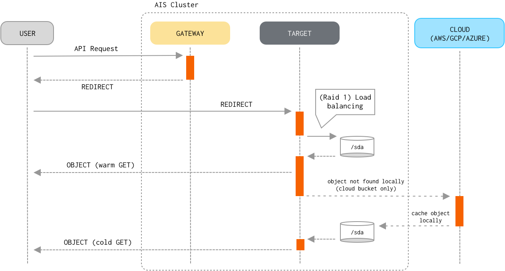

# AIStore: scalable storage for AI applications

AIStore (AIS for short) is a built from scratch storage solution for AI applications. At its core, it's open-source object storage with extensions tailored for AI and, specifically, for petascale deep learning.

As a storage system, AIS is a distributed object store with a [RESTful S3-like API](docs/http_api.md), and the gamut of capabilities that one would normally expect from an object store: eventual consistency, flat namespace, versioning, and all the usual read/write and contorl primitives to access objects and create, destroy, list, and configure buckets that contain those objects.

AIS cluster *comprises* an arbitrary numbers of **gateways** and **storage targets**. Targets utilize local disks while gateways are HTTP **proxies** that provide most of the control plane and never touch the data.

>> The terms *gateway* and *proxy* are used interchangeably throughout this README and other sources in the repository.

Both **gateways** and **targets** are userspace daemons that join (and, by joining, form) a storage cluster at their respective startup times, or upon user request. AIStore can be deployed on any commodity hardware and pretty much any Linux distribution (although we do recommend 4.x kernel). There are no designed-in size/scale type limitations. There are no dependencies on special hardware capabilities. The code itself is free, open, and MIT-licensed.

A bird's-eye view follows - and tries to emphasize a few distinguishing characteristics, and in particular, the fact that client <=> storage traffic has *no-extra-hops*: it's a direct path between the requesting client and the storage target that stores (or will store) the data.


AIS can be deployed as a self-contained standalone persistent storage cluster and/or as a fast tier in front of existing Amazon S3 and Google Cloud (GCP) storage. There's a built-in caching mechanism that provides least-recently-used eviction on a per-bucket basis based on the monitored capacity and configurable high/low watermarks (see [LRU](#lru)). AWS/GCP integration is *turnkey* and boils down to provisioning AIS targets with credentials to access Cloud-based buckets.

>> Terminology: AIS differentiates between **Cloud-based buckets** and those buckets that do not serve as a cache or tier in front of any Cloud storage. For shortness sake, the latter are referred to as **local buckets**.

>> Cloud-based and local buckets support the same API with minor exceptions (only local buckets can be renamed, for instance).

## Table of Contents
- [Overview](#overview)
    - [Limitations](#limitations)
    - [Data Protection](#data-protection)
    - [Scale-Out](#scale-out)
    - [HA](#ha)
    - [Fast Tier](#fast-tier)
    - [Other Services](#other-services)
    - [dSort](#dsort)
- [Prerequisites](#prerequisites)
- [Getting Started](#getting-started)
    - [Local Non-containerized](#local-non-containerized)
    - [Tips](#tips)
    - [Helpful Links](docs/helpful_links.md)
- [Guides and References](#guides-and-references)
- [Selected Package READMEs](#selected-package-readmes)

## Overview
All inter- and intra-cluster networking is based on HTTP/1.1 (with HTTP/2 option currently under development). HTTP(S) clients execute RESTful operations vis-à-vis AIS gateways and data then moves **directly** between the clients and storage targets with no metadata servers and no extra processing in-between:



Distribution of objects across AIS cluster is done via (lightning fast) two-dimensional consistent-hash whereby objects get distributed across all storage targets and, within each target, all local disks.

### Limitations
There are no limitations whatsoever on object and bucket sizes, numbers of objects and buckets, numbers of gateways and storage targets in a single AIS cluster.

### Data Protection
AIS [supports](docs/storage_svcs.md) end-to-end checksum protection, 2-way local mirroring, and Reed-Solomon erasure coding thus providing for arbitrary user-defined levels of cluster-wide data redundancy and space efficiency.

### Scale-Out
The scale-out category includes balanced and fair distribution of objects where each storage target will store (via a variant of the consistent hashing) 1/Nth of the entire namespace where (the number of objects) N is unlimited by design. Similar to the AIS gateways, AIS storage targets can join and leave at any moment causing the cluster to rebalance itself in the background and without downtime.

### HA
AIS features a [highly-available control plane](docs/ha.md) where all gateways are absolutely identical in terms of their data and control plane APIs. Gateways can be ad hoc added and removed, deployed remotely and/or locally to the compute clients (the latter option will eliminate one network roundtrip to resolve object locations).

## Fast Tier
As a fast tier, AIS populates itself on demand (via *cold* GETs) and/or via its own *prefetch* API (see [List/Range Operations](#listrange-operations)) that runs in the background to download batches of objects. In addition, AIS can cache and tier itself (as of 2.0, native tiering is *experimental*).

### Other Services

The (quickly growing) list of services includes (but is not limited to):
* health monitoring and recovery
* range read
* dry-run (to measure raw network and disk performance)
* performance and capacity monitoring with full observability via StatsD/Grafana
* load balancing

>> As of the 2.0, load balancing consists in optimal selection of a local object replica and, therefore, requires buckets configured for [local mirroring](docs/storage_svcs.md#local-mirroring-and-load-balancing).

Most notably, AIStore provides [dSort](dsort/README.md) - a MapReduce layer that performs a wide variety of user-defined merge/sort *transformations* on large datasets used for/by deep learning applications.

### dSort

DSort “views” AIS objects as named shards that comprise archived key/value data. In its 1.0 realization, dSort supports tar, zip, and tar-gzip formats and a variety of built-in sorting algorithms; it is designed, though, to incorporate other popular archival formats including tf.Record and tf.Example ([TensorFlow](https://www.tensorflow.org/tutorials/load_data/tf-records)) and [MessagePack](https://msgpack.org/index.html). The user runs dSort by specifying an input dataset, by-key or by-value (i.e., by content) sorting algorithm, and a desired size of the resulting shards. The rest is done automatically and in parallel by the AIS storage targets, with no part of the processing that’d involve a single-host centralization and with dSort stage and progress-within-stage that can be monitored via user-friendly statistics.

By design, dSort tightly integrates with the AIS-object to take full advantage of the combined clustered CPU and IOPS. Each dSort job (note that multiple jobs can execute in parallel) generates a massively-parallel intra-cluster workload where each AIS target communicates with all other targets and executes a proportional "piece" of a job. Which ultimately results in a *transformed* dataset optimized for subsequent training and inference by deep learning apps.

## Prerequisites

* Linux (with sysstat and attr packages, and kernel 4.x or later)
* [Go 1.10 or later](https://golang.org/dl/)
* Extended attributes (xattrs)
* Optionally, Amazon (AWS) or Google Cloud Platform (GCP) account

Some Linux distributions do not include sysstat and/or attr packages - to install, use `apt-get` (Debian), `yum` (RPM), or other applicable package management tool, e.g.:

```shell
$ apt-get install sysstat
$ apt-get install attr
```

The capability called [extended attributes](https://en.wikipedia.org/wiki/Extended_file_attributes), or xattrs, is a long time POSIX legacy and is supported by all mainstream filesystems with no exceptions. Unfortunately, extended attributes (xattrs) may not always be enabled (by the Linux distribution you are using) in the Linux kernel configurations - the fact that can be easily found out by running `setfattr` command.

>> If disabled, please make sure to enable xattrs in your Linux kernel configuration.

## Getting Started

AIStore runs on commodity Linux machines with no special requirements on the hardware. The implication is that the number of possible (optimal and not-so-optimal) deployment options is practically unlimited. This section covers the bare minimum - the "Hello, World" of the AIStore deployment, if you will.

### Local Non-containerized

If [Go](https://golang.org/dl/) is already installed, getting started with AIStore takes no more than a minute and entails:

```shell
$ cd $GOPATH/src
$ go get -v github.com/NVIDIA/aistore/ais
$ cd github.com/NVIDIA/aistore/ais
$ make deploy
$ go test ./tests -v -run=Mirror
```
The `go get` command installs AIStore sources and all versioned dependencies under your configured [$GOPATH](https://golang.org/cmd/go/#hdr-GOPATH_environment_variable).

The `make deploy` command deploys AIStore daemons locally based on a few prompted Q&A. The example shown below deploys 10 targets (each with 2 local simulated filesystems) and 3 gateways, and will not require (or expect) to access Cloud storage (notice the "Cloud Provider" prompt below):

```shell
# make deploy
Enter number of storage targets:
10
Enter number of proxies (gateways):
3
Number of local cache directories (enter 0 to use preconfigured filesystems):
2
Select Cloud Provider:
1: Amazon Cloud
2: Google Cloud
3: None
Enter your choice:
3
```

>> Docker and K8s based deployments are described elsewhere in the documentation.

>> To enable optional AIStore authentication server, execute instead `$ CREDDIR=/tmp/creddir AUTHENABLED=true make deploy`. For information on AuthN server, please see [AuthN documentation](authn/README.md).

Finally, the `go test` (above) will create a local bucket, configure it as a two-way mirror, generate thousands of random objects, read them all several times, and then destroy the replicas and eventually the bucket as well.

Alternatively, if you happen to have Amazon and/or Google Cloud account, make sure to specify the corresponding bucket name when running `go test` For example, the following will download objects from your (presumably) S3 bucket and distribute them across AIStore:

```shell
$ BUCKET=myS3bucket go test ./tests -v -run=download
```

Here's a minor variation of the above:

```shell
$ BUCKET=myS3bucket go test ./tests -v -run=download -args -numfiles=100 -match='a\d+'
```

This command runs test that matches the specified string ("download"). The test then downloads up to 100 objects from the bucket called myS3bucket, whereby names of those objects match 'a\d+' regex.

For more testing commands and command line options, please refer to the corresponding [README](ais/tests/README.md) and/or the [test sources](ais/tests/).

For other useful commands, see the [Makefile](ais/Makefile).

### Tips

The following sequence downloads up to 100 objects from the bucket called "myS3bucket" and then finds the corresponding cached objects locally, in the local and Cloud bucket directories:

```shell
$ cd $GOPATH/src/github.com/NVIDIA/aistore/ais/tests
$ BUCKET=myS3bucket go test -v -run=down
$ find /tmp/ais -type f | grep local
$ find /tmp/ais -type f | grep cloud
```

This, of course, assumes that all AIStore daemons are local and non-containerized (don't forget to run `make deploy` to make it happen) - and that the "test_fspaths" sections in their respective configurations point to the /tmp/ais.

To show all existing buckets, run:

```shell
$ cd $GOPATH/src/github.com/NVIDIA/aistore
$ BUCKET=x go test ./ais/tests -v -run=bucketnames
```

Note that the output will include both local and Cloud bucket names.

Further, to locate AIStore logs, run:

```shell
$ find $LOGDIR -type f | grep log
```

where $LOGDIR is the configured logging directory as per [AIStore configuration](ais/setup/config.sh).

To terminate a running AIStore service and cleanup local caches, run:
```shell
$ make kill
$ make rmcache
```

Alternatively, run `make clean` to delete AIStore binaries and all (locally accumulated) AIStore data.

## Guides and References
- [List/Range Operations](docs/batch.md)
- [Object checksums: brief theory of operations](docs/checksum.md)
- [Configuration](docs/configuration.md)
- [Datapath](docs/datapath.md)
- [Highly Available Control Plane](docs/ha.md)
- [How to Benchmark](docs/howto_benchmark.md)
- [RESTful API](docs/http_api.md)
- [Joining a Cluster](docs/join_cluster.md)
- [List Bucket](docs/list_bucket.md)
- [Metrics with StatsD](docs/metrics.md)
- [Performance](docs/performance.md)
- [Rebalancing](docs/rebalance.md)
- [Storage Services](docs/storage_svcs.md)
- [Extended Actions (xactions)](docs/xaction.md)
- [Experimental](docs/experimental.md)

## Selected Package READMEs
- [Package `cluster`](cluster/README.md)
- [Package `api`](api/README.md)
- [Package `authn`](authn/README.md)
- [Package `memsis`](memsis/README.md)
- [Package `transport`](transport/README.md)
- [Package `dSort`](dsort/README.md)
