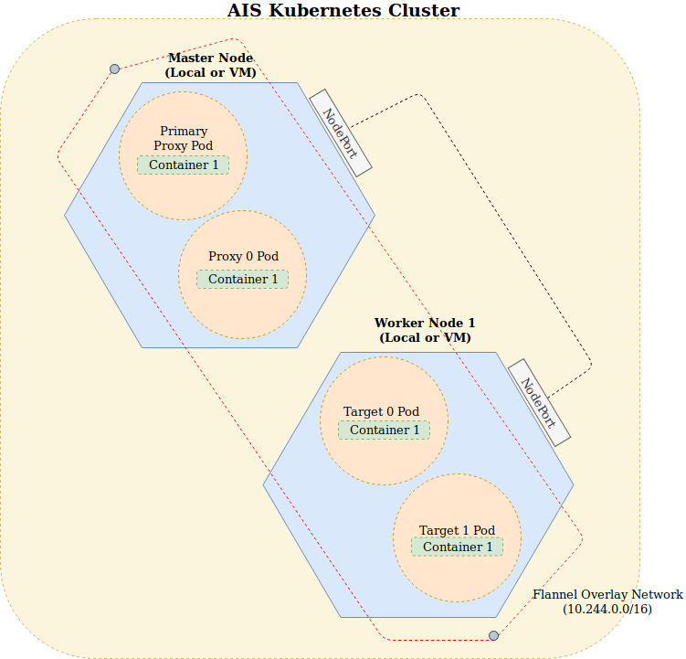

## Disclaimer
> For a more robust version, the development team has switched over to Docker. If you would like to deploy AIS in a containerized environment, consider using Docker. The Docker folder can be found in [`deploy/dev/docker`](../docker).

##  Kubeadm: Deploying an AIStore Cluster
For development purposes, we are going to use [Kubeadm](https://kubernetes.io/docs/reference/setup-tools/kubeadm/kubeadm/) to create a simple two node cluster with any number of proxies and any number of targets. Users can also decide to deploy AIS with a single-node.



> Using [Minikube](https://kubernetes.io/docs/getting-started-guides/minikube/) to deploy a Kubernetes cluster will also work for deploying single node clusters. It cannot be used for multi-node deployments due to its limitations.

### Setup with Kubeadm
We can use our local machine to host our Kubernetes cluster. For multi-node clusters, Kubeadm requires VMs or other physical machines to host the nodes.

1. [Install Kubeadm](https://kubernetes.io/docs/setup/independent/install-kubeadm/) and [kubelet](https://kubernetes.io/docs/reference/command-line-tools-reference/kubelet/) and [kubectl](https://kubernetes.io/docs/reference/kubectl/overview/) tools.
```sh
$ sudo apt-get update && sudo apt-get install -y apt-transport-https curl
$ curl -s https://packages.cloud.google.com/apt/doc/apt-key.gpg | apt-key add -
$ sudo cat <<EOF >/etc/apt/sources.list.d/kubernetes.list
    deb https://apt.kubernetes.io/ kubernetes-xenial main
    EOF
$ sudo apt-get update
$ sudo apt-get install -y kubelet kubeadm kubectl
$ sudo apt-mark hold kubelet kubeadm kubectl
```
2. [Install Docker](https://docs.docker.com/install/)

3. Disable swap memory. Kubeadm requires that swap memory is disabled.
```sh
$ sudo swapoff -a
```

4. Disable your firewall to allow DNS resolution for the pods in the Kubernetes cluster.
```sh
$ sudo ufw disable
```

> For multi-node Kubernetes clusters, you need perform the same steps on each machine

#### Deploying a Two-Node Cluster
1. Initialize the Kubernetes cluster with your local machine as the host.
```sh
$ sudo kubeadm init --pod-network-cidr=10.244.0.0/16
```
The `--pod-network-cidr` allocates a CIDR for every node. This is a requirement by [flannel](https://github.com/coreos/flannel).
> Flannel is a virtual network that gives a subnet to each node for use with container([pod](https://kubernetes.io/docs/concepts/workloads/pods/pod)) runtimes.

> Ensure that Docker and Kubeadm are installed on all machines in the cluster

2. Once Kubeadm finishes initializing, a set of commands should appear on the screen.
```sh
$ mkdir -p $HOME/.kube
$ sudo cp -i /etc/kubernetes/admin.conf $HOME/.kube/config
$ sudo chown $(id -u):$(id -g) $HOME/.kube/conf
```
This allows non-root users to use `kubectl`.

3. Configure the pod network add-on. This will be used to allow pods to communicate with each other.
```sh
$ kubectl apply -f https://raw.githubusercontent.com/coreos/flannel/bc79dd1505b0c8681ece4de4c0d86c5cd2643275/Documentation/kube-flannel.yml
```
Also make sure that `/proc/sys/net/bridge/bridge-nf-call-iptables` is set to `1` by running
```sh
$ sysctl net.bridge.bridge-nf-call-iptables=1
```

4. You should have received a command with the form,
```sh
kubeadm join <MASTER_NODE_IP> --token <TOKEN> --discovery-token-ca-cert-hash <HASH>
```
Use this to join the nodes to your cluster.

5. Once that is setup, you should see that your Kubernetes nodes has been created. Check with
```sh
$ kubectl get nodes
```
The name of the nodes should be the the name of your machines that they are running on. If the status is `NotReady`, wait for a couple of seconds and check again.

6. Once the status is `Ready`, add labels to your nodes and untaint the master node.
 * Add a label:
```sh
# Assigns the node to host the proxy Pod
$ kubectl label node <YOUR_NODE_NAME_HERE> nodename=ais-proxy

# Assigns the node to host the target Pods
$ kubectl label node <YOUR_NODE_NAME_HERE> nodename=ais-target
```
This allows the pods to be ran on particular nodes.

 * untaint the node:
```sh
$ kubectl taint nodes --all node-role.kubernetes.io/master-
```
This allows for pods to be scheduled on the host/master node.

7. Run the deployment script `sudo ./deploy_kubernetes.sh`.
> This is still under development. It currently only works with one proxy and any number of targets.
> If the pod is stuck on `ContainerCreating` status, you can check the logs using `kubectl describe pods <POD_NAME>`

8. After a minute, you should see that the pods are running with `kubectl get pods -o wide`.
```sh
$ kubectl get pods -o wide

    NAME                               READY   STATUS    RESTARTS   AGE   IP           NODE           NOMINATED NODE   READINESS GATES
    aisprimaryproxy-77456674db-6fzq5   1/1     Running   0          89s   10.244.0.4   ais-master     <none>           <none>
    aistarget-5b6c698c8-f87mm          1/1     Running   0          39s   10.244.1.1   ais-worker1    <none>           <none>
```

9. You can also scale the number of storage targets.
```sh
$ kubectl scale --replicas=<REPLICA_COUNT> -f aistarget_deployment.yml
```
Setting the number of replicas to `6` will create six targets.

#### Deploying a Single Node Cluster
AIStore can also be deployed on a single-node Kubernetes cluster. The setup are similar to the multi-node deployment but users will need to slightly modify the deployment files. For each of the deployment files, modify
```sh
nodeSelector:
    nodename: ais-XXX
```
to
```sh
nodeSelector:
    nodename: ais
```


#### Interacting with the Cluster
To interact with the cluster
 * SSH into the proxy
```sh
$ kubectl exec -it <AIS_PRIMARY_PROXY_NAME> -- /bin/bash
```
Example : `kubectl exec -it aisprimaryproxy-77456674db-6fzq5 -- /bin/bash`
 * To create a local bucket with name `abc`
```sh
$ curl -i -X POST -H 'Content-Type: application/json' -d '{"action": "createlb"}' http://<IP_OF_PRIMARY_PROXY>:8080/v1/buckets/abc
```

> The proxy inside the cluster is running at port 8080.

 * Also, you can query cluster information directly from the web browser. Just type `http://localhost:31337/v1/daemon?what=config`.

> This uses port `31337` to communicate with the node.

For the full list of commands, see the [HTTP_API](docs/http_api.md).


#### Stopping the Cluster
1. Run `./stop_kubernetes.sh` to teardown the deployments.

2. To teardown the Kubernetes cluster:
```sh
$ sudo kubeadm reset
```

#### Useful Kubernetes commands
1. To list all the running pods
```sh
$ kubectl get pods -o wide

    NAME                                READY     STATUS    RESTARTS   AGE      IP           NODE
    aisprimaryproxy-77456674db-6fzq5    1/1       Running   0          89s      10.244.0.4   ais-master
    aistarget-5b6c698c8-f87mm           1/1       Running   0          39s      10.244.1.1   ais-worker1
```

2. To view pod logs, run `kubectl logs <pod_name>`
```sh
$ kubectl logs aistarget-5b6c698c8-bdgc5

    I 18:57:42.232529 config.go:447 Logdir: "/tmp/ais/log" Proto: tcp Port: 8080 Verbosity: 3
    I 18:57:42.232823 config.go:449 Config: "/aisconfig/ais.json" StatsTime: 10s
    I 18:57:42.232864 daemon.go:194 version: 6d9c095 | build_time: 2019-02-01T18:57:39+0000
    I 18:57:42.233194 utils.go:108 Found only one IPv4: 10.244.0.50, MTU 1450
    W 18:57:42.233208 utils.go:110 IPv4 10.244.0.50 MTU size is small: 1450
    I 18:57:42.233407 httpcommon.go:291 Configured PUBLIC NETWORK address: [10.244.0.50:8080] (out of: )
    I 18:57:42.235359 daemon.go:245 Warning: configuring 1 fspaths for testing
    I 18:57:42.237140 keepalive.go:377 Starting targetkeepalive
    I 18:57:42.237150 iostat_linux.go:91 Starting iostat
    I 18:57:42.237182 fshc.go:88 Starting fshc
    I 18:57:42.237162 atime.go:151 Starting atime
    I 18:57:42.237292 common_stats.go:192 Starting storstats
    I 18:57:42.237447 mem.go:890 Starting gmem2, minfree 1.25GiB, low 3.76GiB, timer 2m0s
    I 18:57:42.237468 mem.go:890 gmem2: free memory 27.07GiB > 80% total
    I 18:57:42.242928 clustermap.go:314 registered smap-listener aistarget-5b6c698c8-bdgc52019-02-01T18:57:39+0000=>public/rebalance
    I 18:57:42.242955 target.go:261 target aistarget-5b6c698c8-bdgc52019-02-01T18:57:39+0000 is ready
    I 18:57:42.256547 mem.go:890 Starting ec, minfree 2.71GiB, low 8.12GiB, timer 2m0s
    I 18:57:42.256565 mem.go:890 ec: free memory 27.07GiB > 80% total
    I 18:57:42.901475 httpcommon.go:980 receive Smap v1 (local v0), ntargets 1, action early-start-have-registrations
    I 18:57:42.901507 target.go:3344 receive Smap: v1, ntargets 1, primary aisprimaryproxy-77456674db-6mvkb2019-02-01T18:56:48+0000, action early-start-have-registrations
    I 18:57:42.901517 target.go:3349 target: aistarget-5b6c698c8-bdgc52019-02-01T18:57:39+0000 <= self
    I 18:57:42.903763 target.go:3288 receive bucket-metadata: version 1, action early-start-have-registrations
    I 18:57:43.910116 httpcommon.go:980 receive Smap v2 (local v1), ntargets 1, action primary-started-up
    I 18:57:43.910145 target.go:3344 receive Smap: v2, ntargets 1, primary aisprimaryproxy-77456674db-6mvkb2019-02-01T18:56:48+0000, action primary-started-up
    I 18:57:43.910156 target.go:3349 target: aistarget-5b6c698c8-bdgc52019-02-01T18:57:39+0000 <= self
    I 18:57:44.244925 target.go:3432 cluster started up
    I 18:57:52.237593 {"up.μs.time":10000264}
    I 18:57:52.241998 sda, 0.00, 8.00, 0.00, 0.03, 0.00, 0.00, 0.00, 0.00, 0.00, 0.25, 0.00, 0.00, 3.50, 0.25, 0.20
    I 18:58:02.237536 {"kalive.μs":858,"up.μs.time":20000268}
    I 18:58:02.241988 sda, 0.00, 8.00, 0.00, 0.03, 0.00, 0.00, 0.00, 0.00, 0.00, 0.25, 0.00, 0.00, 3.50, 0.25, 0.20
    I 18:58:12.237533 {"kalive.μs":788,"up.μs.time":30000267}
    I 18:58:12.241953 sda, 0.00, 8.00, 0.00, 0.04, 0.00, 3.50, 0.00, 30.43, 0.00, 0.50, 0.00, 0.00, 5.75, 0.50, 0.40
    I 18:58:22.237577 {"kalive.μs":800,"up.μs.time":40000290}
    I 18:58:22.242014 sda, 0.00, 9.50, 0.00, 0.08, 0.00, 10.50, 0.00, 52.50, 0.00, 0.63, 0.01, 0.00, 8.42, 0.63, 0.60
    I 18:58:32.237538 {"kalive.μs":829,"up.μs.time":50000281}
```

3. To ssh into a pod
```sh
$ kubectl exec <pod_name> -i -t /bin/bash
```
Example: `kubectl exec aisproxy-84999457d6-8qk6x -i -t /bin/bash`
