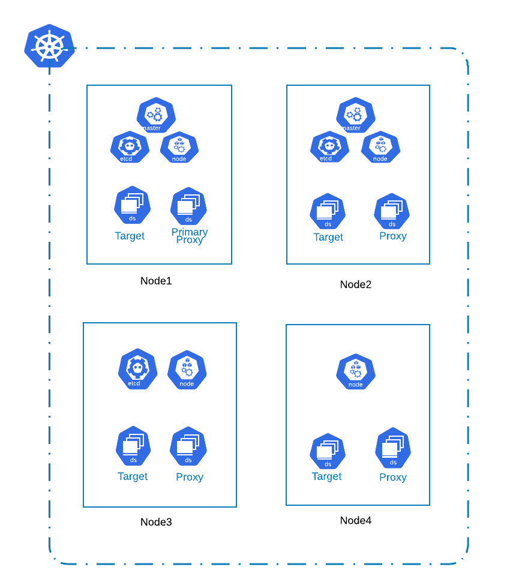

## AIS DEPLOYMENT ON A KUBERNETES CLUSTER

NB: Out-of-date: being updated



Here you can find the scripts to build a docker image to run AIS, setup the hosts with required configurations and deploy AIS using Helm charts.

This README documents the steps to build and run AIS.

### BUILD AIS DOCKER IMAGE

PREREQUISITES:
- Expects Golang to be installed (min requirement: go1.13) and added to PATH environment variable.

1. Create the AIS executable using the build_ais_binary.sh
```
$ ./build_ais_binary.sh
```
2. Build the docker image by running the following command
```
$ docker build -t ais_k8s .
```

The Generated docker image can be tagged and pushed to any docker repo (DockerHub or Quay.io)

### SETUP THE HOSTS

 Once we have the hosts with the K8S cluster, the following configurations need to be applied:
 1. Set the MTU of the hosts to the required value
 2. Install stat and debugging utilities (if required) - like `sysstat`, `iostat`, `pidstat`, Intel PCM tools
 3. Use XFS and create file system on the disks and mount them to the host.
 
 `ais_datafs_mkfs.yml` - This playbook setups up the disk as a filesystem and mounts it to the host.

 `ais_host_config.yml` - This playbook installs the required tools mentioned above and update the host configurations.

 Run these playbook against the inventory specifying the hosts:
 ```
 $ ansible-playbook -i hosts.ini <playbook-name>
 ```
 
 
### HELM INSTALL AIS

AIS needs configuration file (ais.conf) for the proxies, target and non-electable proxies. 
In the current setup, Helm requires templates which are converted to config maps and mounted to the running service pods.
The deployment steps require us to create these config templates. They are generated dynamically to support addition of any new parameters to the setup/config.sh scripts.

 1. To create the configuration template required for AIS that Helm requires, run the following command
 ```
 $ ./setup_ais_configfile.sh
 ```
 2. Check the configuration values specified in charts/values.yaml to ensure they are the expected values.
 3. Update the docker repo token in charts/templates/containerbuilder-secret.yaml to one that has permission to pull the docker image for AIS
 4. Run the following command to deploy AIS to the K8S cluster 
    If using a bastion host:
    ```
    $ cd helm_install_scripts
    $ ansible-playbook -i hosts.ini deploy_ais.yaml
    ```
    Without a bastion host (if current host run kubectl commands against the hosts in the K8S cluster):
    ```
    $ cd helm_install_scripts
    $ ./deploy_ais.sh <location-to-kubeconfig-file> <name-of-helm-deployment> 
    ```

 This requires the following files:
    - The kubeconfig file(admin.conf) for the K8S cluster to be in the current directory
    - An inventory file, listing a host that can reach the hosts in the K8S cluster.
