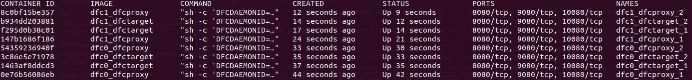

# Docker 

## Introduction

DFC can be run as a cluster of Docker containers. There are three modes of operation: development (docker/dev directory), production (docker/prod directory), and quick start (docker/quick_start directory).

### Development Mode

This mode is currently used for development purposes.
All docker containers mount the same host's DFC source directory, and then execute from this single source. Upon restart (of the DFC cluster), all changes made in the host will, therefore, take an immediate effect.
Note: The development mode is currently being maintained and updated.

### Production Mode

Note the `docker/prod` folder is currently not up to date and might require some tweaking to get it working. Containerized deployment for production is currently tracked seperately.

### Quick Start Mode

Use this mode if you would like to set up a containerized, one-proxy, one-target deployment of DFC within seconds.

For introduction to Docker, please watch [Docker 101 youtube](https://www.youtube.com/watch?v=V9IJj4MzZBc)

This README documents the steps to install and run DFC

## Install Docker and Docker Compose
Note: Using docker requires one of the following versions of Ubuntu:
* Bionic 18.04 (LTS)
* Xenial 16.04 (LTS)
* Trusty 14.04 (LTS)
  
1. Uninstall any old versions of docker:
    ```
    $sudo apt-get remove docker docker-engine docker.io    
    ```
It’s OK if apt-get reports that none of these packages are installed.

2. Update the apt package index:
    ```
    $sudo apt-get update    
    ```

3. Install packages to allow apt to use a repository over HTTPS:
    ```
    $sudo apt-get install \
        apt-transport-https \
        ca-certificates \
        curl \
        software-properties-common    
    ```
4. Install Docker
    ```
    $sudo apt-get install docker-ce
    ```
5. Verify that Docker CE is installed correctly by running the hello-world image.
    ```
    $sudo docker run hello-world
    ```
6.  Add your current user to the docker group (but only if you are not the root). After executing the command, restart your machine for it to take effect.    
    ```    
    $sudo usermod -aG docker $(whoami)       
    ```    
7. Install docker compose using python pip. Install pip if you don't have it:
    ```
    $sudo apt-get install -y python-pip
    $sudo pip install docker-compose

    ```
8. Test the installation:
    ```
    $docker-compose --version
    docker-compose version 1.23.1, build 1719ceb
    ```
9. If you have any troubles with your installation, consider using the latest version of [docker](https://docs.docker.com/install/) and [docker-compose](https://github.com/docker/compose/releases).

## Uninstall Docker and Docker Compose
1. To uninstall Docker, run the following:
    ```
    $sudo apt-get purge docker-ce
    $sudo apt-get purge docker-ce-cli
    ```
2. Ensure docker is completely uninstalled by running the following command:
    ```
    dpkg -l | grep -i docker
    ```
    There should be no docker-ce and docker-ce-cli packages listed.
3. To uninstall Docker-Compose, run the following:
   ```
   $pip uninstall docker-compose
   ```
4. Images, containers, volumes, or customized configuration files on your host are not automatically removed. To delete all images, containers, and volumes:
    ```
    $sudo rm -rf /var/lib/docker
    ```

## Starting DFC
1. If you have already installed go and configured $GOPATH execute the below command to download DFC source code and all its dependencies.
```
$go get -u -v github.com/NVIDIA/dfcpub/dfc
```

2. Set up your AWS configuration by using the the [`aws configure`](https://docs.aws.amazon.com/cli/latest/userguide/cli-chap-getting-started.html) command. 
To run DFC docker containers, you will need to pass your AWS config and credential directory via flag -a=<aws directory> CLI. By default, AWS stores config and credential files in `~/.aws/`
Example:
```
$./deploy_docker.sh -a=~/.aws/
```

3. To deploy DFC, refer to the deployment scripts in `docker/dev`, `docker/prod`, and `docker/quick_start`.
Please note that if you are running the service for the first time, the image build process will take some time; subsequent runs will use the cached images and be much faster.

## Helpful docker commands

### List Running Containers
List all of the running containers using `docker ps`. Many commands require the CONTAINER ID or NAME fields. Example output: 



### List All Containers

Lists all containers (not only the running ones).
```
$docker ps -a
```

### View Container Logs

To view docker logs, use `docker logs <container_name>`. Example:
```
    $docker logs dfc0_proxy_1

    I 21:23:56.400794 metasync.go:142] Starting metasyncer
    I 21:24:06.415473 stats.go:422] {"err.n":0,"get.n":0,"del.n":0,"get.μs":0,"kalive.μs":0,"err.get.n":0,"err.list.n":0,"pst.n":0,"ren.n":0,
    "lst.μs":0,"uptime.μs":0,"kalive.μs.max":0,"err.delete.n":0,"err.post.n":0,"err.range.n":0,"err.head.n":0,"put.n":0,"lst.n":0,
    "kalive.μs.min":0,"err.put.n":0}
    I 21:24:08.386182 proxy.go:2236] joined target 1463af8ddcd3 (num targets 1)
    I 21:24:11.759453 proxy.go:2236] joined target 3c86e5e71978 (num targets 2)
    I 21:24:12.411714 earlystart.go:262] Reached the expected 2/2 target registrations
    I 21:24:12.412098 earlystart.go:228] 0e76b56086eb: merged local Smap (2/1)
    I 21:24:12.412244 metasync.go:290] dosync: smaptag, action=early-start-have-registrations, version=2
    I 21:24:12.412772 metasync.go:290] dosync: bucketmdtag, action=early-start-have-registrations, version=1
    I 21:24:13.425617 earlystart.go:307] 0e76b56086eb: merging discovered Smap v2 (2, 1)

```
Note:
* You can obtain the container name by running command `docker ps`
* The docker/dev directory has a more comprehensive script named `logs.sh` to view logs

### SSH Into a Container

```
    $docker exec -it CONTAINER_NAME /bin/bash
```
Note:
* In production mode, the logs are expected to be in `/var/log/dfc/`.By deafult (Devlopment mode) the logs are under `tmp/dfc/log`
* The docker/dev directory has a script named `container_shell.sh` that does the same thing

### List Docker Images
```
    $docker image ls

    REPOSITORY          TAG                 IMAGE ID            CREATED             SIZE
    dfc1_proxy          latest              ced2cbd2ff2f        27 minutes ago      676MB
    dfc1_target         latest              ced2cbd2ff2f        27 minutes ago      676MB
    dfc0_proxy          latest              4c3fbcb54e4d        27 minutes ago      676MB
    dfc0_target         latest              4c3fbcb54e4d        27 minutes ago      676MB
```

### List Docker Networks
```
    $docker network ls

    NETWORK ID          NAME                    DRIVER              SCOPE
    cb05b22edcb3        bridge                  bridge              local
    86517bef938d        dfc0_internal_control   bridge              local
    51f49b56fe57        dfc0_internal_data      bridge              local
    2cee0651aa72        dfc0_public             bridge              local
    e11635deb15d        dfc1_internal_control   bridge              local
    9eefba13018f        dfc1_internal_data      bridge              local
    674fee80acac        dfc1_public             bridge              local
```

### Start a Container

```
    $docker start CONTAINER_NAME
```

### Stop a Container

```
    $docker stop CONTAINER_NAME
```

### Restart a Container

```
    $docker restart CONTAINER_NAME
```

### Kill a Container

```
    $docker kill CONTAINER_NAME
```

### View Resource Usage Statistics for all Containers

```
    $docker stats
```

### Remove Unused Images

```
    $docker image prune -f
```

### Remove all Stopped Containers

```
    $docker container prune -f
```

### Remove all Unused Networks

```
    $docker network prune -f
```

### Stop all Running Containers

```
    $docker stop $(docker ps -a -q)
```

### Delete all Existing Containers

```
    $docker rm $(docker ps -a -q)
```

### Delete all Existing Images

```
    $docker rmi $(docker images -q -a)
```


