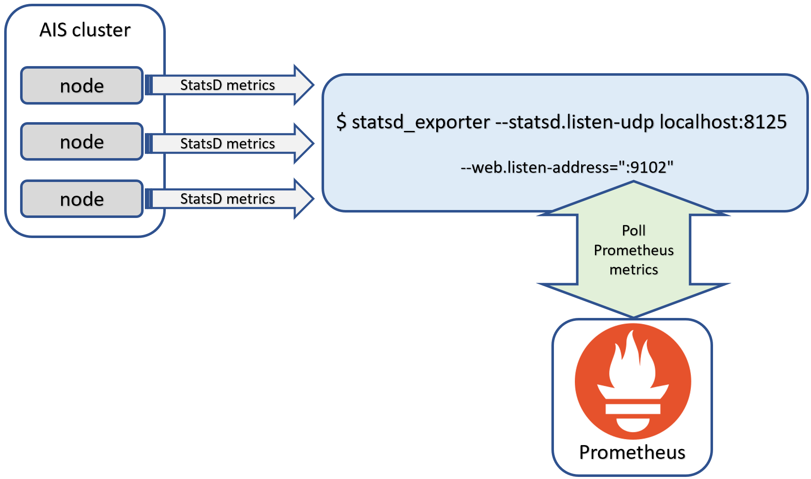

# AIStore Observability: Prometheus

AIStore (AIS) exposes metrics in [Prometheus](https://prometheus.io) format via HTTP endpoints. This integration enables comprehensive monitoring of AIS clusters, performance tracking, and trend analysis.

## Table of Contents
- [Overview](#overview)
- [Monitoring Architecture](#monitoring-architecture)
- [Prometheus Integration](#prometheus-integration)
  - [Native Exporter](#native-exporter)
  - [Viewing Raw Metrics](#viewing-raw-metrics)
  - [Key Metrics Groups](#key-metrics-groups)
  - [Metric Labels](#metric-labels)
  - [Essential Prometheus Queries](#essential-prometheus-queries)
- [Node Alerts](#node-alerts)
  - [CLI Monitoring](#cli-monitoring)
  - [Prometheus Queries](#prometheus-queries)
  - [Grafana Alerting](#grafana-alerting)
- [StatsD Alternative](#statsd-alternative)
  - [StatsD Exporter for Prometheus](#statsd-exporter-for-prometheus)
  - [Setup and Configuration](#setup-and-configuration)
- [Best Practices](#best-practices)
- [References](#references)
- [Related Documentation](#related-documentation)

## Overview

AIS tracks a comprehensive set of performance metrics including:

* Performance counters
* Resource utilization percentages
* Latency and throughput metrics
* Data transfer statistics (total bytes and object counts)
* Error counters and operational status

Full observability is supported using multiple complementary tools:

* AIS node logs for detailed diagnostics
* [CLI](/docs/cli.md) for interactive monitoring, specifically the [`ais show cluster stats`](/docs/cli/cluster.md) command
* Monitoring backends:
  * [Prometheus](https://prometheus.io/) (recommended)
  * [StatsD](https://github.com/etsy/statsd) with any compliant backend (e.g., Graphite/Grafana)

> For information on load testing metrics, please refer to [AIS Load Generator](/docs/aisloader.md) and [How To Benchmark AIStore](/docs/howto_benchmark.md).

## Monitoring Architecture

The typical monitoring setup with Prometheus looks as follows:

```
┌────────────────┐       ┌────────────────┐
│                │ scrape│                │
│   Prometheus   │◄──────┤  AIStore Node  │
│                │       │   /metrics     │
└────────────────┘       └────────────────┘
        │
        │ query
        ▼
┌────────────────┐
│                │
│     Grafana    │
│                │
└────────────────┘
```

This layout provides:

- Direct metric collection from AIS nodes
- Centralized metric storage in Prometheus
- Powerful visualization through [Grafana dashboards](/docs/40-grafana.md)
- Historical trend analysis and alerting capabilities

## Prometheus Integration

### Native Exporter

AIS is a fully compliant [Prometheus exporter](https://prometheus.io/docs/instrumenting/writing_exporters/) that natively supports metric collection without additional components. Key integration points:

1. **Configuration**: No special configuration is required - simply build AIS **without** the `statsd` build tag to enable Prometheus support
2. **Metric Registration**: When starting, each AIS node (gateway or storage target) automatically:
   - Registers all metric descriptions (names, labels, and help text) with Prometheus
   - Exposes the HTTP endpoint `/metrics` for Prometheus scraping
3. **Build Selection**: The choice between StatsD and Prometheus is a **build-time** decision controlled by the `statsd` build tag

> For the complete list of supported build tags, please see [conditional linkage](/docs/build_tags.md).

### Viewing Raw Metrics

You can directly view the exposed metrics using `curl`:

```console
$ curl http://<aistore-node-ip-or-hostname>:<port>/metrics

# For HTTPS deployments:
$ curl https://<aistore-node-ip-or-hostname>:<port>/metrics
```

Sample output:

```console
# HELP ais_target_disk_avg_rsize average read size (bytes)
# TYPE ais_target_disk_avg_rsize gauge
ais_target_disk_avg_rsize{disk="nvme0n1",node_id="ClCt8081"} 4096
# HELP ais_target_disk_avg_wsize average write size (bytes)
# TYPE ais_target_disk_avg_wsize gauge
ais_target_disk_avg_wsize{disk="nvme0n1",node_id="ClCt8081"} 260130
# HELP ais_target_disk_read_mbps read bandwidth (MB/s)
# TYPE ais_target_put_bytes counter
...
ais_target_put_bytes{node_id="ClCt8081"} 1.721761792e+10
# HELP ais_target_put_count total number of executed PUT(object) requests
# TYPE ais_target_put_count counter
ais_target_put_count{node_id="ClCt8081"} 1642
# HELP ais_target_put_ns_total PUT: total cumulative time (nanoseconds)
# TYPE ais_target_put_ns_total counter
ais_target_put_ns_total{node_id="ClCt8081"} 9.44367232e+09
# TYPE ais_target_state_flags gauge
ais_target_state_flags{node_id="ClCt8081"} 6
# HELP ais_target_uptime this node's uptime since its startup (seconds)
# TYPE ais_target_uptime gauge
ais_target_uptime{node_id="ClCt8081"} 210
...
```

For continuous monitoring of specific metrics without a full Prometheus deployment:

```console
for i in {1..99999}; do
  curl http://hostname:8081/metrics --silent | grep "ais_target_get_n.*node"
  sleep 1
done
```

### Key Metrics Groups

| Category | Metrics Prefix | Examples | Usage |
|----------|----------------|----------|-------|
| Operations | `ais_target_get_*`, `ais_target_put_*` | `ais_target_get_count`, `ais_target_put_bytes` | Track throughput, operation counts |
| Resources | `ais_target_disk_*`, `ais_target_mem_*` | `ais_target_disk_util`, `ais_target_mem_used` | Monitor resource consumption |
| Errors | `ais_target_err_*` | `ais_target_err_get_count` | Track operation failures |
| Cloud operations | `ais_target_cloud_*` | `ais_target_cloud_get_count` | Monitor cloud backend activity |
| System | `ais_target_uptime`, `ais_target_rebalance_*` | `ais_target_uptime`, `ais_target_rebalance_objects` | System status, rebalancing |

### Metric Labels

AIS exposes labels for detailed filtering and aggregation:

| Label | Description | Type |
|----------|-------------|-----------------|
| `node_id` | Unique node identifier | Static |
| `disk` | Disk identifier for storage metrics | Variable |
| `bucket` | Bucket name | Variable |
| `xaction` | Extended action (batch job) identifier | Variable |

> Variable labels provide powerful filtering capabilities only available in Prometheus mode.

### Essential Prometheus Queries

Here are key PromQL queries for operational monitoring:

```
# Cluster-wide GET operations per second (rate over 5m)
sum(rate(ais_target_get_count[5m]))

# Average GET latency in milliseconds
sum(rate(ais_target_get_ns_total[5m])) / sum(rate(ais_target_get_count[5m])) / 1000000

# Disk utilization per target
ais_target_disk_util{disk="nvme0n1"}

# Error rate as percentage of operations
sum(rate(ais_target_err_get_count[5m])) / sum(rate(ais_target_get_count[5m])) * 100

# Cluster storage capacity utilization
sum(ais_target_capacity_used) / sum(ais_target_capacity_total) * 100

# Node health status (state flags)
ais_target_state_flags
```

## Node Alerts

AIStore node states are categorized into three severity levels:

1. **Red Alerts** - Critical issues requiring immediate attention:
   - `OOS` - Out of space condition
   - `OOM` - Out of memory condition
   - `OOCPU` - Out of CPU resources
   - `DiskFault` - Disk failures detected
   - `NoMountpaths` - No available mountpaths
   - `NumGoroutines` - Excessive number of goroutines
   - `CertificateExpired` - TLS certificate has expired
   - `CertificateInvalid` - TLS certificate is invalid

2. **Warning Alerts** - Potential issues that may require attention:
   - `Rebalancing` - Rebalance operation in progress
   - `RebalanceInterrupted` - Rebalance was interrupted
   - `Resilvering` - Resilvering operation in progress
   - `ResilverInterrupted` - Resilver was interrupted
   - `NodeRestarted` - Node was restarted (powercycle, crash)
   - `MaintenanceMode` - Node is in maintenance mode
   - `LowCapacity` - Low storage capacity (OOS possible soon)
   - `LowMemory` - Low memory condition (OOM possible soon)
   - `LowCPU` - Low CPU availability
   - `CertWillSoonExpire` - TLS certificate will expire soon
   - `KeepAliveErrors` - Recent keep-alive errors detected

3. **Information States** - Normal operational states:
   - `ClusterStarted` - Cluster has started (primary) or node has joined cluster
   - `NodeStarted` - Node has started (may not have joined cluster yet)
   - `VoteInProgress` - Voting process is in progress

Node state flags are exposed via the Prometheus metric `ais_target_state_flags` and can be monitored using the following methods:

### CLI Monitoring

The node state can be viewed directly using the CLI:

```console
$ ais show cluster
```

This command displays the state for all nodes in the cluster, including any active alerts.

### Prometheus Queries

To monitor node states with Prometheus:

```
# Detect nodes with any red alert condition
ais_target_state_flags > 0 and on (node_id) (
  ais_target_state_flags & 8192 > 0 or  # OOS
  ais_target_state_flags & 16384 > 0 or # OOM
  ais_target_state_flags & 262144 > 0 or # OOCPU
  ais_target_state_flags & 65536 > 0 or # DiskFault
  ais_target_state_flags & 131072 > 0 or # NoMountpaths
  ais_target_state_flags & 262144 > 0 or # NumGoroutines
  ais_target_state_flags & 1048576 > 0 # CertificateExpired
)

# Find nodes with warning conditions
ais_target_state_flags > 0 and on (node_id) (
  ais_target_state_flags & 8 > 0 or # Rebalancing
  ais_target_state_flags & 16 > 0 or # RebalanceInterrupted
  ais_target_state_flags & 32 > 0 or # Resilvering
  ais_target_state_flags & 64 > 0 or # ResilverInterrupted
  ais_target_state_flags & 128 > 0 or # NodeRestarted
  ais_target_state_flags & 32768 > 0 or # MaintenanceMode
  ais_target_state_flags & 4096 > 0 or # LowCapacity
  ais_target_state_flags & 8192 > 0 # LowMemory
)
```

### Grafana Alerting

In Grafana, you can set up alerts based on these node state flags:

1. Create a Grafana alert rule using the PromQL queries above
2. Set appropriate thresholds and notification channels
3. Configure different severity levels for red vs. warning conditions

Example Grafana alert rule for red alerts:

```
# Alert on critical node conditions
ais_target_state_flags{node_id=~"$node"} > 0 and (
  ais_target_state_flags{node_id=~"$node"} & 8192 > 0 or
  ais_target_state_flags{node_id=~"$node"} & 16384 > 0 or
  ais_target_state_flags{node_id=~"$node"} & 262144 > 0
)
```

This alerting system provides comprehensive visibility into the operational state of your AIStore cluster and helps detect issues before they impact performance or availability.

## StatsD Alternative

> **Important**: StatsD support is deprecated and will likely be removed by the end of 2025. New deployments should use the native Prometheus integration described above.

### StatsD Exporter for Prometheus

If specific requirements necessitate using StatsD, you can still integrate with Prometheus using its [statsd_exporter](https://github.com/prometheus/statsd_exporter) component that translates StatsD metrics to Prometheus format on-the-fly.

> **Note**: Native Prometheus integration is the preferred option. StatsD exporter should only be considered for deployments with special requirements.

Architecture with StatsD exporter:



In this configuration:
- AIS nodes send StatsD metrics to a UDP endpoint
- The statsd_exporter receives these metrics and converts them to Prometheus format
- Prometheus scrapes the exporter's HTTP endpoint
- Grafana queries Prometheus for visualization

### Setup and Configuration

To deploy the StatsD exporter:

1. Use the [prebuilt container image](https://quay.io/repository/prometheus/statsd-exporter), or
2. Install from source:
   ```console
   $ go install github.com/prometheus/statsd_exporter@latest
   ```

For testing without Prometheus, run with debug logging:

```console
$ statsd_exporter --statsd.listen-udp localhost:8125 --log.level debug
```

Example debug output:

```console
level=info ts=2021-05-13T15:30:22.251Z caller=main.go:321 msg="Starting StatsD -> Prometheus Exporter" version="(version=, branch=, revision=)"
level=info ts=2021-05-13T15:30:22.251Z caller=main.go:322 msg="Build context" context="(go=go1.16.3, user=, date=)"
level=info ts=2021-05-13T15:30:22.251Z caller=main.go:361 msg="Accepting StatsD Traffic" udp=localhost:8125 tcp=:9125 unixgram=
level=info ts=2021-05-13T15:30:22.251Z caller=main.go:362 msg="Accepting Prometheus Requests" addr=:9102
level=debug ts=2021-05-13T15:30:27.811Z caller=listener.go:73 msg="Incoming line" proto=udp line=aistarget.pakftUgh.kalive.latency:1|ms
level=debug ts=2021-05-13T15:30:29.891Z caller=listener.go:73 msg="Incoming line" proto=udp line=aisproxy.qYyhpllR.pst.count:77|c
```

Finally, configure Prometheus to scrape the exporter's metrics endpoint (default port **9102**).

Default port configuration:
- StatsD UDP input: **8125**
- Prometheus HTTP endpoint: **9102**

To see all configuration options:

```console
$ statsd_exporter --help
```

## Best Practices

To maximize the value of AIStore's Prometheus integration:

1. **Retention Planning**: Configure appropriate retention periods in Prometheus based on your monitoring needs
2. **Dashboard Organization**: Create dedicated [Grafana dashboards](/docs/40-grafana.md) for:
   - Cluster overview (high-level health)
   - Per-node performance
   - Resource utilization
   - Operation latencies
   - Error analysis
3. **Alerting**: Configure alerts for critical conditions:
   - Node state red alerts (OOS, OOM, DiskFault, etc.)
   - High error rates
   - Disk utilization thresholds
   - Performance degradation
4. **Metric Selection**: Focus on key operational metrics for routine monitoring
5. **Collection Frequency**: Balance scrape intervals for accuracy versus storage requirements

## References

* [Prometheus Exporters](https://prometheus.io/docs/instrumenting/writing_exporters/)
* [Prometheus Data Model](https://prometheus.io/docs/concepts/data_model/)
* [Prometheus Metric Types](https://prometheus.io/docs/concepts/metric_types/)
* [StatsD Exporter](https://github.com/prometheus/statsd_exporter)

## Related Documentation

| Document | Description |
|----------|-------------|
| [Observability: Overview](/docs/00-overview.md) | Introduction to AIS observability approaches |
| [Observability: CLI](/docs/10-cli.md) | Command-line monitoring tools |
| [Observability: Logs](/docs/20-logs.md) | Log-based observability |
| [Observability: Metrics Reference](/docs/31-metrics-reference.md) | Complete metrics catalog |
| [Observability: Grafana](/docs/40-grafana.md) | Visualizing AIS metrics with Grafana |
| [Observability: Kubernetes](/docs/50-k8s.md) | Working with Kubernetes monitoring stacks |
