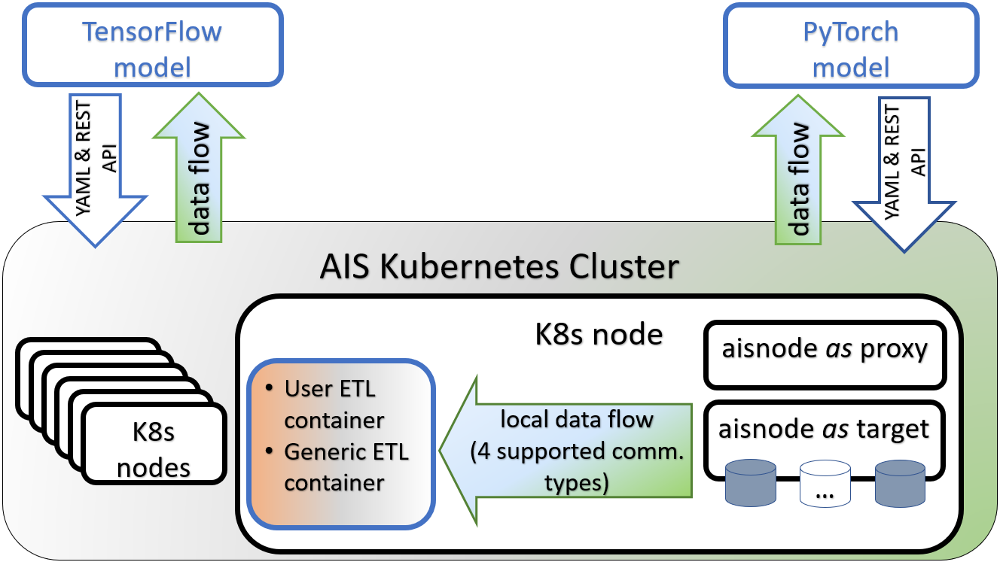

## Introduction

[AIStore](https://github.com/NVIDIA/aistore) (AIS) is a reliable lightweight storage cluster that deploys anywhere, runs user containers and functions, and scales linearly with no limitation. The development has been inspired by the unique demands of deep-learning apps - particularly the need to pre-process, post-process, or otherwise reformat and augment raw data in order to uncover its hidden value and purpose.

> Custom data-transforming operations organized usually into some sort of input and output pipelines that run before, during, and/or after ML training, have become so pervasive and so widely used that, *in summa* - and notwithstanding broad vagueness of the definition and lack of [inline citations](https://en.wikipedia.org/wiki/Extract,_transform,_load) - came to be widely known as ETL.

The long and short of it is that we believe that ETL must run **only and exclusively inside** a storage system - the system that has been built to support just that. The only question is - *how*? How to *offload* I/O intensive data transforming pipelines *to the server*? And how to make it happen without changing the client-side code?

This text opens a series of blog posts where we intend to start answering those questions with simple usage examples and code snippets that anyone can run. For starters, we'll use an **ImageNet**-derived dataset that has been already pre-**sharded**.

> [ImageNet](https://www.image-net.org/download.php) is, without argument, the most popular deep-learning dataset of the last decade. It is, simultaneously, a textbook example of the latter.

The motivation to convert (small-file) samples to larger shards that would optimally contain batches of original samples - such motivation exists and b) grows exponentially with the size of a dataset in question. ImageNet, once [inflated](https://arxiv.org/abs/2001.01858) beyond the capacity of a typical server, would make a good representation. More on that in [here](https://eng.uber.com/scaling-hdfs/) and [here](http://www.acadpubl.eu/hub/2018-119-15/2/301.pdf).

AIS, on the other hand, has been built to conveniently support pre-sharding, post-sharding, de-sharding, and generally handling serialized archives transparently from the user perspective. There are currently 3 (three) equally supported [archival formats](https://github.com/NVIDIA/aistore/releases), whereby training apps can read and write data without really paying any attention. Implementation-wise, archiving is realized as an asynchronous multi-object batch operation that gathers arbitrary ranges of samples from across the cluster and combines them into archival shards in a streaming fashion. `APPEND` (to an existing archives aka shard) is also supported, and much more.

## TL;DR

This post is the first in the upcoming mini-series. We'll gradually introduce AIStore, an open-source immediately-deployable-anywhere scalable-specialized storage. And the tooling around it to assist AI researchers and data scientists.

Much of those tools are early-stage - developing as we speak. For instance, `aistore.pytorch.Dataset` - subclass of the familiar [`torch.utils.data.Dataset`](https://pytorch.org/docs/stable/data.html#torch.utils.data.Dataset) that allows running arbitrary `torchvision` -based transforms *on the server* - i.e., inside (and by) your AIStore cluster.

Schematically, at a comfortably high level, the resulting picture will look as follows:

Here we have a Kubernetes cluster that runs AIS cluster (where [AIS/K8s Operator](https://github.com/NVIDIA/ais-k8s/tree/master/operator) is not shown as well as many other implementation details).

Each K8s node contains an AIS target (that has *disks*) and, optionally, AIS proxy (aka gateway) responsible for control-plane - specifically, for routing I/O requests.

In addition, there's a locally running ETL - locally as far as *transforming* data flow between itself and its peer AIS target within a given K8s node. There are multiple communication mechanisms (currently 4, to be precise) that we support to accommodate a variety of ETL containers and their respective *runtimes* - more about all of that in our next post.

## References

1. **High Performance I/O For Large Scale Deep Learning**, https://arxiv.org/abs/2001.01858
2. **Efficient PyTorch I/O library for Large Datasets, Many Files, Many GPUs**, https://pytorch.org/blog/efficient-pytorch-io-library-for-large-datasets-many-files-many-gpus
3. **AIS ETL: Getting Started, Tutorial, Inline and Offline examples, Kubernetes deployment**, https://github.com/NVIDIA/aistore/blob/master/docs/etl.md
4. **GitHub open source**:
   - [AIStore](https://github.com/NVIDIA/aistore)
   - [AIS/Kubernetes Operator, AIS on bare-metal, Deployment Playbooks, Helm](https://github.com/NVIDIA/ais-k8s)
   - [AIS ETL containers and specs](https://github.com/NVIDIA/ais-etl)
5. **AI-at-Scale** documentation and blogs, https://aiatscale.org
