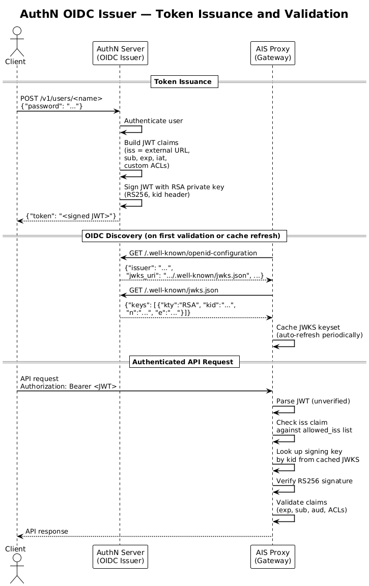

AIStore (AIS) supports authentication and authorization with [JSON Web Tokens](https://datatracker.ietf.org/doc/html/rfc7519)(JWT).
These tokens can be issued from the first party [AuthN service](/docs/authn.md) OR compatible 3rd party OAuth services.
This doc covers how AIS validates requests based on their included tokens.

For details on configuring auth in K8s, see the [AIS K8s Operator README](https://github.com/NVIDIA/ais-k8s/blob/main/operator/README.md).

For an end-to-end example of setting up Keycloak with AIS in K8s, see the [auth deployment guide in the ais-k8s repo](https://github.com/NVIDIA/ais-k8s/blob/main/docs/deploy_with_auth.md).

## Table of Contents

- [General Purpose Auth Support](#general-purpose-auth-support)
- [Token Requirements](#token-requirements)
- [Authentication Flow](#authentication-flow)
- [Token Validation Configuration](#token-validation-configuration)
  - [Required Claims](#required-claims)
  - [Signature Verification](#signature-verification)
    - [Static Credentials](#static-credentials)
    - [OIDC Lookup](#oidc-lookup)
- [Authentication Boundaries](#authentication-boundaries)

## General Purpose Auth Support

AIS uses JWT to both **authenticate** and **authorize** API requests.
Compatible JWTs contain all the information AIS needs to determine if a request can succeed.
Rather than authenticating a user with a role and using that role to lookup authorized actions, AIS validates the claims provided in the JWT itself.
This minimizes the latency impact of the token verification as AIS does not have to query any service to validate user access for a specific request.

While we do provide our own [authN service](./authn.md), many users may prefer to use an existing or more feature-rich authentication and authorization solution.
AIS itself does not have any special requirement for the AIStore AuthN service, but only that a compatible JWT is provided for validation ([see below](#token-requirements)).
This allows for full compatibility with existing auth services.

## Token Requirements

AIS JWT tokens for authentication and authorization can be provided by **any** service.
AIS must be configured to trust tokens generated by that service and the tokens must contain the required AIS claims.
Tokens must use a supported signing method: `[HS256, HS384, HS512] (HMAC)` or `[RS256, RS384, RS512] (RSA)`.
See below for [signature verification configuration](#signature-verification).

JWT tokens for AIS must include the following standard claims to be considered valid:

- `sub` (subject): Identifies the authenticated user or service
- `exp` (expiration): Token expiration timestamp; expired tokens are automatically rejected

The following standard claims are required depending on AIS config (see [Token Validation Configuration](#token-validation-configuration)):

- `iss` (issuer): Identifies the token issuer (only required for OIDC validation, see `auth.oidc.allowed_iss`)
- `aud` (audience): Target audience for the token, validated against `auth.required_claims.aud`

AIS uses a few extra custom claims to validate access for specific API calls.
These are subject to change as we improve AIS auth capabilities.

- `admin` -- Total admin access, supersedes all other claims
- `clusters` -- List of AIS clusters, permission applies cluster-wide
- `buckets` -- List of buckets to access with scoped permissions

Example token claim format:
```json
{
  "sub": "john", // Standard subject JWT claim
  "exp": "2025-10-05T12:00:00Z", // Standard expiry JWT claim
  "clusters": [
    {
      "id": "abc123-cluster-uuid", // Permission only valid for this specific cluster
      "perm": "18446744073709551615", // All possible permissions flags set
    },
    {
      "id": "", // Permission valid for any clusters trusting this token issuer
      "perm": "12288" // Read only permission flags, cluster-wide
    }
  ],
  "buckets": [
    {
      // The permission flag below applies only to this bucket in this cluster
      "bck": {
        "name": "my-bucket",
        "provider": "ais",
        "namespace": {
          "uuid": "abc123-cluster-uuid", // Must match cluster ID
          "name": "" // Not used for validation
        }
      },
      "perm": "575" // All object operations, but no bucket modifications
    }
  ],
  "admin": "true" // Overrides all other access control claims
}
```

The `admin` claim is the simplest option.
If `admin` is true, all permissions are granted for clusters trusting the token issuer.

For the `clusters` claim, the ID must match the cluster's UUID if set.
If the cluster ID is left empty, the claim permissions will be applied to any cluster trusting the issuer.

For the `buckets` claim, the cluster ID must also be provided along with the bucket info.
Permissions attached to each of these will be valid only for that bucket.

For permissions to grant, see the [list of permissions in the authN doc](/docs/authn.md#permissions) and the values in [api/apc/access.go](/api/apc/access.go).
Add the bit flags together to combine permissions.

## Authentication Flow

When authentication is enabled, incoming HTTP requests are validated before processing:

1. Tokens are extracted from request headers: `Authorization: Bearer <token>` (standard) or `X-Amz-Security-Token` (AWS SDK compatibility)
1. The proxy validates the token signature using either static credentials or OIDC lookup (see [Signature Verification](#signature-verification))
1. Token claims (`subject`, `issuer`, `audience`, `expiration`) are verified according to [cluster configuration](#token-validation-configuration)
1. Custom AIS claims (`admin`, `clusters`, `buckets`) are compared against the request to validate user access to the resource specified by the API call
1. Starting in v5.1, if `auth.intra_cluster.request_auth` is set, the redirect URL is signed for targets to validate (see [Authentication Boundaries](#authentication-boundaries))

## Token Validation Configuration

Authentication is controlled via the `auth` section of the cluster configuration.
To require authentication for protected client requests, set `auth.client_auth_required` to `true`.

### Required Claims

To set claims that must be present in all tokens, you can add them to `auth.required_claims`.
Currently, the only supported value is `auth.required_claims.aud` to verify the configured value matches the issued token audience.

### Signature Verification

AIS supports two mutually exclusive approaches to signature verification, configured via `auth.signature` or `auth.oidc`:

#### Static Credentials

Static credential validation uses a fixed shared secret or public key configured directly in the cluster config:

- **HMAC (symmetric)**: Configure `auth.signature.method` (e.g., "HS256") and `auth.signature.key` with a shared secret
  - The same secret must be used by the token issuer to sign tokens and by AIS to verify them
  - Suitable for integration with the first-party AuthN service or controlled token issuers
- **RSA (asymmetric)**: Configure `auth.signature.method` (e.g., "RS256") and `auth.signature.key` with an RSA public key
  - AIS validates tokens using the public key; tokens are signed by the issuer using the corresponding private key
  - More secure for scenarios where the signing key cannot be safely shared with AIS

#### OIDC Lookup

OIDC validation enables dynamic public key discovery from trusted OIDC compatible providers.
To enable, configure `auth.oidc.allowed_iss` with a list of trusted issuer URLs (e.g., `["https://keycloak.svc.cluster.local:8543/realms/aistore"]`).
These URLs must use HTTPS and must exactly match the `iss` claim in tokens issued by that provider (including scheme, host, port, and path).
Optionally, configure `auth.oidc.issuer_ca_bundle` to provide custom CA certificates for issuer TLS validation.

Token verification via OIDC discovery follows this flow:

1. The AIS proxy queries each configured allowed issuer's `/.well-known/openid-configuration` endpoint
2. The discovery document returns a `jwks_uri` pointing to the issuer's public key set
3. The proxy fetches the JWKS from the `jwks_uri` and caches the keys (with automatic periodic refresh)
4. When validating a token, the proxy checks the `iss` claim against the allowed issuer list and uses the issuer's public key (identified by `kid` header) to verify the signature

See the diagram below for an example of how this flow works with the AuthN service:



## Authentication Boundaries

The `auth` section controls three separate security boundaries:

| Setting | Boundary | v5.0 behavior |
|---|---|---|
| `auth.client_auth_required` | Client requests reaching AIS proxies | Requires JWT/OIDC authentication and authorization when true |
| `auth.intra_cluster.request_auth` | Protected node-to-node requests and redirects | Accepted and persisted, but signing and verification remain inactive until v5.1; direct client access to targets is rejected |
| `auth.intra_cluster.self_join_auth` | A node's startup self-join request to the primary proxy | Accepted and persisted, but has no runtime effect until v5.1 |

These settings are independent. For example, an operator can pre-stage either
intra-cluster policy without requiring JWT/OIDC authentication from clients.

The request-authentication window settings apply only to
`auth.intra_cluster.request_auth`:

- `auth.intra_cluster.ttl`: TTL for request signatures; `0s` means no expiration
- `auth.intra_cluster.nonce_window`: tolerated clock skew between nodes
- `auth.intra_cluster.rotation_grace`: time to accept old and new signing keys during rotation

In v5.1, nodes use per-node Ed25519 keys distributed through cluster metadata to
sign and verify protected intra-cluster requests. Self-join authentication is
also enforced only when `auth.intra_cluster.self_join_auth` is true.
