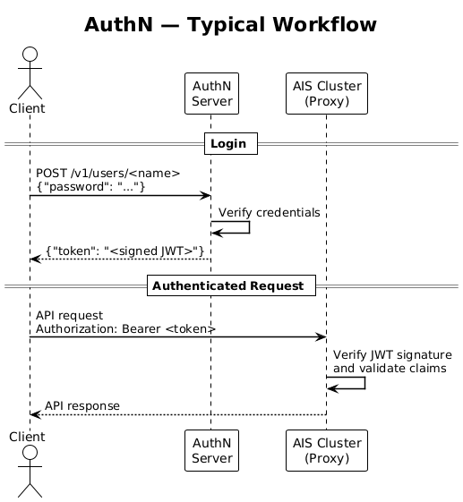
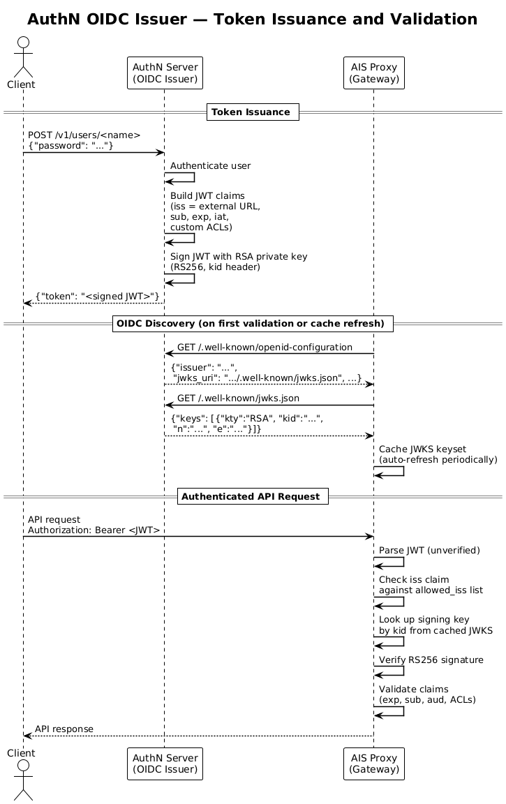
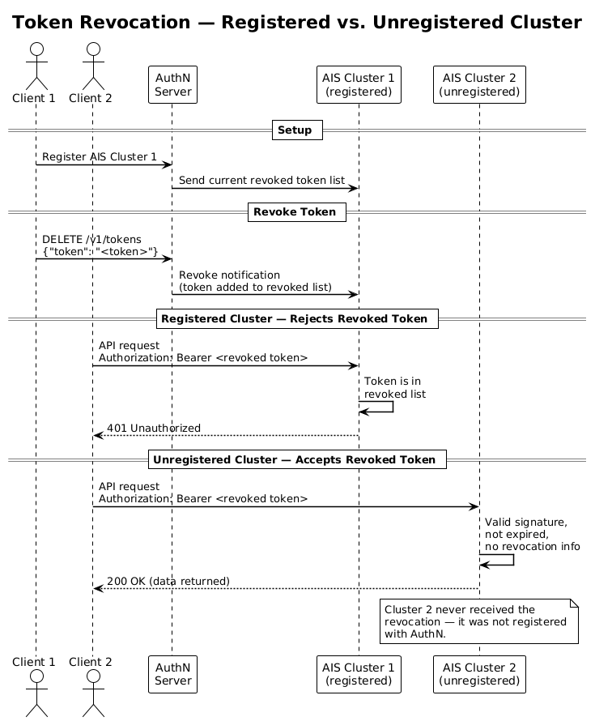

The AIStore Authentication Server (AuthN) provides secure access to AIStore by leveraging [JSON Web Tokens (JWT)](https://datatracker.ietf.org/doc/html/rfc7519).

>  **NOTE**: AuthN is under development and has NOT gone through a complete security audit. 
Please review your deployment carefully and follow [our security policy](https://github.com/NVIDIA/aistore/blob/main/SECURITY.md) to report any issues.

> **COMPATIBILITY**: Tokens issued with only the 'username' and 'expires' claims (deprecated in v4.2) will no longer pass AIS authentication in v4.3. 
> New tokens will use 'sub' and 'exp' claims in place of 'username' and 'expires', respectively. 

For more details:
- [Introduction to JWT](https://jwt.io/introduction/)
- [Go implementation of JSON Web Tokens](https://github.com/golang-jwt/jwt) used for AuthN.

### Key Features
- **Standalone Server**: AuthN operates *independently*, managing users and tokens separately from the AIStore cluster.
- **Secure Tokens**: AuthN supports two methods for signing issued JWTs:
  - RSA asymmetric key pairs with RS256 (Recommended)
  - HMAC symmetric key signing with HS256
- **Client Workflow**: If AuthN is enabled on a cluster, users must log in to receive a token from AuthN. This token must be included in subsequent HTTP requests to the AIS cluster. Requests without a valid token are rejected by AuthN-enabled AIS clusters.
- **OIDC Issuer Compliance**: When configured with RSA signing, AuthN implements a small subset of the OIDC spec with the capability to serve as a discoverable JWKS provider. See [OIDC Issuer](#oidc-issuer) below.

### Typical Workflow



1. **User logs in**: The client sends login credentials to AuthN.
2. **Token Issuance**: AuthN issues a token to the client.
3. **Authenticated Requests**: The client includes the token in the request headers (`Authorization: Bearer <token>`) for subsequent API requests to the AIStore cluster.
4. **API Response**: The cluster processes the request and responds.

### Protocols
AuthN supports both HTTP and HTTPS protocols.
By default, AuthN starts as an HTTP server listening on port `52001`.
For HTTPS, ensure the configuration file options `server_crt` and `server_key` are correctly set to the TLS certificate and key paths.

AuthN generates tokens that are *self-sufficient*, meaning a proxy does not need to contact AuthN to check permissions.
AIStore clusters should be registered with the AuthN server.
This allows AuthN to broadcast revoked tokens to all registered clusters for immediate access restriction.

## Table of Contents

- [Getting Started](#getting-started)
  - [Initial Setup and Authentication](#initial-setup-and-authentication)
  - [Default Roles and Permissions](#default-roles-and-permissions)
  - [Enable CLI Auto-Completion](#enable-cli-auto-completion)
  - [Example Workflow](#example-workflow)
- [RSA Signing](#rsa-signing)
  - [Private Key Passphrase](#private-key-passphrase)
- [OIDC Issuer](#oidc-issuer)
  - [External URL](#external-url)
  - [OIDC Deployment Example](#oidc-deployment-example)
- [HMAC Deployment Example](#hmac-deployment-example)
- [Environment and Configuration](#environment-configuration)
- [AuthN Configuration and Log](#authn-configuration-and-log)
- [Permissions](#permissions)
- [How to Enable AuthN Server After Deployment](#how-to-enable-authn-server-after-deployment)
- [REST API](#rest-api)
  - [Notation](#notation)
  - [Authorization](#authorization)
  - [Tokens](#tokens)
  - [Clusters](#clusters)
  - [Roles](#roles)
  - [Users](#users)
  - [Configuration](#configuration)

## Getting Started

In this section, we use AIStore [Local Playground](/docs/getting_started.md#local-playground).
This is done for demonstration purposes, as it's easy to use and reproduce.

If you already have an AIS cluster deployed and just want to add AuthN to it for authentication and access control, follow [these instructions](#how-to-enable-authn-server-after-deployment).

> **Note:** When deploying AIStore with AuthN, an `admin` user is created by default with `admin` privileges.
>
> The default password for the `admin` user **must** be set with the environment variable `AIS_AUTHN_SU_PASS`.
>
> For the list of environment variables, refer to the [Environment Configuration](#environment-configuration) section below.


Follow these steps to deploy a new local AIS cluster with AuthN enabled and RSA signing:

1. Optionally, shut down and clean up any existing [Local Playground](/docs/getting_started.md#local-playground) deployments and rebuild AIS CLI:
    ```sh
    make kill clean cli
    ```

2. Build AuthN and deploy an AuthN server. The following example exports the required admin password. Then it runs AuthN with an auto-generated local config at `$HOME/.config/ais/authn` (see the [deployment script](../deploy/dev/local/authn_deploy.sh)). See [key passphrase](#private-key-passphrase) to optionally protect the private key on disk.

    ```sh
    export AIS_AUTHN_SU_PASS="adminpass"
    make authn-deploy
    ```

3. Fetch the public key from the AuthN service and export it for the AIS cluster to use:

    ```sh
    export AIS_AUTHN_PUBLIC_KEY="$(ais auth show public-key)"
    ```

4. Deploy the cluster with AuthN validation enabled:
    ```sh
    AIS_AUTHN_ENABLED=true make deploy
    ```

This will start up an AIStore cluster that trusts JWTs issued by the AuthN server.

### Initial Setup and Authentication

After deploying the cluster, you won't be able to access it without authentication:

```sh
ais show cluster
Error: token required
```

1. **Log in as Admin**:
    ```sh
    ais auth login admin -p $AIS_AUTHN_SU_PASS
    Logged in (/root/.config/ais/cli/auth.token)
    ```

2. **View Registered Clusters**:
    ```sh
    ais auth show cluster
    CLUSTER ID  ALIAS   URLs
    ```

3. **Add Your Cluster**:
    ```sh
    ais auth add cluster mycluster $AIS_ENDPOINT
    ```

4. **Confirm Cluster Registration**:
    ```sh
    ais auth show cluster
    CLUSTER ID  ALIAS       URLs
    eTdL4YGHN   mycluster   http://localhost:8080
    ```

### Default Roles and Permissions

AuthN automatically deploys with a superuser role `Admin` and a user account `admin` with that role assigned.
Only users with the `Admin` role can manage AuthN.
Admins have superuser permissions and can assume all other roles in the cluster.

When a cluster is registered, AuthN creates a set of default roles for that cluster:

```sh
ais auth show role
ROLE                          DESCRIPTION
Admin                         AuthN administrator
BucketOwner-mycluster         Full access to buckets in eTdL4YGHN[mycluster]
ClusterOwner-mycluster        Admin access to eTdL4YGHN[mycluster]
Guest-mycluster               Read-only access to buckets in eTdL4YGHN[mycluster]
```

### Enable CLI Auto-Completion

Ensure that you have auto-completions enabled for the AIS CLI:
```sh
make cli-autocompletions
```

You can use `<TAB-TAB>` to view a list of possible options:
```sh
$ ais auth add role role_name <TAB-TAB>
ro               GET              DESTROY-BUCKET   PATCH            PROMOTE          APPEND           SET-BUCKET-ACL 
rw               HEAD-OBJECT      MOVE-BUCKET      PUT              HEAD-BUCKET      MOVE-OBJECT      LIST-BUCKETS 
su               LIST-OBJECTS     ADMIN            DELETE-OBJECT    CREATE-BUCKET    UPDATE-OBJECT    SHOW-CLUSTER 
```

### Example Workflow

1. **Create a Bucket and Add an Object**:
    ```sh
    ais bucket create ais://nnn
    "ais://nnn" created
    ais put README.md ais://nnn
    PUT "README.md" => ais://nnn/README.md
    ```

2. **Create a Role and User**:
    - Create a role that can only list buckets and objects:
        ```sh
        ais auth add role list-perm --cluster mycluster --desc "Users with this role can only list buckets and objects" LIST-OBJECTS LIST-BUCKETS
        ```
        > For a comprehensive list of permissions, see the [Permissions section](#permissions) below.
    - Add a user named `alice` with this role:
        ```sh
        ais auth add user alice -p 12345 list-perm
        ```

3. **Log in as the New User and Save the Token**:
    ```sh
    ais auth login alice -p 12345 -f /tmp/alice.token
    Logged in (/tmp/alice.token)
    ```

4. **Perform Operations with Limited Permissions**:
    - List buckets and objects:
        ```sh
        AIS_AUTHN_TOKEN_FILE=/tmp/alice.token ais ls
        AIS_AUTHN_TOKEN_FILE=/tmp/alice.token ais ls ais://nnn
        ```
    - Attempt restricted actions (which will fail due to permissions):
        ```sh
        AIS_AUTHN_TOKEN_FILE=/tmp/alice.token ais get ais://nnn/README.md -
        Error: http error code 'Forbidden', bucket "ais://nnn"
        ```

Further references:

* See [CLI auth subcommand](/docs/cli/auth.md) for all supported command line options and usage examples.

## RSA Signing

The recommended and default signing method for AuthN-issued JWTs is RS256. 
This is an asymmetric signing system; the private key is managed solely by AuthN and never shared, while the public key is freely distributed.

The public key can be easily accessed in PEM format by simply running `ais auth show public-key`.
See [auth_validation.md](./auth_validation.md#static-credentials) for info on configuring this for AIStore.

For dynamic public key lookup, see the [OIDC issuer](#oidc-issuer) section below. 

### Private Key Passphrase

For production use, we recommend storing the generated private key on encrypted storage, e.g. a K8s secret. 
The location of generated RSA private keys can be set with `AIS_AUTHN_PRIVATE_KEY_FILE`. 
Otherwise, it defaults to a location in the config directory. 

If this is not available or if you want additional protection, you can also protect the private key with a passphrase.
Set `AIS_AUTHN_PRIVATE_KEY_PASS` to use a passphrase for encrypting the key. 
Note that this passphrase cannot be changed without replacing the key on disk. 

## OIDC Issuer

While AuthN does not implement the full OIDC spec, it provides basic [OIDC Discovery](https://openid.net/specs/openid-connect-discovery-1_0.html) and JWKS endpoints.
This allows an AIS cluster to trust tokens issued by AuthN without needing any static key details.

When configured with RSA signing, AuthN:
- Embeds a `kid` (key ID) header in every issued JWT
- Serves an OIDC discovery document at `/.well-known/openid-configuration`
- Serves the public key set at `/.well-known/jwks.json`
  - The JWKS endpoint returns a standard [JSON Web Key Set](https://datatracker.ietf.org/doc/html/rfc7517) containing the RSA public key(s).

The diagram below shows the authentication flow: 




For details on configuring AIStore for validation based on OIDC lookup, see [auth_validation.md](./auth_validation.md#oidc-lookup).

### External URL

AuthN must know its own externally reachable URL so that the OIDC discovery document and issued tokens contain the correct `issuer` value.
The `iss` claim in every token is set to this URL, and all endpoints in the discovery document are derived from it.

Set the external URL via the `AIS_AUTHN_EXTERNAL_URL` environment variable or the `net.external_url` field in `authn.json`:

```sh
export AIS_AUTHN_EXTERNAL_URL="https://authn.example.com:52001"
```

If not set, AuthN defaults to `http[s]://localhost:<port>` (with a warning logged).

> **NOTE**: In these examples we use `localhost` as the hostname for the AuthN service.
In a production deployment, this must be the hostname for the AuthN service accessible by AIStore.
This can be provided by a load balancer, Docker network, K8s service, etc.

The external URL value must match an entry in `auth.oidc.allowed_iss` on the AIS cluster for OIDC validation to succeed.

### OIDC Deployment Example

Deploying with OIDC discovery simplifies the setup, but requires TLS for AuthN itself.

First, set up a self-signed certificate pair for `localhost` (see [Generating self-signed certificates](https.md#generating-self-signed-certificates) for a more complete example):

```shell
openssl req -x509 -newkey rsa:2048 -keyout server.key -out server.crt -days 365 -nodes \
  -subj '/CN=localhost' -addext 'subjectAltName=DNS:localhost,IP:127.0.0.1'
```

Then deploy both AuthN and AIStore locally with AuthN provisioned as a trusted OIDC issuer:

```shell
AIS_AUTHN_SU_PASS="adminpass" \
AIS_AUTHN_USE_HTTPS=true \
AIS_SERVER_CRT=server.crt \
AIS_SERVER_KEY=server.key \
AIS_USE_HTTPS=true \
AIS_SKIP_VERIFY_CRT=true \
AIS_AUTHN_ALLOWED_ISS="https://localhost:52001" \
AIS_AUTHN_ENABLED=true \
AIS_AUTHN_DEPLOY=true \
make deploy
```

AIStore deploys before AuthN in this mode, so you can safely ignore warnings about key pre-caching failing. 
Once deployment is complete, AIStore will fetch the JWKS from AuthN as needed on the first validation. 

> **Note:** In this local deployment, both AuthN and the AIS cluster share the same TLS certificate (`AIS_SERVER_CRT`/`AIS_SERVER_KEY`).
> `AIS_SKIP_VERIFY_CRT=true` is set to accommodate the self-signed certificate.
> For production deployments, configure `auth.oidc.issuer_ca_bundle` instead of skipping verification.

After deployment, configure the CLI to accept the self-signed certificate and set the HTTPS endpoint:

```sh
ais config cli set cluster.skip_verify_crt true
export AIS_ENDPOINT=https://localhost:8080
export AIS_AUTHN_URL=https://localhost:52001
```

From here, follow the same [Initial Setup and Authentication](#initial-setup-and-authentication) steps to log in, register the cluster, and create roles and users.

## HMAC Deployment Example

If asymmetric keys are not a requirement for your deployment, AuthN can still be used for basic access control with a single static HMAC secret used for both signing and validation.

Set `AIS_AUTHN_SECRET_KEY` to configure this for both AuthN signing and AIStore validation.

```sh
AIS_AUTHN_ENABLED=true \
AIS_AUTHN_DEPLOY=true \
AIS_AUTHN_SU_PASS="password" \
AIS_AUTHN_SECRET_KEY="keyForSigningTokens" \
make deploy
```

> **Note:** The secret key used to validate tokens cannot be changed without restarting the cluster.

## Environment Configuration

For variables used for AIStore token validation, see [environment-vars.md](./environment-vars.md#authn).

Environment variables used by the AuthN server:

| Variable                     | Default Value               | Description                                                                                                                                                           |
|------------------------------|-----------------------------|-----------------------------------------------------------------------------------------------------------------------------------------------------------------------|
| `AIS_AUTHN_CONF_DIR`         | `""` -- CLI option          | Set the directory used for AuthN config. Overrides the CLI `config` option.                                                                                           |
| `AIS_AUTHN_LOG_DIR`          | `AIS_AUTHN_CONF_DIR/logs/`  | Override for log directory set in config                                                                                                                              |
| `AIS_AUTHN_LOG_LEVEL`        | `3`                         | Log level, currently only parsed once on config generation and only referenced from config. Supported levels include: 3 (default), 4 (verbose), and 5 (super-verbose) |
| `AIS_AUTHN_PORT`             | `52001`                     | Port on which AuthN listens for requests                                                                                                                              |
| `AIS_AUTHN_TTL`              | `24h`                       | Token expiration time. Can be set to `0` for no expiration                                                                                                            |
| `AIS_AUTHN_USE_HTTPS`        | `false`                     | Enable HTTPS for AuthN server. If `true`, requires `AIS_SERVER_CRT` and `AIS_SERVER_KEY` to be set                                                                    |
| `AIS_SERVER_CRT`             | `""`                        | TLS certificate. Required when `AIS_AUTHN_USE_HTTPS` is `true`                                                                                                        |
| `AIS_SERVER_KEY`             | `""`                        | Private key for the TLS certificate (above).                                                                                                                          |
| `AIS_AUTHN_SU_NAME`          | `admin`                     | Superuser (admin) name for AuthN                                                                                                                                      |
| `AIS_AUTHN_SU_PASS`          | None -- required            | Superuser (admin) password for AuthN                                                                                                                                  |
| `AIS_AUTHN_SECRET_KEY`       | `""`                        | HMAC secret key used to sign tokens.                                                                                                                                  |    
| `AIS_AUTHN_PRIVATE_KEY_FILE` | `""`                        | RSA private key file path (AuthN server)                                                                                                                              |
| `AIS_AUTHN_PRIVATE_KEY_PASS` | `""`                        | RSA private key passphrase (AuthN server, optional)                                                                                                                   |
| `AIS_AUTHN_EXTERNAL_URL`     | `http[s]://localhost:52001` | URL for AIS clusters to use when validating AuthN as allowed issuer. See [External URL](#external-url) section                                                        |

All variables can be set at AIStore cluster deployment and will override values in the config.
* More info on env vars: [api/env/authn.go](https://github.com/NVIDIA/aistore/blob/main/api/env/authn.go)

Separately, configure the following AuthN environment variables for client access:

| Name                   | Description                                                                                     |
|------------------------|-------------------------------------------------------------------------------------------------|
| `AIS_AUTHN_URL`        | Used by [CLI](/docs/cli/auth.md) to configure and query the authentication server (AuthN).      |
| `AIS_AUTHN_TOKEN_FILE` | Token file pathname; can be used to override the default `$HOME/.config/ais/cli/<fname.Token>`. |
| `AIS_AUTHN_TOKEN`      | The JWT string itself (excluding the file and JSON) -- replaces need for a token file.          |

## AuthN Configuration and Log

| File                 | Location                         |
|----------------------|----------------------------------|
| Server configuration | `$AIS_AUTHN_CONF_DIR/authn.json` |
| User database        | `$AIS_AUTHN_CONF_DIR/authn.db`   |
| Log directory        | `$AIS_LOG_DIR/authn/log/`        |

> **Note:** When AuthN is running, execute `ais auth show config` to find out the current location of all AuthN files.

## Permissions

In AIStore, roles define the level of access by granting permissions to users.
The available permissions are listed below: 

| Permission        | Description                                                                           |
|-------------------|---------------------------------------------------------------------------------------|
| `GET`             | Read object contents.                                                                 |
| `HEAD-OBJECT`     | Read object metadata (properties).                                                    |
| `PUT`             | Write object.                                                                         |
| `APPEND`          | Append to object.                                                                     |
| `DELETE-OBJECT`   | Delete object.                                                                        |
| `MOVE-OBJECT`     | Move/rename object.                                                                   |
| `PROMOTE`         | Promote local files.                                                                  |
| `UPDATE-OBJECT`   | Update object metadata.                                                               |
| `HEAD-BUCKET`     | Read bucket metadata (properties).                                                    |
| `LIST-OBJECTS`    | List objects in a bucket.                                                             |
| `PATCH`           | Set bucket properties.                                                                |
| `SET-BUCKET-ACL`  | Set bucket permissions.                                                               |
| `LIST-BUCKETS`    | List all buckets in cluster.                                                          |
| `SHOW-CLUSTER`    | View cluster information.                                                             |
| `CREATE-BUCKET`   | Create new bucket.                                                                    |
| `DESTROY-BUCKET`  | Destroy/delete bucket.                                                                |
| `MOVE-BUCKET`     | Move/rename bucket.                                                                   |
| `ADMIN`           | Full administrative access: all cluster operations.       <br/>                            |

The following values are provided as convenient aliases for a list of permissions:

| Alias | Permission list                                                                       |
|-------|---------------------------------------------------------------------------------------|
| `ro`  | Bucket read-only: `GET`, `HEAD-OBJECT`, `HEAD-BUCKET`, `LIST-OBJECTS`.                |
| `rw`  | Bucket read-write: `ro` + `PUT`, `APPEND`, `DELETE-OBJECT`, `MOVE-OBJECT`, `PROMOTE`. |
| `su`  | Super-user: full access to all operations.                                            |


## How to Enable AuthN Server After Deployment

By default, the AIStore deployment does not launch the AuthN server. To start the AuthN server manually, follow these steps:

1. **Build AuthN:**
    ```sh
    make authn
    ```

2. **Create a Configuration File:**
    - Reference [deploy/dev/local/authn_config.sh](../deploy/dev/local/authn_config.sh) for current config generation.
    - You will need a configuration file similar to the following:
    ```json
    {
        "log": {
            "dir": "/tmp/ais/authn/log",
            "level": "3"
        },
        "net": {
            "http": {
                "port": 52001,
                "use_https": false,
                "server_crt": "",
                "server_key": ""
            }
        },
        "auth": {
            "expiration_time": "24h"
        },
        "timeout": {
            "default_timeout": "30s"
        }
    }
    ```

3. **Start the AuthN Server:**
    Start the AuthN server in a new terminal or screen session. Ensure that `authn.json` exists in the configuration directory.
    ```sh
    authn -config=<authn_config_dir>
    ```

4. **Configure AIStore Cluster to Enable Token-Based Access:**
    ```sh
    ais config cluster auth.enabled true
    ```

5. **Verify Access:**
    Now, you cannot access the cluster without a token:
    ```sh
    ais ls
    Error: token required
    ```

6. **Log in as Admin:**
    To continue operations, log in as the admin user:
    ```sh
    ais auth login admin -p admin
    Logged in (/root/.config/ais/cli/auth.token)
    ```

7. **Register the Cluster with AuthN:**
    Register the AIStore cluster with AuthN to receive AuthN messages (e.g., revoked token list):
    ```sh
    ais auth add cluster mycluster $AIS_ENDPOINT
    ```

8. **Proceed with Cluster Operations:**
    After registering, you can proceed using your cluster with admin privileges. You can add users, set up roles, etc.

> **Note:** This example assumes that AuthN is running on the same host as the AIS cluster. If AuthN is running on a different host, you will need to specify the `AIS_AUTHN_URL` variable. For example, use `AIS_AUTHN_URL=http://10.10.1.190:52001 ais auth COMMAND`.

## REST API

### Notation

In this section:

> `AUTHSRV` - denotes a (hostname:port) address of a deployed AuthN server (default: http://localhost:52001)

### Authorization

Every request to AuthN (except login) must contain an authentication token in the header:

```
Authorization: Bearer <token-issued-by-AuthN-after-login>
```

For curl, pass it as an argument: `-H 'Authorization: Bearer token'`.

### Tokens

See the [auth validation doc](./auth_validation.md#token-requirements) for JWT claim requirements. 
In addition to meeting these requirements, tokens must also not be in the cluster's revoked token collection.

#### Revoked Tokens

AuthN ensures that all AIS gateways (proxies) are updated with each revoked token.
When AuthN registers a new cluster, it sends the cluster the entire list of revoked tokens.
Periodically, AuthN will clean up the list and remove expired and invalid tokens.

The example workflow below demonstrates the revocation process: 

- An AuthN server is deployed alongside two clusters
- `AIS Cluster 1` is registered with AuthN
- When a user revokes a token from AuthN, it is synced with all registered clusters
- `AIS Cluster 1` now rejects the previously valid token
- `AIS Cluster 2` is not registered, so does not receive any revoked token list
- Requests with the revoked token to `AIS Cluster 2` will still succeed



#### Expired Tokens

Generating a token for data access requires users to log in with a username and password.
By default, the token expiration time is set to 24 hours.
Modify `expiration_time` in the configuration file to change the default expiration time.

To issue a single token with a custom expiration time, pass an optional expiration duration in the request:

```sh
ais auth login -p password username -e 5h
```

Pass a zero value with `-e 0` to generate a token with no expiration.

AuthN returns the generated token as JSON. Example: `{"token": "issued_token"}`.
The revoke token API shown below will forcefully invalidate a token before it expires.

| Operation                            | HTTP Action                  | Example                                                                                                 |
|--------------------------------------|------------------------------|---------------------------------------------------------------------------------------------------------|
| Generate a token for a user (Log in) | POST /v1/users/\<user-name\> | `curl -X POST $AUTHSRV/v1/users/<user-name> -d '{"password":"<password>"}'`                             |
| Revoke a token                       | DELETE /v1/tokens            | `curl -X DELETE $AUTHSRV/v1/tokens -d '{"token":"<issued_token>"}' -H 'Content-Type: application/json'` |

### Clusters

When a cluster is registered, an arbitrary alias can be assigned to the cluster.
The CLI supports both the cluster's ID and the cluster's alias in commands.
The alias is used to create default roles for a newly registered cluster.
If a cluster does not have an alias, the role names contain the cluster ID.

| Operation                         | HTTP Action                        | Example                                                                                                                                                                                                      |
|-----------------------------------|------------------------------------|--------------------------------------------------------------------------------------------------------------------------------------------------------------------------------------------------------------|
| Get a list of registered clusters | GET /v1/clusters                   | `curl -X GET $AUTHSRV/v1/clusters`                                                                                                                                                                           |
| Get a registered cluster's info   | GET /v1/clusters/cluster-id        | `curl -X GET $AUTHSRV/v1/clusters/cluster-id`                                                                                                                                                                |
| Register a cluster                | POST /v1/clusters                  | `curl -X POST $AUTHSRV/v1/clusters -d '{"id": "<cluster-id>", "alias": "<cluster-alias>", "urls": ["<http://host:port>"]}' -H 'Content-Type: application/json' -H 'Authorization: Bearer <token>'`           |
| Update a registered cluster       | PUT /v1/clusters/\<cluster-id\>    | `curl -X PUT $AUTHSRV/v1/clusters/<cluster-id> -d '{"id": "<cluster-id>", "alias": "<cluster-alias>", "urls": ["http://host:port"]}' -H 'Content-Type: application/json' -H 'Authorization: Bearer <token>'` |
| Delete a registered cluster       | DELETE /v1/clusters/\<cluster-id\> | `curl -X DELETE $AUTHSRV/v1/clusters/<cluster-id> -H 'Authorization: Bearer <token>'`                                                                                                                        |

### Roles

| Operation               | HTTP Action                    | Example                                                                                                                                                                                                                                                                                                                                                                                              |
|-------------------------|--------------------------------|------------------------------------------------------------------------------------------------------------------------------------------------------------------------------------------------------------------------------------------------------------------------------------------------------------------------------------------------------------------------------------------------------|
| Get a list of roles     | GET  /v1/roles                 | `curl -X GET $AUTHSRV/v1/roles`                                                                                                                                                                                                                                                                                                                                                                      |
| Get a role              | GET  /v1/roles/\<role-name\>   | `curl -X GET $AUTHSRV/v1/roles/<role-name>`                                                                                                                                                                                                                                                                                                                                                          |
| Create a new role       | POST /v1/roles/                | `curl -X POST $AUTHSRV/v1/roles/ -d '{"name":"<role-name>","desc":"<role-desc>","clusters":[{"id":"<cluster-id>","perm":"<permission-number>"}],"buckets":[{"bck":{"name":"<bck-name>","provider":"<bck-provider>","namespace":{"uuid":"<namespace-id>","name":""}},"perm":"<permission-number>"}],"admin":false}' -H 'Content-Type: application/json' -H 'Authorization: Bearer <token>'`           |
| Update an existing role | PUT /v1/roles/\<role-name\>    | `curl -X PUT $AUTHSRV/v1/roles/<role-name> -d '{"name":"<role-name>","desc":"<role-desc>","clusters":[{"id":"<cluster-id>","perm":"<permission-number>"}],"buckets":[{"bck":{"name":"<bck-name>","provider":"<bck-provider>","namespace":{"uuid":"<namespace-id>","name":""}},"perm":"<permission-number>"}],"admin":false}' -H 'Content-Type: application/json' -H 'Authorization: Bearer <token>'` |
| Delete a role           | DELETE /v1/roles/\<role-name\> | `curl -X DELETE $AUTHSRV/v1/roles/<role-name> -H 'Content-Type: application/json' -H 'Authorization: Bearer <token>'`                                                                                                                                                                                                                                                                                |

### Users

| Operation               | HTTP Action                  | Example                                                                                                                                                    |
|-------------------------|------------------------------|------------------------------------------------------------------------------------------------------------------------------------------------------------|
| Get a list of users     | GET /v1/users                | `curl -X GET $AUTHSRV/v1/users -H 'Authorization: Bearer <token>'`                                                                                         |
| Get a user              | GET /v1/users/\<user-id\>    | `curl -X GET $AUTHSRV/v1/users/<user-id> -H 'Authorization: Bearer <token>'`                                                                               |
| Add a user              | POST /v1/users               | `curl -X POST $AUTHSRV/v1/users -d '{"id": "<user-id>", "password": "<password>", "roles": "[{<role-json>}]"' -H 'Authorization: Bearer <token>'`          |
| Update an existing user | PUT /v1/users/\<user-id\>    | `curl -X PUT $AUTHSRV/v1/users/<user-id> -d '{"id": "<user-id>", "password": "<password>", "roles": "[{<role-json>}]"' -H 'Authorization: Bearer <token>'` |
| Delete a user           | DELETE /v1/users/\<user-id\> | `curl -X DELETE $AUTHSRV/v1/users/<user-id>  -H 'Authorization: Bearer <token>'`                                                                           |

> Note: A user can update their own password without admin privileges by issuing `PUT /v1/users/<user-id>` with only the `password` field set, authorized with their own token. A user can also retrieve their own user info via `GET /v1/users/<user-id>` using their own token.

### Configuration

| Operation                  | HTTP Action    | Example                                                                                                                                                                                                                                                                                                         |
|----------------------------|----------------|-----------------------------------------------------------------------------------------------------------------------------------------------------------------------------------------------------------------------------------------------------------------------------------------------------------------|
| Get AuthN configuration    | GET /v1/daemon | `curl -X GET $AUTHSRV/v1/daemon -H 'Authorization: Bearer <token>'`                                                                                                                                                                                                                                             |
| Update AuthN configuration | PUT /v1/daemon | `curl -X PUT $AUTHSRV/v1/daemon -d '{"log":{"dir":"<log-dir>","level":"<log-level>"},"net":{"http":{"port":<port>,"use_https":false,"server_crt":"","server_key":""}},"auth":{"secret":"aBitLongSecretKey","expiration_time":"24h0m"},"timeout":{"default_timeout":"30s"}}' -H 'Authorization: Bearer <token>'` |
