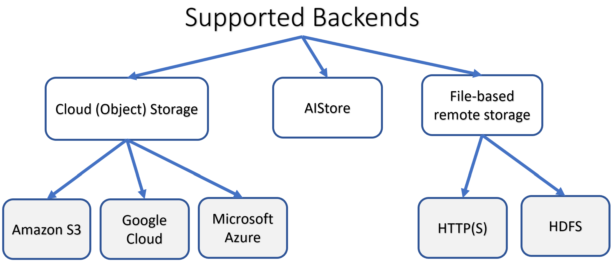

# Table of Contents

- [Bucket](#bucket)
  - [Default Bucket Properties](#default-bucket-properties)
  - [Inherited Bucket Properties and LRU](#inherited-bucket-properties-and-lru)
  - [Backend Provider](#backend-provider)
- [List Buckets](#list-buckets)
- [AIS Bucket](#ais-bucket)
  - [CLI: create, rename and, destroy ais bucket](#cli-create-rename-and-destroy-ais-bucket)
  - [CLI: specifying and listing remote buckets](#cli-specifying-and-listing-remote-buckets)
  - [CLI: working with remote AIS cluster](#cli-working-with-remote-ais-cluster)
- [Remote Bucket](#remote-bucket)
  - [Public Cloud Buckets](#public-cloud-buckets)
  - [Remote AIS cluster](#remote-ais-cluster)
  - [Prefetch/Evict Objects](#prefetchevict-objects)
  - [Evict Remote Bucket](#evict-remote-bucket)
- [Backend Bucket](#backend-bucket)
  - [AIS bucket as a reference](#ais-bucket-as-a-reference)
- [Bucket Properties](#bucket-properties)
  - [CLI examples: listing and setting bucket properties](#cli-examples-listing-and-setting-bucket-properties)
- [Bucket Access Attributes](#bucket-access-attributes)
- [AWS-specific configuration](#aws-specific-configuration)
- [List Objects](#list-objects)
  - [Options](#options)
  - [Results](#results)

# Bucket

AIStore uses the popular and well-known bucket abstraction, originally (likely) introduced by Amazon S3.

Similar to S3, AIS bucket is a _container for objects_.

> An object, in turn, is a file **and** a metadata that describes that object and normally includes: checksum, version, references to copies (replicas), size, last access time, source bucket (if object's origin is a Cloud bucket), custom user-defined attributes and more.

AIS is a flat `<bucket-name>/<object-name>` storage hierarchy where named buckets store user datasets.

In addition, each AIS bucket is a point of applying (per-bucket) management policies: checksumming, versioning, erasure coding, mirroring, LRU eviction, checksum and/or version validation.

AIS buckets *contain* user data performing the same function as, for instance:

* [Amazon S3 buckets](https://docs.aws.amazon.com/AmazonS3/latest/dev/UsingBucket.html)
* [Google Cloud (GCP) buckets](https://cloud.google.com/storage/docs/key-terms#buckets)
* [Microsoft Azure Blob containers](https://docs.microsoft.com/en-us/azure/storage/blobs/storage-blobs-introduction)

In addition, AIS supports multiple storage **backends** including itself:



But there's more.

AIStore supports vendor-specific configuration on a per bucket basis. For instance, any bucket _backed up_ by an AWS S3 bucket (**) can be configured to use alternative:

* named AWS profiles (with alternative credentials and/or region)
* s3 endpoints

(**) Terminology-wise, when we say "s3 bucket" or "google cloud bucket" we in fact reference a bucket in an AIS cluster that is either:

* (A) denoted with the respective `s3:` or `gs:` protocol schema, or
* (B) is a differently named AIS (that is, `ais://`) bucket that has its `backend_bck` property referencing the s3 (or google cloud) bucket in question.

> For examples and **usage**, grep docs for `backend_bck` or see [AWS profiles and alternative s3 endpoints](/docs/cli/aws_profile_endpoint.md).

All the [supported storage services](storage_svcs.md) equally apply to all storage backends with only a few exceptions. The following table summarizes them.

| Kind | Description | Supported Storage Services |
| --- | --- | --- |
| AIS buckets | buckets that are **not** 3rd party backend-based. AIS buckets store user objects and support user-specified bucket properties (e.g., 3 copies). Unlike remote buckets, ais buckets can be created through the [RESTful API](http_api.md). Similar to remote buckets, ais buckets are distributed and balanced, content-wise, across the entire AIS cluster. | [Checksumming](storage_svcs.md#checksumming), [LRU (advanced usage)](storage_svcs.md#lru-for-local-buckets), [Erasure Coding](storage_svcs.md#erasure-coding), [Local Mirroring and Load Balancing](storage_svcs.md#local-mirroring-and-load-balancing) |
| remote buckets | When AIS is deployed as [fast tier](providers.md), buckets in the cloud storage can be viewed and accessed through the [RESTful API](http_api.md) in AIS, in the exact same way as ais buckets. When this happens, AIS creates local instances of said buckets which then serves as a cache. These are referred to as **3rd party backend-based buckets**. | [Checksumming](storage_svcs.md#checksumming), [LRU](storage_svcs.md#lru), [Erasure Coding](storage_svcs.md#erasure-coding), [Local mirroring and load balancing](storage_svcs.md#local-mirroring-and-load-balancing) |

3rd party backend-based and AIS buckets support the same API with a few documented exceptions. Remote buckets can be *evicted* from AIS. AIS buckets are the only buckets that can be created, renamed, and deleted via the [RESTful API](http_api.md).

## Default Bucket Properties

By default, created buckets inherit their properties from the cluster-wide global [configuration](configuration.md).
Similar to other types of cluster-wide metadata, global configuration (also referred to as "cluster configuration")
is protected (versioned, checksummed) and replicated across the entire cluster.

**Important**:

* Bucket properties can be changed at any time via `api.SetBucketProps`.
* In addition, `api.CreateBucket` allows to specify (non-default) properties at bucket creation time.
* Inherited defaults include (but are not limited to) checksum, LRU, versioning, n-way mirroring, and erasure-coding configurations.
* By default, LRU is disabled for AIS (`ais://`) buckets.

Bucket creation operation allows to override the **inherited defaults**, which include:

| Configuration section | References |
| --- | --- |
| Backend | [Backend Provider](#backend-provider) |
| Checksum | [Supported Checksums and Brief Theory of Operations](checksum.md) |
| LRU | [Storage Services: LRU](storage_svcs.md#lru) |
| N-way mirror | [Storage Services: n-way mirror](storage_svcs.md#n-way-mirror) |
| Versioning | --- |
| Access | [Bucket Access Attributes](#bucket-access-attributes) |
| Erasure Coding | [Storage Services: erasure coding](storage_svcs.md#erasure-coding) |
| Metadata Persistence | --- |

Example specifying (non-default) bucket properties at creation time:

```console
$ ais create ais://abc --props="mirror.enabled=true mirror.copies=4"

# or, same using JSON:
$ ais create ais://abc --props='{"mirror": {"enabled": true, "copies": 4}}'
```

## Inherited Bucket Properties and LRU

1. [LRU](storage_svcs.md#lru) eviction triggers automatically when the percentage of used capacity exceeds configured ("high") watermark `space.highwm`. The latter is part of bucket configuration and one of the many bucket properties that can be individually configured.
2. By default, `space.highwm` = `90%` of total storage space.
3. Another important knob is `lru.enabled` that defines whether a given bucket can be a subject of LRU eviction in the first place.
4. By default, these two and all the other knobs are [inherited](#default-bucket-properties) by a newly created bucket from [default (global, cluster-wide) configuration](configuration.md#cluster-and-node-configuration).
5. However, those inherited defaults can be changed - [overridden](#default-bucket-properties) - both at bucket creation time, and at any later time.

Going back to [LRU](storage_svcs.md#lru), it can be disabled (or enabled) on a per bucket basis.

Prior to the version 3.8, [LRU](storage_svcs.md#lru) eviction **was by default globally enabled**. Starting v3.8, [LRU](storage_svcs.md#lru) is enabled by default **only for remote buckets**.

> AIS buckets that have remote backends are, by definition, remote buckets. See [next section](#backend-provider) for details.

In summary, starting v3.8, a newly created AIS bucket inherits default configuration that makes the bucket *non-evictable*.

Useful CLI commands include:

```console
# CLI to conveniently _toggle_ LRU eviction on and off on a per-bucket basis:
$ ais bucket lru ...

# Reset bucket properties to cluster-wide defaults:
$ ais bucket props reset ...

# Evict any given bucket based on a user-defined _template_.
# The command is one of the many supported _multi-object_ operations that run asynchronously
# and handle arbitrary (list, range, prefix)-defined templates.
$ ais bucket evict ...
```

See also:

* [CLI: Operations on Lists and Ranges](/docs/cli/object.md#operations-on-lists-and-ranges-and-entire-buckets)
* [api.CreateBucket() and api.SetBucketProps()](/api/bucket.go)
* [RESTful API](http_api.md)
* [CLI: listing and setting bucket properties](#cli-examples-listing-and-setting-bucket-properties)
* [CLI documentation and many more examples](cli/bucket.md)

## Backend Provider

[Backend Provider](providers.md) is an abstraction, and, simultaneously, an API-supported option that allows to delineate between "remote" and "local" buckets with respect to a given (any given) AIS cluster.
For complete definition and details, please refer to the [backend provider document](providers.md).

Backend provider is realized as an optional parameter in the GET, PUT, APPEND, DELETE and [Range/List](batch.md) operations with supported enumerated values that include:
* `ais` - for AIS buckets
* `aws` or `s3` - for Amazon S3 buckets
* `azure` or `az` - for Microsoft Azure Blob Storage buckets
* `gcp` or `gs` - for Google Cloud Storage buckets
* `ht` - for HTTP(S) based datasets

For API reference, please refer [to the RESTful API and examples](http_api.md).
The rest of this document serves to further explain features and concepts specific to storage buckets.

# List Buckets

To list all buckets, both _present_ in the cluster and remote, simply run:

* `ais ls --all`

Other useful variations of the command include:

* `ais ls s3`            - list only those s3 buckets that are _present_ in the cluster
* `ais ls gs`            - GCP buckets
* `ais ls ais`           - list _all_ AIS buckets
* `ais ls ais://@ --all` - list _all_ remote AIS buckets (i.e., buckets in all remote AIS clusters currently attached)

And more:

* `ais ls s3: --all --regex abc`  - list _all_ s3 buckets that match a given regex ("abc", in the example) 
* `ais ls gs: --summary`          - report usage statistics: numbers of objects and total sizes

## See also

* `ais ls --help`
* [CLI: `ais ls`](/docs/cli/bucket.md)

# AIS Bucket

AIS buckets are the AIStore-own distributed buckets that are not associated with any 3rd party Cloud.

The [RESTful API](http_api.md) can be used to create, copy, rename and, destroy ais buckets.

New ais buckets must be given a unique name that does not duplicate any existing ais bucket.

If you are going to use an AIS bucket as an S3-compatible one, consider changing the bucket's checksum to `MD5`.
For details, see [S3 compatibility](s3compat.md#s3-compatibility).

## CLI: create, rename and, destroy ais bucket

To create an ais bucket with the name `yt8m`, rename it to `yt8m_extended` and delete it, run:

```console
$ ais create ais://yt8m
$ ais bucket mv ais://yt8m ais://yt8m_extended
$ ais bucket rm ais://yt8m_extended
```

Please note that rename bucket is not an instant operation, especially if the bucket contains data. Follow the `rename` command tips to monitor when the operation completes.

## CLI: specifying and listing remote buckets

To list absolutely _all_ buckets that your AIS cluster has access to, run `ais ls`.

To lists all remote (and only remote) buckets, use: `ais ls @`. For example:

```console
$ ais ls @

AIS Buckets (1)
  ais://@U-0MEX8oYt/abc
GCP Buckets (7)
  gcp://lpr-foo
  gcp://lpr-bar
  ... (another 5 buckets omitted)
```

This example assumes that there's a remote AIS cluster identified by its UUID `U-0MEX8oYt` and previously [attached](#cli-working-with-remote-ais-cluster) to the "local" one.

Notice the naming notiation reference remote AIS buckets: prefix `@` in the full bucket name indicates remote cluster's UUIDs.

> Complete bucket naming specification includes bucket name, backend provider and namespace (which in turn includes UUID and optional sub-name, etc.). The spec can be found in this [source](/cmn/bucket.go).

And here are CLI examples of listing buckets by a given provider:

### List Google buckets:
```console
$ ais ls gs://
# or, same:
$ ais ls gs:

GCP Buckets (7)
  gcp://lpr-foo
  gcp://lpr-bar
  ...
```

### List AIS buckets:
```console
$ ais ls ais://
# or, same:
$ ais ls ais:
```

### List remote AIS buckets:
```console
$ ais ls ais://@
```

## CLI: working with remote AIS cluster

AIS clusters can be attached to each other, thus forming a global (and globally accessible) namespace of all individually hosted datasets. For background and details on AIS multi-clustering, please refer to this [document](providers.md#remote-ais-cluster).

The following example creates an attachment between two clusters, lists all remote buckets, and then list objects in one of those remote buckets (see comments inline):

```console
$ # Attach remote AIS cluster and assign it an alias `teamZ` (for convenience and for future reference):
$ ais cluster attach teamZ=http://cluster.ais.org:51080
Remote cluster (teamZ=http://cluster.ais.org:51080) successfully attached
$
$ # The cluster at http://cluster.ais.org:51080 is now persistently attached:
$ ais show remote-cluster
UUID      URL                            Alias     Primary      Smap   Targets  Online
MCBgkFqp  http://cluster.ais.org:51080   teamZ     p[primary]   v317   10       yes
$
$ # List all buckets in all remote clusters
$ # Notice the syntax: by convention, we use `@` to prefix remote cluster UUIDs, and so
$ # `ais://@` translates as "AIS backend provider, any remote cluster"
$
$ ais ls ais://@
AIS Buckets (4)
	  ais://@MCBgkFqp/imagenet
	  ais://@MCBgkFqp/coco
	  ais://@MCBgkFqp/imagenet-augmented
	  ais://@MCBgkFqp/imagenet-inflated
$
$ # List all buckets in the remote cluster with UUID = MCBgkFqp
$ # Notice the syntax: `ais://@some-string` translates as "remote AIS cluster with alias or UUID equal some-string"
$
$ ais ls ais://@MCBgkFqp
AIS Buckets (4)
	  ais://@MCBgkFqp/imagenet
	  ais://@MCBgkFqp/coco
	  ais://@MCBgkFqp/imagenet-augmented
	  ais://@MCBgkFqp/imagenet-inflated
$
$ # List all buckets with name matching the regex pattern "tes*"
$ ais ls --regex "tes*"
AWS Buckets (3)
  aws://test1
  aws://test2
  aws://test2
$
$ # We can conveniently keep using our previously selected alias for the remote cluster -
$ # The following lists selected remote bucket using the cluster's alias:
$ ais ls ais://@teamZ/imagenet-augmented
NAME              SIZE
train-001.tgz     153.52KiB
train-002.tgz     136.44KiB
...
$
$ # The same, but this time using the cluster's UUID:
$ ais ls ais://@MCBgkFqp/imagenet-augmented
NAME              SIZE
train-001.tgz     153.52KiB
train-002.tgz     136.44KiB
...
```

# Remote Bucket

Remote buckets are buckets that use 3rd party storage (AWS/GCP/Azure or HDFS) when AIS is deployed as [fast tier](overview.md#fast-tier).
Any reference to "Cloud buckets" refer to remote buckets that use a public cloud bucket as their backend (i.e. AWS/GCP/Azure, but not HDFS).

> By default, AIS does not keep track of the remote buckets in its configuration map. However, if users modify the properties of the remote bucket, AIS will then keep track.

## Public Cloud Buckets

Public Google Storage supports limited access to its data.
If AIS cluster is deployed with Google Cloud enabled (Google Storage is selected as 3rd party Backend provider when [deploying an AIS cluster](/docs/getting_started.md#local-playground)), it allows a few operations without providing credentials:
HEAD a bucket, list bucket's content, GET an object, and HEAD an object.
The example shows accessing a private GCP bucket and a public GCP one without user authorization.

```console
$ # Listing objects of a private bucket
$ ais ls gs://ais-ic
Bucket "gcp://ais-ic" does not exist
$
$ # Listing a public bucket
$ ais ls gs://pub-images --limit 3
NAME                         SIZE
images-shard.ipynb           101.94KiB
images-train-000000.tar      964.77MiB
images-train-000001.tar      964.74MiB
```

Even if an AIS cluster is deployed without Cloud support, it is still possible to access public GCP and AWS buckets.
Run downloader to copy data from a public Cloud bucket to an AIS bucket and then use the AIS bucket.
Example shows how to download data from public Google storage:

```console
$ ais create ais://images
"ais://images" bucket created
$ ais start download "gs://pub-images/images-train-{000000..000001}.tar" ais://images/
Z8WkHxwIrr
Run `ais show job download Z8WkHxwIrr` to monitor the progress of downloading.
$ ais wait download Z8WkHxwIrr # or, same: ais wait Z8WkHxwIrr
$ ais ls ais://images
NAME                         SIZE
images-train-000000.tar      964.77MiB
images-train-000001.tar      964.74MiB
```

> Job starting, stopping (i.e., aborting), and monitoring commands all have equivalent *shorter* versions. For instance `ais start download` can be expressed as `ais start download`, while `ais wait copy-bucket Z8WkHxwIrr` is the same as `ais wait Z8WkHxwIrr`.

## Remote AIS cluster

AIS cluster can be *attached* to another one which provides immediate capability for one cluster to "see" and transparently access the other's buckets and objects.

The functionality is termed [global namespace](providers.md#remote-ais-cluster) and is further described in the [backend providers](providers.md) readme.

To support global namespace, bucket names include `@`-prefixed cluster UUID. For remote AIS clusters, remote UUID and remote aliases can be used interchangeably.

For example, `ais://@remais/abc` would translate as AIS backend provider, where remote cluster would have `remais` alias.

Example working with remote AIS cluster (as well as easy-to-use scripts) can be found at:

* [readme for developers](development.md)
* [working with remote AIS cluster](#cli-working-with-remote-ais-cluster)

## Prefetch/Evict Objects

Objects within remote buckets are automatically fetched into storage targets when accessed through AIS and are evicted based on the monitored capacity and configurable high/low watermarks when [LRU](storage_svcs.md#lru) is enabled.

The [RESTful API](http_api.md) can be used to manually fetch a group of objects from the remote bucket (called prefetch) into storage targets or to remove them from AIS (called evict).

Objects are prefetched or evicted using [List/Range Operations](batch.md#listrange-operations).

For example, to use a [list operation](batch.md#list) to prefetch 'o1', 'o2', and, 'o3' from Amazon S3 remote bucket `abc`, run:

```console
$ ais start prefetch aws://abc --list o1,o2,o3
```

To use a [range operation](batch.md#range) to evict the 1000th to 2000th objects in the remote bucket `abc` from AIS, which names begin with the prefix `__tst/test-`, run:

```console
$ ais bucket evict aws://abc --template "__tst/test-{1000..2000}"
```

### See also

* [Operations on Lists and Ranges (and entire buckets)](/docs/cli/object.md#operations-on-lists-and-ranges-and-entire-buckets)
* to fully synchronize in-cluster content with remote backend, please refer to [out of band updates](/docs/out_of_band.md)

## Evict Remote Bucket

This is `ais bucket evict` command but most of the time we'll be using its `ais evict` alias:

```console
$ ais evict --help

NAME:
   ais evict - (alias for "bucket evict") Evict one remote bucket, multiple remote buckets, or
     selected objects in a given remote bucket or buckets,
     e.g.:
     - evict gs://abc                                          - evict entire bucket from aistore: remove all "cached" gs://abc objects _and_ bucket metadata;
     - evict gs://abc --keep-md                                - same as above but keep bucket metadata;
     - evict gs:                                               - evict all GCP buckets from the cluster;
     - evict gs://abc --prefix images/                         - evict all gs://abc objects from the virtual subdirectory "images";
     - evict gs://abc/images/                                  - same as above;
     - evict gs://abc --template images/                       - same as above;
     - evict gs://abc --template "shard-{0000..9999}.tar.lz4"  - evict the matching range (prefix + brace expansion);
     - evict "gs://abc/shard-{0000..9999}.tar.lz4"             - same as above (note the double quotes around the BUCKET/TEMPLATE argument)

USAGE:
   ais evict BUCKET[/OBJECT_NAME_or_TEMPLATE] [BUCKET[/OBJECT_NAME_or_TEMPLATE] ...] [command options]

OPTIONS:
   dry-run           Preview the results without really running the action
   keep-md           Keep bucket metadata
   list              Comma-separated list of object or file names, e.g.:
                     --list 'o1,o2,o3'
                     --list "abc/1.tar, abc/1.cls, abc/1.jpeg"
                     or, when listing files and/or directories:
                     --list "/home/docs, /home/abc/1.tar, /home/abc/1.jpeg"
   non-recursive,nr  Non-recursive operation, e.g.:
                     - 'ais ls gs://bucket/prefix --nr'   - list objects and/or virtual subdirectories with names starting with the specified prefix;
                     - 'ais ls gs://bucket/prefix/ --nr'  - list contained objects and/or immediately nested virtual subdirectories _without_ recursing into the latter;
                     - 'ais prefetch s3://bck/abcd --nr'  - prefetch a single named object (see 'ais prefetch --help' for details);
                     - 'ais rmo gs://bucket/prefix --nr'  - remove a single object with the specified name (see 'ais rmo --help' for details)
   non-verbose,nv    Non-verbose (quiet) output, minimized reporting, fewer warnings
   prefix            Select virtual directories or objects with names starting with the specified prefix, e.g.:
                     '--prefix a/b/c'   - matches names 'a/b/c/d', 'a/b/cdef', and similar;
                     '--prefix a/b/c/'  - only matches objects from the virtual directory a/b/c/
   progress          Show progress bar(s) and progress of execution in real time
   refresh           Time interval for continuous monitoring; can be also used to update progress bar (at a given interval);
                     valid time units: ns, us (or µs), ms, s (default), m, h
   skip-lookup       Do not execute HEAD(bucket) request to lookup remote bucket and its properties; possible usage scenarios include:
                      1) adding remote bucket to aistore without first checking the bucket's accessibility
                         (e.g., to configure the bucket's aistore properties with alternative security profile and/or endpoint)
                      2) listing public-access Cloud buckets where certain operations (e.g., 'HEAD(bucket)') may be disallowed
   template          Template to match object or file names; may contain prefix (that could be empty) with zero or more ranges
                     (with optional steps and gaps), e.g.:
                     --template "" # (an empty or '*' template matches eveything)
                     --template 'dir/subdir/'
                     --template 'shard-{1000..9999}.tar'
                     --template "prefix-{0010..0013..2}-gap-{1..2}-suffix"
                     and similarly, when specifying files and directories:
                     --template '/home/dir/subdir/'
                     --template "/abc/prefix-{0010..9999..2}-suffix"
   timeout           Maximum time to wait for a job to finish; if omitted: wait forever or until Ctrl-C;
                     valid time units: ns, us (or µs), ms, s (default), m, h
   verbose,v         Verbose output
   wait              Wait for an asynchronous operation to finish (optionally, use '--timeout' to limit the waiting time)
   help, h           Show help
```

Note usage examples above. You can always run `--help` option to see the most recently updated inline help.

Once there is a request to access the bucket, or a request to change the bucket's properties (see `set bucket props` in [REST API](http_api.md)), then the AIS cluster starts keeping track of the bucket.

In an evict bucket operation, AIS will remove all traces of the remote bucket within the AIS cluster. This effectively resets the AIS cluster to the point before any requests to the bucket have been made. This does not affect the objects stored within the remote bucket.

For example, to evict `abc` remote bucket from the AIS cluster, run:

```console
$ ais bucket evict aws://abc
```

Note: When an HDFS bucket is evicted, AIS will only delete objects stored in the cluster. AIS will retain the bucket's metadata to allow the bucket to re-register later.
This behavior can be applied to other remote buckets by using the `--keep-md` flag with `ais bucket evict`.

### See also

* [Operations on Lists and Ranges (and entire buckets)](/docs/cli/object.md#operations-on-lists-and-ranges-and-entire-buckets)
* to fully synchronize in-cluster content with remote backend, please refer to [out of band updates](/docs/out_of_band.md)

# Backend Bucket

So far, we have covered AIS and remote buckets. These abstractions are sufficient for almost all use cases. But there are times when we would like to download objects from an existing remote bucket and then make use of the features available only for AIS buckets.

One way of accomplishing that could be:
1. Prefetch cloud objects.
2. Create AIS bucket.
3. Use the bucket-copying [API](http_api.md) or [CLI](/docs/cli/bucket.md) to copy over the objects from the remote bucket to the newly created AIS bucket.

However, the extra-copying involved may prove to be time and/or space consuming. Hence, AIS-supported capability to establish an **ad-hoc** 1-to-1 relationship between a given AIS bucket and an existing cloud (*backend*).

> As aside, the term "backend" - something that is on the back, usually far (or farther) away - is often used for data redundancy, data caching, and/or data sharing. AIS *backend bucket* allows to achieve all of the above.

For example:

```console
$ ais create abc
"abc" bucket created
$ ais bucket props set ais://abc backend_bck=gcp://xyz
Bucket props successfully updated
```

After that, you can access all objects from `gcp://xyz` via `ais://abc`. **On-demand persistent caching** (from the `gcp://xyz`) becomes then automatically available, as well as **all other AIS-supported storage services** configurable on a per-bucket basis.

For example:

```console
$ ais ls gcp://xyz
NAME		 SIZE		 VERSION
shard-0.tar	 2.50KiB	 1
shard-1.tar	 2.50KiB	 1
$ ais ls ais://abc
NAME		 SIZE		 VERSION
shard-0.tar	 2.50KiB	 1
shard-1.tar	 2.50KiB	 1
$ ais get ais://abc/shard-0.tar /dev/null # cache/prefetch cloud object
"shard-0.tar" has the size 2.50KiB (2560 B)
$ ais ls ais://abc --cached
NAME		 SIZE		 VERSION
shard-0.tar	 2.50KiB	 1
$ ais bucket props set ais://abc backend_bck=none # disconnect backend bucket
Bucket props successfully updated
$ ais ls ais://abc
NAME		 SIZE		 VERSION
shard-0.tar	 2.50KiB	 1
```

For more examples please refer to [CLI docs](/docs/cli/bucket.md#connectdisconnect-ais-bucket-tofrom-cloud-bucket).

## AIS bucket as a reference

Stated differently, aistore bucket itself can serve as a reference to another bucket. E.g., you could have, say, `ais://llm-latest` to always point to whatever is the latest result of a data prep service.

```console
### create an arbitrary bucket (say, `ais://llm-latest`) and always use it to reference the latest augmented results

$ ais create ais://llm-latest
$ ais bucket props set ais://llm-latest backend_bck=gs://llm-augmented-2023-12-04

### next day, when the data prep service produces a new derivative:

$ ais bucket props set ais://llm-latest backend_bck=gs://llm-augmented-2023-12-05

### and keep using the same static name, etc.
```

Caching wise, when you walk `ais://llm-latest` (or any other aistore bucket with a remote backend), aistore will make sure to perform remote (cold) GETs to update itself when and if required, etc.

> In re "cold GET" vs "warm GET" performance, see [AIStore as a Fast Tier Storage](https://aistore.nvidia.com/blog/2023/11/27/aistore-fast-tier) blog.

# Bucket Properties

The full list of bucket properties are:

| Bucket Property | JSON | Description | Fields |
| --- | --- | --- | --- |
| Provider | `provider` | "ais", "aws", "azure", "gcp", or "ht" | `"provider": "ais"/"aws"/"azure"/"gcp"/"ht"` |
| Cksum | `checksum` | Please refer to [Supported Checksums and Brief Theory of Operations](checksum.md) | |
| LRU | `lru` | Configuration for [LRU](storage_svcs.md#lru). `space.lowwm` and `space.highwm` is the used capacity low-watermark and high-watermark (% of total local storage capacity) respectively. `space.out_of_space` if exceeded, the target starts failing new PUTs and keeps failing them until its local used-cap gets back below `space.highwm`. `dont_evict_time` denotes the period of time during which eviction of an object is forbidden [atime, atime + `dont_evict_time`]. `capacity_upd_time` denotes the frequency at which AIStore updates local capacity utilization. `enabled` LRU will only run when set to true. | `"lru": {"dont_evict_time": "120m", "capacity_upd_time": "10m", "enabled": bool }`. Note: `space.*` are cluster level properties. |
| Mirror | `mirror` | Configuration for [Mirroring](storage_svcs.md#n-way-mirror). `copies` represents the number of local copies. `burst_buffer` represents channel buffer size. `enabled` will only generate local copies when set to true. | `"mirror": { "copies": int64, "burst_buffer": int64, "enabled": bool }` |
| EC | `ec` | Configuration for [erasure coding](storage_svcs.md#erasure-coding). `objsize_limit` is the limit in which objects below this size are replicated instead of EC'ed. `data_slices` represents the number of data slices. `parity_slices` represents the number of parity slices/replicas. `enabled` represents if EC is enabled. | `"ec": { "objsize_limit": int64, "data_slices": int, "parity_slices": int, "enabled": bool }` |
| Versioning | `versioning` | Configuration for object versioning support where `enabled` represents if object versioning is enabled for a bucket. For remote bucket versioning must be enabled in the corresponding backend (e.g. Amazon S3). `validate_warm_get`: determines if the object's version is checked | `"versioning": { "enabled": true, "validate_warm_get": false }`|
| AccessAttrs | `access` | Bucket access [attributes](#bucket-access-attributes). Default value is 0 - full access | `"access": "0" ` |
| BID | `bid` | Readonly property: unique bucket ID  | `"bid": "10e45"` |
| Created | `created` | Readonly property: bucket creation date, in nanoseconds(Unix time) | `"created": "1546300800000000000"` |

## CLI examples: listing and setting bucket properties

### List bucket properties

```console
$ ais show bucket mybucket
...
$
$ # Or, the same to get output in a (raw) JSON form:
$ ais show bucket mybucket --json
...
```

### Enable erasure coding on a bucket

```console
$ ais bucket props mybucket ec.enabled=true
```

### Enable object versioning and then list updated bucket properties

```console
$ ais bucket props mybucket versioning.enabled=true
$ ais show bucket mybucket
...
```

# Bucket Access Attributes

Bucket access is controlled by a single 64-bit `access` value in the [Bucket Properties structure](/cmn/api.go), whereby its bits have the following mapping as far as allowed (or denied) operations:

| Operation | Bit Mask |
| --- | --- |
| GET | 0x1 |
| HEAD | 0x2 |
| PUT, APPEND | 0x4 |
| Cold GET | 0x8 |
| DELETE | 0x16 |

For instance, to make bucket `abc` read-only, execute the following [AIS CLI](/docs/cli.md) command:

```console
$ ais bucket props abc 'access=ro'
```

The same expressed via `curl` will look as follows:

```console
$ curl -i -X PATCH  -H 'Content-Type: application/json' -d '{"action": "set-bprops", "value": {"access": 18446744073709551587}}' http://localhost:8080/v1/buckets/abc
```

> `18446744073709551587 = 0xffffffffffffffe3 = 0xffffffffffffffff ^ (4|8|16)`

# AWS-specific configuration

AIStore supports AWS-specific configuration on a per s3 bucket basis. Any bucket that is backed up by an AWS S3 bucket (**) can be configured to use alternative:

* named AWS profiles (with alternative credentials and/or region)
* alternative s3 endpoints

For background and usage examples, please see [CLI: AWS-specific bucket configuration](/docs/cli/aws_profile_endpoint.md).

# List Objects

**Note**: some of the following content **may be outdated**. For the most recent updates, please check:

- [List objects](/docs/cli/bucket.md#list-objects)
* [`ais ls`](https://github.com/NVIDIA/aistore/blob/main/docs/cli/bucket.md#list-objects)
* [Virtual directories](/docs/howto_virt_dirs.md)

`ListObjects` API returns a page of object names and, optionally, their properties (including sizes, access time, checksums), in addition to a token that serves as a cursor, or a marker for the *next* page retrieval.

> Go [ListObjects](https://github.com/NVIDIA/aistore/blob/main/api/bucket.go) API

When a cluster is rebalancing, the returned list of objects can be incomplete due to objects are being migrated.
The returned [result](#list-result) has non-zero value(the least significant bit is set to `1`) to indicate that the list was generated when the cluster was unstable.
To get the correct list, either re-request the list after the rebalance ends or read the list with [the option](#list-options) `SelectMisplaced` enabled.
In the latter case, the list may contain duplicated entries.

## Options

The properties-and-options specifier must be a JSON-encoded structure, for instance `{"props": "size"}` (see examples).
An empty structure `{}` results in getting just the names of the objects (from the specified bucket) with no other metadata.

| Property/Option | Description | Value |
| --- | --- | --- |
| `uuid` | ID of the list objects operation | After initial request to list objects the `uuid` is returned and should be used for subsequent requests. The ID ensures integrity between next requests. |
| `pagesize` | The maximum number of object names returned in response | For AIS buckets default value is `10000`. For remote buckets this value varies as each provider has it's own maximum page size. |
| `props` | The properties of the object to return | A comma-separated string containing any combination of: `name,size,version,checksum,atime,location,copies,ec,status` (if not specified, props are set to `name,size,version,checksum,atime`). <sup id="a1">[1](#ft1)</sup> |
| `prefix` | The prefix which all returned objects must have | For example, `prefix = "my/directory/structure/"` will include object `object_name = "my/directory/structure/object1.txt"` but will not `object_name = "my/directory/object2.txt"` |
| `start_after` | Name of the object after which the listing should start | For example, `start_after = "baa"` will include object `object_name = "caa"` but will not `object_name = "ba"` nor `object_name = "aab"`. |
| `continuation_token` | The token identifying the next page to retrieve | Returned in the `ContinuationToken` field from a call to ListObjects that does not retrieve all keys. When the last key is retrieved, `ContinuationToken` will be the empty string. |
| `time_format` | The standard by which times should be formatted | Any of the following [golang time constants](http://golang.org/pkg/time/#pkg-constants): RFC822, Stamp, StampMilli, RFC822Z, RFC1123, RFC1123Z, RFC3339. The default is RFC822. |
| `flags` | Advanced filter options | A bit field of [ListObjsMsg extended flags](/cmn/api.go). |

ListObjsMsg extended flags:

| Name | Value | Description |
| --- | --- | --- |
| `SelectCached` | `1` | For remote buckets only: return only objects that are cached on AIS drives, i.e. objects that can be read without accessing to the Cloud |
| `SelectMisplaced` | `2` | Include objects that are on incorrect target or mountpath |
| `SelectDeleted` | `4` | Include objects marked as deleted |
| `SelectArchDir` | `8` | If an object is an archive, include its content into object list |
| `SelectOnlyNames` | `16` | Do not retrieve object attributes for faster bucket listing. In this mode, all fields of the response, except object names and statuses, are empty |

We say that "an object is cached" to indicate two separate things:

* The object was originally downloaded from a remote bucket, bucket in a remote AIS cluster, or an HTTP(s) based dataset;
* The object is stored in the AIS cluster.

In other words, the term "cached" is simply a **shortcut** to indicate the object's immediate availability without the need to go and check the object's original location. Being "cached" does not have any implications on object's persistence: "cached" objects, similar to those objects that originated in a given AIS cluster, are stored with arbitrary (per bucket configurable) levels of redundancy, etc. In short, the same storage policies apply to "cached" and "non-cached".

Note that the list generated with `SelectMisplaced` option may have duplicated entries.
E.g, after rebalance the list can contain two entries for the same object:
a misplaced one (from original location) and real one (from the new location).

 <a name="ft1">1</a>) The objects that exist in the Cloud but are not present in the AIStore cache will have their atime property empty (`""`). The atime (access time) property is supported for the objects that are present in the AIStore cache. [↩](#a1)

### Results

The result may contain all bucket objects(if a bucket is small) or only the current page. The struct includes fields:

| Field | JSON Value | Description |
| --- | --- | --- |
| UUID | `uuid` | Unique ID of the listing operation. Pass it to all consecutive list requests to read the next page of objects. If UUID is empty, the server starts listing objects from the first page |
| Entries | `entries` | A page of objects and their properties |
| ContinuationToken | `continuation_token` | The token to request the next page of objects. Empty value means that it is the last page |
| Flags | `flags` | Extra information - a bit-mask field. `0x0001` bit indicates that a rebalance was running at the time the list was generated |
