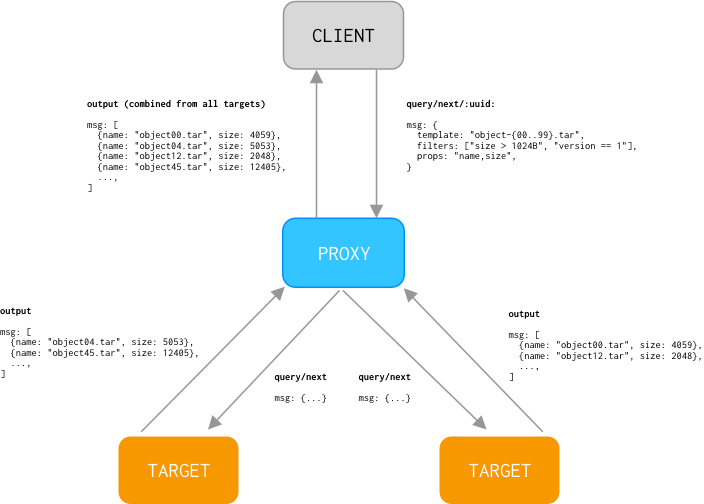
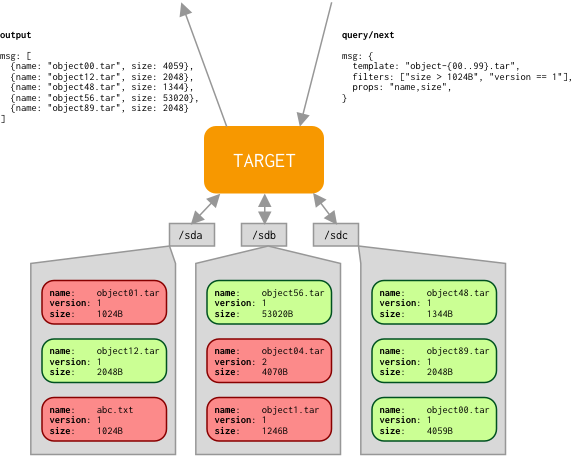

## Table of Contents

- [Bucket](#bucket)
  - [Cloud Provider](#cloud-provider)
- [AIS Bucket](#ais-bucket)
  - [CLI examples: create, rename and, destroy ais bucket](#cli-examples-create-rename-and-destroy-ais-bucket)
  - [CLI example: working with remote AIS bucket](#cli-example-working-with-remote-ais-bucket)
- [Cloud Bucket](#cloud-bucket)
  - [Public Cloud Buckets](#public-cloud-buckets)
  - [Public HTTP(S) Datasets](#public-https-dataset)
  - [Prefetch/Evict Objects](#prefetchevict-objects)
  - [Evict Cloud Bucket](#evict-cloud-bucket)
- [Backend Bucket](#backend-bucket)
- [Bucket Properties](#bucket-properties)
  - [CLI examples: listing and setting bucket properties](#cli-examples-listing-and-setting-bucket-properties)
- [Bucket Access Attributes](#bucket-access-attributes)
- [List Objects](#list-objects)
  - [Options](#list-options)
- [Query Objects](#experimental-query-objects)
  - [Options](#query-options)

## Bucket

AIStore uses the popular-and-well-known bucket abstraction.
In a flat storage hierarchy, bucket is a named container of user dataset(s) (represented as objects) and, simultaneously, a point of applying storage management policies: erasure coding, mirroring, etc.

Each object is assigned to (and stored in) a basic container called *bucket*.
AIS buckets *contain* user data; in that sense they are very similar to:

* [Amazon S3 buckets](https://docs.aws.amazon.com/AmazonS3/latest/dev/UsingBucket.html)
* [Google Cloud (GCP) buckets](https://cloud.google.com/storage/docs/key-terms#buckets)
* [Microsoft Azure Blob containers](https://docs.microsoft.com/en-us/azure/storage/blobs/storage-blobs-introduction)

AIS supports two kinds of buckets: **AIS buckets** and **3rd party Cloud-based buckets** (or simply **cloud buckets**).

All the [supported storage services](storage_svcs.md) equally apply to both kinds of buckets, with only a few exceptions. The following table summarizes them.

| Kind | Description | Supported Storage Services |
| --- | --- | --- |
| AIS buckets | buckets that are **not** 3rd party Cloud-based. AIS buckets store user objects and support user-specified bucket properties (e.g., 3 copies). Unlike cloud buckets, ais buckets can be created through the [RESTful API](http_api.md). Similar to cloud buckets, ais buckets are distributed and balanced, content-wise, across the entire AIS cluster. | [Checksumming](storage_svcs.md#checksumming), [LRU (advanced usage)](storage_svcs.md#lru-for-local-buckets), [Erasure Coding](storage_svcs.md#erasure-coding), [Local Mirroring and Load Balancing](storage_svcs.md#local-mirroring-and-load-balancing) |
| cloud buckets | When AIS is deployed as [fast tier](/aistore/docs/overview.md#fast-tier), buckets in the cloud storage can be viewed and accessed through the [RESTful API](http_api.md) in AIS, in the exact same way as ais buckets. When this happens, AIS creates local instances of said buckets which then serves as a cache. These are referred to as **Cloud-based buckets** (or **cloud buckets** for short). | [Checksumming](storage_svcs.md#checksumming), [LRU](storage_svcs.md#lru), [Erasure Coding](storage_svcs.md#erasure-coding), [Local mirroring and load balancing](storage_svcs.md#local-mirroring-and-load-balancing) |

Cloud-based and ais buckets support the same API with minor exceptions. Cloud buckets can be *evicted* from AIS. AIS buckets are the only buckets that can be created, renamed, and deleted via the [RESTful API](http_api.md).

### Cloud Provider

[Cloud Provider](./providers.md) is an abstraction, and, simultaneously, an API-supported option that allows to delineate between "remote" and "local" buckets with respect to a given (any given) AIS cluster. For complete definition and details, please refer to the [Cloud Provider](./providers.md) document.

Cloud provider is realized as an optional parameter in the GET, PUT, APPEND, DELETE and [Range/List](batch.md) operations with supported enumerated values that include:

* `ais` - for AIS buckets
* `aws` or `s3` - for Amazon S3 buckets
* `gcp` or `gs` - for Google Cloud Storage buckets
* `azure` - for Microsoft Azure Blob Storage buckets
* `ht` - for HTTP(S) based datasets

* and finally, you can simple say `cloud` to designate any one of the 5 Cloud providers listed above.

For API reference, please refer [to the RESTful API and examples](http_api.md).
The rest of this document serves to further explain features and concepts specific to storage buckets.

## AIS Bucket

AIS buckets are the AIStore-own distributed buckets that are not associated with any 3rd party Cloud.

The [RESTful API](docs/http_api.md) can be used to create, rename and, destroy ais buckets.

New ais buckets must be given a unique name that does not duplicate any existing ais or cloud bucket.

### CLI examples: create, rename and, destroy ais bucket

To create an ais bucket with the name 'myBucket', rename it to 'myBucket2' and delete it, run:

```console
$ ais create bucket myBucket
$ ais rename bucket ais://myBucket ais://myBucket2
$ ais rm bucket ais://myBucket2
```

Please note that rename bucket is not an instant operation, especially if the bucket contains data. Follow the `rename` command tips to monitor when the operation completes.

### CLI example: working with remote AIS bucket

AIS clusters can be attached to each other, thus forming a global (and globally accessible) namespace of all individually hosted datasets. For background and details on AIS multi-clustering, please refer to this [document](providers.md).

The following example creates an attachment between two clusters, lists all remote buckets, and then list objects in one of those remote buckets (see comments inline):

```console

# attach remote AIS cluster and assign it an alias `teamZ` (for convenience and for future reference):
$ ais attach remote teamZ=http://cluster.ais.org:51080
Remote cluster (teamZ=http://cluster.ais.org:51080) successfully attached

# the cluster at http://cluster.ais.org:51080 is now persistently attached:
$ ais show remote
UUID      URL                            Alias     Primary      Smap   Targets  Online
MCBgkFqp  http://cluster.ais.org:51080   teamZ     p[primary]   v317   10       yes

# list all buckets in all remote clusters
# notice the syntax: by convention, we use `@` to prefix remote cluster UUIDs, and so
# `ais://@` translates as "AIS cloud provider, any remote cluster"

$ ais ls ais://@
AIS Buckets (4)
	  ais://@MCBgkFqp/imagenet
	  ais://@MCBgkFqp/coco
	  ais://@MCBgkFqp/imagenet-augmented
	  ais://@MCBgkFqp/imagenet-inflated

# list all buckets in the remote cluster with UUID = MCBgkFqp
# notice again the syntax: `ais://@some-string` translates as "remote AIS cluster with alias or UUID equal some-string"

$ ais ls ais://@MCBgkFqp
AIS Buckets (4)
	  ais://@MCBgkFqp/imagenet
	  ais://@MCBgkFqp/coco
	  ais://@MCBgkFqp/imagenet-augmented
	  ais://@MCBgkFqp/imagenet-inflated

# list all buckets with name matching the regex pattern "tes*"
$ ais ls --regex "tes*"
AWS Buckets (3)
  aws://test1
  aws://test2
  aws://test2

# we can conveniently keep using our previously selected alias for the remote cluster -
# the following lists selected remote bucket using the cluster's alias:
$ ais ls ais://@teamZ/imagenet-augmented
NAME              SIZE
train-001.tgz     153.52KiB
train-002.tgz     136.44KiB
...

# the same, but this time using the cluster's UUID:
$ ais ls ais://@MCBgkFqp/imagenet-augmented
NAME              SIZE
train-001.tgz     153.52KiB
train-002.tgz     136.44KiB
...
```

## Cloud Bucket

Cloud buckets are existing buckets in the 3rd party Cloud storage when AIS is deployed as [fast tier](/aistore/docs/overview.md#fast-tier).

> By default, AIS does not keep track of the cloud buckets in its configuration map. However, if users modify the properties of the cloud bucket, AIS will then keep track.

### Public Cloud Buckets

Public Google Storage supports limited access to its data.
If AIS cluster is deployed with Google Cloud enabled (Google Storage is selected as 3rd party Cloud provider when [deploying an AIS cluster](/aistore/README.md#local-playground)), it allows a few operations without providing credentials:
HEAD a bucket, list bucket objects, GET an object, and HEAD an object.
The example shows accessing a private GCP bucket and a public GCP one without user authorization.

```console
# Listing objects of a private bucket
$ ais ls gs://ais-ic
Failed to HEAD bucket "gcp://ais-ic": {"status":400,"message":"","method":"HEAD","url_path":"/v1/buckets/ais-ic","remote_addr":"","trace":""}

# Listing a public bucket
$ ais ls gs://pub-images --limit 3
NAME                         SIZE
images-shard.ipynb           101.94KiB
images-train-000000.tar      964.77MiB
images-train-000001.tar      964.74MiB
```

Even if an AIS cluster is deployed without Cloud support, it is still possible to access public GCP and AWS buckets.
Run downloader to copy data from a public Cloud bucket to an AIS bucket and then use the AIS bucket.
Example shows how to download data from public Google storage:

```console
$ ais create bucket ais://images
"ais://images" bucket created
$ ais start download "gs://pub-images/images-train-{000000..000001}.tar" ais://images/
Z8WkHxwIrr
Run `ais show download Z8WkHxwIrr` to monitor the progress of downloading.
$ ais wait download Z8WkHxwIrr
$ ais ls ais://images
NAME                         SIZE
images-train-000000.tar      964.77MiB
images-train-000001.tar      964.74MiB
```

### Public HTTP(S) Dataset

It is standard in machine learning community to publish datasets in public domains, so they can be accessed by everyone.
AIStore has integrated tools like [downloader](/aistore/downloader/README.md) which can help in downloading those large datasets straight into provided AIS bucket.
However, sometimes using such tools is not a feasible solution.

For other cases AIStore has ability to act as a reverese-proxy when accessing **any** URL.
This enables downloading any HTTP(S) based content into AIStore cluster.
Assuming that proxy is listening on `localhost:8080`, one can use it as reverse-proxy to download `http://storage.googleapis.com/pub-images/images-train-000000.tar` shard into AIS cluster:

```console
$ curl -sL --max-redirs 3 -x localhost:8080 --noproxy "$(curl -s localhost:8080/v1/cluster?what=target_ips)" \
  -X GET "http://storage.googleapis.com/minikube/minikube-0.6.iso.sha256" \
  > /dev/null
```

Alternatively, an object can also be downloaded using the `get` and `cat` CLI commands. 
```console
$ ais get -f http://storage.googleapis.com/minikube/minikube-0.7.iso.sha256 minikube-0.7.iso.sha256
```

The `--force`(`-f`) option skips bucket validation and automatically creates a new `ht://` bucket for the object if it doesn't exist.

This will cache shard object inside the AIStore cluster.
We can confirm this by listing available buckets and checking the content:

```console
$ ais ls
AIS Buckets (1)
  ais://local-bck
AWS Buckets (1)
  aws://ais-test
HTTP(S) Buckets (1)
  ht://ZDdhNTYxZTkyMzhkNjk3NA (http://storage.googleapis.com/minikube/)

$ ais ls ht://ZDdhNTYxZTkyMzhkNjk3NA
NAME                                 SIZE
minikube-0.6.iso.sha256	              65B
```

Now, when the object is accessed again, it will be served from AIStore cluster and will **not** be re-downloaded from HTTP(S) source.

Under the hood, AIStore remembers the object's source URL and associates the bucket with this URL.
In our example, bucket `ht://ZDdhNTYxZTkyMzhkNjk3NA` will be associated with `http://storage.googleapis.com/minikube/` URL.
Therefore, we can interchangeably use the associated URL for listing the bucket as show below.

```console
$ ais ls http://storage.googleapis.com/minikube
NAME                                  SIZE
minikube-0.6.iso.sha256	              65B
```

> Note that only the last part (`minikube-0.6.iso.sha256`) of the URL is treated as the object name.

Such connection between bucket and URL allows downloading content without providing URL again:

```console
$ ais cat ht://ZDdhNTYxZTkyMzhkNjk3NA/minikube-0.7.iso.sha256 > /dev/null # cache another object
$ ais ls ht://ZDdhNTYxZTkyMzhkNjk3NA
NAME                     SIZE
minikube-0.6.iso.sha256  65B
minikube-0.7.iso.sha256  65B
```

### Prefetch/Evict Objects

Objects within cloud buckets are automatically fetched into storage targets when accessed through AIS and are evicted based on the monitored capacity and configurable high/low watermarks when [LRU](storage_svcs.md#lru) is enabled.

The [RESTful API](http_api.md) can be used to manually fetch a group of objects from the cloud bucket (called prefetch) into storage targets or to remove them from AIS (called evict).

Objects are prefetched or evicted using [List/Range Operations](batch.md#listrange-operations).

For example, to use a [list operation](batch.md#list) to prefetch 'o1', 'o2', and, 'o3' from Amazon S3 cloud bucket `abc`, run:

```console
$ ais start prefetch aws://abc --list o1,o2,o3
```

To use a [range operation](batch.md#range) to evict the 1000th to 2000th objects in the cloud bucket `abc` from AIS, which names begin with the prefix `__tst/test-`, run:

```console
$ ais evict aws://abc --template "__tst/test-{1000..2000}"
```

### Evict Cloud Bucket

Before a cloud bucket is accessed through AIS, the cluster has no awareness of the bucket.

Once there is a request to access the bucket, or a request to change the bucket's properties (see `set bucket props` in [REST API](http_api.md)), then the AIS cluster starts keeping track of the bucket.

In an evict bucket operation, AIS will remove all traces of the cloud bucket within the AIS cluster. This effectively resets the AIS cluster to the point before any requests to the bucket have been made. This does not affect the objects stored within the cloud bucket.

For example, to evict `abc` cloud bucket from the AIS cluster, run:

```console
$ ais evict aws://abc
```

## Backend Bucket

So far, we have covered AIS and cloud buckets. These abstractions are sufficient for almost all use cases.  But there are times when we would like to download objects from an existing cloud bucket and then make use of the features available only for AIS buckets.

One way of accomplishing that could be:

* prefetch cloud objects
* create AIS bucket
* and then use the bucket-copying [API](http_api.md) or [CLI](/aistore/cmd/cli/resources/bucket.md) to copy over the objects from the cloud bucket to the newly created AIS bucket.

However, the extra-copying involved may prove to be time and/or space consuming. Hence, AIS-supported capability to establish an **ad-hoc** 1-to-1 relationship between a given AIS bucket and an existing cloud (*backend*).

> As aside, the term "backend" - something that is on the back, usually far (or farther) away - is often used for data redundancy, data caching, and/or data sharing. AIS *backend bucket* allows to achieve all of the above.

For example:

```console
$ ais create bucket abc
"abc" bucket created
$ ais set props ais://abc backend_bck=gcp://xyz
Bucket props successfully updated
```

After that, you can access all objects from `gcp://xyz` via `ais://abc`. **On-demand persistent caching** (from the `gcp://xyz`) becomes then automatically available, as well as **all other AIS-supported storage services** configurable on a per-bucket basis.

For example:

```console
$ ais ls gcp://xyz
NAME		 SIZE		 VERSION
shard-0.tar	 2.50KiB	 1
shard-1.tar	 2.50KiB	 1
$ ais ls ais://abc
NAME		 SIZE		 VERSION
shard-0.tar	 2.50KiB	 1
shard-1.tar	 2.50KiB	 1
$ ais get ais://abc/shard-0.tar /dev/null # cache/prefetch cloud object
"shard-0.tar" has the size 2.50KiB (2560 B)
$ ais ls ais://abc --cached
NAME		 SIZE		 VERSION
shard-0.tar	 2.50KiB	 1
$ ais set props ais://abc backend_bck=none # disconnect backend bucket
Bucket props successfully updated
$ ais ls ais://abc
NAME		 SIZE		 VERSION
shard-0.tar	 2.50KiB	 1
```

For more examples please refer to [CLI docs](/aistore/cmd/cli/resources/bucket.md#connectdisconnect-ais-bucket-tofrom-cloud-bucket).

## Bucket Properties

The full list of bucket properties are:

| Bucket Property | JSON | Description | Fields |
| --- | --- | --- | --- |
| Provider | `provider` | "aws", "gcp" or "ais" | `"provider": "aws"/"gcp"/"ais"` |
| Cksum | `checksum` | Please refer to [Supported Checksums and Brief Theory of Operations](checksum.md) | |
| LRU | `lru` | Configuration for [LRU](storage_svcs.md#lru). `lowwm` and `highwm` is the used capacity low-watermark and high-watermark (% of total local storage capacity) respectively. `out_of_space` if exceeded, the target starts failing new PUTs and keeps failing them until its local used-cap gets back below `highwm`. `atime_cache_max` represents the maximum number of entries. `dont_evict_time` denotes the period of time during which eviction of an object is forbidden [atime, atime + `dont_evict_time`]. `capacity_upd_time` denotes the frequency at which AIStore updates local capacity utilization. `enabled` LRU will only run when set to true. | `"lru": { "lowwm": int64, "highwm": int64, "out_of_space": int64, "atime_cache_max": int64, "dont_evict_time": "120m", "capacity_upd_time": "10m", "enabled": bool }` |
| Mirror | `mirror` | Configuration for [Mirroring](storage_svcs.md#n-way-mirror). `copies` represents the number of local copies. `burst_buffer` represents channel buffer size.  `util_thresh` represents the threshold when utilizations are considered equivalent. `optimize_put` represents the optimization objective. `enabled` will only generate local copies when set to true. | `"mirror": { "copies": int64, "burst_buffer": int64, "util_thresh": int64, "optimize_put": bool, "enabled": bool }` |
| EC | `ec` | Configuration for [erasure coding](storage_svcs.md#erasure-coding). `objsize_limit` is the limit in which objects below this size are replicated instead of EC'ed. `data_slices` represents the number of data slices. `parity_slices` represents the number of parity slices/replicas. `enabled` represents if EC is enabled. | `"ec": { "objsize_limit": int64, "data_slices": int, "parity_slices": int, "enabled": bool }` |
| Versioning | `versioning` | Configuration for object versioning support. `enabled` represents if object versioning is enabled for a bucket. For Cloud-based bucket, its versioning must be enabled in the cloud prior to enabling on AIS side. `validate_warm_get`: determines if the object's version is checked(if in Cloud-based bucket) | `"versioning": { "enabled": true, "validate_warm_get": false }`|
| AccessAttrs | `access` | Bucket access [attributes](#bucket-access-attributes). Default value is 0 - full access | `"access": "0" ` |
| BID | `bid` | Readonly property: unique bucket ID  | `"bid": "10e45"` |
| Created | `created` | Readonly property: bucket creation date, in nanoseconds(Unix time) | `"created": "1546300800000000000"` |

`SetBucketProps` allows the following configurations to be changed:

| Property | Type | Description |
| --- | --- | --- |
| `ec.enabled` | bool | enables EC on the bucket |
| `ec.data_slices` | int | number of data slices for EC |
| `ec.parity_slices` | int | number of parity slices for EC |
| `ec.objsize_limit` | int | below this size objects are replicated instead of EC'ed |
| `ec.compression` | string | LZ4 compression parameters used when EC sends its fragments and replicas over network |
| `mirror.enabled` | bool | enable local mirroring |
| `mirror.copies` | int | number of local copies |
| `mirror.util_thresh` | int | threshold when utilization are considered equivalent |

### CLI examples: listing and setting bucket properties

1. List bucket properties:

```console
$ ais show props mybucket
```

or, the same to get output in a (raw) JSON form:

```console
$ ais show props mybucket --json
```

2. Enable erasure coding on a bucket:

```console
$ ais set props mybucket ec.enabled=true
```

3. Enable object versioning and then list updated bucket properties:

```console
$ ais set props mybucket versioning.enabled=true
$ ais show props mybucket
```

## Bucket Access Attributes

Bucket access is controlled by a single 64-bit `access` value in the [Bucket Properties structure](../cmn/api.go), whereby its bits have the following mapping as far as allowed (or denied) operations:

| Operation | Bit Mask |
| --- | --- |
| GET | 0x1 |
| HEAD | 0x2 |
| PUT, APPEND | 0x4 |
| Cold GET | 0x8 |
| DELETE | 0x16 |

For instance, to make bucket `abc` read-only, execute the following [AIS CLI](../cmd/cli/README.md) command:

```console
$ ais set props abc 'access=ro'
```

The same expressed via `curl` will look as follows:

```console
$ curl -i -X PATCH  -H 'Content-Type: application/json' -d '{"action": "setbprops", "value": {"access": 18446744073709551587}}' http://localhost:8080/v1/buckets/abc
```

> 18446744073709551587 = 0xffffffffffffffe3 = 0xffffffffffffffff ^ (4|8|16)

## List Objects

ListObjects API returns a page of object names and, optionally, their properties (including sizes, access time, checksums, and more), in addition to a token that serves as a cursor or a marker for the *next* page retrieval.

When using proxy cache (experimental) immutability of a bucket is assumed between subsequent ListObjects request.
If a bucket has been updated after ListObjects request, a user should call ListObjectsInvalidateCache API to get
correct ListObjects results. This is the temporary requirement and will be removed in next AIS versions.

### List Options

The properties-and-options specifier must be a JSON-encoded structure, for instance `{"props": "size"}` (see examples).
An empty structure `{}` results in getting just the names of the objects (from the specified bucket) with no other metadata.

| Property/Option | Description | Value |
| --- | --- | --- |
| `uuid` | ID of the list objects operation | After initial request to list objects the `uuid` is returned and should be used for subsequent requests. The ID ensures integrity between next requests. |
| `pagesize` | The maximum number of object names returned in response | For AIS buckets default value is `10000`. For cloud buckets this value varies as each cloud has it's own maximal page size. |
| `props` | The properties of the object to return | A comma-separated string containing any combination of: `name,size,version,checksum,atime,target_url,copies,ec,status` (if not specified, props are set to `name,size,version,checksum,atime`). <sup id="a1">[1](#ft1)</sup> |
| `prefix` | The prefix which all returned objects must have | For example, `prefix = "my/directory/structure/"` will include object `object_name = "my/directory/structure/object1.txt"` but will not `object_name = "my/directory/object2.txt"` |
| `start_after` | Name of the object after which the listing should start | For example, `start_after = "baa"` will include object `object_name = "caa"` but will not `object_name = "ba"` nor `object_name = "aab"`. |
| `continuation_token` | The token identifying the next page to retrieve | Returned in the `ContinuationToken` field from a call to ListObjects that does not retrieve all keys. When the last key is retrieved, `ContinuationToken` will be the empty string. |
| `time_format` | The standard by which times should be formatted | Any of the following [golang time constants](http://golang.org/pkg/time/#pkg-constants): RFC822, Stamp, StampMilli, RFC822Z, RFC1123, RFC1123Z, RFC3339. The default is RFC822. |
| `flags` | Advanced filter options | A bit field of [SelectMsg extended flags](/aistore/cmn/api.go). |
| [experimental] `use_cache` | Enables caching | With this option enabled, subsequent requests to list objects for the given bucket will be served from cache without traversing disks. For now implementation is limited to caching results for buckets which content doesn't change, otherwise the cache will be in stale state. |

SelectMsg extended flags:

| Name | Value | Description |
| --- | --- | --- |
| `SelectCached` | `1` | For Cloud buckets only: return only objects that are cached on local drives, i.e. objects that can be read without accessing to the Cloud |
| `SelectMisplaced` | `2` | Include objects that are on incorrect target or mountpath |

Note that the list generated with `SelectMisplaced` option may have duplicated entries.
E.g, after rebalance the list can contain two entries for the same object:
a misplaced one (from original location) and real one (from the new location).

 <a name="ft1">1</a>) The objects that exist in the Cloud but are not present in the AIStore cache will have their atime property empty (`""`). The atime (access time) property is supported for the objects that are present in the AIStore cache. [↩](#a1)

## [experimental] Query Objects

QueryObjects API is extension of list objects.
Alongside listing names and properties of the objects, it also allows filtering and selecting specific sets of objects.

At the high level, the idea is that a proxy dispatches a request to targets which produce output that is returned and combined by the proxy.



*(Proxy combines and sorts the outputs returned from targets)*


When target receives a request from the proxy, it then traverses disks applying the filters and selections on each of the object.



*(Objects marked as green pass all the filtering and selection whereas objects marked red don't)*

### Query Options

The options for init message describe the most important values of the query.

| Property/Option | Description | Value |
| --- | --- | --- |
| `outer_select.prefix` | Prefix which all returned objects must have | For example, `prefix = "my/directory/structure/"` will include object `object_name = "my/directory/structure/object1.txt"` but will not `object_name = "my/directory/object2.txt"` |
| `outer_select.objects_source` | Template that object names must match to | For example `objects_source = "object{00..99}.tar"` will include object `object_name = "object49.tar"` but will not `object_name = "object0.tgz"` |
| `inner_select.props` | Properties of objects to return | A comma-separated list containing any combination of: `name,size,version,checksum,atime,target_url,copies,ec,status`. |
| `from.bucket` | Bucket in which query should be executed | |
| `where.filter` | Filter to apply when traversing objects | Filter is recursive data structure that can describe multiple filters which should be applied. |

Init message returns `handle` that should be used in NextQueryResults API call.
