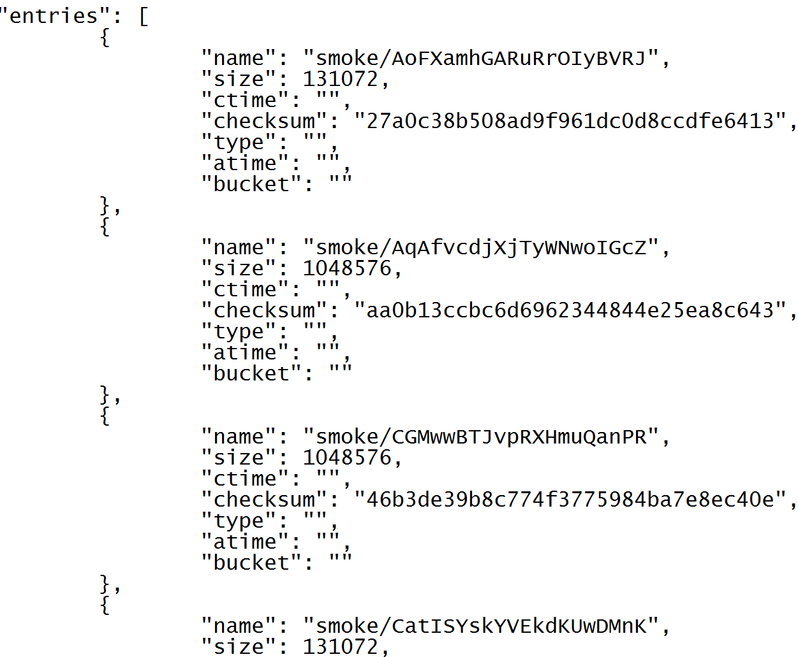

## Table of Contents
- [Bucket](#bucket)
- [Local Bucket](#local-bucket)
    - [Example: create, rename and, destroy local bucket](#example-create-rename-and-destroy-local-bucket)
- [Cloud Bucket](#cloud-bucket)
    - [Prefetch/Evict Objects](#prefetchevict-objects)
    - [Evict Bucket](#evict-bucket)
- [List Bucket](#list-bucket)
    - [properties-and-options](#properties-and-options)
    - [Example: listing local and Cloud buckets](#example-listing-local-and-cloud-buckets)
    - [Example: Listing all pages](#example-listing-all-pages)

## Bucket

As one would normally expect from an object store, AIS uses the bucket abstraction.

Buckets in AIS serve as the basic container in which objects are stored, similar to the buckets in [Amazon S3](https://docs.aws.amazon.com/AmazonS3/latest/dev/UsingBucket.html) and [Google Cloud (GCP)](https://cloud.google.com/storage/docs/key-terms#buckets).

Some buckets exist only within AIS. These are referred to as **local buckets** and can be created through the [REST API](http_api.md). Local buckets are totally distributed content-wise, across the entire AIS cluster.

When AIS is deployed as [fast tier](../README.md#fast-tier), buckets in the cloud storage can be viewed and accessed through the [RESTful API](http_api.md) in AIS, in the exact same way as local buckets. When this happens, AIS creates local instances of said buckets which then serves as a cache. These are referred to as **Cloud-based buckets** (or **cloud buckets** for short).

Cloud-based and local buckets support the same API with minor exceptions. Cloud buckets have operations specific to its cache within AIS. Local buckets, as of v2.0, are the only buckets that can be created, renamed or deleted through the [RESTful API](http_api.md).

The RESTful API itself is documented [here](http_api.md), while this document serves to further explain certain features of it specific to buckets.

## Local Bucket
Local Buckets are buckets that exist only within AIS.

Local Bucket API can be used to create, rename and, destroy local buckets.

New local buckets must be given a unique name that is not shared with any other local or cloud bucket. 

### Example: create, rename and, destroy local bucket

To create a local bucket with the name 'myBucket', rename it to 'myBucket2' and delete it, run:

```shell
$ curl -X POST -L -H 'Content-Type: application/json' -d '{"action": "createlb"}' http://localhost:8080/v1/buckets/myBucket
$ curl -X POST -L -H 'Content-Type: application/json' -d '{"action": "renamelb",  "name": "myBucket2"}' http://localhost:8080/v1/buckets/myBucket
$ curl -X DELETE -L -H 'Content-Type: application/json' -d '{"action": "destroylb"}' http://localhost:8080/v1/buckets/myBucket2
```

## Cloud Bucket

Cloud buckets are existing buckets in the cloud storage when AIS is deployed as [fast tier](../README.md#fast-tier). 

### Prefetch/Evict Objects

Objects within cloud buckets are automatically fetched into storage targets when accessed through AIS, and are evicted based on the monitored capacity and configurable high/low watermarks when [LRU](storage_svcs.md#lru) is enabled.

Cloud Bucket API can be used to manually fetch a group of objects from the cloud bucket (called prefetch) into storage targets, or to evict them. 

Objects are prefetched or deleted using [List/Range Operations](batch.md#listrange-operations).

For example, to use a [list operation](batch.md#list) to prefetch 'o1', 'o2', and, 'o3' from the cloud bucket `abc`, run:

```shell
curl -i -X POST -H 'Content-Type: application/json' -d '{"action":"prefetch", "value":{"objnames":["o1","o2","o3"], "deadline": "10s", "wait":true}}' http://localhost:8080/v1/buckets/abc
```

See the [List/Range Operation section](batch.md#listrange-operations) for the `"deadline": "10s"` and `"wait":true` parameters.

To use a [range operation](batch.md#range) to evict the 1000th to 2000th objects in the cloud bucket `abc` from AIS, which begin with the prefix `__tst/test-` and contain a 4 digit number with `22` in the middle, run:

```shell
curl -i -X DELETE -H 'Content-Type: application/json' -d '{"action":"evictobjects", "value":{"prefix":"__tst/test-", "regex":"\\d22\\d", "range":"1000:2000", "deadline": "10s", "wait":true}}' http://localhost:8080/v1/buckets/abc
```

### Evict Bucket

Before a cloud bucket is accessed through AIS, the cluster has no awareness of said bucket. 

Once a request to access the bucket, or to change the bucket's properties (see `set bucket props` in [REST API](http_api.md)) has been made, the AIS cluster starts keeping track of the bucket.

Cloud Bucket API provides the operation to evict a cloud bucket.

Evicting a cloud bucket will remove all traces of the cloud bucket within the AIS cluster. This effectively resets the AIS cluster to the point before any requests to access the bucket were made. This does not affect the objects stored within the cloud bucket.

For example, to evict the `abc` cloud bucket from the AIS cluster, run:

```shell
curl -i -X DELETE -H 'Content-Type: application/json' -d '{"action": "evictcb"}' http://localhost:8080/v1/buckets/myS3bucket
```

## List Bucket

ListBucket API returns a page of object names and, optionally, their properties (including sizes, creation times, checksums, and more), in addition to a token that servers as a cursor or a marker for the *next* page retrieval.

### properties-and-options
The properties-and-options specifier must be a JSON-encoded structure, for instance '{"props": "size"}' (see examples). An empty structure '{}' results in getting just the names of the objects (from the specified bucket) with no other metadata.

| Property/Option | Description | Value |
| --- | --- | --- |
| props | The properties to return with object names | A comma-separated string containing any combination of: "checksum","size","atime","ctime","iscached","bucket","version","targetURL". <sup id="a6">[6](#ft6)</sup> |
| time_format | The standard by which times should be formatted | Any of the following [golang time constants](http://golang.org/pkg/time/#pkg-constants): RFC822, Stamp, StampMilli, RFC822Z, RFC1123, RFC1123Z, RFC3339. The default is RFC822. |
| prefix | The prefix which all returned objects must have | For example, "my/directory/structure/" |
| pagemarker | The token identifying the next page to retrieve | Returned in the "nextpage" field from a call to ListBucket that does not retrieve all keys. When the last key is retrieved, NextPage will be the empty string |
| pagesize | The maximum number of object names returned in response | Default value is 1000. GCP and local bucket support greater page sizes. AWS is unable to return more than [1000 objects in one page](https://docs.aws.amazon.com/AmazonS3/latest/API/RESTBucketGET.html). |\b

 <a name="ft6">6</a>: The objects that exist in the Cloud but are not present in the AIStore cache will have their atime property empty (""). The atime (access time) property is supported for the objects that are present in the AIStore cache. [↩](#a6)

### Example: listing local and Cloud buckets

To list objects in the smoke/ subdirectory of a given bucket called 'myBucket', and to include in the listing their respective sizes and checksums, run:

```shell
$ curl -X POST -L -H 'Content-Type: application/json' -d '{"action": "listobjects", "value":{"props": "size, checksum", "prefix": "smoke/"}}' http://localhost:8080/v1/buckets/myBucket
```

This request will produce an output that (in part) may look as follows:



For many more examples, please refer to the [test sources](../ais/tests/) in the repository.

### Example: Listing all pages

The following Go code retrieves a list of all of object names from a named bucket (note: error handling omitted):

```go
// e.g. proxyurl: "http://localhost:8080"
url := proxyurl + "/v1/buckets/" + bucket

msg := &api.ActionMsg{Action: ais.ActListObjects}
fullbucketlist := &ais.BucketList{Entries: make([]*ais.BucketEntry, 0)}
for {
    // 1. First, send the request
    jsbytes, _ := json.Marshal(msg)
    r, _ := http.DefaultClient.Post(url, "application/json", bytes.NewBuffer(jsbytes))

    defer func(r *http.Response){
        r.Body.Close()
    }(r)

    // 2. Unmarshal the response
    pagelist := &ais.BucketList{}
    respbytes, _ := ioutil.ReadAll(r.Body)
    _ = json.Unmarshal(respbytes, pagelist)

    // 3. Add the entries to the list
    fullbucketlist.Entries = append(fullbucketlist.Entries, pagelist.Entries...)
    if pagelist.PageMarker == "" {
        // If PageMarker is the empty string, this was the last page
        break
    }
    // If not, update PageMarker to the next page returned from the request.
    msg.GetPageMarker = pagelist.PageMarker
}
```

>> PageMarker returned as part of the pagelist *points* to the *next* page.
