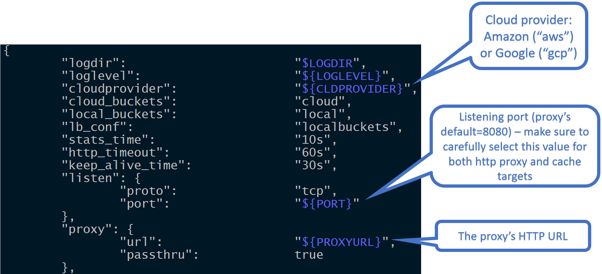
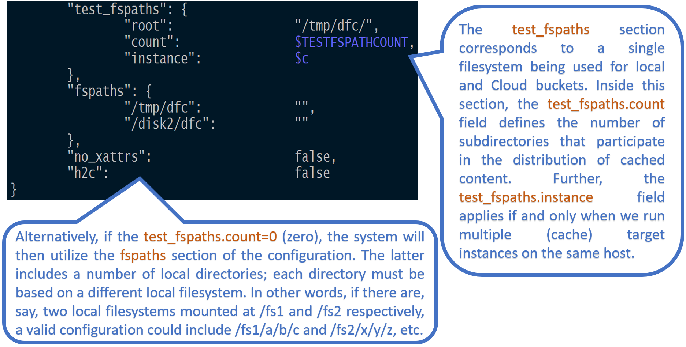

# Introduction

AIS configuration consists of cluster-wide (global) defaults and node-specific values - the latter includes node's own hostnames (or IP addresses) and mountpaths (disks).

Optionally and in addition, there's also a node-specific "config override" - a set of values that were changed for this node from global (inherited) defaults.

It is important to note that configuring cluster for production requires careful consideration. For example, AIS supports 3 (**three**) logical networks and will, therefore, benefit, performance-wise, if provisioned with up to 3 isolated physical networks or VLANs. The logical networks are:

* user (aka public)
* intra-cluster control
* intra-cluster data

with the corresponding [JSON names](/deploy/dev/local/aisnode_config.sh), respectively:

* `hostname`
* `hostname_intra_control`
* `hostname_intra_data`

> For AIS Kubernetes deployments we recommended [Cilium](https://cilium.io) CNI.

# References

* To enable an optional AIStore authentication server, execute `$ AUTH_ENABLED=true make deploy`. For information on AuthN server, please see [AuthN documentation](/docs/authn.md).
* In addition to AIStore - the storage cluster, you can also deploy [aisfs](/docs/aisfs.md) - to access AIS objects as files, and [AIS CLI](/docs/cli.md) - to monitor, configure and manage AIS nodes and buckets.
* AIS CLI is an easy-to-use command-line management tool supporting a growing number of commands and options (one of the first ones you may want to try could be `ais show cluster` - show the state and status of an AIS cluster). The CLI is documented in the [readme](/docs/cli.md); getting started with it boils down to running `make cli` and following the prompts.
* For more testing commands and options, please refer to the [testing README](/ais/tests/README.md).
* For `aisnode` command-line options, see: [command-line options](/docs/command_line.md).
* For helpful links and/or background on Go, AWS, GCP, and Deep Learning: [helpful links](/docs/helpful_links.md).
* And again, run `make help` to find out how to build, run, and test AIStore and tools.

# Cluster and Node Configuration

The first thing to keep in mind is that there are 3 (three) separate, and separately maintained, pieces:

1. Cluster configuration that comprises global defaults
2. Node (local) configuration
3. Node's local overrides of global defaults

Specifically:

## Cluster Config

In the documentation and in the code we can say "global configuration" or, same, "cluster configuration". The point, though, is that global config is replicated, versioned, checksummed, compressed, and - most importantly - applies to the entire cluster, all current (and future) node members.

Typically, when we deploy a new AIS cluster, we use configuration template that contains all the defaults - see, for example, [JSON template](/deploy/dev/local/aisnode_config.sh). Configuration sections in this template, and the knobs within those sections, must be self-explanatory, and the majority of those, except maybe just a few, have pre-assigned default values.

To show and/or change global config, simply type one of:

```console
# 1. show cluster config
$ ais show cluster config

# 2. show cluster config in JSON format
$ ais show cluster config --json

# 3. show cluster-wide defaults for all variables prefixed with "time"
$ ais show config cluster time
# or, same:
$ ais show cluster config time
PROPERTY                         VALUE
timeout.cplane_operation         2s
timeout.max_keepalive            4s
timeout.max_host_busy            20s
timeout.startup_time             1m
timeout.send_file_time           5m
timeout.transport_idle_term      4s

# 4. for all nodes in the cluster set startup timeout to 2 minutes
$ ais config cluster timeout.startup_time=2m
config successfully updated
```

## Node (local) configuration

Unlike global configuration that is replicated across all nodes there is also a node-specific configuration comprising:

* local config and log directories
* network configuration, including node's hostname(s) or IP addresses
* node's mountpaths

> Terminology: *mountpath* is a triplet **(local filesystem, disks this LFS utilizes, directory where AIS will store its metadata and user data)**. The following "share-nothing" rules are enforced: different mountpaths use different local filesystems, whereby each local FS uses its own disks.

> Separately, since AIS supports n-way mirroring and erasure coding, we strongly recommend not using LVM and hardware RAID. Rather, there must be a simple 1-to-1 relationship: one local FS - one non-partitioned disk.

### Example: show node's configuration

```console
# ais show config CCDpt8088
PROPERTY                                 VALUE                                                           DEFAULT
auth.enabled                             false                                                           -
backend.conf                             map[aws:map[] gcp:map[]]                                        -
checksum.enable_read_range               false                                                           -
...
...
(Hint: use `--type` to select the node config's type to show: 'cluster', 'local', 'all'.)
...
...
```

### Example: same as above, in JSON form:
```console
$ ais show config CCDpt8088 --json | tail -20
    "lastupdate_time": "2021-03-20 18:00:20.393881867 -0700 PDT m=+2907.143584987",
    "uuid": "ZzCknLkMi",
    "config_version": "3",
    "confdir": "/ais",
    "log_dir": "/tmp/ais/log",
    "host_net": {
        "hostname": "",
        "hostname_intra_control": "",
        "hostname_intra_data": "",
        "port": "51081",
        "port_intra_control": "51082",
        "port_intra_data": "51083"
    },
    "fspaths": {"/ais/mp1":{},"/ais/mp2":{},"/ais/mp3":{},"/ais/mp4":{}},
    "test_fspaths": {
        "root": "/tmp/ais",
        "count": 0,
        "instance": 0
    }
```

### Example: use `--type` option to show only local config
```console
# ais show config koLAt8081 --type local
PROPERTY                         VALUE
confdir                          /ais
log_dir                          /tmp/ais/log
host_net.hostname
host_net.hostname_intra_control
host_net.hostname_intra_data
host_net.port                    51081
host_net.port_intra_control      51082
host_net.port_intra_data         51083
fspaths.paths                    /ais/mp1,/ais/mp2,/ais/mp3,/ais/mp4
test_fspaths.root                /tmp/ais
test_fspaths.count               0
test_fspaths.instance            0
```

## Per-Node override of global defaults

Finally, each clustered node can individually override *inherited* defaults. For example:

```console
# ais show config CCDpt8088 timeout
PROPERTY                         VALUE   DEFAULT
timeout.cplane_operation         2s      -
timeout.max_host_busy            20s     -
timeout.max_keepalive            4s      -
timeout.send_file_time           5m      -
timeout.startup_time             1m      -
timeout.transport_idle_term      4s      -

# ais cluster configure CCDpt8088 timeout.startup_time=2m
config for node "CCDpt8088" successfully updated

# ais show config CCDpt8088 timeout
PROPERTY                         VALUE   DEFAULT
timeout.cplane_operation         2s      -
timeout.max_host_busy            20s     -
timeout.max_keepalive            4s      -
timeout.send_file_time           5m      -
timeout.startup_time             2m      1m
timeout.transport_idle_term      4s      -
```

Notice the `DEFAULT` column above where `-` indicates that the corresponding value is inherited and remains unchanged.

Rest of this document is structured as follows:

- [Basics](#basics)
- [Startup override](#startup-override)
- [Managing mountpaths](#managing-mountpaths)
- [Disabling extended attributes](#disabling-extended-attributes)
- [Enabling HTTPS](#enabling-https)
- [Filesystem Health Checker](#filesystem-health-checker)
- [Networking](#networking)
- [Reverse proxy](#reverse-proxy)
- [Curl examples](#curl-examples)
- [CLI examples](#cli-examples)

AIS production deployment, in particular, requires careful consideration of at least some of the configurable aspects. For example, AIS supports 3 (three) logical networks and will, therefore, benefit, performance-wise, if provisioned with up to 3 isolated physical networks or VLANs. The logical networks are: user (aka public), intra-cluster control, and intra-cluster data - the corresponding JSON names are, respectively: `hostname`, `hostname_intra_control`, and `hostname_intra_data`.

The following picture illustrates one section of the configuration template that, in part, includes listening port:



Further, `test_fspaths` section (see below) corresponds to a **single local filesystem being partitioned** between both *local* and *Cloud* buckets. In other words, the `test_fspaths` configuration option is intended strictly for development.



In production we use an alternative configuration called `fspaths`: the section of the [config](/deploy/dev/local/aisnode_config.sh) that includes a number of local directories, whereby each directory is based on a different local filesystem.

> Terminology: *mountpath* is a triplet **(local filesystem (LFS), disks that this LFS utilizes, LFS directory)**. The following rules are enforced: 1) different mountpaths use different LFSes, and 2) different LFSes use different disks.

> The terms `fspath` (aka `filesystem path`) and `mountpath` are used interchangeably throughout AIStore docs and sources. When `fspath` configuration is enabled, the 1-to-1 relationship between configured `mountpaths` and local filesystems is enforced and validated at all times.

An example of 12 fspaths (and 12 local filesystems) follows below:


# Basics

First, some basic facts:

* AIS cluster is a collection of nodes - members of the cluster.
* A node can be an AIS proxy (aka gateway) or an AIS target.
* In either case, HTTP request to read (get) or write (set) specific node's configuration will have `/v1/daemon` in its URL path.
* The capability to carry out cluster-wide configuration updates is also supported. The corresponding HTTP URL will have `/v1/cluster` in its path.

> Both `daemon` and `cluster` are the two RESTful resource abstractions supported by the API. Please see [AIS API](http_api.md) for naming conventions, RESTful resources, as well as API reference and details.

* To get the node's up-to-date configuration, execute:
```console
$ ais show config <daemon-ID>
```
This will display all configuration sections and all the named *knobs* - i.e., configuration variables and their current values.

Most configuration options can be updated either on an individual (target or proxy) daemon, or the entire cluster.
Some configurations are "overridable" and can be configured on a per-daemon basis. Some of these are shown in the table below.

For examples and alternative ways to format configuration-updating requests, please see the [examples below](#examples).

Following is a table-summary that contains a *subset* of all *settable* knobs:

| Option name | Overridable | Default value | Description |
|---|---|---|---|
| `ec.data_slices` | No | `2` | Represents the number of fragments an object is broken into (in the range [2, 100]) |
| `ec.disk_only` | No | `false` | If true, EC uses local drives for all operations. If false, EC automatically chooses between memory and local drives depending on the current memory load |
| `ec.enabled` | No | `false` | Enables or disables data protection |
| `ec.objsize_limit` | No | `262144` | Indicated the minimum size of an object in bytes that is erasure encoded. Smaller objects are replicated |
| `ec.parity_slices` | No | `2` | Represents the number of redundant fragments to provide protection from failures (in the range [2, 32]) |
| `ec.compression` | No | `"never"` | LZ4 compression parameters used when EC sends its fragments and replicas over network. Values: "never" - disables, "always" - compress all data, or a set of rules for LZ4, e.g "ratio=1.2" means enable compression from the start but disable when average compression ratio drops below 1.2 to save CPU resources |
| `mirror.burst_buffer` | No | `512` | the maximum length of the queue of objects to be mirrored. When the queue length exceeds the value, a target may skip creating replicas for new objects |
| `mirror.copies` | No | `1` | the number of local copies of an object |
| `mirror.enabled` | No | `false` | If true, for every object PUT a target creates object replica on another mountpath. Later, on object GET request, loadbalancer chooses a mountpath with lowest disk utilization and reads the object from it |
| `mirror.util_thresh` | No | `20` | If mirroring is enabled, loadbalancer chooses an object replica to read but only if main object's mountpath utilization exceeds the replica' s mountpath utilization by this value. Main object's mountpath is the mountpath used to store the object when mirroring is disabled |
| `rebalance.dest_retry_time` | No | `2m` | If a target does not respond within this interval while rebalance is running the target is excluded from rebalance process |
| `rebalance.enabled` | No | `true` | Enables and disables automatic rebalance after a target receives the updated cluster map. If the (automated rebalancing) option is disabled, you can still use the REST API (`PUT {"action": "start", "value": {"kind": "rebalance"}} v1/cluster`) to initiate cluster-wide rebalancing |
| `rebalance.multiplier` | No | `4` | A tunable that can be adjusted to optimize cluster rebalancing time (advanced usage only) |
| `rebalance.quiescent` | No | `20s` | Rebalance moves to the next stage or starts the next batch of objects when no objects are received during this time interval |
| `versioning.enabled` | No | `true` | Enables and disables versioning. For the supported 3rd party backends, versioning is _on_ only when it enabled for (and supported by) the specific backend |
| `versioning.validate_warm_get` | No | `false` | If false, a target returns a requested object immediately if it is cached. If true, a target fetches object's version(via HEAD request) from Cloud and if the received version mismatches locally cached one, the target redownloads the object and then returns it to a client |
| `checksum.enable_read_range` | Yes | `false` | See [Supported Checksums and Brief Theory of Operations](checksum.md) |
| `checksum.type` | Yes | `xxhash` | Checksum type. Please see [Supported Checksums and Brief Theory of Operations](checksum.md)  |
| `checksum.validate_cold_get` | Yes | `true` | Please see [Supported Checksums and Brief Theory of Operations](checksum.md) |
| `checksum.validate_warm_get` | Yes | `false` | See [Supported Checksums and Brief Theory of Operations](checksum.md) |
| `client.client_long_timeout` | Yes | `30m` | Default _long_ client timeout |
| `client.client_timeout` | Yes | `10s` | Default client timeout |
| `client.list_timeout` | Yes | `2m` | Client list objects timeout |
| `compression.block_size` | Yes | `262144` | Maximum data block size used by LZ4, greater values may increase compression ration but requires more memory. Value is one of 64KB, 256KB(AIS default), 1MB, and 4MB |
| `disk.disk_util_high_wm` | Yes | `80` | Operations that implement self-throttling mechanism, e.g. LRU, turn on the maximum throttle if disk utilization is higher than `disk_util_high_wm` |
| `disk.disk_util_low_wm` | Yes | `60` | Operations that implement self-throttling mechanism, e.g. LRU, do not throttle themselves if disk utilization is below `disk_util_low_wm` |
| `disk.iostat_time_long` | Yes | `2s` | The interval that disk utilization is checked when disk utilization is below `disk_util_low_wm`. |
| `disk.iostat_time_short` | Yes | `100ms` | Used instead of `iostat_time_long` when disk utilization reaches `disk_util_high_wm`. If disk utilization is between `disk_util_high_wm` and `disk_util_low_wm`, a proportional value between `iostat_time_short` and `iostat_time_long` is used. |
| `distributed_sort.call_timeout` | Yes | `"10m"` | a maximum time a target waits for another target to respond |
| `distributed_sort.compression` | Yes | `"never"` | LZ4 compression parameters used when dSort sends its shards over network. Values: "never" - disables, "always" - compress all data, or a set of rules for LZ4, e.g "ratio=1.2" means enable compression from the start but disable when average compression ratio drops below 1.2 to save CPU resources |
| `distributed_sort.default_max_mem_usage` | Yes | `"80%"` | a maximum amount of memory used by running dSort. Can be set as a percent of total memory(e.g `80%`) or as the number of bytes(e.g, `12G`) |
| `distributed_sort.dsorter_mem_threshold` | Yes | `"100GB"` | minimum free memory threshold which will activate specialized dsorter type which uses memory in creation phase - benchmarks shows that this type of dsorter behaves better than general type |
| `distributed_sort.duplicated_records` | Yes | `"ignore"` | what to do when duplicated records are found: "ignore" - ignore and continue, "warn" - notify a user and continue, "abort" - abort dSort operation |
| `distributed_sort.ekm_malformed_line` | Yes | `"abort"` | what to do when extraction key map notices a malformed line: "ignore" - ignore and continue, "warn" - notify a user and continue, "abort" - abort dSort operation |
| `distributed_sort.ekm_missing_key` | Yes | `"abort"` | what to do when extraction key map have a missing key: "ignore" - ignore and continue, "warn" - notify a user and continue, "abort" - abort dSort operation |
| `distributed_sort.missing_shards` | Yes | `"ignore"` | what to do when missing shards are detected: "ignore" - ignore and continue, "warn" - notify a user and continue, "abort" - abort dSort operation |
| `fshc.enabled` | Yes | `true` | Enables and disables filesystem health checker (FSHC) |
| `log.level` | Yes | `3` | Set global logging level. The greater number the more verbose log output |
| `lru.capacity_upd_time` | Yes | `10m` | Determines how often AIStore updates filesystem usage |
| `lru.dont_evict_time` | Yes | `120m` | LRU does not evict an object which was accessed less than dont_evict_time ago |
| `lru.enabled` | Yes | `true` | Enables and disabled the LRU |
| `lru.highwm` | Yes | `90` | LRU starts immediately if a filesystem usage exceeds the value |
| `lru.lowwm` | Yes | `75` | If filesystem usage exceeds `highwm` LRU tries to evict objects so the filesystem usage drops to `lowwm` |
| `periodic.notif_time` | Yes | `30s` | An interval of time to notify subscribers (IC members) of the status and statistics of a given asynchronous operation (such as Download, Copy Bucket, etc.)  |
| `periodic.stats_time` | Yes | `10s` | A *housekeeping* time interval to periodically update and log internal statistics, remove/rotate old logs, check available space (and run LRU *xaction* if need be), etc. |
| `resilver.enabled` | Yes | `true` | Enables and disables automatic reresilver after a mountpath has been added or removed. If the (automated resilvering) option is disabled, you can still use the REST API (`PUT {"action": "start", "value": {"kind": "resilver", "node": targetID}} v1/cluster`) to initiate resilvering |
| `timeout.max_host_busy` | Yes | `20s` | Maximum latency of control-plane operations that may involve receiving new bucket metadata and associated processing |
| `timeout.send_file_time` | Yes | `5m` | Timeout for sending/receiving an object from another target in the same cluster |
| `timeout.transport_idle_term` | Yes | `4s` | Max idle time to temporarily teardown long-lived intra-cluster connection |
| `vmodule` | Yes | `""` | Overrides logging level for a given modules.<br>{"name": "vmodule", "value": "target\*=2"} sets log level to 2 for target modules |

# Startup override

AIS command-line allows to override configuration at AIS node's startup. For example:

```console
$ aisnode -config=/etc/ais.json -local_config=/etc/ais_local.json -role=target -config_custom="client.timeout=13s,log.level=4"
```

As shown above, the CLI option in-question is: `confjson`.
Its value is a JSON-formatted map of string names and string values.
By default, the config provided in `config_custom` will be persisted on the disk.
To make it transient either add `-transient=true` flag or add additional JSON entry:

```console
$ aisnode -config=/etc/ais.json -local_config=/etc/ais_local.json -role=target -transient=true -config_custom="client.timeout=13s, transient=true"
```

Another example.
To override locally-configured address of the primary proxy, run:

```console
$ aisnode -config=/etc/ais.json -local_config=/etc/ais_local.json -role=target -config_custom="proxy.primary_url=http://G"
# where G denotes the designated primary's hostname and port.
```

To achieve the same on temporary basis, add `-transient=true` as follows:

```console
$ aisnode -config=/etc/ais.json -local_config=/etc/ais_local.json -role=target -config_custom="proxy.primary_url=http://G"
```

> Please see [AIS command-line](command_line.md) for other command-line options and details.

# Managing mountpaths

Configuration option `fspaths` specifies the list of local directories where storage targets store objects. An `fspath` aka `mountpath` (both terms are used interchangeably) is a local directory serviced by a local filesystem.

> There must be a 1-to-1 relationship between `fspath` and an underlying local filesystem. Note as well that this may be not the case for the development environments where multiple mountpaths are allowed to coexist within a single filesystem (e.g., tmpfs).

> AIS [mountpath](overview.md#terminology) is a single disk **or** a volume (a RAID) formatted with a local filesystem of choice, **and** a local directory that AIS utilizes to store user data and AIS metadata. A mountpath can be disabled and (re)enabled, automatically or administratively, at any point during runtime. In a given cluster, a total number of mountpaths would normally compute as a direct product of (number of storage targets) x (number of disks in each target).

AIStore [HTTP API](http_api.md) makes it possible to list, add, remove, enable, and disable a `fspath` (and, therefore, the corresponding local filesystem) at runtime. Filesystem's health checker (FSHC) monitors the health of all local filesystems: a filesystem that "accumulates" I/O errors will be disabled and taken out, as far as the AIStore built-in mechanism of object distribution. For further details about FSHC, please refer to [FSHC readme](/health/fshc.md).

# Disabling extended attributes

To make sure that AIStore does not utilize xattrs, configure `checksum.type`=`none`, `versioning.enabled`=`true`,
and `md_write`=`never` for all targets in a AIStore cluster.
This can be done via the [common configuration "part"](/deploy/dev/local/aisnode_config.sh) that'd be further used to deploy the cluster.

Extended attributes can be disabled on per bucket basis. To do this, turn off saving metadata to disks (CLI):

```console
$ ais bucket props ais://mybucket md_write=never
Bucket props successfully updated
"md_write" set to: "never" (was: "")
```

Disable extended attributes only if you need fast and **temporary** storage.
Without xattrs, a node loses its objects after the node reboots.
If extended attributes are disabled globally when deploying a cluster, node IDs are not permanent and a node can change its ID after it restarts.

# Enabling HTTPS

To switch from HTTP protocol to an encrypted HTTPS, configure `net.http.use_https`=`true` and modify `net.http.server_crt` and `net.http.server_key` values so they point to your OpenSSL certificate and key files respectively (see [AIStore configuration](/deploy/dev/local/aisnode_config.sh)).

# Filesystem Health Checker

Default installation enables filesystem health checker component called FSHC. FSHC can be also disabled via section "fshc" of the [configuration](/deploy/dev/local/aisnode_config.sh).

When enabled, FSHC gets notified on every I/O error upon which it performs extensive checks on the corresponding local filesystem. One possible outcome of this health-checking process is that FSHC disables the faulty filesystems leaving the target with one filesystem less to distribute incoming data.

Please see [FSHC readme](/health/fshc.md) for further details.

# Networking

In addition to user-accessible public network, AIStore will optionally make use of the two other networks: internal (or intra-cluster) and replication. If configured via the [net section of the configuration](/deploy/dev/local/aisnode_config.sh), the intra-cluster network is utilized for latency-sensitive control plane communications including keep-alive and [metasync](ha.md#metasync). The replication network is used, as the name implies, for a variety of replication workloads.

All the 3 (three) networking options are enumerated [here](/cmn/network.go).

# Reverse proxy

AIStore gateway can act as a reverse proxy vis-à-vis AIStore storage targets. This functionality is limited to GET requests only and must be used with caution and consideration. Related [configuration variable](/deploy/dev/local/aisnode_config.sh) is called `rproxy` - see sub-section `http` of the section `net`. For further details, please refer to [this readme](rproxy.md).

# Curl examples

The following assumes that `G` and `T` are the (hostname:port) of one of the deployed gateways (in a given AIS cluster) and one of the targets, respectively.

## Cluster-wide operation (all nodes)
* Set the stats logging interval to 1 second

```console
$ curl -i -X PUT -H 'Content-Type: application/json' -d '{"action": "setconfig","name": "periodic.stats_time", "value": "1s"}' 'http://G/v1/cluster'
```

or, same:

```console
$ curl -i -X PUT 'http://G/v1/cluster/setconfig?periodic.stats_time=1s'
```

> Notice the two alternative ways to form the requests.

## Cluster-wide operation (all nodes)
* Set the stats logging interval to 2 minutes

```console
$ curl -i -X PUT -H 'Content-Type: application/json' -d '{"action": "setconfig","name": "periodic.stats_time", "value": "2m"}' 'http://G/v1/cluster'
```

## Cluster-wide operation (all nodes)
* Elevate log verbosity to `4` for all sources matching `ais/targ*` regex

```console
$ curl -i -X PUT -H 'Content-Type: application/json' -d '{"action": "setconfig","name": "vmodule", "value": "ais/targ*=4"}' 'http://G/v1/cluster'
```

## Single-node operation (single node)
* Set log verbosity to `1` for all source files that match the `ais/targ*` regex

```console
$ curl -i -X PUT -H 'Content-Type: application/json' -d '{"action": "setconfig","name": "vmodule", "value": "ais/targ*=1"}' 'http://T/v1/daemon'
```

or, same:

```console
$ curl -i -X PUT 'http://T/v1/daemon/setconfig?vmodule=ais/targ*=1'
```

# CLI examples

[AIS CLI](/docs/cli.md) is an integrated management-and-monitoring command line tool. The following CLI command sequence, first - finds out all AIS knobs that contain substring "time" in their names, second - modifies `list_timeout` from 2 minutes to 5 minutes, and finally, displays the modified value:

```console
$ ais show config --type all 844974_8080 --json | jq '.timeout.list_timeout'
"2m"
$ ais config cluster timeout.list_timeout=5m
Config has been updated successfully.
$ ais show config --type all 844974_8080 --json | jq '.timeout.list_timeout'
"5m"
```

The example above demonstrates cluster-wide configuration update but note: single-node updates are also supported.

## Cluster-wide operation (all nodes)
* Set `periodic.stats_time` = 1 minute, `periodic.iostat_time_long` = 4 seconds

```console
$ ais config cluster periodic.stats_time=1m disk.iostat_time_long=4s
```

## Single-node operation (single node)
AIS configuration includes a section called `disk`. The `disk` in turn contains several knobs - one of those knobs is `disk.iostat_time_long`, another - `disk.disk_util_low_wm`. To update one or both of those named variables on all or one of the clustered nodes, you could:
* Set `disk.iostat_time_long` = 3 seconds, `disk.disk_util_low_wm` = 40 percent on daemon with ID `target1`

```console
$ ais config node target1 periodic.stats_time=1m disk.iostat_time_long=4s
```
