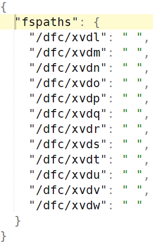

AIS configuration comprises:

| Name | Scope | Comment |
| --- | --- | --- |
| [ClusterConfig](https://github.com/NVIDIA/aistore/blob/main/cmn/config.go#L48) | Global | [Named sections](https://github.com/NVIDIA/aistore/blob/main/deploy/dev/local/aisnode_config.sh#L13) containing name-value knobs |
| [LocalConfig](https://github.com/NVIDIA/aistore/blob/main/cmn/config.go#L49) | Local | Allows to override global defaults on a per-node basis |

Cluster-wide (global) configuration is protected, namely: checksummed, versioned, and safely replicated. In effect, global config defines cluster-wide defaults inherited by each node joining the cluster.

Local config includes:

1. node's own hostnames (or IP addresses) and [mountpaths](overview.md#terminology) (data drives);
2. optionally, names-and-values that were changed for *this* specific node. For each node in the cluster, the corresponding capability (dubbed *config-override*) boils down to:
   * **inheriting** cluster configuration, and optionally
   * optionally, **locally overriding** assorted inherited defaults (see usage examples below).

Majority of the configuration knobs can be changed at runtime (and at any time). A few read-only variables are explicitly [marked](https://github.com/NVIDIA/aistore/blob/main/cmn/config.go) in the source; any attempt to modify those at runtime will return "read-only" error message.

## CLI

For the most part, commands to view and update (CLI, cluster, node) configuration can be found [here](/docs/cli/config.md).

The [same document](/docs/cli/config.md) also contains a brief theory of operation, command descriptions, numerous usage examples and more.

> **Important:** as an input, CLI accepts both plain text and JSON-formatted values. For the latter, make sure to embed the (JSON value) argument into single quotes, e.g.:

```console
$ ais config cluster checksum.type='{"type":"md5"}'
```

However, plain-text updating is more common, e.g.:

```console
$ ais config cluster log.level 4

$ ais config cluster log.modules <TAB-TAB>
transport    memsys       fs           ec           ios          backend      mirror       downloader   s3
ais          cluster      reb          stats        xs           space        dsort        etl          none

$ ais config cluster log.modules space,s3
```

To show the current cluster config in plain text and JSON:

```console
$ ais config cluster log
PROPERTY         VALUE
log.level        4 (modules: space,s3)
log.max_size     4MiB
log.max_total    128MiB
log.flush_time   40s
log.stats_time   1m
log.to_stderr    false
```

And the same in JSON:

```console
$ ais config cluster log --json

    "log": {
        "level": "540676",
        "max_size": "4MiB",
        "max_total": "128MiB",
        "flush_time": "40s",
        "stats_time": "1m",
        "to_stderr": false
    }
```

**Note:** some config values are read-only or otherwise protected and can be only listed, e.g.:

```console
$ ais config cluster backend.conf --json
    "backend": {"aws":{},"azure":{},"gcp":{}}
```

See also:

* [Backend providers and supported backends](/docs/providers.md)
* [Disable/Enable cloud backend at runtime](/docs/cli/advanced.mdi#disableenable-cloud-backend-at-runtime)

## Configuring for production

Configuring AIS cluster for production requires a careful consideration. First and foremost, there are assorted [performance](performance.md) related recommendations.

Optimal performance settings will always depend on your (hardware, network) environment. Speaking of networking, AIS supports 3 (**three**) logical networks and will, therefore, benefit, performance-wise, if provisioned with up to 3 isolated physical networks or VLANs. The logical networks are:

* user (aka public)
* intra-cluster control
* intra-cluster data

with the corresponding [JSON names](/deploy/dev/local/aisnode_config.sh), respectively:

* `hostname`
* `hostname_intra_control`
* `hostname_intra_data`

### Example

```console
$ ais config node <TAB-TAB>

p[ctfooJtb]   p[qGfooQSf]   p[KffoosQR]   p[ckfooUEX]   p[DlPmfooU]   t[MgHfooNG]   t[ufooIDPc]   t[tFUfooCO]   t[wSJfoonU]   t[WofooQEW]
p[pbarqYtn]   p[JedbargG]   p[WMbargGF]   p[barwMoEU]   p[OUgbarGf]   t[tfNbarFk]   t[fbarswQP]   t[vAWbarPv]   t[Kopbarra]   t[fXbarenn]

## in aistore, each node has "inherited" and "local" configuration
## choose "local" to show the (selected) target's disks and network

$ ais config node t[fbarswQP] local --json
{
    "confdir": "/etc/ais",
    "log_dir": "/var/log/ais",
    "host_net": {
        "hostname": "10.51.156.130",
        "hostname_intra_control": "ais-target-5.nvmetal.net",
        "hostname_intra_data": "ais-target-5.nvmetal.net",
        "port": "51081",
        "port_intra_control": "51082",
        "port_intra_data": "51083"
    },
    "fspaths": {"/ais/nvme0n1": "","/ais/nvme1n1": "","/ais/nvme2n1": ""},
    "test_fspaths": {
        "root": "",
        "count": 0,
        "instance": 0
    }
}
```

### Multi-homing

All aistore nodes - both ais targets and ais gateways - can be deployed as multi-homed servers. But of course, the capability is mostly important and relevant for the targets that may be required (and expected) to move a lot of traffic, as fast as possible.

Building up on the previous section's example, here's how it may look:

```console
$ ais config node t[fbarswQP] local host_net --json
{
    "host_net": {
        "hostname": "10.51.156.130, 10.51.156.131, 10.51.156.132",
        "hostname_intra_control": "ais-target-5.nvmetal.net",
        "hostname_intra_data": "ais-target-5.nvmetal.net",
        "port": "51081",
        "port_intra_control": "51082",
        "port_intra_data": "51083"
    },
}
```

**Note**: additional NICs can be added (or removed) transparently for users, i.e. without requiring (or causing) any other changes.

The example above may serve as a simple illustration whereby `t[fbarswQP]` becomes a multi-homed device equally utilizing all 3 (three) IPv4 interfaces

## References

* For Kubernetes deployment, please refer to a separate [ais-k8s](https://github.com/NVIDIA/ais-k8s) repository that also contains [AIS/K8s Operator](https://github.com/NVIDIA/ais-k8s/blob/main/operator/README.md) and its configuration-defining [resources](https://github.com/NVIDIA/ais-k8s/blob/main/operator/pkg/resources/cmn/config.go).
* To configure an optional AIStore authentication server, run `$ AIS_AUTHN_ENABLED=true make deploy`. For information on AuthN server, please see [AuthN documentation](/docs/authn.md).
* AIS [CLI](/docs/cli.md) is an easy-to-use convenient command-line management/monitoring tool. To get started with CLI, run `make cli` (that generates `ais` executable) and follow the prompts.

## Cluster and Node Configuration

The first thing to keep in mind is that there are 3 (three) separate, and separately maintained, pieces:

1. Cluster configuration that comprises global defaults
2. Node (local) configuration
3. Node's local overrides of global defaults

Specifically:

## Cluster Config

To show and/or change global config, simply type one of:

```console
# 1. show cluster config
$ ais show cluster config

# 2. show cluster config in JSON format
$ ais show cluster config --json

# 3. show cluster-wide defaults for all variables prefixed with "time"
$ ais show config cluster time
# or, same:
$ ais show cluster config time
PROPERTY                         VALUE
timeout.cplane_operation         2s
timeout.max_keepalive            4s
timeout.max_host_busy            20s
timeout.startup_time             1m
timeout.send_file_time           5m
timeout.transport_idle_term      4s

# 4. for all nodes in the cluster set startup timeout to 2 minutes
$ ais config cluster timeout.startup_time=2m
config successfully updated
```

Typically, when we deploy a new AIS cluster, we use configuration template that contains all the defaults - see, for example, [JSON template](/deploy/dev/local/aisnode_config.sh). Configuration sections in this template, and the knobs within those sections, must be self-explanatory, and the majority of those, except maybe just a few, have pre-assigned default values.

## Node configuration

As stated above, each node in the cluster inherits global configuration with the capability to override the latter locally.

There are also node-specific settings, such as:

* log directories
* network configuration, including node's hostname(s) or IP addresses
* node's [mountpaths](#managing-mountpaths)

> Since AIS supports n-way mirroring and erasure coding, we typically recommend not using LVMs and hardware RAIDs.

### Example: show node's configuration

```console
# ais show config t[CCDpt8088]
PROPERTY                                 VALUE                                                           DEFAULT
auth.enabled                             false                                                           -
auth.secret                              aBitLongSecretKey                                               -
backend.conf                             map[aws:map[] gcp:map[]]                                        -
checksum.enable_read_range               false                                                           -
checksum.type                            xxhash                                                          -
checksum.validate_cold_get               true                                                            -
checksum.validate_obj_move               false                                                           -
checksum.validate_warm_get               false                                                           -
...
...
(Hint: use `--type` to select the node config's type to show: 'cluster', 'local', 'all'.)
...
...
```

### Example: same as above in JSON format:

```console
$ ais show config CCDpt8088 --json | tail -20
    "lastupdate_time": "2021-03-20 18:00:20.393881867 -0700 PDT m=+2907.143584987",
    "uuid": "ZzCknLkMi",
    "config_version": "3",
    "confdir": "/ais",
    "log_dir": "/tmp/ais/log",
    "host_net": {
        "hostname": "",
        "hostname_intra_control": "",
        "hostname_intra_data": "",
        "port": "51081",
        "port_intra_control": "51082",
        "port_intra_data": "51083"
    },
    "fspaths": {"/ais/mp1": "","/ais/mp2": "","/ais/mp3":{},"/ais/mp4": ""},
    "test_fspaths": {
        "root": "/tmp/ais",
        "count": 0,
        "instance": 0
    }
```

See also:
*  [local playground with two data drives](https://github.com/NVIDIA/aistore/blob/main/deploy/dev/local/README.md)

###Example: use `--type` option to show only local config

```console
# ais show config koLAt8081 --type local
PROPERTY                         VALUE
confdir                          /ais
log_dir                          /tmp/ais/log
host_net.hostname
host_net.hostname_intra_control
host_net.hostname_intra_data
host_net.port                    51081
host_net.port_intra_control      51082
host_net.port_intra_data         51083
fspaths.paths                    /ais/mp1,/ais/mp2,/ais/mp3,/ais/mp4
test_fspaths.root                /tmp/ais
test_fspaths.count               0
test_fspaths.instance            0
```

### Local override (of global defaults)

Example:

```console
$ ais show config t[CCDpt8088] timeout
# or, same:
$ ais config node t[CCDpt8088] timeout

PROPERTY                         VALUE   DEFAULT
timeout.cplane_operation         2s      -
timeout.join_startup_time        3m      -
timeout.max_host_busy            20s     -
timeout.max_keepalive            4s      -
timeout.send_file_time           5m      -
timeout.startup_time             1m      -

$ ais config node t[CCDpt8088] timeout.startup_time=90s
config for node "CCDpt8088" successfully updated

$ ais config node t[CCDpt8088] timeout

PROPERTY                         VALUE   DEFAULT
timeout.cplane_operation         2s      -
timeout.join_startup_time        3m      -
timeout.max_host_busy            20s     -
timeout.max_keepalive            4s      -
timeout.send_file_time           5m      -
timeout.startup_time             1m30s   1m
```

In the `DEFAULT` column above hyphen (`-`) indicates that the corresponding value is inherited and, as far as the node `CCDpt8088`, remains unchanged.

## Rest of this document is structured as follows

- [Basics](#basics)
- [Startup override](#startup-override)
- [Managing mountpaths](#managing-mountpaths)
- [Disabling extended attributes](#disabling-extended-attributes)
- [Enabling HTTPS](#enabling-https)
- [Filesystem Health Checker](#filesystem-health-checker)
- [Networking](#networking)
- [Curl examples](#curl-examples)
- [CLI examples](#cli-examples)

The picture illustrates one section of the configuration template that, in part, includes listening port:


Further, `test_fspaths` section (see below) corresponds to a **single local filesystem being partitioned** between both *local* and *Cloud* buckets. In other words, the `test_fspaths` configuration option is intended strictly for development.


In production, we use an alternative configuration called `fspaths`: the section of the [config](/deploy/dev/local/aisnode_config.sh) that includes a number of local directories, whereby each directory is based on a different local filesystem.

For `fspath` and `mountpath` terminology and details, please see section [Managing Mountpaths](#managing-mountpaths) in this document.

An example of 12 fspaths (and 12 local filesystems) follows below:



### Example: 3 NVMe drives

```console
$ ais config node <TAB-TAB>

p[ctfooJtb]   p[qGfooQSf]   p[KffoosQR]   p[ckfooUEX]   p[DlPmfooU]   t[MgHfooNG]   t[ufooIDPc]   t[tFUfooCO]   t[wSJfoonU]   t[WofooQEW]
p[pbarqYtn]   p[JedbargG]   p[WMbargGF]   p[barwMoEU]   p[OUgbarGf]   t[tfNbarFk]   t[fbarswQP]   t[vAWbarPv]   t[Kopbarra]   t[fXbarenn]

## in aistore, each node has "inherited" and "local" configuration
## choose "local" to show the target's own disks and network

$ ais config node t[fbarswQP] local --json
{
    "confdir": "/etc/ais",
    "log_dir": "/var/log/ais",
    "host_net": {
        "hostname": "10.51.156.130",
        "hostname_intra_control": "ais-target-5.nvmetal.net",
        "hostname_intra_data": "ais-target-5.nvmetal.net",
        "port": "51081",
        "port_intra_control": "51082",
        "port_intra_data": "51083"
    },
    "fspaths": {"/ais/nvme0n1": "","/ais/nvme1n1": "","/ais/nvme2n1": ""},
    "test_fspaths": {
        "root": "",
        "count": 0,
        "instance": 0
    }
}
```

See also:
*  [local playground with two data drives](https://github.com/NVIDIA/aistore/blob/main/deploy/dev/local/README.md)

## Basics

First, some basic facts:

* AIS cluster is a collection of nodes - members of the cluster.
* A node can be an AIS proxy (aka gateway) or an AIS target.
* In either case, HTTP request to read (get) or write (set) specific node's configuration will have `/v1/daemon` in its URL path.
* The capability to carry out cluster-wide configuration updates is also supported. The corresponding HTTP URL will have `/v1/cluster` in its path.

> Both `daemon` and `cluster` are the two RESTful resource abstractions supported by the API. Please see [AIS API](http_api.md) for naming conventions, RESTful resources, as well as API reference and details.

* To get the node's up-to-date configuration, execute:
```console
$ ais show config <daemon-ID>
```
This will display all configuration sections and all the named *knobs* - i.e., configuration variables and their current values.

Most configuration options can be updated either on an individual (target or proxy) daemon, or the entire cluster.
Some configurations are "overridable" and can be configured on a per-daemon basis. Some of these are shown in the table below.

For examples and alternative ways to format configuration-updating requests, please see the [examples below](#examples).

Following is a table-summary that contains a *subset* of all *settable* knobs:

> **NOTE (May 2022):** this table is somewhat **outdated** and must be revisited.

| Option name | Overridable | Default value | Description |
|---|---|---|---|
| `ec.data_slices` | No | `2` | Represents the number of fragments an object is broken into (in the range [2, 100]) |
| `ec.disk_only` | No | `false` | If true, EC uses local drives for all operations. If false, EC automatically chooses between memory and local drives depending on the current memory load |
| `ec.enabled` | No | `false` | Enables or disables data protection |
| `ec.objsize_limit` | No | `262144` | Indicated the minimum size of an object in bytes that is erasure encoded. Smaller objects are replicated |
| `ec.parity_slices` | No | `2` | Represents the number of redundant fragments to provide protection from failures (in the range [2, 32]) |
| `ec.compression` | No | `"never"` | LZ4 compression parameters used when EC sends its fragments and replicas over network. Values: "never" - disables, "always" - compress all data, or a set of rules for LZ4, e.g "ratio=1.2" means enable compression from the start but disable when average compression ratio drops below 1.2 to save CPU resources |
| `mirror.burst_buffer` | No | `512` | the maximum queue size for the (pending) objects to be mirrored. When exceeded, target logs a warning. |
| `mirror.copies` | No | `1` | the number of local copies of an object |
| `mirror.enabled` | No | `false` | If true, for every object PUT a target creates object replica on another mountpath. Later, on object GET request, loadbalancer chooses a mountpath with lowest disk utilization and reads the object from it |
| `rebalance.dest_retry_time` | No | `2m` | If a target does not respond within this interval while rebalance is running the target is excluded from rebalance process |
| `rebalance.enabled` | No | `true` | Enables and disables automatic rebalance after a target receives the updated cluster map. If the (automated rebalancing) option is disabled, you can still use the REST API (`PUT {"action": "start", "value": {"kind": "rebalance"}} v1/cluster`) to initiate cluster-wide rebalancing |
| `rebalance.multiplier` | No | `4` | A tunable that can be adjusted to optimize cluster rebalancing time (advanced usage only) |
| `transport.quiescent` | No | `20s` | Rebalance moves to the next stage or starts the next batch of objects when no objects are received during this time interval |
| `versioning.enabled` | No | `true` | Enables and disables versioning. For the supported 3rd party backends, versioning is _on_ only when it enabled for (and supported by) the specific backend |
| `versioning.validate_warm_get` | No | `false` | If false, a target returns a requested object immediately if it is cached. If true, a target fetches object's version(via HEAD request) from Cloud and if the received version mismatches locally cached one, the target redownloads the object and then returns it to a client |
| `checksum.enable_read_range` | Yes | `false` | See [Supported Checksums and Brief Theory of Operations](checksum.md) |
| `checksum.type` | Yes | `xxhash` | Checksum type. Please see [Supported Checksums and Brief Theory of Operations](checksum.md)  |
| `checksum.validate_cold_get` | Yes | `true` | Please see [Supported Checksums and Brief Theory of Operations](checksum.md) |
| `checksum.validate_warm_get` | Yes | `false` | See [Supported Checksums and Brief Theory of Operations](checksum.md) |
| `client.client_long_timeout` | Yes | `30m` | Default _long_ client timeout |
| `client.client_timeout` | Yes | `10s` | Default client timeout |
| `client.list_timeout` | Yes | `2m` | Client list objects timeout |
| `transport.block_size` | Yes | `262144` | Maximum data block size used by LZ4, greater values may increase compression ration but requires more memory. Value is one of 64KB, 256KB(AIS default), 1MB, and 4MB |
| `disk.disk_util_high_wm` | Yes | `80` | Operations that implement self-throttling mechanism, e.g. LRU, turn on the maximum throttle if disk utilization is higher than `disk_util_high_wm` |
| `disk.disk_util_low_wm` | Yes | `60` | Operations that implement self-throttling mechanism, e.g. LRU, do not throttle themselves if disk utilization is below `disk_util_low_wm` |
| `disk.iostat_time_long` | Yes | `2s` | The interval that disk utilization is checked when disk utilization is below `disk_util_low_wm`. |
| `disk.iostat_time_short` | Yes | `100ms` | Used instead of `iostat_time_long` when disk utilization reaches `disk_util_high_wm`. If disk utilization is between `disk_util_high_wm` and `disk_util_low_wm`, a proportional value between `iostat_time_short` and `iostat_time_long` is used. |
| `distributed_sort.call_timeout` | Yes | `"10m"` | a maximum time a target waits for another target to respond |
| `distributed_sort.compression` | Yes | `"never"` | LZ4 compression parameters used when dSort sends its shards over network. Values: "never" - disables, "always" - compress all data, or a set of rules for LZ4, e.g "ratio=1.2" means enable compression from the start but disable when average compression ratio drops below 1.2 to save CPU resources |
| `distributed_sort.default_max_mem_usage` | Yes | `"80%"` | a maximum amount of memory used by running dSort. Can be set as a percent of total memory(e.g `80%`) or as the number of bytes(e.g, `12G`) |
| `distributed_sort.dsorter_mem_threshold` | Yes | `"100GB"` | minimum free memory threshold which will activate specialized dsorter type which uses memory in creation phase - benchmarks shows that this type of dsorter behaves better than general type |
| `distributed_sort.duplicated_records` | Yes | `"ignore"` | what to do when duplicated records are found: "ignore" - ignore and continue, "warn" - notify a user and continue, "abort" - abort dSort operation |
| `distributed_sort.ekm_malformed_line` | Yes | `"abort"` | what to do when extraction key map notices a malformed line: "ignore" - ignore and continue, "warn" - notify a user and continue, "abort" - abort dSort operation |
| `distributed_sort.ekm_missing_key` | Yes | `"abort"` | what to do when extraction key map have a missing key: "ignore" - ignore and continue, "warn" - notify a user and continue, "abort" - abort dSort operation |
| `distributed_sort.missing_shards` | Yes | `"ignore"` | what to do when missing shards are detected: "ignore" - ignore and continue, "warn" - notify a user and continue, "abort" - abort dSort operation |
| `fshc.enabled` | Yes | `true` | Enables and disables filesystem health checker (FSHC) |
| `log.level` | Yes | `3` | Set global logging level. The greater number the more verbose log output |
| `lru.capacity_upd_time` | Yes | `10m` | Determines how often AIStore updates filesystem usage |
| `lru.dont_evict_time` | Yes | `120m` | LRU does not evict an object which was accessed less than dont_evict_time ago |
| `lru.enabled` | Yes | `true` | Enables and disabled the LRU |
| `space.highwm` | Yes | `90` | LRU starts immediately if a filesystem usage exceeds the value |
| `space.lowwm` | Yes | `75` | If filesystem usage exceeds `highwm` LRU tries to evict objects so the filesystem usage drops to `lowwm` |
| `periodic.notif_time` | Yes | `30s` | An interval of time to notify subscribers (IC members) of the status and statistics of a given asynchronous operation (such as Download, Copy Bucket, etc.)  |
| `periodic.stats_time` | Yes | `10s` | A *housekeeping* time interval to periodically update and log internal statistics, remove/rotate old logs, check available space (and run LRU *xaction* if need be), etc. |
| `resilver.enabled` | Yes | `true` | Enables and disables automatic reresilver after a mountpath has been added or removed. If the (automated resilvering) option is disabled, you can still use the REST API (`PUT {"action": "start", "value": {"kind": "resilver", "node": targetID}} v1/cluster`) to initiate resilvering |
| `timeout.max_host_busy` | Yes | `20s` | Maximum latency of control-plane operations that may involve receiving new bucket metadata and associated processing |
| `timeout.send_file_time` | Yes | `5m` | Timeout for sending/receiving an object from another target in the same cluster |
| `timeout.transport_idle_term` | Yes | `4s` | Max idle time to temporarily teardown long-lived intra-cluster connection |

## Startup override

AIS command-line allows to override configuration at AIS node's startup. For example:

```console
$ aisnode -config=/etc/ais.json -local_config=/etc/ais_local.json -role=target -config_custom="client.timeout=13s,log.level=4"
```

As shown above, the CLI option in-question is: `confjson`.
Its value is a JSON-formatted map of string names and string values.
By default, the config provided in `config_custom` will be persisted on the disk.
To make it transient either add `-transient=true` flag or add additional JSON entry:

```console
$ aisnode -config=/etc/ais.json -local_config=/etc/ais_local.json -role=target -transient=true -config_custom="client.timeout=13s, transient=true"
```

Another example.
To override locally-configured address of the primary proxy, run:

```console
$ aisnode -config=/etc/ais.json -local_config=/etc/ais_local.json -role=target -config_custom="proxy.primary_url=http://G"
# where G denotes the designated primary's hostname and port.
```

To achieve the same on temporary basis, add `-transient=true` as follows:

```console
$ aisnode -config=/etc/ais.json -local_config=/etc/ais_local.json -role=target -config_custom="proxy.primary_url=http://G"
```

> Please see [AIS command-line](command_line.md) for other command-line options and details.

## Managing mountpaths

* [Mountpath](overview.md#terminology) - is a single disk **or** a volume (a RAID) formatted with a local filesystem of choice, **and** a local directory that AIS can fully own and utilize (to store user data and system metadata). Note that any given disk (or RAID) can have (at most) one mountpath (meaning **no disk sharing**) and mountpath directories cannot be nested. Further:
   - a mountpath can be temporarily disabled and (re)enabled;
   - a mountpath can also be detached and (re)attached, thus effectively supporting growth and "shrinkage" of local capacity;
   - it is safe to execute the 4 listed operations (enable, disable, attach, detach) at any point during runtime;
   - in a typical deployment, the total number of mountpaths would compute as a direct product of (number of storage targets) x (number of disks in each target).

Configuration option `fspaths` specifies the list of local mountpath directories. Each configured `fspath` is, simply, a local directory that provides the basis for AIS `mountpath`.

> In regards **non-sharing of disks** between mountpaths: for development we make an exception, such that multiple mountpaths are actually allowed to share a disk and coexist within a single filesystem. This is done strictly for development convenience, though.

AIStore [REST API](http_api.md) makes it possible to list, add, remove, enable, and disable a `fspath` (and, therefore, the corresponding local filesystem) at runtime. Filesystem's health checker (FSHC) monitors the health of all local filesystems: a filesystem that "accumulates" I/O errors will be disabled and taken out, as far as the AIStore built-in mechanism of object distribution. For further details about FSHC, please refer to [FSHC readme](https://github.com/NVIDIA/aistore/blob/main/fs/health/README.md).

## Disabling extended attributes

To make sure that AIStore does not utilize xattrs, configure:
* `checksum.type`=`none`
* `versioning.enabled`=`true`, and
* `write_policy.md`=`never`

for all targets in AIStore cluster.

Or, simply update global configuration (to have those cluster-wide defaults later inherited by all newly created buckets).

This can be done via the [common configuration "part"](/deploy/dev/local/aisnode_config.sh) that'd be further used to deploy the cluster.

Extended attributes can be disabled on per bucket basis. To do this, turn off saving metadata to disks (CLI):

```console
$ ais bucket props ais://mybucket write_policy.md=never
Bucket props successfully updated
"write_policy.md" set to: "never" (was: "")
```

Disable extended attributes only if you need fast and **temporary** storage.
Without xattrs, a node loses its objects after the node reboots.
If extended attributes are disabled globally when deploying a cluster, node IDs are not permanent and a node can change its ID after it restarts.

## Enabling HTTPS

To switch from HTTP protocol to an encrypted HTTPS, configure `net.http.use_https`=`true` and modify `net.http.server_crt` and `net.http.server_key` values so they point to your TLS certificate and key files respectively (see [AIStore configuration](/deploy/dev/local/aisnode_config.sh)).

The following HTTPS topics are also covered elsewhere:

- [Generating self-signed certificates](https.md#generating-self-signed-certificates)
- [Deploying: 4 targets, 1 gateway, 6 mountpaths, AWS backend](https.md#deploying-4-targets-1-gateway-6-mountpaths-aws-backend)
- [Accessing the cluster](https.md#accessing-the-cluster)
- [Testing with self-signed certificates](https.md#testing-with-self-signed-certificates)
- [Updating and reloading X.509 certificates](https.md#updating-and-reloading-x509-certificates)
- [Switching cluster between HTTP and HTTPS](https.md#switching-cluster-between-http-and-https)

## Filesystem Health Checker

Default installation enables filesystem health checker component called FSHC. FSHC can be also disabled via section "fshc" of the [configuration](/deploy/dev/local/aisnode_config.sh).

When enabled, FSHC gets notified on every I/O error upon which it performs extensive checks on the corresponding local filesystem. One possible outcome of this health-checking process is that FSHC disables the faulty filesystems leaving the target with one filesystem less to distribute incoming data.

Please see [FSHC readme](https://github.com/NVIDIA/aistore/blob/main/fs/health/README.md) for further details.

## Networking

In addition to user-accessible public network, AIStore will optionally make use of the two other networks:

* intra-cluster control
* intra-cluster data

The way the corresponding config may look in production (e.g.) follows:

```console
$ ais config node t[nKfooBE] local h... <TAB-TAB>
host_net.hostname                 host_net.port_intra_control       host_net.hostname_intra_control
host_net.port                     host_net.port_intra_data          host_net.hostname_intra_data

$ ais config node t[nKfooBE] local host_net --json

    "host_net": {
        "hostname": "10.50.56.205",
        "hostname_intra_control": "ais-target-27.ais.svc.cluster.local",
        "hostname_intra_data": "ais-target-27.ais.svc.cluster.local",
        "port": "51081",
        "port_intra_control": "51082",
        "port_intra_data": "51083"
    }
```

The fact that there are 3 logical networks is not a "limitation" - not a requirement to specifically have 3. Using the example above, here's a small deployment-time change to run a single one:

```console
    "host_net": {
        "hostname": "10.50.56.205",
        "hostname_intra_control": "ais-target-27.ais.svc.cluster.local",
        "hostname_intra_data": "ais-target-27.ais.svc.cluster.local",
        "port": "51081",
        "port_intra_control": "51081,   # <<<<<< notice the same port
        "port_intra_data": "51081"      # <<<<<< ditto
    }
```

Ideally though, production clusters are deployed over 3 physically different and isolated networks, whereby intense data traffic, for instance, does not introduce additional latency for the control one, etc.

Separately, there's a **multi-homing** capability motivated by the fact that today's server systems may often have, say, two 50Gbps network adapters. To deliver the entire 100Gbps _without_ LACP trunking and (static) teaming, we could simply have something like:

```console
    "host_net": {
        "hostname": "10.50.56.205, 10.50.56.206",
        "hostname_intra_control": "ais-target-27.ais.svc.cluster.local",
        "hostname_intra_data": "ais-target-27.ais.svc.cluster.local",
        "port": "51081",
        "port_intra_control": "51082",
        "port_intra_data": "51083"
    }
```

No other changes. Just add the second NIC - second IPv4 addr `10.50.56.206` above, and that's all.

## Curl examples

The following assumes that `G` and `T` are the (hostname:port) of one of the deployed gateways (in a given AIS cluster) and one of the targets, respectively.

### Cluster-wide operation (all nodes)

* Set the stats logging interval to 1 second

```console
$ curl -i -X PUT -H 'Content-Type: application/json' -d '{"action": "set-config","name": "periodic.stats_time", "value": "1s"}' 'http://G/v1/cluster'
```

or, same:

```console
$ curl -i -X PUT 'http://G/v1/cluster/set-config?periodic.stats_time=1s'
```

> Notice the two alternative ways to form the requests.

### Cluster-wide operation (all nodes)
* Set the stats logging interval to 2 minutes

```console
$ curl -i -X PUT -H 'Content-Type: application/json' -d '{"action": "set-config","name": "periodic.stats_time", "value": "2m"}' 'http://G/v1/cluster'
```

### Cluster-wide operation (all nodes)
* Set the default number of n-way copies to 4 (can still be redefined on a per-bucket basis)

```console
$ curl -i -X PUT -H 'Content-Type: application/json' -d '{"action": "set-config","name": "mirror.copies", "value": "4"}' 'http://G/v1/cluster'

# or, same using CLI:
$ ais config cluster mirror.copies 4
```

### Single-node operation (single node)
* Set log level = 1

```console
$ curl -i -X PUT -H 'Content-Type: application/json' -d '{"action": "set-config","name": "log.level", "value": "1"}' 'http://T/v1/daemon'
# or, same:
$ curl -i -X PUT 'http://T/v1/daemon/set-config?log.level=1'

# or, same using CLI (assuming the node in question is t[tZktGpbM]):
$ ais config node t[tZktGpbM] log.level 1
```

## CLI examples

[AIS CLI](/docs/cli.md) is an integrated management-and-monitoring command line tool. The following CLI command sequence, first - finds out all AIS knobs that contain substring "time" in their names, second - modifies `list_timeout` from 2 minutes to 5 minutes, and finally, displays the modified value:

```console
$ ais show config p[rZTp8080] --type all --json | jq '.timeout.list_timeout'
"2m"

$ ais config cluster timeout.list_timeout=5m
Config has been updated successfully.

$ ais show config p[rZTp8080] --type all --json | jq '.timeout.list_timeout'
"5m"
```

The example above demonstrates cluster-wide configuration update but note: single-node updates are also supported.

### Cluster-wide operation (all nodes)
* Set `periodic.stats_time` = 1 minute, `periodic.iostat_time_long` = 4 seconds

```console
$ ais config cluster periodic.stats_time=1m disk.iostat_time_long=4s
```

### Single-node operation (single node)
AIS configuration includes a section called `disk`. The `disk` in turn contains several knobs - one of those knobs is `disk.iostat_time_long`, another - `disk.disk_util_low_wm`. To update one or both of those named variables on all or one of the clustered nodes, you could:
* Set `disk.iostat_time_long` = 3 seconds, `disk.disk_util_low_wm` = 40 percent on daemon with ID `target1`

```console
$ ais config node target1 periodic.stats_time=1m disk.iostat_time_long=4s
```
