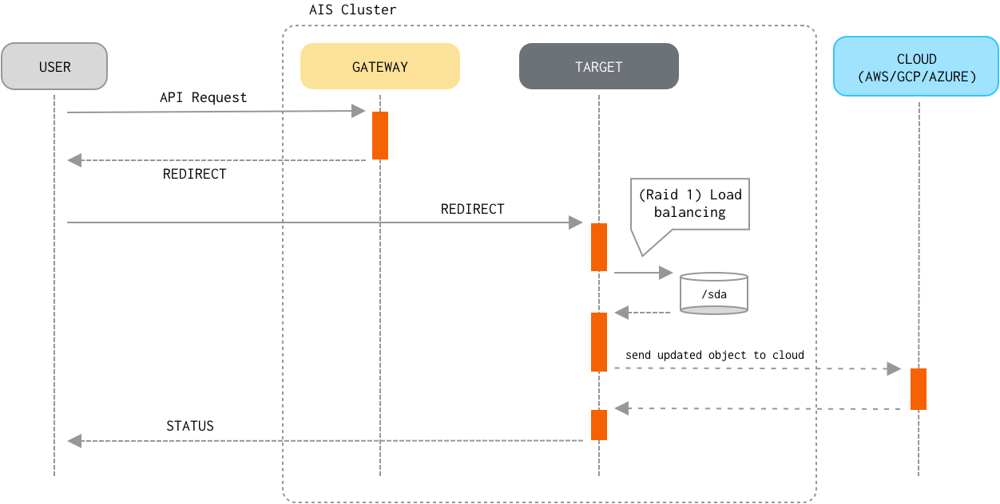

## Table of Contents
- [Read and Write Data Paths](#read-and-write-data-paths)
    - [`GET`](#get)
    - [`PUT`](#put)

## Read and Write Data Paths

`GET object` and `PUT object` are by far the most common operations performed by a AIStore cluster.
As far as I/O processing pipeline, the first few steps of the GET and, respectively, PUT processing are
very similar if not identical:

1. Client sends a `GET` or `PUT` request to any of the AIStore proxies/gateways.
2. The proxy determines which storage target to redirect the request to, the steps including:
    1. extract bucket and object names from the request;
    2. select storage target as an HRW function of the (cluster map, bucket, object) triplet,
       where HRW stands for [Highest Random Weight](https://en.wikipedia.org/wiki/Rendezvous_hashing);
       note that since HRW is a consistent hashing mechanism, the output of the computation will be
       (consistently) the same for the same `(bucket, object)` pair and cluster configuration.
    3. redirect the request to the selected target.
3. Target parses the bucket and object from the (redirected) request and determines whether the bucket
   is an ais bucket or a Cloud-based bucket.
4. Target then determines a `mountpath` (and therefore, a local filesystem) that will be used to perform
   the I/O operation. This time, the target computes HRW(configured mountpaths, bucket, object) on the
   input that, in addition to the same `(bucket, object)` pair includes all currently active/enabled mountpaths.
5. Once the highest-randomly-weighted `mountpath` is selected, the target then forms a fully-qualified name
   to perform the local read/write operation. For instance, given a `mountpath`  `/a/b/c`, the fully-qualified
   name may look as `/a/b/c/local/<bucket_name>/<object_name>` for an ais bucket,
   or `/a/b/c/cloud/<bucket_name>/<object_name>` for a Cloud bucket.

Beyond these 5 (five) common steps the similarity between `GET` and `PUT` request handling ends, and the remaining steps include:

### `GET`

5. If the object already exists locally (meaning, it belongs to an ais bucket or the most recent version of a Cloud-based object is cached
   and resides on a local disk), the target optionally validates the object's checksum and version.
   This type of `GET` is often referred to as a "warm `GET`".
6. Otherwise, the target performs a "cold `GET`" by downloading the newest version of the object from the next AIStore tier or from the Cloud.
7. Finally, the target delivers the object to the client via HTTP(S) response.

### `PUT`

5. If the object already exists locally and its checksum matches the checksum from the `PUT` request, processing stops because the object hasn't
   changed.
6. Target streams the object contents from an HTTP request to a temporary work file.
7. Upon receiving the last byte of the object, the target sends the new version of the object to the next AIStore tier or the Cloud.
8. The target then writes the object to the local disk replacing the old one if it exists.
9. Finally, the target writes extended attributes that include the versioning and checksum information, and thus commits the PUT transaction.

