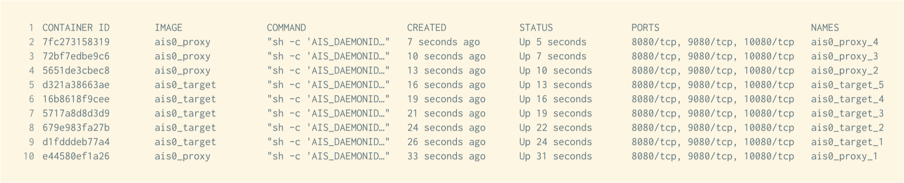
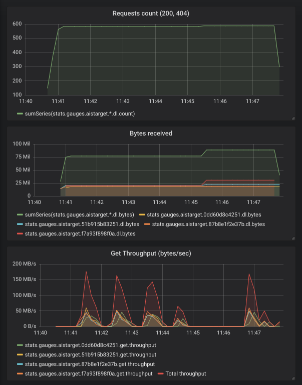

## Introduction

AIStore can be run as a cluster of Docker containers. There are two modes of operation: development and quick-start. They can be found in the [`deploy/dev/docker`](/deploy/dev/docker) directory.

### Development Mode
This mode is currently used for development purposes.
All docker containers mount the same host's AIStore source directory, and then execute from this single source. Upon restart (of the AIStore cluster), all changes made in the host will, therefore, take an immediate effect.

> The development mode is currently being maintained and updated.

### Quick Start Mode
Use this mode if you would like to set up a containerized, one-proxy, one-target deployment of AIStore within seconds. [See quick start AIS with Docker](/deploy/dev/docker/README.md#quick-start-ais-cluster). You just need Docker installed to quick-start AIS.

For an introduction to Docker, please watch [Docker 101 youtube](https://www.youtube.com/watch?v=V9IJj4MzZBc)

## Install Docker and Docker Compose
**Note:** Using Docker requires one of the following versions of Ubuntu:
* Bionic 18.04 (LTS)
* Xenial 16.04 (LTS)
* Trusty 14.04 (LTS)

1. Uninstall any old versions of docker:

```console
$ sudo apt-get remove docker docker-engine docker.io
```

It’s OK if apt-get reports that none of these packages are installed.

2. Update the apt package index:

```console
$ sudo apt-get update
```

3. Install packages to allow apt to use a repository over HTTPS:

```console
$ sudo apt-get install \
    apt-transport-https \
    ca-certificates \
    curl \
    software-properties-common
```

4. Install Docker

```console
$ sudo apt-get install docker-ce
```

**Note:** For version `16.04` and up, `docker-ce` is not in the default Ubuntu repository. See [this guide](https://docs.docker.com/v17.09/engine/installation/linux/docker-ce/ubuntu/#install-docker-ce-1) for `docker-ce` installation.

5. Verify that Docker CE is installed correctly by running the "hello-world" image.

```console
$ sudo docker run hello-world
```

6.  Add your current user to the Docker group (but only if you are not the root). After executing the command, restart your machine for it to take effect.

```console
$ sudo usermod -aG docker $(whoami)
```

7. Install Docker-Compose using python `pip`. Install `pip` if you don't have it:

```console
$ sudo apt-get install -y python-pip
$ sudo pip install docker-compose
```

8. Test the installation:

```console
$ docker-compose --version
docker-compose version 1.23.1, build 1719ceb
```

9. If you have any troubles with your installation, consider using the latest version of [Docker](https://docs.docker.com/install/) and [Docker-Compose](https://github.com/docker/compose/releases).

## Uninstall Docker and Docker Compose

1. To uninstall Docker, run the following:

```console
$ sudo apt-get purge docker-ce
$ sudo apt-get purge docker-ce-cli
```

2. Ensure docker is completely uninstalled by running the following command:

```console
$ dpkg -l | grep -i docker
```

There should be no docker-ce and docker-ce-cli packages listed.

3. To uninstall Docker-Compose, run the following:

```console
$ pip uninstall docker-compose
```

4. Images, containers, volumes, or customized configuration files on your host are not automatically removed. To delete all images, containers, and volumes:

```console
$ sudo rm -rf /var/lib/docker
```

## Starting AIStore

1. If you have already installed go and configured $GOPATH execute the below command to download AIStore source code and all its dependencies.

```console
$ go get -u -v github.com/NVIDIA/aistore/ais
```

2. Set up your AWS configuration by using the the [`aws configure`](https://docs.aws.amazon.com/cli/latest/userguide/cli-chap-getting-started.html) command.
To run AIStore Docker containers, you will need to pass your AWS config and credential directory via flag `-a=<aws directory>` CLI. By default, AWS stores config and credential files in `~/.aws/`
Example:

```console
$ ./deploy_docker.sh -a=~/.aws/
```

3. To deploy AIStore, refer to the deployment script in [`deploy/dev/docker`](/deploy/dev/docker/README.md).
Please note that if you are running the service for the first time, the image build process will take some time; subsequent runs will use the cached images and be much faster.

## Helpful docker commands

### List Running Containers

List all of the running containers using `docker ps`. Many commands require the CONTAINER ID or NAME fields. Example output:



### List All Containers

Lists all containers (not only the running ones).

```console
$ docker ps -a
```

### View Container Logs

To view docker logs, use `docker logs <container_name>`. Example:

```console
$ docker logs ais0_proxy_1
I 21:23:56.400794 metasync.go:142] Starting metasyncer
I 21:24:06.415473 stats.go:422] {"err.n":0,"get.n":0,"del.n":0,"get.ns":0,"kalive.ns":0,"err.get.n":0,"err.list.n":0,"pst.n":0,"ren.n":0,
"lst.ns":0,"uptime.ns":0,"kalive.ns.max":0,"err.delete.n":0,"err.post.n":0,"err.range.n":0,"err.head.n":0,"put.n":0,"lst.n":0,
"kalive.ns.min":0,"err.put.n":0}
I 21:24:08.386182 proxy.go:2236] joined target 1463af8ddcd3 (num targets 1)
I 21:24:11.759453 proxy.go:2236] joined target 3c86e5e71978 (num targets 2)
I 21:24:12.411714 earlystart.go:262] Reached the expected 2/2 target registrations
I 21:24:12.412098 earlystart.go:228] 0e76b56086eb: merged local Smap (2/1)
I 21:24:12.412244 metasync.go:290] dosync: smaptag, action=early-start-have-registrations, version=2
I 21:24:12.412772 metasync.go:290] dosync: bucketmdtag, action=early-start-have-registrations, version=1
I 21:24:13.425617 earlystart.go:307] 0e76b56086eb: merging discovered Smap v2 (2, 1)
...
```

Note:
* You can obtain the container name by running command `docker ps`
* The `deploy/dev/docker/` directory has a more comprehensive script named `logs.sh` to view logs

### SSH Into a Container

```console
$ docker exec -it CONTAINER_NAME /bin/bash
```

Note:
* In production mode, the logs are expected to be in `/var/log/ais/`.By default (development mode) the logs are under `tmp/ais/log`
* The `deploy/dev/docker/` directory has a script named `container_shell.sh` that does the same thing

### List Docker Images

```console
$ docker image ls
REPOSITORY          TAG                 IMAGE ID            CREATED             SIZE
ais1_proxy          latest              ced2cbd2ff2f        27 minutes ago      676MB
ais1_target         latest              ced2cbd2ff2f        27 minutes ago      676MB
ais0_proxy          latest              4c3fbcb54e4d        27 minutes ago      676MB
ais0_target         latest              4c3fbcb54e4d        27 minutes ago      676MB
```

### List Docker Networks
```console
$ docker network ls
NETWORK ID          NAME                    DRIVER              SCOPE
cb05b22edcb3        bridge                  bridge              local
86517bef938d        ais0_internal_control   bridge              local
51f49b56fe57        ais0_internal_data      bridge              local
2cee0651aa72        ais0_public             bridge              local
e11635deb15d        ais1_internal_control   bridge              local
9eefba13018f        ais1_internal_data      bridge              local
674fee80acac        ais1_public             bridge              local
```

### Start a Container

```console
$ docker start CONTAINER_NAME
```

### Stop a Container

```console
$ docker stop CONTAINER_NAME
```

### Restart a Container

```console
$ docker restart CONTAINER_NAME
```

### Kill a Container

```console
$ docker kill CONTAINER_NAME
```

### View Resource Usage Statistics for all Containers

```console
$ docker stats
```

### Remove Unused Images

```console
$ docker image prune -f
```

### Remove all Stopped Containers

```console
$ docker container prune -f
```

### Remove all Unused Networks

```console
$ docker network prune -f
```

### Stop all Running Containers

```console
$ docker stop $(docker ps -a -q)
```

### Delete all Existing Containers

```console
$ docker rm $(docker ps -a -q)
```

### Delete all Existing Images

```console
$ docker rmi $(docker images -q -a)
```

## Docker playground

Following is a super-simple presentation to showcase some of the AIS capabilities.

In [Docker playground](/deploy/dev/docker/playground), you can find the scripts to download different popular AI datasets (e.g., MNIST and ImageNet). The datasets are downloaded with the AIS-integrated [Downloader](/docs/downloader.md) that stores all downloaded objects directly into the AIStore.

During the download, you can monitor:

 * number of requests made
 * number of requests failed
 * number of bytes transferred

In the example below, AIS downloads a handful of ImageNet images and collects/visualizes the corresponding statistics:

```console
$ cd path_to/deploy/dev/docker
$ ./deploy_docker.sh -d=2 -p=2 -t=4 -c=1 -grafana -nocloud # start 2 proxies and 4 targets
$ ./playground/download_imagenet.sh # download some of ImageNet images into AIS and show stats
# once Downloader will save the files...
$ ./playground/stress_get.sh imagenet # do gets on saved files (requires jq command)
$ ./stop_docker.sh -l # stop docker
```


