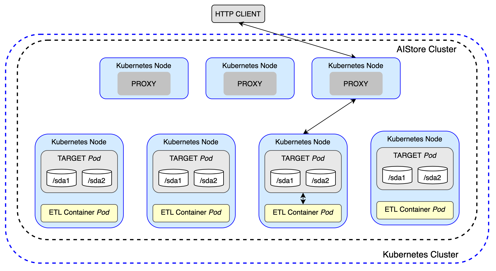
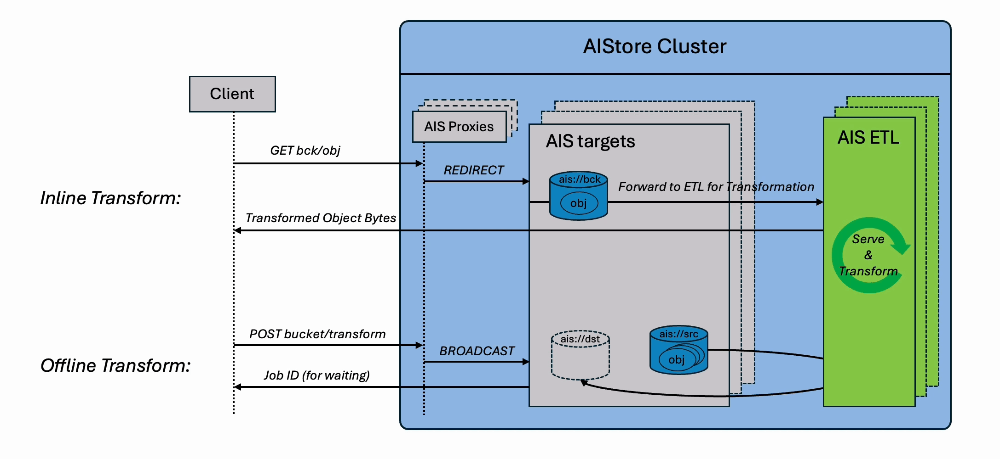
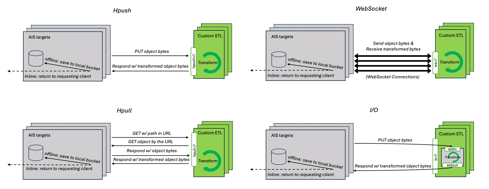

**ETL** — **Extract**, **Transform**, **Load** — is a core workflow in data pipelines:

- **Extract** data from various formats and sources
- **Transform** it into a unified format optimized for compute (e.g., deep learning)
- **Load** the result into a new destination

The AIStore ETL (**AIS ETL**) subsystem is designed from the ground up to execute all three stages of the ETL process *locally*. AIStore and any of its [supported backends](https://github.com/NVIDIA/aistore/blob/main/docs/images/supported-backends.png) can serve as both the source for extraction and the destination for loading. Unlike traditional ETL pipelines that extract data out of storage, transform it externally, and push it back, AIStore deploys custom transformation logic directly on the nodes that store the data. This drastically **reduces data movement**, **improves performance**, and **eliminates infrastructure overhead**.

## Overview

Most ETL workflows pull data out of object storage into client machines or dedicated servers for preprocessing, augmentation, or custom transformations. This model lacks scalability and often results in significant performance degradation due to unnecessary data movement. Unlike other open-source and cloud ETL tools, AIStore performs transformations on the same machines where your data lives, **minimizing redundant transfers** and exploiting **data locality**.

Based on a user-defined specification, each AIS target launches its own ETL container—a web server responsible for transforming data—co-located on the same node as the target. Each container is scoped to handle only the data stored on its respective target. This **data-local design** eliminates unnecessary network transfers (egress costs), improves performance, and enables seamless, horizontal scalability.

The following figure illustrates a cluster of 3 AIS proxies (gateways) and 4 storage targets, with each target running user-defined ETL in parallel:



It supports both **inline transformations** (real-time processing via GET requests) and **offline batch transformations** (bucket-to-bucket), delivering massive performance gains over traditional client-side ETL workflows.




> **Note:** AIStore ETL requires [Kubernetes](https://kubernetes.io).

## Table of Contents

* [Quick Start](#quick-start)
  * [Inline ETL Transformation](#inline-etl-transformation)
    * [ETL Args](#etl-args)
  * [Offline ETL Transformation](#offline-etl-transformation)
* [AIS ETL Webserver Framework](#ais-etl-webserver-framework)
* [Initializing an ETL](#initializing-an-etl)
  * [Using `init`](#using-init)
    * [Prerequisites](#prerequisites)
    * [Runtime Specification (Recommended)](#1-runtime-specification-recommended)
    * [Kubernetes Pod Spec (Advanced Use)](#2-kubernetes-pod-spec-advanced-use)
  * [Using `init_class` (Python SDK Only)](#using-init_class-python-sdk-only)
* [Configuration Options](#configuration-options)
  * [Communication Mechanisms](#communication-mechanisms)
  * [Direct Put Optimization](#direct-put-optimization)
  * [Timeouts](#timeouts)
  * [Resource Limits](#resource-limits)
* [ETL Pod Lifecycle](#etl-pod-lifecycle)
  * [Lifecycle Stages & Transitions](#lifecycle-stages--transitions)
* [Advanced Approach: Build a Container Image from Scratch](#advanced-approach-build-a-container-image-from-scratch)
  * [Specification YAML](#specification-yaml)
    * [Required or additional fields](#required-or-additional-fields)
    * [Forbidden fields](#forbidden-fields)
* [API Reference](#api-reference)
* [ETL Name Specifications](#etl-name-specifications)
* [References](#references)

## Quick Start

To begin using ETLs in AIStore, you'll need to deploy AIStore on a Kubernetes cluster. There are several ways to achieve this, each suited for different purposes:

1. **AIStore Development with Local Kubernetes**:
   - Folder: [deploy/dev/k8s](https://github.com/NVIDIA/aistore/tree/main/deploy/dev/k8s)
   - Intended for: AIStore development using local Kubernetes.
   - How to use: Run a local Kubernetes cluster and deploy an AIS cluster on it using the carefully documented steps available [here](https://github.com/NVIDIA/aistore/tree/main/deploy/dev/k8s).
   - Documentation: [README](https://github.com/NVIDIA/aistore/tree/main/deploy/dev/k8s)

2. **Production Deployment with Kubernetes**:
   - Folder: [deploy/prod/k8s](https://github.com/NVIDIA/aistore/tree/main/deploy/prod/k8s)
   - Intended for: Production use
   - How to use: Utilize the Dockerfiles in this folder to build AIS images for production deployment. For this purpose, there is a separate dedicated [repository](https://github.com/NVIDIA/ais-k8s) that contains corresponding tools, scripts, and documentation.
   - Documentation: [AIS/K8s Operator and Deployment Playbooks](https://github.com/NVIDIA/ais-k8s)

To verify that your deployment is correctly set up, execute the following [CLI](/docs/cli.md) command:

```console
$ ais etl show
```

If you receive an empty response without any errors, your AIStore cluster is now ready to run ETL tasks.

**Note**: Unlike most AIStore features that are available immediately via a single command, ETL requires an *initialization step* where the transformation logic is defined and plugged into the system.

### Inline ETL Transformation

ETL inline transform involves transforming datasets on the fly, where the data is read, transformed, and streamed directly to the requesting clients. You can think of inline transformation as a variant of [GET object](/docs/cli/object.md#get-object) operation, except the object content is passed through a user-defined transformation before being returned.

To follow this and subsequent examples, make sure you have the [AIS CLI](/docs/cli.md) installed on your system.

```bash
# Step 1: Create a source bucket
$ ais bucket create ais://src

# Step 2: Show any existing ETLs (optional)
$ ais etl show

# Step 3: Upload a sample object
$ echo "hello world" > text.txt
$ ais put text.txt ais://src

# Step 4: Initialize a sample ETL transformer (MD5 in this case)
$ ais etl init -f https://raw.githubusercontent.com/NVIDIA/ais-etl/refs/heads/main/transformers/md5/etl_spec.yaml

# Step 5: Confirm the ETL is running
$ ais etl show

# Step 6: Apply inline transformation to the object
$ ais etl object md5-transformer-etl ais://src/text.txt -
```

#### ETL Args

`ETL Args` is an optional feature supported **only in inline ETL operations** to pass additional parameters or metadata into your ETL transformation at runtime.

Think of `ETL Args` as a way to dynamically **customize how a specific object is transformed**, without needing to modify the ETL container or re-deploy the ETL. This feature is used to dynamically adjust transformation behavior—e.g., format, filters, parameters, or user-defined options.

**Sample Command with `--args`:**

```bash
$ ais etl object <etl-name> <source-object> <destination> --args="<your-args>"
```

### Offline ETL Transformation

Offline ETL generates a **new bucket** as the output, where each object is transformed and stored for future access. Think of this as an enhanced version of the [`Bucket Copy`](/docs/cli/bucket.md#copy-ais-bucket) operation—except every object is passed through a user-defined transformation during the copy.

Unlike inline ETL, which transforms data in real time on each request, offline ETL is ideal for bulk processing and long-term reuse.

This example walks through converting audio files (e.g., `.flac`, `.mp3`) to `.wav` using the [FFmpeg transformer](https://github.com/NVIDIA/ais-etl/blob/main/transformers/FFmpeg/README.md), with control over audio channels and sampling rate.

---

#### Example: Convert Audio Files to WAV

```bash
# Step 1: Download LibriSpeech ASR dataset (dev-clean subset)
$ wget -O libre-speech-dataset.tar https://www.openslr.org/resources/12/dev-clean.tar.gz --no-check-certificate

# Step 2: Extract the dataset
$ mkdir speech-dataset && tar -C speech-dataset -xvf libre-speech-dataset.tar >/dev/null

# Step 3: Inspect extracted files
$ cd speech-dataset/LibriSpeech/dev-clean
$ ls | head -5

# Step 4: Create a source bucket and upload the dataset
$ ais bucket create ais://libre-speech
$ ais put . ais://libre-speech -r -y

# Step 5: Verify uploaded objects
$ ais ls ais://libre-speech | head -5

# Step 6: Initialize FFmpeg ETL transformer
$ ais etl init -f https://raw.githubusercontent.com/NVIDIA/ais-etl/refs/heads/main/transformers/FFmpeg/etl_spec.yaml

# Step 7: Run offline transformation (convert .flac to .wav)
$ ais etl bucket ffmpeg-etl ais://libre-speech ais://libre-speech-transformed --ext="{flac:wav}"

# Step 8: Verify transformed objects in destination bucket
$ ais ls ais://libre-speech-transformed | head -5
```

### Single-Object Transformation

Single-object Transformation allows you to transform one object at a time between any two buckets. It's similar to a regular copy operation, but with an ETL transformation applied in-flight. This is ideal for quick, ad-hoc conversions where creating an entire new bucket isn’t necessary.

Compared to inline ETL (which returns the result directly to the client), this operation stores the transformed result back to a destination bucket for future use.

#### Example: Apply MD5 Transformation During Copy

```bash
# Step 1: Create source and destination buckets
$ ais bucket create ais://src
$ ais bucket create ais://dst

# Step 2: Upload a sample object to source
$ echo "hello world" > text.txt
$ ais put text.txt ais://src

# Step 3: Initialize the MD5 transformer
$ ais etl init -f https://raw.githubusercontent.com/NVIDIA/ais-etl/refs/heads/main/transformers/md5/etl_spec.yaml --name md5-etl

# Step 4: Transform and copy the object using ETL
$ ais etl object md5-etl cp ais://src/text.txt ais://dst/hashed.txt

# Step 5: Retrieve the transformed object
$ ais get ais://dst/hashed.txt
```

This approach is lightweight, flexible, and avoids the overhead of launching a full offline ETL job. It’s well-suited for transforming one or a few objects as part of a scripted workflow or user-driven action.


**Note**: there are two ways to run ETL initialization and transformation:
- [ETL CLI](/docs/cli/etl.md)
- [Python SDK](https://github.com/NVIDIA/aistore/blob/main/python/aistore/sdk/README.md#etls)


## AIS ETL Webserver Framework

**AIS ETL** is language- and framework-agnostic. You can deploy any custom web server as your transformation container. However, implementing a production-ready ETL service involves more than just defining a transformation function. Your server must also:

* Perform health checks
* [Communicate](#communication-mechanisms) with AIStore targets
* Parse [`etl args`](#etl-args) (runtime parameters for transformation behavior)
* Support [`direct put`](#direct-put-optimization) optimization
* Handle HTTP/WebSocket protocols with concurrency control

Design choices typically depend on your workload—object size, volume, throughput needs, and whether your service is synchronous or async.

To streamline this, we offer a prebuilt **AIS ETL Webserver Framework** in:

* [Go](https://github.com/NVIDIA/aistore/tree/main/ext/etl/webserver#readme)
* [Python](https://github.com/NVIDIA/aistore/blob/main/python/aistore/sdk/etl/webserver/README.md)

These SDKs abstract the boilerplate and protocol handling, so you can focus purely on your transformation logic. The Python framework is fully integrated with the [AIStore Python SDK](https://github.com/NVIDIA/aistore/tree/main/python/aistore/sdk), allowing you to deploy ETLs directly from code without building a new container.

## Initializing an ETL

ETL initialization in AIStore defines how your transformation logic is deployed, configured, and executed. This step launches a containerized ETL service that integrates with AIStore targets to handle object transformations.

There are two primary ways to initialize an ETL using the `init` API—via a **runtime spec** or a **Kubernetes pod spec**. Additionally, for Python-only ETLs, a separate `init_class` approach is available through the Python SDK.

---

### Using `init`

The `init` API is available through both the **AIS CLI** and the **Python SDK**. It requires a pre-built container image that runs an ETL web server to process incoming data.

#### Prerequisites

You must have a container image prepared before using `init`. This image must run an ETL web server responsible for:
* Health checks
* Receiving and transforming data
* Communicating with AIStore targets

You can build this server using the [AIS ETL Webserver Framework](#ais-etl-webserver-framework) or create your own. For reference, see the [sample transformers](https://github.com/NVIDIA/ais-etl/tree/main/transformers).

---

#### 1. Runtime Specification (Recommended)

The preferred method of initialization is through a runtime YAML spec, which defines the ETL's configuration, including [communication method](#communication-mechanisms), [timeouts](#timeouts), [support for direct writes](#direct-put-optimization), and [resource limit](#resource-limits).

Example `etl_spec.yaml`:

```yaml
name: hello-world-etl

runtime:
  image: aistorage/transformer_hello_world:latest
  # Optional: override container entrypoint
  # command: ["uvicorn", "fastapi_server:fastapi_app", "--host", "0.0.0.0", "--port", "8000"]
# --Optional Values--
communication: hpush://      # Options: hpush:// (default), hpull://, ws://
argument: fqn                # "" (default) or "fqn" to mount host volumes
init_timeout: 5m             # Max time to initialize ETL container (default: 5m)
obj_timeout: 45s             # Max time to process a single object (default: 45s)
support_direct_put: true     # Enable zero-copy bucket-to-bucket optimization (default: false)
resources:
  requests:
    memory: "256Mi"          # Minimum memory guaranteed for scheduling
    cpu: "500m"              # Minimum CPU guaranteed (0.5 CPU cores)
  limits:
    memory: "512Mi"          # Maximum memory before container gets killed
    cpu: "1"                 # Maximum CPU usage (1 CPU core)
```

Initialize the ETL:

```bash
ais etl init --spec etl_spec.yaml
```

---

#### 2. Kubernetes Pod Spec (Advanced Use)

For advanced use cases, you can provide a full Kubernetes Pod specification. This method is useful if you need fine-grained control over pod behavior, health checks, init containers, or you’re not using the AIS ETL framework.

```bash
curl -O https://raw.githubusercontent.com/NVIDIA/ais-etl/refs/heads/main/transformers/hello_world/pod.yaml
# Review and edit the pod.yaml as needed
ais etl init -f pod.yaml --name hello-world-etl
```

This method is backward-compatible with old AIS ETL transformers and gives full control over deployment configuration.

---

### Using `init_class` (Python SDK Only)

`init_class` is a simplified method to initialize pure Python-based ETLs—no need for container images. It is only available through the Python SDK and is supported on Python 3.9 through 3.13.

This approach is ideal when:

* You want to deploy transformations quickly without containerization
* Your ETL logic depends only on Python and PyPI packages

Example:

```python
etl_upper_case = client.etl("etl-upper-case")

@etl_upper_case.init_class()
class UpperCaseETL(FastAPIServer):
    def transform(self, data, *_args):
        return data.upper()
```

Testing the ETL:

```python
bucket = client.bucket("etl-examples").create(exist_ok=True)
obj = bucket.object("test.txt")
obj.get_writer().put_content(b"Hello ais-etl!")

print(obj.get_reader().read_all())
# Output: b'Hello ais etl!'

from aistore.sdk.etl import ETLConfig
print(obj.get_reader(etl=ETLConfig(etl_upper_case.name)).read_all())
# Output: b'HELLO AIS ETL!'
```


## Configuration Options

When initializing an ETL using the `init` API (via runtime spec or full Pod spec), several configuration parameters can be set to optimize behavior and performance. These options control how data is passed between AIStore targets and ETL containers, how responses are handled, and how the system reacts to delays or failures. Understanding and tuning these options allows users to better match ETL behavior to their specific workloads.

All the following options can be included in your ETL spec (YAML) during initialization.

### Communication Mechanisms

AIS currently supports three distinct target-to-container communication mechanisms to facilitate inline or offline transformation.



Users can choose and specify any of the following:

| Name | Value | Description |
|---|---|---|
| **HTTP Push** | `hpush://` | A target issues a PUT request to its ETL container with the body containing the requested object. After finishing the request, the target forwards the response from the ETL container to the user. |
| **HTTP Redirect** | `hpull://` | A target uses [HTTP redirect](https://developer.mozilla.org/en-US/docs/Web/HTTP/Redirections) to send a (GET) request to cluster using an ETL container. ETL container should make a GET request to the target, transform bytes, and return it to a user. |
| **WebSocket** | `ws://` | A target uses [WebSocket](https://developer.mozilla.org/en-US/docs/Web/API/WebSocket) to send the requested object to its ETL container as individual messages. |

> ETL container will have `AIS_TARGET_URL` environment variable set to the URL of its corresponding target.
> To make a request for a given object it is required to add `<bucket-name>/<object-name>` to `AIS_TARGET_URL`, eg. `requests.get(env("AIS_TARGET_URL") + "/" + bucket_name + "/" + object_name)`.

### Direct Put Optimization

> _Applicable only to bucket-to-bucket offline transformations._

In bucket-to-bucket offline transformations, the destination target for a transformed object may differ from the original target. By default, the ETL container sends the transformed data back to the original target, which then forwards it to the destination. The **direct put** optimization streamlines this flow by allowing the ETL container to send the transformed object directly to the destination target. Our stress tests across multiple transformation types consistently show a 3 - 5x performance improvement with direct put enabled.

> The ETL container will have the `DIRECT_PUT` environment variable set to `"true"` or `"false"` accordingly.

The destination address is provided based on the communication mechanism in use:

| Communication Mechanism | Execution Steps |
|-------------------------|-----------------|
| **HTTP Push/Redirect** | For each HTTP request, the destination target's address is provided in the `ais-node-url` header. The ETL container should perform an additional `PUT` request to that address with the transformed object as the payload. |
| **WebSocket** | Since WebSocket preserves message order and boundaries, the ETL container receives two consecutive messages: (1) a control message in JSON format containing the destination address, FQN, and associated ETL argument, and (2) a binary message with the object content. The container should process them in order and issue a `PUT` request to the destination with the transformed object. |

### Timeouts

ETL initialization supports two configurable timeout settings to ensure robust and predictable behavior during container startup and object transformation.

#### Initialization Timeout (`init_timeout`)

Specifies the maximum time allowed for the ETL container to start and become ready.
**Default:** `5m` (5 minutes)
If the container fails to initialize within this period, the ETL setup will be aborted.

#### Object Processing Timeout (`obj_timeout`)

Defines the maximum time permitted to transform a single object.
**Default:** `45s` (45 seconds)
If a transformation exceeds this duration, the operation will be terminated and logged as a failure.

### Resource Limits

ETL containers support standard Kubernetes resource limits to control CPU and memory consumption. Setting appropriate resource limits ensures predictable performance and prevents ETL containers from overwhelming cluster nodes, especially during intensive transformation workloads.

**Resource Configuration:**

Resource limits can be specified in your ETL spec using the standard Kubernetes `resources` field:

```yaml
name: my-etl-transformer

runtime:
  image: aistorage/my_transformer:latest

resources:
  requests:
    memory: "256Mi"    # Minimum memory guaranteed for scheduling
    cpu: "500m"        # Minimum CPU guaranteed (0.5 CPU cores)
  limits:
    memory: "512Mi"    # Maximum memory before container gets killed
    cpu: "1"           # Maximum CPU usage (1 CPU core)
```

| Resource Type | Description |
|---------------|-------------|
| **`requests`** | Minimum guaranteed resources allocated to the container. Used by the Kubernetes scheduler for pod placement. |
| **`limits`** | Maximum resources the container can consume. ETL container will be throttled (CPU) or aborted (memory) if these limits are exceeded. |

**Usage Notes:**

- `memory.requests` sets the minimum memory needed for ETL container scheduling
- `memory.limits` prevents containers from using excessive memory during heavy transformations  
- `cpu.requests` guarantees CPU allocation for consistent transformation performance
- `cpu.limits` controls maximum CPU usage to avoid impacting other containers

If no resource limits are specified, ETL containers can use all available memory and CPU on the node, unless the cluster has other restrictions in place.

## ETL Pod Lifecycle

ETL follows a structured lifecycle to enhance observability. The lifecycle consists of three stages: `Initializing`, `Running`, and `Aborted`. This design prevents ETL from consuming resources when not in use while maintaining visibility into failures.

### Lifecycle Stages & Transitions

```sh
+--------------+     Success      +---------+
| Initializing |  ------------->  | Running |
+--------------+                  +---------+
       | ^                             |
 Error | | User Restarts               |
       v |                             |
+--------------+      Runtime Error    |
|   Aborted    |  <--------------------+
+--------------+       User Stops
        |
        | User Deletes
        v
    (Removed)
```

#### 1. `Initializing` Stage
The ETL enters this stage when created via an [Init](#api-reference) requests. The system provisions the required Kubernetes resources, including pods and services.
- **Success**: Transitions to `Running` stage.
- **Failure (Pod Initialization Error/Timeout)**: Transitions to `Aborted` stage.
#### 2. `Running` Stage
The ETL is actively processing requests and remains in this stage unless Aborted manually or due to an error.
- **User Sends [Stop ETL](#api-reference)**: Transitions to `Aborted` stage with error message `user abort`.
- **Runtime Error**: Transitions to `Aborted` stage.
#### 3. `Aborted` Stage
The ETL is inactive but retains metadata, allowing for future restarts. Upon entering the Aborted state, AIStore automatically cleans up all associated Kubernetes resources (pods, services) across all targets.
- **User Sends [Restart ETL](#api-reference)**: Transitions to `Initializing` stage.
- **User Sends [Delete ETL](#api-reference)**: Permanently removes the ETL instance and its metadata from AIStore.

## Advanced Approach: Build a Container Image from Scratch

To initialize an ETL using the `init` API, you must provide a container image that runs your transformation logic. The easiest and most maintainable path is to **extend an existing [AIS ETL Web Server](#ais-etl-webserver-framework)**. These prebuilt server frameworks handle the core logic—such as health checks, protocol handling, and request routing—so you can focus solely on the transformation function.

However, if you need full control, you can also **build your own ETL web server from scratch**. For reference, we provide minimal yet functional implementations in both Python and Go:

* [Python Web Server Framework (Source)](https://github.com/NVIDIA/aistore/tree/main/python/aistore/sdk/etl/webserver)
* [Quickstart Guide and Examples](https://github.com/NVIDIA/aistore/tree/main/python/aistore/sdk/etl/webserver#quickstart)

The quickstart guide walks through:

* Implementing a custom transformation class
* Containerizing your ETL server
* Deploying it in a Kubernetes environment
* Initializing the ETL via the AIS CLI or Python SDK

### Specification YAML

Specification of an ETL should be in the form of a YAML file.
It is required to follow the Kubernetes [Pod template format](https://kubernetes.io/docs/concepts/workloads/pods/#pod-templates)
and contain all necessary fields to start the Pod.

#### Required or additional fields

| Path | Required | Description | Default |
| --- | --- | --- | --- |
| `metadata.annotations.communication_type` | `false` | [Communication type](#communication-mechanisms) of an ETL. | `hpush://` |
| `metadata.annotations.wait_timeout` | `false` | Timeout on ETL Pods starting on target machines. See [annotations](#annotations) | infinity |
| `metadata.annotations.support_direct_put` | `false` | Enable [direct put](#direct-put-optimization) optimization of an ETL. | - |
| `spec.containers` | `true` | Containers running inside a Pod, exactly one required. | - |
| `spec.containers[0].image` | `true` | Docker image of ETL container. | - |
| `spec.containers[0].ports` | `true` (except `io://` communication type) | Ports exposed by a container, at least one expected. | - |
| `spec.containers[0].ports[0].Name` | `true` | Name of the first Pod should be `default`. | - |
| `spec.containers[0].ports[0].containerPort` | `true` | Port which a cluster will contact containers on. | - |
| `spec.containers[0].readinessProbe` | `true` (except `io://` communication type) | ReadinessProbe of a container. | - |
| `spec.containers[0].readinessProbe.timeoutSeconds` | `false` | Timeout for a readiness probe in seconds. | `5` |
| `spec.containers[0].readinessProbe.periodSeconds` | `false` | Period between readiness probe requests in seconds. | `10` |
| `spec.containers[0].readinessProbe.httpGet.Path` | `true` | Path for HTTP readiness probes. | - |
| `spec.containers[0].readinessProbe.httpGet.Port` | `true` | Port for HTTP readiness probes. Required `default`. | - |

#### Forbidden fields

| Path | Reason |
| --- | --- |
| `spec.affinity.nodeAffinity` | Used by AIStore to colocate ETL containers with targets. |


## API Reference

This section describes how to interact with ETLs via RESTful API.

> `G` - denotes a (`hostname:port`) address of a **gateway** (any gateway in a given AIS cluster)

| Operation | Description | HTTP action | Example |
| --- | --- | --- | --- |
| Init spec ETL | Initializes ETL based on POD `spec` template. Returns `ETL_NAME`. | PUT /v1/etl | `curl -X PUT 'http://G/v1/etl' '{"spec": "...", "id": "..."}'` |
| List ETLs | Lists all running ETLs. | GET /v1/etl | `curl -L -X GET 'http://G/v1/etl'` |
| View ETLs | View code/spec of ETL by `ETL_NAME` | GET /v1/etl/ETL_NAME | `curl -L -X GET 'http://G/v1/etl/ETL_NAME'` |
| Transform an object | Transforms an object based on ETL with `ETL_NAME`. | GET /v1/objects/<bucket>/<objname>?etl_name=ETL_NAME | `curl -L -X GET 'http://G/v1/objects/shards/shard01.tar?etl_name=ETL_NAME' -o transformed_shard01.tar` |
| Transform bucket | Transforms all objects in a bucket and puts them to destination bucket. | POST {"action": "etl-bck"} /v1/buckets/SRC_BUCKET | `curl -i -X POST -H 'Content-Type: application/json' -d '{"action": "etl-bck", "name": "to-name", "value":{"id": "ETL_NAME", "ext":{"SRC_EXT": "DEST_EXT"}, "prefix":"PREFIX_FILTER", "prepend":"PREPEND_NAME"}}' 'http://G/v1/buckets/SRC_BUCKET?bck_to=PROVIDER%2FNAMESPACE%2FDEST_BUCKET%2F'` |
| Transform and synchronize bucket | Synchronize destination bucket with its remote (e.g., Cloud or remote AIS) source. | POST {"action": "etl-bck"} /v1/buckets/SRC_BUCKET | `curl -i -X POST -H 'Content-Type: application/json' -d '{"action": "etl-bck", "name": "to-name", "value":{"id": "ETL_NAME", "synchronize": true}}' 'http://G/v1/buckets/SRC_BUCKET?bck_to=PROVIDER%2FNAMESPACE%2FDEST_BUCKET%2F'` |
| Dry run transform bucket | Accumulates in xaction stats how many objects and bytes would be created, without actually doing it. | POST {"action": "etl-bck"} /v1/buckets/SRC_BUCKET | `curl -i -X POST -H 'Content-Type: application/json' -d '{"action": "etl-bck", "name": "to-name", "value":{"id": "ETL_NAME", "dry_run": true}}' 'http://G/v1/buckets/SRC_BUCKET?bck_to=PROVIDER%2FNAMESPACE%2FDEST_BUCKET%2F'` |
| Stop ETL | Stops ETL with given `ETL_NAME`. | POST /v1/etl/ETL_NAME/stop | `curl -X POST 'http://G/v1/etl/ETL_NAME/stop'` |
| Restart ETL | Restarts ETL with given `ETL_NAME`. | POST /v1/etl/ETL_NAME/start | `curl -X POST 'http://G/v1/etl/ETL_NAME/start'` |
| Delete ETL | Delete ETL spec/code with given `ETL_NAME` | DELETE /v1/etl/ETL_NAME | `curl -X DELETE 'http://G/v1/etl/ETL_NAME'` |


## ETL name specifications

Every initialized ETL has a unique user-defined `ETL_NAME` associated with it, used for running transforms/computation on data or stopping the ETL.

```yaml
apiVersion: v1
kind: Pod
metadata:
  name: compute-md5
(...)
```

When initializing ETL from spec/code, a valid and unique user-defined `ETL_NAME` should be assigned using the `--name` CLI parameter as shown below.

```console
$ ais etl init --name=etl-md5 --spec=spec.yaml --comm-type hpull
```

Below are specifications for a valid `ETL_NAME`:
1. Must start and end with a lowercase alphabet ('a' to 'z') or a number ('1' to '9').
2. Can contain lowercase alphabets, numbers, or hyphen ('-').
3. Should have a length greater than 5 and less than 33.
4. Shouldn't contain special characters except for hyphen (no capitals or underscore).

## References

* For technical blogs with in-depth background and working real-life examples, see:
  - [ETL: Introduction](https://aistore.nvidia.com/blog/2021/10/21/ais-etl-1)
  - [AIStore SDK & ETL: Transform an image dataset with AIS SDK and load into PyTorch](https://aistore.nvidia.com/blog/2023/04/03/transform-images-with-python-sdk)
  - [Single-Object Copy/Transformation Capability](https://aistore.nvidia.com/blog/2025/07/25/single-object-copy-transformation-capability)
  - [ETL: Using WebDataset to train on a sharded dataset ](https://aistore.nvidia.com/blog/2021/10/29/ais-etl-3)
* For step-by-step tutorials, see:
  - [Compute the MD5 of the object](/docs/tutorials/etl/compute_md5.md)
* For a quick CLI introduction and reference, see [ETL CLI](/docs/cli/etl.md)
* For initializing ETLs with AIStore Python SDK, see:
  - [Python SDK ETL Usage Docs](https://github.com/NVIDIA/aistore/blob/main/python/aistore/sdk/README.md#etls)
  - [Python SDK ETL Examples](https://github.com/NVIDIA/aistore/tree/main/python/examples/ais-etl)
