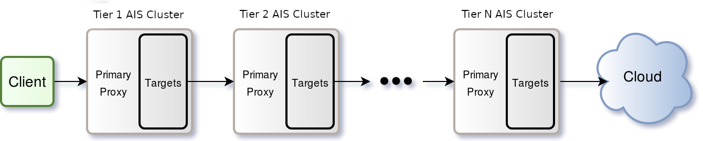
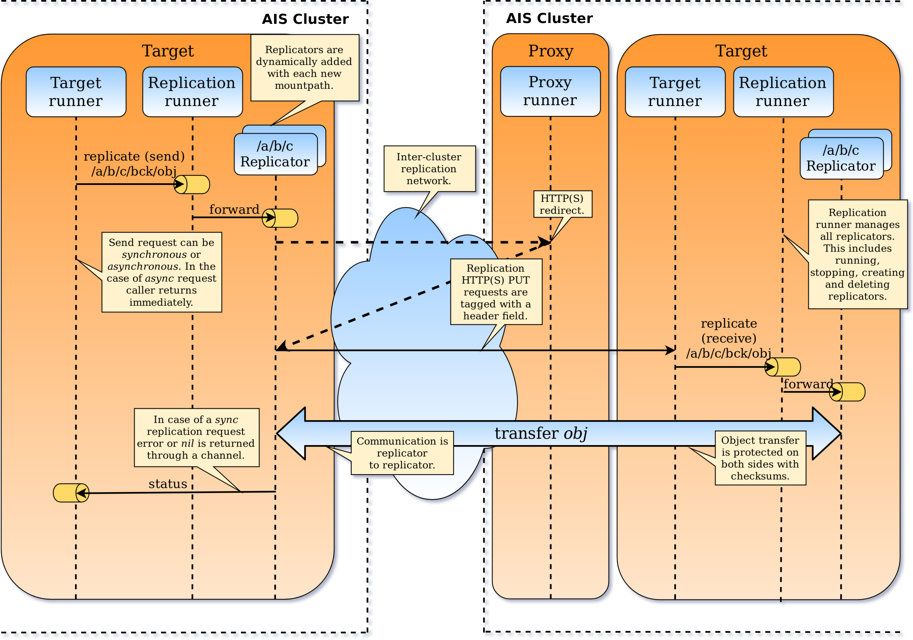

## Table of Contents
- [Experimental](#experimental)
	- [WebDAV](#webdav)
	- [Multi-tiering](#multi-tiering)
	- [Inter-cluster replication](#inter-cluster-replication)
	- [Authentication](#authentication)

## Experimental

There are features, capabilities and modules that we designate as _experimental_ - not ready yet for deployment and usage. Some of those might be eventually removed from the product, others - completed and stabilized. This section contains a partial list.

### WebDAV

WebDAV aka "Web Distributed Authoring and Versioning" is the IETF standard that defines HTTP extension for collaborative file management and editing. AIStore WebDAV server is a reverse proxy (with interoperable WebDAV on the front and AIStore's RESTful interface on the back) that can be used with any of the popular [WebDAV-compliant clients](https://en.wikipedia.org/wiki/Comparison_of_WebDAV_software).

For information on how to run it and details, please refer to the [WebDAV README](../webdav/README.md).

### Multi-tiering

AIStore can be deployed with multiple consecutive AIStore clusters aka "tiers" sitting behind a primary tier. This provides the option to use a multi-level cache architecture.



Tiering is configured at the bucket level by setting bucket properties, for example:

```shell
$ curl -i -X PUT -H 'Content-Type: application/json' -d '{"action":"setprops", "value": {"next_tier_url": "http://localhost:8082", "read_policy": "cloud", "write_policy": "next_tier"}}' 'http://localhost:8080/v1/buckets/<bucket-name>'
```

The following fields are used to configure multi-tiering:

* `next_tier_url`: an absolute URI corresponding to the primary proxy of the next tier configured for the bucket specified
* `read_policy`: `"next_tier"` or `"cloud"` (defaults to `"next_tier"` if not set)
* `write_policy`: `"next_tier"` or `"cloud"` (defaults to `"cloud"` if not set)

For the `"next_tier"` policy, a tier will read or write to the next tier specified by the `next_tier_url` field. On failure, it will read or write to the cloud (aka AWS or GCP).

For the `"cloud"` policy, a tier will read or write to the cloud (aka AWS or GCP) directly from that tier.

Currently, the endpoints which support multi-tier policies are the following:

* GET /v1/objects/bucket-name/object-name
* PUT /v1/objects/bucket-name/object-name

### Inter-cluster replication

Object replication (service) sends and receives objects via HTTP(S). Each replicating worker (aka _replicator_) is associated with a single configured local filesystem and is tasked with queuing and subsequent FIFO processing of *replication requests*. To isolate the, potentially, massive replication traffic from all other intra- and inter-cluster workloads, the service can be configured to utilize a separate network. Replication transfers themselves are end-to-end protected by checksums.

The picture below illustrates some of the aspects of replication service as far as its design and data flows.



**Note:** The service is currently in its prototype stage and is not yet available.


### Authentication

Please see [AuthN documentation](../authn/README.md).
