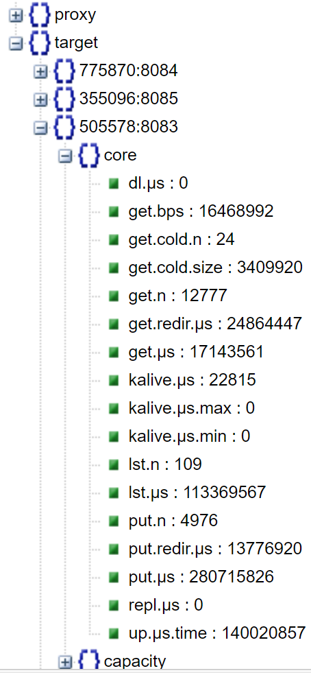

## Table of Contents

- [Notation](#notation)
- [Overview](#overview)
- [Easy URL](#easy-url)
- [API Reference](#api-reference)
  - [Cluster Operations](#cluster-operations)
  - [Node Operations](#node-operations)
  - [Mountpaths and Disks](#mountpaths-and-disks)
  - [Bucket and Object Operations](#bucket-and-object-operations)
  - [Footnotes](#footnotes)
  - [Storage Services](#storage-services)
  - [Multi-Object Operations](#multi-object-operations)
  - [Working with archives (TAR, TGZ, ZIP, MessagePack)](#working-with-archives-tar-tgz-zip-messagepack)
  - [Starting, stopping, and querying batch operations (jobs)](#starting-stopping-and-querying-batch-operations-jobs)
- [Backend Provider](#backend-provider)
- [Curl Examples](#curl-examples)
- [Querying information](#querying-information)
- [Example: querying runtime statistics](#example-querying-runtime-statistics)
- [ETL](#etl)

## Notation

In this README:

> `G` - denotes a (hostname:port) address of a **gateway** (any gateway in a given AIS cluster)

> `T` - (hostname:port) of a storage **target**

> `G-or-T` - (hostname:port) of **any node** member of the cluster

## Overview

AIStore supports a growing number and variety of RESTful operations. To illustrate common conventions, let's take a look at the example:

```console
$ curl -X GET http://G-or-T/v1/daemon?what=config
```

This command queries one of the AIS nodes (denoted as `G-or-T`) for its configuration. The query - as well as most of other control plane queries - results in a JSON-formatted output that can be viewed with any compatible JSON viewer.

Notice the 6 (six) elements that usually accompany any RESTful operation:

1. Command line **option** or flag.

In particular, note the '-X` (or `--request`) and `-L` (`--location`) options that `curl` supports. Those are important.

Run `curl --help` for help.

2. **HTTP verb** aka method, one of: `PUT`, `GET`, `HEAD`, `POST`, `DELETE`, or `PATCH`.

In the example, it's a GET but it can also be POST, PUT, and DELETE. For a brief summary of the standard HTTP verbs and their CRUD semantics, see, for instance, this [REST API tutorial](http://www.restapitutorial.com/lessons/httpmethods.html).

3. **Hostname** (or IPv4 address) and TCP port of one of the AIStore daemons.

Most RESTful operations performed on an AIStore proxy/gateway will likely have a *clustered* scope. Exceptions may include querying proxy's own configuration via `?what=config`, and more.

4. **URL path**: version of the REST API, RESTful *resource* that is operated upon, and possibly more forward-slash delimited specifiers.

For example: /v1/cluster where `v1` is the currently supported API version and `cluster` is the (RESTful) resource. Other *resources* include (but are **not** limited to):

| RESTful resource | Description |
| --- | ---|
| `cluster` | cluster-wide control-plane operation |
| `daemon` (aka **node**) | control-plane request to update or query specific AIS daemon (proxy or target). In the documentation, the terms "daemon" and "node" are used interchangeably. |
| `buckets` | create, destroy, rename, copy, transform (entire) buckets; list objects in a given bucket; get bucket names for a given provider (or all providers); get bucket properties |
| `objects` | datapath request to GET, PUT and DELETE objects, read their properties |
| `download` | download external datasets and/or selected files from remote buckets, HDFS, or even specific HTTP locations |
| `sort` | user-defined distributed shuffle |

and more.

For the most recently updated **URL paths**, please see:

* [`api/apc/urlpaths.go`](https://github.com/NVIDIA/aistore/blob/main/api/apc/urlpaths.go)

5. **URL query**, e. g., `?what=config`.

In particular, all API requests that operate on a bucket carry the bucket's specification details in the URL's query. Those details may include [backend provider](/docs/providers.md) and [namespace](/docs/providers.md#unified-global-namespace) where an empty backend provider indicates an AIS bucket (with AIStore being, effectively, the default provider) while an empty namespace parameter translates as a global (default) namespace. For exact names of the bucket-specifying URL Query parameters, please refer to this [API source](/api/bucket.go).

> Combined, all these elements tell the following story. They specify the most generic action (e.g., GET) and designate the target aka "resource" of this action: e. g., an entire cluster or a given AIS node. Further, they may also include context-specific and query string encoded control message to, for instance, distinguish between getting system statistics (`?what=stats`) versus system configuration (`?what=config`).

> For developers and first-time users: if you deployed AIS locally having followed [these instructions](/README.md#local-non-containerized) then most likely you will have `http://localhost:8080` as the primary proxy, and generally, `http://localhost:808x` for all locally-deployed AIS daemons.

> The reference below is "formulated" in `curl` - i.e., using `curl` command lines. It is possible, however, and often much easier (and, therefore, **preferable**), to execute the same operations using [AIS CLI](/docs/cli.md).

6. And finally, **HTTP request and response headers**

All supported query parameters and all HTTP headers are enumerated and commented in the following two sources, respectively:

* [REST API Query parameters](https://github.com/NVIDIA/aistore/blob/main/api/apc/query.go)
* [REST API Headers](https://github.com/NVIDIA/aistore/blob/main/api/apc/headers.go)

## Easy URL

"Easy URL" is a simple alternative mapping of the AIS API to handle URLs paths that look as follows:

* **GET http(s)://host:port/provider/[bucket[/object]]**
* **PUT http(s)://host:port/provider/[bucket[/object]]**,

The capability enables (convenient) usage of your Internet Browser (or `curl`, etc. tools). In other words, you can use simple intuitive URLs to execute:

1. GET(object)
2. PUT(object)
3. list-objects(bucket)
4. list-buckets

**NOTE**: rest of this section provides a short summary; please see [easy URL readme](/docs/easy_url.md) for background, details, and extended comments.

In other words, the supported URL paths include:

| URL | Comment |
|--- | --- |
| `/gs/mybucket/myobject` | read, write, delete, and list objects in Google Cloud buckets |
| `/az/mybucket/myobject` | same, for Azure Blob Storage buckets |
| `/ais/mybucket/myobject` | AIS buckets |

```console
# Example: GET
$ curl -s -L -X GET 'http://aistore/gs/my-google-bucket/abc-train-0001.tar -o abc-train-0001.tar'

  # Using conventional AIS RESTful API, the same exact GET operation will look as follows:
  $ curl -s -L -X GET 'http://aistore/v1/objects/my-google-bucket/abc-train-0001.tar?provider=gs -o abc-train-0001.tar'

# Example: PUT
$ curl -s -L -X PUT 'http://aistore/gs/my-google-bucket/abc-train-9999.tar -T /tmp/9999.tar'

  # For comparison, the same without using "easy URL":
  $ curl -s -L -X PUT 'http://aistore/v1/objects/my-google-bucket/abc-train-9999.tar?provider=gs -T /tmp/9999.tar'

# Example: LIST (i.e., `list-objects`)
$ curl -s -L -X GET 'http://aistore/gs/my-google-bucket' | jq
```

> AIS provides S3 compatibility layer via its "/s3" endpoint. [S3 compatibility](/docs/s3compat.md) shall not be confused with "easy URL" mapping, whereby a path (e.g.) "gs/mybucket/myobject" gets replaced with "v1/objects/mybucket/myobject?provider=gcp" with _no_ other changes to the request and response parameters and components.

> For detals and additional usage examples, please see [easy URL readme](/docs/easy_url.md).

## API Reference

The entire AIStore RESTful API is substantial in size. It is also constantly growing, which is why this section is structured as several groups of related APIs.

In addition, the rightmost column references AIS [api](https://github.com/NVIDIA/aistore/tree/main/api) package and the specific Go-based API in it that performs the same **operation**. Needless to say - simply because we use it ourselves across a variety of Go-based clients and apps, the [api](https://github.com/NVIDIA/aistore/tree/main/api) package will always contain the most recently updated version of the API.

In other words, AIS [api](https://github.com/NVIDIA/aistore/tree/main/api) is always current and can be used to lookup the most recently updated version of the RESTful API.

### Cluster Operations

This and the next section reference a variety of URL paths (e.g., `/v1/cluster`). For the most recently updated list of all URLs, see:

* [`api/apc/urlpaths.go`](https://github.com/NVIDIA/aistore/blob/main/api/apc/urlpaths.go)

| Operation | HTTP action | Example | Go API |
|--- | --- | ---|--- |
| Add a node to cluster | POST /v1/cluster/join-by-admin | (to be added) | `api.JoinCluster` |
| Put node in maintenance (that is, safely and temporarily remove the node from the cluster _upon rebalancing_ the node's data between remaining nodes) | (to be added) | (to be added) | `api.StartMaintenance` |
| Take node out of maintenance | (to be added) | (to be added) | `api.StopMaintenance` |
| Decommission a node | (to be added) | (to be added) | `api.Decommission` |
| Decommission entire cluster | PUT {"action": "decommission"} /v1/cluster | `curl -i -X PUT -H 'Content-Type: application/json' -d '{"action": "decommission"}' 'http://G-primary/v1/cluster'` | `api.DecommissionCluster` |
| Shutdown ais node | PUT {"action": "shutdown-node", "value": {"sid": daemonID}} /v1/cluster | `curl -i -X PUT -H 'Content-Type: application/json' -d '{"action": "shutdown-node", "value": {"sid": "43888:8083"}}' 'http://G/v1/cluster'` | `api.ShutdownNode` |
| Decommission entire cluster | PUT {"action": "decommission"} /v1/cluster | `curl -i -X PUT -H 'Content-Type: application/json' -d '{"action": "decommission"}' 'http://G-primary/v1/cluster'` | `api.DecommissionCluster` |
| Query cluster health | GET /v1/health | See [Probing liveness and readiness](#probing-liveness-and-readiness) section below | `api.Health` |
| Set primary proxy | PUT /v1/cluster/proxy/new primary-proxy-id | `curl -i -X PUT 'http://G-primary/v1/cluster/proxy/26869:8080'` | `api.SetPrimaryProxy` |
| Force-Set primary proxy (NOTE: advanced usage only!) | PUT /v1/daemon/proxy/proxyID | `curl -i -X PUT -G 'http://G-primary/v1/daemon/proxy/23ef189ed'  --data-urlencode "frc=true" --data-urlencode "can=http://G-new-designated-primary"` <sup id="a6">[6](#ft6)</sup>| `api.SetPrimaryProxy` |
| Get cluster configuration | GET /v1/cluster | See [Querying information](#querying-information) section below | `api.GetClusterConfig` |
| Get `BMD` ("bucket metadata") | GET /v1/cluster or GET /v1/daemon | See [Querying information](#querying-information) section below | `api.GetBMD` |
| Set cluster-wide configuration **via JSON message** (proxy) | PUT {"action": "set-config", "name": "some-name", "value": "other-value"} /v1/cluster | `curl -i -X PUT -H 'Content-Type: application/json' -d '{"action": "set-config","name": "stats_time", "value": "1s"}' 'http://G/v1/cluster'`<br>• Note below the alternative way to update cluster configuration<br>• For the list of named options, see [runtime configuration](/docs/configuration.md) | `api.SetClusterConfigUsingMsg` |
| Set cluster-wide configuration **via URL query** | PUT /v1/cluster/set-config/?name1=value1&name2=value2&... | `curl -i -X PUT 'http://G/v1/cluster/set-config?stats_time=33s&log.loglevel=4'`<br>• Allows to update multiple values in one shot<br>• For the list of named configuration options, see [runtime configuration](/docs/configuration.md) | `api.SetClusterConfig` |
| Reset cluster-wide configuration | PUT {"action": "reset-config"} /v1/cluster | `curl -i -X PUT -H 'Content-Type: application/json' -d '{"action": "reset-config"}' 'http://G/v1/cluster'` | `api.ResetClusterConfig` |
| Shutdown cluster | PUT {"action": "shutdown"} /v1/cluster | `curl -i -X PUT -H 'Content-Type: application/json' -d '{"action": "shutdown"}' 'http://G-primary/v1/cluster'` | `api.ShutdownCluster` |
| Rebalance cluster | PUT {"action": "start", "value": {"kind": "rebalance"}} /v1/cluster | `curl -i -X PUT -H 'Content-Type: application/json' -d '{"action": "start", "value": {"kind": "rebalance"}}' 'http://G/v1/cluster'` | `api.StartXaction` |
| Resilver cluster | PUT {"action": "start", "value": {"kind": "resilver"}} /v1/cluster | `curl -i -X PUT -H 'Content-Type: application/json' -d '{"action": "start", "value": {"kind": "resilver"}}' 'http://G/v1/cluster'` | `api.StartXaction` |
| Abort global (automated or manually started) rebalance (proxy) | PUT {"action": "stop", "value": {"kind": "rebalance"}} /v1/cluster | `curl -i -X PUT -H 'Content-Type: application/json' -d '{"action": "stop", "value": {"kind": "rebalance"}}' 'http://G/v1/cluster'` |  |
| Remove storage target from the cluster (NOTE: advanced usage only - use Maintenance API instead!) | DELETE /v1/cluster/daemon/daemonID | `curl -i -X DELETE 'http://G/v1/cluster/daemon/15205:8083'` | n/a |
| Join storage target (NOTE: advanced usage only - use JoinCluster API instead!)| POST /v1/cluster/register | `curl -i -X POST -H 'Content-Type: application/json' -d '{"daemon_type": "target", "node_ip_addr": "172.16.175.41", "daemon_port": "8083", "direct_url": "http://172.16.175.41:8083"}' 'http://localhost:8083/v1/cluster/register'` | n/a |
| Join proxy (aka "gateway") | POST /v1/cluster/register | `curl -i -X POST -H 'Content-Type: application/json' -d '{"daemon_type": "proxy", "node_ip_addr": "172.16.175.41", "daemon_port": "8083", "direct_url": "http://172.16.175.41:8083"}' 'http://localhost:8083/v1/cluster/register'` | n/a |
| Get Cluster Map | (to be added) | See [Querying information](#querying-information) section below | `api.GetClusterMap` |
| Get Cluster Map from a specific node (any node in the cluster) | See [Querying information](#querying-information) section below | (to be added) | `api.GetNodeClusterMap` |
| Get Cluster System information | GET /v1/cluster | See [Querying information](#querying-information) section below | `api.GetClusterSysInfo` |
| Get Cluster statistics | GET /v1/cluster | See [Querying information](#querying-information) section below | `api.GetClusterStats` |
| Get remote AIS-cluster information (access URL, primary gateway, cluster map version and more) | GET /v1/cluster | See [Querying information](#querying-information) section below | `api.GetRemoteAIS` |
| Attach remote AIS cluster | PUT /v1/cluster/attach | (to be added) | `api.AttachRemoteAIS` |
| Detach remote AIS cluster | PUT /v1/cluster/detach | (to be added) | `api.DetachRemoteAIS` |

### Node Operations

The operations that are limited in scope to a single specified node and that usually require node ID:

| Operation | HTTP action | Example | Go API |
|--- | --- | ---|--- |
| Get node log | GET /v1/daemon | See [Querying information](#querying-information) section below | `api.GetDaemonLog` |
| Resilver storage target | PUT {"action": "start", "value": {"kind": "resilver", "node": targetID}} /v1/cluster | `curl -i -X PUT -H 'Content-Type: application/json' -d '{"action": "start", "value": {"kind": "resilver", "node": "43888:8083"}}' 'http://G/v1/cluster'` | `api.StartXaction` |
| Get target IO (aka disk) statistics | (to be added) | (to be added) | `api.GetTargetDiskStats` |
| Get node log | (to be added) | (to be added) | `api.GetDaemonLog` |
| Get node status | (to be added) | (to be added) | `api.GetDaemonStatus` |
| Get node config | (to be added) | (to be added) | `api.GetDaemonConfig` |
| Set node configuration | PUT /v1/daemon/set-config/?name1=value1&name2=value2&... | `curl -i -X PUT 'http://G-or-T/v1/daemon/set-config?stats_time=33s&log.loglevel=4'`<br>• Allows to update multiple values in one shot<br>• For the list of named configuration options, see [runtime configuration](/docs/configuration.md) | `api.SetDaemonConfig` |
| Reset node configuration | PUT {"action": "reset-config"} /v1/daemon | `curl -i -X PUT -H 'Content-Type: application/json' -d '{"action": "reset-config"}' 'http://G-or-T/v1/daemon'` | `api.ResetDaemonConfig` |
| Get target IO (aka disk) statistics | (to be added) | (to be added) | `api.GetTargetDiskStats` |
| Set (i.e., update) node config | (to be added) | (to be added) | `api.SetDaemonConfig` |
| Reset AIS node configuration | PUT {"action": "reset-config"} /v1/daemon | `curl -i -X PUT -H 'Content-Type: application/json' -d '{"action": "reset-config"}' 'http://G-or-T/v1/daemon'` | `api.ResetDaemonConfig` |

### Probing liveness and readiness

In this section, two quick `curl` examples. Notice response headers that show both the cluster and the responding node's respective uptimes (in nanoseconds):

```console
$ curl -i http://localhost:8080//v1/health
HTTP/1.1 200 OK
Ais-Cluster-Uptime: 295433144686
Ais-Node-Uptime: 310453738871
Date: Tue, 08 Nov 2022 14:11:57 GMT
Content-Length: 0
```

And here's a health probe executed during cluster startup:

```console
$ curl -i http://localhost:8080//v1/health?prr=true
HTTP/1.1 503 Service Unavailable
Ais-Cluster-Uptime: 5578879646
Ais-Node-Uptime: 20603416072
Content-Type: application/json
X-Content-Type-Options: nosniff
Date: Tue, 08 Nov 2022 14:17:59 GMT
Content-Length: 221

{"message":"p[lgGp8080] primary is not ready yet to start rebalance (started=true, starting-up=true)","method":"GET","url_path":"//v1/health","remote_addr":"127.0.0.1:42720","caller":"","node":"p[lgGp8080]","status":503}
```

An additional query parameter `prr=true` requests (an additional) check whether the cluster is ready to rebalance itself upon any *membership changes*.

Unless cluster rebalancing was previously interrupted, there's usually a few seconds interval of time between the following two events:

* ready to run traffic
* ready to run traffic and, simultaneously, globally rebalance if new nodes join (or existing nodes leave) the cluster

To the (fully expected) question of where the `prr` query comes from - all supported query parameters and all HTTP headers are enumerated and commented in the following two sources:

* [REST API Query parameters](https://github.com/NVIDIA/aistore/blob/main/api/apc/query.go)
* [REST API Headers](https://github.com/NVIDIA/aistore/blob/main/api/apc/headers.go)

### Mountpaths and Disks

Special subset of node operations (see previous section) to manage disks attached to specific storage target. The corresponding AIS abstraction is called [mountpath](/docs/overview.md#terminology).

These APIs also require specific node ID (to identify the target in the cluster to operate on):

| Operation | HTTP action | Example | Go API |
|--- | --- | ---|--- |
| Get target's mountpath info | (to be added) | (to be added) | `api.GetMountpaths` |
| Attach mountpath | (to be added) | (to be added) | `api.AddMountpath` |
| Remove mountpath | (to be added) | (to be added) | `api.RemoveMountpath` |
| Enable mountpath | (to be added) | (to be added) | `api.EnableMountpath` |
| Disable mountpath | (to be added) | (to be added) | `api.DisableMountpath` |

### Bucket and Object Operations

Many of the operations on buckets and objects support numerous options. Not all of these options are listed in the table below; in fact, the table may serve as a quick summary but may also lag behind the latest released version of AIStore.

Thirdly, some of the operations are further documented in separate sections below, including:

* [Listing buckets](#listing-buckets)
* [Listing objects](#listing-objects)

and more.

| Operation | HTTP action | Example | Go API |
|--- | --- | ---|--- |
| List buckets aka `list-buckets` (not to confuse with `list-objects` below) | GET {"action": "list"} /v1/buckets/ | `curl -s -L -X GET  -H 'Content-Type: application/json' -d '{"action": "list"}' 'http://G/v1/buckets/'`. More examples in the section [Listing buckets](#listing-buckets) below | `api.ListBuckets` |
| Create [bucket](/docs/bucket.md) | POST {"action": "create-bck"} /v1/buckets/bucket-name | `curl -i -X POST -H 'Content-Type: application/json' -d '{"action": "create-bck"}' 'http://G/v1/buckets/abc'` | `api.CreateBucket` |
| Destroy [bucket](/docs/bucket.md) | DELETE {"action": "destroy-bck"} /v1/buckets/bucket-name | `curl -i -X DELETE -H 'Content-Type: application/json' -d '{"action": "destroy-bck"}' 'http://G/v1/buckets/abc'` | `api.DestroyBucket` |
| Rename ais [bucket](/docs/bucket.md) | POST {"action": "move-bck"} /v1/buckets/from-name | `curl -i -X POST -H 'Content-Type: application/json' -d '{"action": "move-bck" }' 'http://G/v1/buckets/from-name?bck=<bck>&bckto=<to-bck>'` | `api.RenameBucket` |
| Copy [bucket](/docs/bucket.md) | POST {"action": "copy-bck"} /v1/buckets/from-name | `curl -i -X POST -H 'Content-Type: application/json' -d '{"action": "copy-bck", }}}' 'http://G/v1/buckets/from-name?bck=<bck>&bckto=<to-bck>'` | `api.CopyBucket` |
| Rename/move object (ais buckets only) | POST {"action": "rename", "name": new-name} /v1/objects/bucket-name/object-name | `curl -i -X POST -L -H 'Content-Type: application/json' -d '{"action": "rename", "name": "dir2/DDDDDD"}' 'http://G/v1/objects/mybucket/dir1/CCCCCC'` <sup id="a3">[3](#ft3)</sup> | `api.RenameObject` |
| Check if an object from a remote bucket *is present*  | HEAD /v1/objects/bucket-name/object-name | `curl -s -L --head 'http://G/v1/objects/mybucket/myobject?check_cached=true'` | `api.HeadObject` |
| GET object | GET /v1/objects/bucket-name/object-name | `curl -s -L -X GET 'http://G/v1/objects/myS3bucket/myobject?provider=s3' -o myobject` <sup id="a1">[1](#ft1)</sup> | `api.GetObject`, `api.GetObjectWithValidation`, `api.GetObjectReader`, `api.GetObjectWithResp` |
| Read range | GET /v1/objects/bucket-name/object-name | `curl -s -L -X GET -H 'Range: bytes=1024-1535' 'http://G/v1/objects/myS3bucket/myobject?provider=s3' -o myobject`<br> Note: For more information about the HTTP Range header, see [this](https://www.w3.org/Protocols/rfc2616/rfc2616-sec14.html#sec14.35)  | `` |
| List objects (`list-objects`) in a given [bucket](/docs/bucket.md) | GET {"action": "list", "value": { properties-and-options... }} /v1/buckets/bucket-name | `curl -X GET -L -H 'Content-Type: application/json' -d '{"action": "list", "value":{"props": "size"}}' 'http://G/v1/buckets/myS3bucket'` <sup id="a2">[2](#ft2)</sup> | `api.ListObjects` (see also `api.ListObjectsPage` and section [Listing objects](#listing-objects) below |
| Get [bucket properties](/docs/bucket.md#bucket-properties) | HEAD /v1/buckets/bucket-name | `curl -s -L --head 'http://G/v1/buckets/mybucket'` | `api.HeadBucket` |
| Get object props | HEAD /v1/objects/bucket-name/object-name | `curl -s -L --head 'http://G/v1/objects/mybucket/myobject'` | `api.HeadObject` |
| Set object's custom (user-defined) properties | PATCH /v1/objects/bucket-name/object-name | `curl -i -L -X PATCH -H 'Content-Type: application/json' -d '{"value": {"key": "value"}}' 'http://G/v1/objects/bucket/object'` | `api.SetObjectCustomProps` |
| PUT object | PUT /v1/objects/bucket-name/object-name | `curl -s -L -X PUT 'http://G/v1/objects/myS3bucket/myobject' -T filenameToUpload` | `api.PutObject` |
| APPEND to object | PUT /v1/objects/bucket-name/object-name?append_type=append&append_handle= | `curl -s -L -X PUT 'http://G/v1/objects/myS3bucket/myobject?append_type=append&append_handle=' -T filenameToUpload-partN`  <sup>[8](#ft8)</sup> | `api.AppendObject` |
| Finalize APPEND | PUT /v1/objects/bucket-name/object-name?append_type=flush&append_handle=obj-handle | `curl -s -L -X PUT 'http://G/v1/objects/myS3bucket/myobject?append_type=flush&append_handle=obj-handle'`  <sup>[8](#ft8)</sup> | `api.FlushObject` |
| Delete object | DELETE /v1/objects/bucket-name/object-name | `curl -i -X DELETE -L 'http://G/v1/objects/mybucket/myobject'` | `api.DeleteObject` |
| Set [bucket properties](/docs/bucket.md#bucket-properties) (proxy) | PATCH {"action": "set-bprops"} /v1/buckets/bucket-name | `curl -i -X PATCH -H 'Content-Type: application/json' -d '{"action":"set-bprops", "value": {"checksum": {"type": "sha256"}, "mirror": {"enable": true}, "force": false}' 'http://G/v1/buckets/abc'`  <sup id="a9">[9](#ft9)</sup> | `api.SetBucketProps` |
| Reset [bucket properties](/docs/bucket.md#bucket-properties) (proxy) | PATCH {"action": "reset-bprops"} /v1/buckets/bucket-name | `curl -i -X PATCH -H 'Content-Type: application/json' -d '{"action":"reset-bprops"}' 'http://G/v1/buckets/abc'` | `api.ResetBucketProps` |
| [Evict](/docs/bucket.md#prefetchevict-objects) object | DELETE '{"action": "evict-listrange"}' /v1/objects/bucket-name/object-name | `curl -i -X DELETE -L -H 'Content-Type: application/json' -d '{"action": "evict-listrange"}' 'http://G/v1/objects/mybucket/myobject'` | `api.EvictObject` |
| [Evict](/docs/bucket.md#evict-bucket) remote bucket | DELETE {"action": "evict-remote-bck"} /v1/buckets/bucket-name | `curl -i -X DELETE -H 'Content-Type: application/json' -d '{"action": "evict-remote-bck"}' 'http://G/v1/buckets/myS3bucket'` | `api.EvictRemoteBucket` |
| Promote file or directory | POST {"action": "promote", "name": "/home/user/dirname", "value": {"target": "234ed78", "recurs": true, "keep": true}} /v1/buckets/bucket-name | `curl -i -X POST -H 'Content-Type: application/json' -d '{"action":"promote", "name":"/user/dir", "value": {"target": "234ed78", "trim_prefix": "/user/", "recurs": true, "keep": true} }' 'http://G/v1/buckets/abc'` <sup>[7](#ft7)</sup>| `api.PromoteFileOrDir` |

### Listing buckets

#### Example 1. List all buckets in the [global namespace](/docs/providers.md):

```console
$ curl -s -L -X GET -H 'Content-Type: application/json' -d '{"action": "list"}' 'http://localhost:8080/v1/buckets' | jq
[
  {
    "name": "abc",
    "provider": "ais",
    "namespace": {
      "uuid": "",
      "name": ""
    }
  },
    "name": "jonh-s3-bucket",
    "provider": "aws",
    "namespace": {
      "uuid": "",
      "name": ""
    }
  },
  {
    "name": "my-gs-bucket",
    "provider": "gcp",
    "namespace": {
      "uuid": "",
      "name": ""
    }
  },
...
]
```

#### Example 2. List only those buckets in the global namespace that are **present** in the cluster:

```console
$ curl -s -L -X GET -H 'Content-Type: application/json' -d '{"action": "list"}' 'http://localhost:8080/v1/buckets?presence=2' | jq
[
  {
    "name": "abc",
    "provider": "ais",
    "namespace": {
      "uuid": "",
      "name": ""
    }
  }
  {
    "name": "my-gs-bucket",
    "provider": "gcp",
    "namespace": {
      "uuid": "",
      "name": ""
    }
  },
]

```

The `presence=` query parameter tells AIStore to look only for the buckets that are **present** in the AIS bucket metadata called `BMD`.

Remote buckets (such as, for instance, `s3://jonh-s3-bucket` above) may not be present but they will still be fully accessible - both readable and writeable, assuming, of course, that the cluster is provided with right credentials.

> That's because AIS supports on-the-fly bucket creation. When user references a new bucket, AIS looks it up behind the scenes, confirms its existence and accessibility, and updates its own cluster-wide global metadata that contains bucket definitions, associated management policies, and properties.

Further, all supported query parameters are enumerated and commented in the following source:

* [REST API Query parameters](https://github.com/NVIDIA/aistore/blob/main/api/apc/query.go)

#### Examples 3.1 and 3.2. Listing buckets in remote namespaces

In the two examples below, we list buckets in the remote AIS cluster that we have previously [attached](/docs/providers.md#remote-ais-cluster) (which is not shown here). We have attached it and called `remais`.

In other words, `remais` in this example is, simultaneously, a user-given name to reference remote AIS cluster, and a namespace for this cluster's buckets - all of them.

```console
# 3.1. List remote ais://@remais/... buckets that are present in our cluster:

$ curl -s -L -X GET -H 'Content-Type: application/json' -d '{"action": "list"}' 'http://localhost:8080/v1/buckets?provider=ais&namespace=@remais&presence=2' | jq
[
  {
    "name": "abc",
    "provider": "ais",
    "namespace": {
      "uuid": "ihGdxzrC3",
      "name": ""
    }
  }
]

The result (above) translates as `ais://@remais/abc` or - same - `ais://@ihGdxzrC3/abc`.

This is the only bucket from the remote AIS cluster with UUID "ihGdxzrC3" that we currently have in our cluster.

# 3.2. List all remote ais://@remais/... buckets:

$ curl -s -L -X GET -H 'Content-Type: application/json' -d '{"action": "list"}' 'http://localhost:8080/v1/buckets?provider=ais&namespace=@remais' | jq
[
  {
    "name": "abc",
    "provider": "ais",
    "namespace": {
      "uuid": "remais",
      "name": ""
    }
  },
  {
    "name": "xyz",
    "provider": "ais",
    "namespace": {
      "uuid": "remais",
      "name": ""
    }
  }
]
```

The results include two remote buckets: `ais://@remais/abc` and `ais://@remais/xyz`.

And again, to read, write and otherwise reference these buckets we could (in this case) use `@remais` and `@ihGdxzrC3` interchangeably.

### Listing objects

#### Example 1. List `ais://abc` and use all defaults for the numerous supported (listing) options:

```console
$ curl -s -L -X GET -H 'Content-Type: application/json' -d '{"action": "list"}' 'http://localhost:8080/v1/buckets/abc?provider=ais' | jq
{
  "uuid": "J-6ynHbFVx",
  "continuation_token": "",
  "entries": [
    {
      "name": "LICENSE",
      "checksum": "ed5b3e74f9f3516a",
      "atime": "09 Nov 22 18:52 EST",
      "size": "1075",
      "flags": 64
    }
  ],
  "flags": 0
}
```

As far as "numerous supported options", JSON message '{"action": "list"}' in the `curl` command line translates as:

```console
{
   "action": "list",
   "value": {
	   "props":	"name, size",
	   "start_after":"",
	   "pagesize":	0,
	   "flags":	"0",
	   "uuid":	"",
	   "time_format	":"",
	   "prefix":	"",
	   "continuation_token":"",
	   "target":	"",
   },
}
```

Each of these value fields - "props", "flags", etc. - has its own utility. For closely related reference, see e.g.:

* [CLI to list objects](/docs/cli/bucket.md#list-objects)

#### Example 2. Same as above using alternative [easy URL](#easy-url) notation:

```console
$ curl -s -L -X GET -H 'Content-Type: application/json' -d '{"action": "list"}' 'http://localhost:8080/ais/abc' | jq
```

#### Example 3. Compare the following two `curl` commands that look almost identical but produce different results.

But first, let's do this:

```console
$ ais put LICENSE gs://nv
$ ais object evict gs://nv/LICENSE
```

And now, use `curl` to list objects in a Cloud bucket called `gs://nv`:

```console
# 3.1. List only those objects that are _present_ or (same) cached in the cluster:

$ curl -s -L -X GET -H 'Content-Type: application/json' -d '{"action": "list", "value": {"flags": "1"}}' 'http://localhost:8080/gs/nv' | jq
{
  "uuid": "P0CeeasVj",
  "continuation_token": "",
  "entries": null,
  "flags": 0
}

# 3.2. List _all_  objects:
$ curl -s -L -X GET -H 'Content-Type: application/json' -d '{"action": "list", "value": {"flags": "0"}}' 'http://localhost:8080/gs/nv' | jq
{
  "uuid": "Tk0eebFnx",
  "continuation_token": "",
  "entries": [
    {
      "name": "LICENSE",
      "checksum": "f70a21a0c5fa26a93820b0bef5be7619",
      "version": "1668040083889738",
      "size": "1075"
    }
  ],
  "flags": 0
}
```

### Storage Services

| Operation | HTTP action | Example | Go API |
|--- | --- | ---|--- |
| Erasure code entire bucket | (to be added) | (to be added) | `api.ECEncodeBucket` |
| Configure bucket as [n-way mirror](/docs/storage_svcs.md#n-way-mirror) | POST {"action": "make-n-copies", "value": n} /v1/buckets/bucket-name | `curl -i -X POST -H 'Content-Type: application/json' -d '{"action":"make-n-copies", "value": 2}' 'http://G/v1/buckets/abc'` | `api.MakeNCopies` |
| Enable [erasure coding](/docs/storage_svcs.md#erasure-coding) protection for all objects (proxy) | POST {"action": "ec-encode"} /v1/buckets/bucket-name | `curl -i -X POST -H 'Content-Type: application/json' -d '{"action":"ec-encode"}' 'http://G/v1/buckets/abc'` | (to be added) |

### Multi-Object Operations

| Operation | HTTP action | Example | Go API |
|--- | --- | ---|--- |
| [Prefetch](/docs/bucket.md#prefetchevict-objects) a list of objects | POST '{"action":"prefetch", "value":{"objnames":"[o1[,o]]"}}' /v1/buckets/bucket-name | `curl -i -X POST -H 'Content-Type: application/json' -d '{"action":"prefetch", "value":{"objnames":["o1","o2","o3"]}}' 'http://G/v1/buckets/abc'` <sup>[4](#ft4)</sup> | `api.PrefetchList` |
| [Prefetch](/docs/bucket.md#prefetchevict-objects) a range of objects| POST '{"action":"prefetch", "value":{"template":"your-prefix{min..max}" }}' /v1/buckets/bucket-name | `curl -i -X POST -H 'Content-Type: application/json' -d '{"action":"prefetch", "value":{"template":"__tst/test-{1000..2000}"}}' 'http://G/v1/buckets/abc'` <sup>[4](#ft4)</sup> | `api.PrefetchRange` |
| Delete a list of objects | DELETE '{"action":"delete", "value":{"objnames":"[o1[,o]]"}}' /v1/buckets/bucket-name | `curl -i -X DELETE -H 'Content-Type: application/json' -d '{"action":"delete", "value":{"objnames":["o1","o2","o3"]}}' 'http://G/v1/buckets/abc'` <sup>[4](#ft4)</sup> | `api.DeleteList` |
| Delete a range of objects | DELETE '{"action":"delete", "value":{"template":"your-prefix{min..max}"}}' /v1/buckets/bucket-name | `curl -i -X DELETE -H 'Content-Type: application/json' -d '{"action":"delete", "value":{"template":"__tst/test-{1000..2000}"}}' 'http://G/v1/buckets/abc'` <sup>[4](#ft4)</sup> | `api.DeleteRange` |
| | (to be added) | (to be added) | |
| [Evict](/docs/bucket.md#prefetchevict-objects) a list of objects | DELETE '{"action":"evictobj", "value":{"objnames":"[o1[,o]]"}}' /v1/buckets/bucket-name | `curl -i -X DELETE -H 'Content-Type: application/json' -d '{"action":"evictobj", "value":{"objnames":["o1","o2","o3"]}}' 'http://G/v1/buckets/abc'` <sup>[4](#ft4)</sup> | `api.EvictList` |
| [Evict](/docs/bucket.md#prefetchevict-objects) a range of objects| DELETE '{"action":"evictobj", "value":{"template":"your-prefix{min..max}"}}' /v1/buckets/bucket-name | `curl -i -X DELETE -H 'Content-Type: application/json' -d '{"action":"evictobj", "value":{"template":"__tst/test-{1000..2000}"}}' 'http://G/v1/buckets/abc'` <sup>[4](#ft4)</sup> | `api.EvictRange` |
| Copy multiple objects from bucket to bucket | (to be added) | (to be added) | `api.CopyMultiObj` |
| Copy and, simultaneously, transform multiple objects (i.e., perform user-defined offline transformation) | (to be added) | (to be added) | `api.ETLMultiObj` |

### Working with archives (TAR, TGZ, ZIP, [MessagePack](https://msgpack.org))

| Operation | HTTP action | Example | Go API |
|--- | --- | ---|--- |
| Create multi-object archive _or_ append multiple objects to an existing one | (to be added) | (to be added) | `api.CreateArchMultiObj` |
| APPEND to an existing archive | (to be added) | (to be added) | `api.AppendToArch` |
| List archived content | (to be added) | (to be added) | `api.ListObjects` and friends |

### Starting, stopping, and querying batch operations (jobs)

The term we use in the code and elsewhere is [xaction](/docs/overview.md#terminology) - a shortcut for *eXtended action*. For definition and further references, see:

* [Terminology](/docs/overview.md#terminology)
* [Batch operations](/docs/batch.md)

| Operation | HTTP action | Example | Go API |
|--- | --- | ---|--- |
| Start xaction | (to be added) | (to be added) | `api.StartXaction` |
| Abort xaction | (to be added) | (to be added) | `api.AbortXaction` |
| Get xaction stats by ID | (to be added) | (to be added) | `api.GetXactionStatsByID` |
| Query xaction stats | (to be added) | (to be added) | `api.QueryXactionStats` |
| Get xaction status | (to be added) | (to be added) | `api.GetXactionStatus` |
| Wait for xaction to finish | (to be added) | (to be added) | `api.WaitForXaction` |
| Wait for xaction to become idle | (to be added) | (to be added) | `api.WaitForXactionIdle` |

## Backend Provider

Any storage bucket that AIS handles may originate in a 3rd party Cloud, or in another AIS cluster, or - the 3rd option - be created (and subsequently filled-in) in the AIS itself. But what if there's a pair of buckets, a Cloud-based and, separately, an AIS bucket that happen to share the same name? To resolve all potential naming, and (arguably, more importantly) partition namespace with respect to both physical isolation and QoS, AIS introduces the concept of *provider*.

* [Backend Provider](/docs/providers.md) - an abstraction, and simultaneously an API-supported option, that allows to delineate between "remote" and "local" buckets with respect to a given AIS cluster.

> Backend provider is realized as an optional parameter across all AIStore APIs that handle access to user data and bucket configuration. The list (of those APIs) includes GET, PUT, DELETE and [Range/List](/docs/batch.md) operations. For supported backend providers, please refer to [backend providers](/docs/providers.md) and/or [Buckets: introduction and detailed overview](/docs/bucket.md) documents.

For even more information, CLI examples, and the most recent updates, please see:
- [Backend Providers](/docs/providers.md)
- [CLI: operations on buckets](/docs/cli/bucket.md)
- [CLI: operations on objects](/docs/cli/object.md)
- [On-Disk Layout](/docs/on_disk_layout.md)

## Curl Examples

```console
# List a given AWS bucket
$ curl -s -L -X GET 'http://G/v1/objects/myS3bucket/myobject?provider=aws'

# Using locally deployed AIS, get archived file from a remote named tar:
$ curl -s -L -X GET 'http://localhost:8080/v1/objects/myGCPbucket/train-1234.tar?provider=gcp&archpath=567.jpg' --output /tmp/567.jpg
  % Total    % Received % Xferd  Average Speed   Time    Time     Time  Current
                                 Dload  Upload   Total   Spent    Left  Speed
100   201  100   201    0     0   196k      0 --:--:-- --:--:-- --:--:--  196k
100 44327  100 44327    0     0  2404k      0 --:--:-- --:--:-- --:--:-- 2404k
$ file /tmp/567.jpg
/tmp/567.jpg: JPEG image data, JFIF standard 1.01, aspect ratio, density 1x1, segment length 16, baseline, precision 8, 294x312, frames 3
```

And here's another (somewhat more involved) example that ties an existing AIS bucket `ais://nnn` to a remote backend called (in this case) `gs://cloud_bucket`:

```console
$ curl -i -X PATCH -H 'Content-Type: application/json' -d '{"action":"set-bprops", "value": {"backend_bck":{"name":"cloud_bucket", "provider":"gcp"}}}' 'http://G/v1/buckets/nnn'
HTTP/1.1 200 OK
Date: Thu, 21 Jul 2022 17:42:47 GMT
Content-Length: 0

# Next, we PUT directly into gs://cloud_bucket and then check the result via ais://nnn
$ ais ls gs://cloud_bucket -H | wc -l
0
$ ais put README.md gs://cloud_bucket
PUT "README.md" to gcp://cloud_bucket

$ ais ls ais://nnn
NAME             SIZE
README.md        9.97KiB

# List with Google version and checksum:
$ ais ls ais://nnn --props name,size,checksum,version
NAME             SIZE            CHECKSUM                                VERSION
README.md        9.97KiB         a56d5e9f313480b7bbe41256012fb7b0        1658425395717602
```

## Querying information

A typical query is a GET request that includes `?what=<...>` (HTTP) query. For the most recently updated `what=` enumeration, see:

* [REST API Query parameters](https://github.com/NVIDIA/aistore/blob/main/api/apc/query.go)

Notice that many cluster-level operations can be designated to both the entire cluster or any specific node. For instance, for the current cluster map we can use `GET /v1/cluster?what=smap` and `GET /v1/daemon?what=smap`. This is because each node in the cluster would have a replica (of the map), and it also may be useful to find out the current cluster map of the node that's joining right now, and so on.

Querying statistics would be another typical example whereby `GET /v1/daemon?what=stats` reports runtime stats of a specific node, while `GET /v1/cluster?what=stats` returns a combined JSON table that includes all of the above.

Table-summary follows below but first, let's look at examples.

For instance, if we want to show all remote clusters [attached](/docs/providers.md#remote-ais-cluster) to our cluster, we do something like:

```console
$ curl -s -L http://localhost:8080//v1/cluster?what=remote | jq
{
  "a": [
    {
      "url": "http://127.0.0.1:11080",
      "alias": "remais",
      "uuid": "cKEuiUYz-l",
      "smap": {
        "pmap": {
          "Cifp11080": {
            "public_net": {
              "node_ip_addr": "127.0.0.1",
              "daemon_port": "11080",
              "direct_url": "http://127.0.0.1:11080"
            },
   ...
   ...
            "daemon_type": "target",
            "daemon_id": "pWWt11081",
            "flags": 0
          }
        },
        "uuid": "cKEuiUYz-l",
        "creation_time": "2022-11-08 09:07:08.009409455 -0500 EST m=+16.021127017",
        "version": "14"
      }
    }
  ],
  "ver": 3
```

The result in this case includes the cluster's URL, alias, UUID and Smap - for each remote cluster.

Another useful query could be retrieving log information from any selected node (notice `/daemon` in the URL path):

```console
curl -s -L -i http://localhost:8081//v1/daemon?what=log | less

HTTP/1.1 200 OK
Date: Tue, 08 Nov 2022 17:03:03 GMT
Content-Type: text/plain; charset=utf-8
Transfer-Encoding: chunked

Started up at 2023/11/08 02:34:35, host ais-target-13, go1.21.4 for linux/amd64
W 02:34:35.701629 config:1238 control and data share one intra-cluster network (ais-target-13.ais.svc.cluster.local)
I 02:34:35.701785 config:1755 log.dir: "/var/log/ais"; l4.proto: tcp; pub port: 51081; verbosity: 3
I 02:34:35.701791 config:1757 config: "/etc/ais/.ais.conf"; stats_time: 10s; authentication: false; backends: [aws]
I 02:34:35.701811 daemon:195 Version 3.21.1.4ce0e0b, build time 2023-11-08T00:05:16+0000, debug false, CPUs(256, runtime=256), containerized
I 02:34:35.702060 init:42 Checking (HOSTNAME: "ais-target-13")
I 02:34:35.721086 init:60 K8s spec: NodeName 10.0.140.13 Hostname ais-target-13 HostNetwork false

...
I 02:34:54.772574 htrun:1916 t[DfooZbarT] via primary health: cluster startup Ok, Smap v34[t=10, p=10]
...
```

This (log observing operation) could be especially handy for (low-level) troubleshooting of any kind. Just another tool to use.

Following is a brief summary of the majority of supported monitoring operations that query the current state and status of both the entire cluster (via `/cluster` URL) or any given node (via `/daemon`).

| Query <what> | HTTP action | Example |
|--- | --- | ---|
| Cluster map | GET /v1/cluster | `curl -X GET http://G/v1/cluster?what=smap` |
| Cluster map | GET /v1/daemon | `curl -X GET http://G/v1/daemon?what=smap` |
| Node configuration| GET /v1/daemon | `curl -X GET http://G-or-T/v1/daemon?what=config` |
| Remote clusters | GET /v1/cluster | `curl -X GET http://G-or-T/v1/cluster?what=remote` |
| Node information | GET /v1/daemon | `curl -X GET http://G-or-T/v1/daemon?what=snode` |
| Node status | GET /v1/daemon | `curl -X GET http://G-or-T/v1/daemon?what=status` |
| Cluster statistics (proxy) | GET /v1/cluster | `curl -X GET http://G/v1/cluster?what=stats` |
| Node statistics | GET /v1/daemon | `curl -X GET http://T/v1/daemon?what=stats` |
| System info for all nodes in cluster | GET /v1/cluster | `curl -X GET http://G/v1/cluster?what=sysinfo` |
| Node system info | GET /v1/daemon | `curl -X GET http://G-or-T/v1/daemon?what=sysinfo` |
| Node log | GET /v1/daemon | `curl -X GET http://G-or-T/v1/daemon?what=log` |
| Get xactions' statistics (proxy) [More](/xact/README.md)| GET /v1/cluster | `curl -i -X GET  -H 'Content-Type: application/json' -d '{"action": "stats", "name": "xactionname", "value":{"bucket":"bckname"}}' 'http://G/v1/cluster?what=xaction'` |
| List of target's filesystems | GET /v1/daemon?what=mountpaths | `curl -X GET http://T/v1/daemon?what=mountpaths` |
| List of all target filesystems | GET /v1/cluster?what=mountpaths | `curl -X GET http://G/v1/cluster?what=mountpaths` |
| Comma-separated list of IPs of all targets (compare with `?what=snode` above) | GET /v1/cluster | `curl -X GET http://G/v1/cluster?what=target_ips` |
| `BMD` (bucket metadata) | GET /v1/daemon | `curl -X GET http://T/v1/daemon?what=bmd` |

### Example: querying runtime statistics

```console
$ curl -X GET http://G/v1/cluster?what=stats
```

Execution flow for this single command causes intra-cluster broadcast whereby requesting proxy (which could be any proxy in the cluster) consolidates all  results from all other nodes in a JSON-formatted output. The latter contains both http proxy and storage targets request counters, per-target used/available capacitiesand more. For example:



More usage examples can be found in the [README that describes AIS configuration](/docs/configuration.md).

## ETL

For API Reference of ETL please refer to [ETL Readme](/docs/etl.md#api-reference)

## Footnotes

<a name="ft1">1</a>) This will fetch the object "myS3object" from the bucket "myS3bucket". Notice the -L - this option must be used in all AIStore supported commands that read or write data - usually via the URL path /v1/objects/. For more on the -L and other useful options, see [Everything curl: HTTP redirect](https://ec.haxx.se/http-redirects.html). [↩](#a1)

<a name="ft2">2</a>) See the [List Objects section](/docs/bucket.md#list-objects) for details. [↩](#a2)

<a name="ft3">3</a>) Notice the -L option here and elsewhere. [↩](#a3)

<a name="ft4">4</a>) See the [List/Range Operations section](/docs/batch.md#listrange-operations) for details.

<a name="ft5">5</a>) The request returns an HTTP status code 204 if the mountpath is already enabled/disabled or 404 if mountpath was not found. [↩](#a5)

<a name="ft6">6</a>) Advanced usage only. Use it to reassign the primary *role* administratively or if a cluster ever gets in a so-called [split-brain mode](https://en.wikipedia.org/wiki/Split-brain_(computing)). [↩](#a6)

<a name="ft7">7</a>) The request promotes files to objects; note that the files must be present inside AIStore targets and be referenceable via local directories or fully qualified names. The example request promotes recursively all files of a directory `/user/dir` that is on the target with ID `234ed78` to objects of a bucket `abc`. As `trim_prefix` is set, the names of objects are the file paths with the base trimmed: `dir/file1`, `dir/file2`, `dir/subdir/file3` etc. [↩](#a7)

<a name="ft8">8</a>) When putting the first part of an object, `append_handle` value must be empty string or omitted. On success, the first request returns an object handle. The subsequent `AppendObject` and `FlushObject` requests must pass the handle to the API calls. The object gets accessible and appears in a bucket only after `FlushObject` is done.

<a name="ft9">9</a>) Use option `"force": true` to ignore non-critical errors. E.g, to modify `ec.objsize_limit` when EC is already enabled, or to enable EC if the number of target is less than `ec.data_slices + ec.parity_slices + 1`. [↩](#a9)
