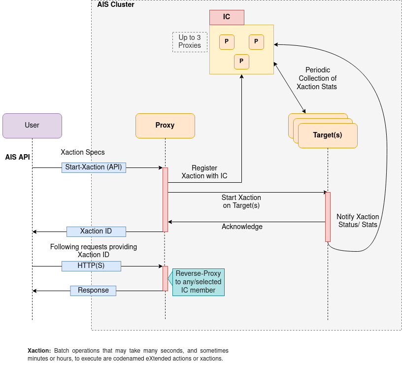

## Control Plane: internal machinery to process asynchronous operations

[AIStore](https://github.com/NVIDIA/aistore) supports running several asynchronous operations, that are triggered either by a user request (e.g., download, transformations, etc.) or as a result of internal cluster events (e.g., rebalance, LRU, etc.), hereby referred to as eXtended actions or **xactions**.
These operations utilize the cluster resources and take many seconds, sometimes minutes or hours to complete their execution.
They also require constant monitoring through their life-cycle (i.e., starting through termination).

For efficient monitoring of extended actions, AIStore employs what we call **Information Center** (IC) - a group of proxies that “own” all the currently running (as well as already finished) xactions in the cluster. IC continuously monitors them by coordinating with other proxies and targets.

In the following sections, we will briefly look into the design choices and operation of IC.

## Information Center (IC) Design

IC is a group of up to 3 (or configured) AIStore gateways aka AIS proxies (henceforth referred to as **proxies**).

IC members maintain an in-memory table to store the information about all the asynchronous batch operations being monitored. This table is reliably replicated on each of the following events:

* Proxy joins IC
* xaction started
* xaction finished
* IC member crashes or gets administratively removed

The diagram below shows a high-level flow of asynchronous operations in the presence of IC, and the different steps involved.

When an xaction such as `list-objects` is triggered by a user, AIStore internally performs the following steps:

1. User makes an API call to start a given xaction (say, `list-objects1`).
2. A proxy that got the request (can be **any** proxy in the cluster) generates a unique xaction ID and registers the xaction with all the IC members.
3. The proxy then starts the xaction by broadcasting the request to all the targets which run the xaction.
4. Once every target in the cluster acknowledges the request, the proxy responds back to the user with a unique UUID.
5. The user then includes the provided xaction ID in the following requests, which may include checking the status of xaction, or fetching results, etc.
6. A proxy on receiving a follow-up request with xaction ID, reverse-proxies to any/selected IC member.
7. In the background, IC members track the xaction by periodically probing the targets running the xaction and listening to the notification sent by the targets.
