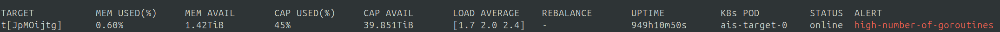

## Idle Connection Management

AIStore employs HTTP connections across multiple layers of its architecture.

Proper idle connection management is critical for preventing resource accumulation in long-running deployments.

AIStore uses a three-layer HTTP connection model:

1. **External clients → AIStore cluster** (server-side connections)
2. **AIStore intra-cluster communication** (client-side connections)
3. **AIStore cluster → Cloud backends** (client-side connections)

## Connection Types and Configuration

### 1. Server-Side Idle Connections

AIStore servers accept connections from external clients including:
- User applications
- Xactions (batch jobs)
- Monitoring systems
- Administrative tools

**Source:** `ais/htcommon.go`

- `IdleTimeout`: Maximum time the server waits for the next request on an idle connection
- Default: 20 seconds (`cmn.DfltMaxIdleTimeout`)

### 2. Intra-Cluster Connections (internal)

**Configuration Location:** `transport/client_*.go`

> Depending on the build tag: `fasthttp` or `nethttp`. See docs/build_tags.md.

### 3. Backend Connections (AIStore → Cloud)

Connections to cloud storage backends:
- Amazon S3
- Google Cloud Storage
- Azure Blob Storage
- Oracle Cloud
- Other S3-compatible endpoints

**Configuration Location:** `cmn/client.go` - via `cmn.NewTransport()` and the respective defaults that also include:

```go
const (
    DefaultMaxIdleConns        = 0               // unlimited total
    DefaultMaxIdleConnsPerHost = 32              // per-host limit
    DefaultIdleConnTimeout     = 6 * time.Second // aggressive cleanup
)
```

> Note: These (and all other cited) settings reflect the current defaults and **may change** in future releases.

## Runtime Configuration

```bash
# View current HTTP configuration
ais config cluster net.http --json

# Set idle connection timeout
ais config cluster net.http.idle_conn_time=30s

# Set total idle connection limit
ais config cluster net.http.idle_conns=1000

# Set per-host idle connection limit
ais config cluster net.http.idle_conns_per_host=128
```

## Monitoring and Observability

Idle connections directly correlate with goroutine count:
- Each idle connection typically results in **two goroutines**.
- Use AIStore Prometheus alerts (e.g., `AISNumGoroutinesHigh`) to detect issues.
- Watch out for `ais show cluster` showing this alert:



## Recommended Settings

```bash
ais config cluster net.http.idle_conn_time=20s
ais config cluster net.http.idle_conns=2000
ais config cluster net.http.idle_conns_per_host=100
```

> Or, tune it down in resource-constrained or dev/testing environments.

## References

- [Go net/http Transport documentation](https://pkg.go.dev/net/http#Transport)
- [HTTP/1.1 Keep-Alive specification (RFC 7230)](https://tools.ietf.org/html/rfc7230#section-6.3)
- AIStore configuration documentation
- Prometheus monitoring setup guide
