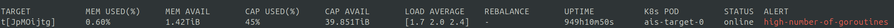

## Idle Connection Management

AIStore employs HTTP connections across multiple layers of its architecture.
These connections are _pooled_ where possible, so idle connection settings may affect resource
usage, reconnect frequency, and sometimes even request latency.

There are three distinct cases:

| Client/Server Nexus | Description |
|---|---|
| Clients -> AIStore servers | Inbound connections accepted by AIS proxies and targets. |
| AIS node -> AIS node | Intra-cluster client connections for control-plane and data-plane traffic. |
| AIS node -> backend | Outbound client connections to cloud/object-store backends. |

These are related, but they are not the same knob.

## Connection Types

### 1. Server-Side Idle Connections

AIStore HTTP servers accept connections from user applications, monitoring tools,
administrative clients, and other AIS nodes.

**Source:** `ais/htcommon.go`

- Go setting: `http.Server.IdleTimeout`
- Current default: `30s` (`cmn.DfltMaxIdleTimeout`)
- Meaning: maximum time an AIS server keeps an accepted connection open while
  waiting for the next request.

This timeout is server-side. It controls when AIS closes an idle inbound
connection.

### 2. Intra-Cluster Client Connections

AIS nodes also act as HTTP clients when communicating with other AIS nodes.

Examples include:

- control-plane requests
- metasync and cluster metadata updates
- reverse proxying
- intra-cluster data paths and streams

**Sources:** `ais/http.go`, `ais/prxrev.go`, `transport/client_*.go`

The primary runtime setting is:

```bash
net.http.idle_conn_time
````

This is a client-side idle connection timeout for AIS-to-AIS communication. It
must remain aligned with the AIS server-side idle timeout. In practice:

```text
intra-cluster client IdleConnTimeout <= AIS server IdleTimeout
```

Currently, AIS server `IdleTimeout` defaults to `30s`, so
`net.http.idle_conn_time` is bounded by `30s`.

### 3. Backend Client Connections

AIS targets may also open outbound HTTP connections to cloud/object-store
backends such as:

* Amazon S3
* Google Cloud Storage
* Azure Blob Storage
* Oracle Cloud
* S3-compatible endpoints

These connections are independent of AIS server-side idle timeout. A cloud
backend is not an AIS server, so the `30s` AIS listener timeout does not apply.

Backend idle connection timeout is controlled separately:

```bash
net.http.backend_idle_conn_time
```

A value of `0` means “use the AIS backend client default,” currently:

```go
const (
    DefaultIdleConnTimeout = 6 * time.Second
)
```

Unlike `net.http.idle_conn_time`, backend idle timeout has no AIS-imposed upper
bound. Operators may increase it for high-latency networks, load-balanced cloud
endpoints, or workloads that benefit from longer-lived backend keep-alive
connections.

## Runtime Configuration

View current HTTP settings:

```bash
ais config cluster net.http --json
```

Set intra-cluster idle connection timeout:

```bash
ais config cluster net.http.idle_conn_time=20s
```

Set backend/cloud idle connection timeout:

```bash
ais config cluster net.http.backend_idle_conn_time=2m
```

Reset backend timeout to the AIS default:

```bash
ais config cluster net.http.backend_idle_conn_time=0
```

Set idle connection limits:

```bash
ais config cluster net.http.idle_conns=1000
ais config cluster net.http.idle_conns_per_host=128
```

## Important Distinction

Do not use `net.http.idle_conn_time` to tune cloud backend behavior.

`net.http.idle_conn_time` is for AIS-to-AIS clients and is intentionally bounded
by the AIS server-side idle timeout. Backend/cloud clients use
`net.http.backend_idle_conn_time`.

## Monitoring and Observability

Idle HTTP connections consume resources. With Go `net/http`, an idle pooled
client connection typically has associated read/write goroutines. Large numbers
of idle connections can therefore show up as elevated goroutine counts.

Useful signals include:

* AIStore Prometheus alerts such as `AISNumGoroutinesHigh`
* `ais show cluster` warnings and alerts
* per-node goroutine count trends
* backend reconnect frequency and request latency

Example alert:



## Recommended Starting Point

For AIS-to-AIS traffic:

```bash
ais config cluster net.http.idle_conn_time=20s
ais config cluster net.http.idle_conns=2000
ais config cluster net.http.idle_conns_per_host=100
```

For backend/cloud traffic, start with the default:

```bash
ais config cluster net.http.backend_idle_conn_time=0
```

Increase `backend_idle_conn_time` only when backend reconnect churn is measurable
or expected, for example with high-RTT object stores or load-balanced endpoints.

Resource-constrained, development, and test deployments may use lower idle
connection limits.

## References

* [Go `net/http.Transport` documentation](https://pkg.go.dev/net/http#Transport)
* [Go `http.Server.IdleTimeout` documentation](https://pkg.go.dev/net/http#Server)
* [HTTP Semantics, RFC 9110](https://www.rfc-editor.org/rfc/rfc9110)
* [Prometheus integration](/docs/monitoring-prometheus.md)
* [Metrics reference](/docs/monitoring-metrics.md)
- [Configuration via CLI](/docs/cli/config.md)
- [Configuration](/docs/configuration.md)
- [Environment variables](/docs/environment-vars.md)
