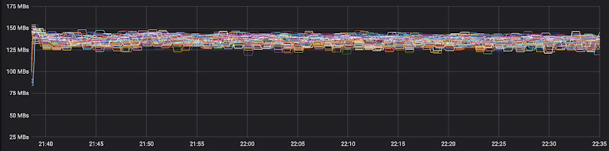

AIStore (AIS for short) is a built from scratch, lightweight storage stack tailored for AI apps. AIS consistently shows balanced I/O distribution and linear scalability across arbitrary numbers of clustered servers, producing performance charts that look as follows:

> The picture above *comprises* 120 HDDs.

The ability to scale linearly with each added disk was, and remains, one of the main incentives behind AIStore. Much of the development is also driven by the ideas to [offload dataset transformations](https://aiatscale.org/blog/2021/10/21/ais-etl-1) to AIS clusters.

## Features

* **Deploys anywhere**. AIS clusters are immediately deployable on any commodity hardware, on any Linux machine(s).
* **Highly available** control and data planes, end-to-end data protection, self-healing, n-way mirroring, erasure coding, and arbitrary number of extremely lightweight access points.
* **REST API**. Comprehensive native HTTP-based API, as well as compliant [Amazon S3 API](/docs/s3compat.md) to run unmodified S3 clients and apps.
* **Unified namespace** across multiple [remote backends](/docs/providers.md) including Amazon S3, Google Cloud, and Microsoft Azure.
* **Network of clusters**. Any AIS cluster can attach any other AIS cluster thus gaining immediate visibility and fast access to the respective hosted datasets.
* **Turn-key cache**. Can be used as a standalone highly-available protected storage and/or LRU-based fast cache. Eviction watermarks, as well as numerous other management policies, are per-bucket configurable.
* **ETL offload**. The capability to run I/O intensive custom data transformations *close to data*, offline (dataset to dataset) and inline (on-the-fly).
* **File datasets**. AIS can be immediately populated from any file-based data source (local or remote, ad-hoc/on-demand or via asynchronus batch);
* **Small files. Sharding.** To serialize small files, AIS supports TAR, TAR.GZ, ZIP, and [MessagePack](https://msgpack.org) formats, and provides the entire spectrum of operations to make the corresponding sharding transparent to the apps.
* **Kubernetes**. Provides for easy Kubernetes deployment via a separate GitHub [repo](https://github.com/NVIDIA/ais-k8s) and [AIS/K8s Operator](https://github.com/NVIDIA/ais-k8s/tree/master/operator).
* **Command line management**. Integrated powerful [CLI](/docs/cli.md) for easy management and monitoring.
* **Access control**. For security and fine-grained access control, AIS includes OAuth 2.0 compliant [Authentication Server (AuthN)](/docs/authn.md). A single AuthN instance executes CLI requests over HTTPS and can serve multiple clusters.
* **Distributed shuffle** extension for massively parallel resharding of very large datasets;
* **Batch jobs**. APIs and CLI to start, stop, and monitor documented [batch operations](/docs/batch.md), such as `prefetch`, `download`, copy or transform datasets, and many more.

AIS runs natively on Kubernetes and features open format - thus, the freedom to copy or move your data from AIS at any time using the familiar Linux `tar(1)`, `scp(1)`, `rsync(1)` and similar.

For developers and data scientists, there's also:
* native [Go (language) API](https://github.com/NVIDIA/aistore/tree/master/api) that we utilize in a variety of tools including [CLI](/docs/cli.md) and [Load Generator](/docs/aisloader.md);
* native [Python API](/docs/python_api.md), and [Python SDK](https://github.com/NVIDIA/aistore/tree/master/sdk/python) that also contains PyTorch integration and usage examples.

For the original AIStore **white paper** and design philosophy, for introduction to large-scale deep learning and the most recently added features, please see [AIStore Overview](/docs/overview.md) (where you can also find six alternative ways to work with existing datasets). Videos and **animated presentations** can be found at [videos](/docs/videos.md).

Finally, [getting started](/docs/getting_started.md) with AIS takes only a few minutes.

---------------------

## Deployment options

AIS deployment options, as well as intended (development vs. production vs. first-time) usages, are all [summarized here](deploy/README.md).

Since prerequisites boil down to, essentially, having Linux with a disk the deployment options range from [all-in-one container](/docs/videos.md#minimal-all-in-one-standalone-docker) to a petascale bare-metal cluster of any size, and from a single VM to multiple racks of high-end servers. But practical use cases require, of course, further consideration and may include:

| Option | Objective |
| --- | ---|
| [Local playground](/docs/getting_started.md#local-playground) | AIS developers and development, Linux or Mac OS |
| Minimal production-ready deployment | This option utilizes preinstalled docker image and is targeting first-time users or researchers (who could immediately start training their models on smaller datasets) |
| [Easy automated GCP/GKE deployment](/docs/getting_started.md#kubernetes-deployments) | Developers, first-time users, AI researchers |
| [Large-scale production deployment](https://github.com/NVIDIA/ais-k8s) | Requires Kubernetes and is provided via a separate repository: [ais-k8s](https://github.com/NVIDIA/ais-k8s) |

Further, there's the capability referred to as [global namespace](/docs/providers.md#remote-ais-cluster): given HTTP(S) connectivity, AIS clusters can be easily interconnected to "see" each other's datasets. Hence, the idea to start "small" to gradually and incrementally build high-performance shared capacity.

> For detailed discussion on supported deployments, please refer to [Getting Started](/docs/getting_started.md).

> For performance tuning and preparing AIS nodes for bare-metal deployment, see [performance](/docs/performance.md).

## Related Software

When it comes to PyTorch, [WebDataset](https://github.com/webdataset/webdataset) is the preferred AIStore client.

> WebDataset is a PyTorch Dataset (IterableDataset) implementation providing efficient access to datasets stored in POSIX tar archives.

Further references include technical blog titled [AIStore & ETL: Using WebDataset to train on a sharded dataset](https://aiatscale.org/blog/2021/10/29/ais-etl-3) where you can also find easy step-by-step instruction.

## Guides and References

- [Getting Started](/docs/getting_started.md)
- [Technical Blog](https://aiatscale.org/blog)
- API and SDK
  - [Go (language) API](https://github.com/NVIDIA/aistore/tree/master/api)
  - [Python SDK](https://github.com/NVIDIA/aistore/tree/master/sdk/python) (and [pip package](https://pypi.org/project/aistore/))
  - [REST API](/docs/http_api.md)
    - [Easy URL](/docs/easy_url.md)
- Amazon S3
  - [`s3cmd` client](/docs/s3cmd.md)
  - [S3 compatibility](/docs/s3compat.md)
- [CLI](/docs/cli.md)
  - [Create, destroy, list, copy, rename, transform, configure, evict buckets](/docs/cli/bucket.md)
  - [GET, PUT, APPEND, PROMOTE, and other operations on objects](/docs/cli/object.md)
  - [Cluster and node management](/docs/cli/cluster.md)
  - [Mountpath (disk) management](/docs/cli/storage.md)
  - [Attach, detach, and monitor remote clusters](/docs/cli/cluster.md)
  - [Start, stop, and monitor downloads](/docs/cli/download.md)
  - [Distributed shuffle](/docs/cli/dsort.md)
  - [User account and access management](/docs/cli/auth.md)
  - [Job (aka `xaction`) management](/docs/cli/job.md)
- Security and Access Control
  - [Authentication Server (AuthN)](/docs/authn.md)
- Tutorials
  - [Tutorials](/docs/tutorials/README.md)
  - [Videos](/docs/videos.md)
- Power tools and extensions
  - [Reading, writing, and listing *archives*](/docs/archive.md)
  - [Distributed Shuffle](/docs/dsort.md)
  - [Downloader](/docs/downloader.md)
  - [Extract, Transform, Load](/docs/etl.md)
  - [Tools and utilities](/docs/tools.md)
- Benchmarking and tuning Performance
  - [AIS Load Generator: integrated benchmark tool](/docs/aisloader.md)
  - [How to benchmark](/docs/howto_benchmark.md)
  - [Performance tuning and testing](/docs/performance.md)
- Buckets and Backend Providers
  - [Backend providers](/docs/providers.md)
  - [Buckets](/docs/bucket.md)
- Storage Services
  - [Storage Services](/docs/storage_svcs.md)
  - [Checksumming: brief theory of operations](/docs/checksum.md)
  - [S3 compatibility](/docs/s3compat.md)
- Cluster Management
  - [Joining AIS cluster](/docs/join_cluster.md)
  - [Leaving AIS cluster](/docs/leave_cluster.md)
  - [Global Rebalance](/docs/rebalance.md)
  - [Troubleshooting](/docs/troubleshooting.md)
- Configuration
  - [Configuration](/docs/configuration.md)
  - [CLI to view and update cluster and node config](/docs/cli/config.md)
- Observability
  - [Observability](/docs/metrics.md)
  - [Prometheus](/docs/prometheus.md)
- For developers
  - [Getting started](/docs/getting_started.md)
  - [Docker](/docs/docker_main.md)
  - [Useful scripts](/docs/development.md)
  - Profiling, race-detecting, and more
- Batch operations
  - [Batch operations](/docs/batch.md)
  - [eXtended Actions (xactions)](/xact/README.md)
  - [CLI: job management](/docs/cli/job.md)
- Topics
  - [System files](/docs/sysfiles.md)
  - [`aisnode` command line](/docs/command_line.md)
  - [Traffic patterns](/docs/traffic_patterns.md)
  - [Highly available control plane](/docs/ha.md)
  - [File access (experimental)](/docs/aisfs.md)
  - [Downloader](/docs/downloader.md)
  - [On-disk layout](/docs/on_disk_layout.md)
  - [AIS Buckets: definition, operations, properties](/docs/bucket.md#bucket)

## License

MIT

## Author

Alex Aizman (NVIDIA)
