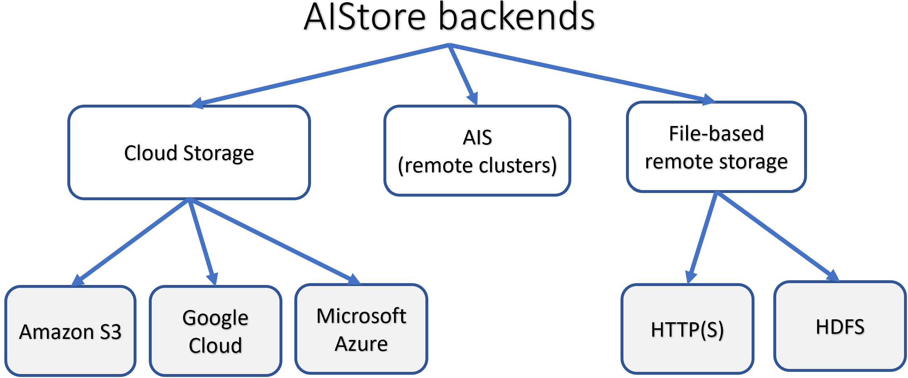

AIStore (AIS for short) is a built from scratch, lightweight storage stack tailored for AI apps. AIS consistently shows balanced I/O distribution and linear scalability across arbitrary numbers of clustered servers, producing performance charts that look as follows:


> The picture above *comprises* 120 HDDs.

The ability to scale linearly with each added disk was, and remains, one of the main incentives behind AIStore. Much of the development is also driven by the ideas to offload dataset transformation and other I/O intensive stages of the ETL pipelines.

## Features

* scale-out with no downtime and no limitation;
* comprehensive HTTP REST API to GET and PUT objects, create, destroy, list and configure buckets, and more;
* [Amazon S3 API](/docs/s3compat.md) to run unmodified S3 clients and apps;
* FUSE client (`aisfs`) to access AIS objects as files;
* arbitrary number of extremely lightweight access points;
* easy-to-use [CLI](https://www.youtube.com/watch?v=VPIhQm2sMD8&ab_channel=AIStore) based on [auto-completions](/docs/cli.md);
* automated cluster rebalancing upon: changes in cluster membership, drive failures and attachments, bucket renames;
* [N-way mirroring (RAID-1), Reed–Solomon erasure coding, end-to-end data protection](/docs/storage_svcs.md).
* [ETL offload](/docs/etl.md): running user-defined extract-transform-load workloads on (and by) performance-optimized storage cluster;

Also, AIStore:

* can be deployed on any commodity hardware;
* supports single-command infrastructure and software deployment on Google Cloud Platform via [ais-k8s GitHub repo](https://github.com/NVIDIA/ais-k8s);
* supports Amazon S3, Google Cloud, and Microsoft Azure backends (and all S3, GCS, and Azure-compliant object storages);
* can ad-hoc attach and "see" (read, write, list, cache, evict) datasets hosted by other AIS clusters;
* provides unified global namespace across multiple backends:



* can be used as a fast cache for GCS and S3; can be populated on-demand and/or via `prefetch` and `download` APIs;
* can be used as a standalone highly-available protected storage;
* includes MapReduce extension for massively parallel resharding of very large datasets;
* supports existing [PyTorch](https://storagetarget.files.wordpress.com/2019/12/deep-learning-large-scale-phys-poster-1.pdf) and [TensorFlow](https://www.youtube.com/watch?v=r9uw1BNt2x8&feature=youtu.be)-based training models.

AIS runs natively on Kubernetes and features open format - thus, the freedom to copy or move your data from AIS at any time using the familiar Linux `tar(1)`, `scp(1)`, `rsync(1)` and similar.

For AIStore **white paper** and design philosophy, for introduction to large-scale deep learning and the most recently added features, please see [AIStore Overview](/docs/overview.md) (where you can also find six alternative ways to work with existing datasets). Videos and **animated presentations** can be found at [videos](/docs/videos.md).

Finally, [getting started](/docs/getting_started.md) with AIS takes only a few minutes.

## Deployment options

There is a vast spectrum of possible deployments - primarily due to the fact that the essential prerequisites boil down to having Linux with a disk.
This results in a practically unlimited set of options from all-in-one (AIS gateway + AIS target) docker container to a petascale bare-metal cluster of any size, and from a single development VM or workstation to multiple racks of high-end servers.

The table below contains a few concrete examples:

| Deployment option | Targeted audience and objective |
| --- | ---|
| [Local playground](/docs/getting_started.md#local-playground) | AIS developers and development, Linux or Mac OS |
| Minimal production-ready deployment | This option utilizes preinstalled docker image and is targeting first-time users or researchers (who could immediately start training their models on smaller datasets) |
| [Easy automated GCP/GKE deployment](/docs/getting_started.md#kubernetes-deployments) | Developers, first-time users, AI researchers |
| [Large-scale production deployment](https://github.com/NVIDIA/ais-k8s) | Requires Kubernetes and is provided (documented, automated) via a separate repository: [ais-k8s](https://github.com/NVIDIA/ais-k8s) |

Further, there's the capability referred to as [global namespace](/docs/providers.md#remote-ais-cluster). Simply put, as long as there’s HTTP connectivity, AIS clusters can be easily interconnected to “see” - i.e., *list*, *read*, *write*, *cache*, *evict* - each other's datasets. This ad-hoc capability, in turn, makes it possible to start small and gradually/incrementally build high-performance shared storage comprising petabytes.

> For more discussion on supported deployments, please refer to [Getting Started](/docs/getting_started.md).

## Observability

AIStore tracks, logs, and reports a fairly large and growing number of counters, latencies and throughputs including (but not limited to) metrics that reflect cluster recovery and global rebalancing, all [extended long-running operations](/xaction/README.md), and, of course, the basic read, write, list transactions, and more. Viewership is equally supported via:

1. System logs
2. [CLI](/docs/cli.md)
3. [Prometheus](/docs/prometheus.md)
4. Any [StatsD](https://github.com/etsy/statsd) compliant [backend](https://github.com/statsd/statsd/blob/master/docs/backend.md#supported-backends) including Graphite/Grafana

> For general information on AIS metrics, see [Statistics, Collected Metrics, Visualization](/docs/metrics.md).

> AIStore includes `aisloader` - a powerful tool that we use to simulate a variety of AI workloads. For numerous command-line options and usage examples, please see [Load Generator](/docs/aisloader.md) and [How To Benchmark AIStore](/docs/howto_benchmark.md). Or, just run the tool and see its online help. Note as well that `aisloader` is fully StatsD-enabled.

## Batch jobs

Batch operations that may take many seconds (minutes, sometimes hours) to execute are called *eXtended actions* or *xactions*.
Examples include erasure coding or n-way mirroring a dataset, resharding and reshuffling a dataset, and many more.
All [eXtended actions](/xaction/README.md) support generic [API](/api/xaction.go) and [CLI](/docs/cli/job.md#show-job-statistics) to show both common counters (byte and object numbers) as well as operation-specific extended statistics.

Global rebalance that gets triggered by any membership changes (nodes joining, leaving, going down, etc.) can be further visualized via `ais show rebalance` CLI.

AIS subsystems integrate subsystem-specific stats - e.g.:

* [dSort](/docs/dsort.md)
* [Downloader](/docs/downloader.md)

## Debug-Mode Observability

For development and, more generally, for any non-production deployments AIS supports [building with debug](/Makefile), for instance:

```sh
$ MODE=debug make deploy
```

As usual, debug builds incorporate more runtime checks and extra logging. But in addition AIS debug build provides a special **API endpoint** at `hostname:port/debug/vars` that can be accessed (via browser or Curl) at any time to display the current values of:

* all stats counters (including error counters)
* all latencies including keepalive
* mountpath capacities
* mountpath (disk) utilizations
* total number of goroutines
* memory stats

and more.

> Notation `hostname:port` stands for TCP endpoint of *any* deployed AIS node, gateway or storage target.

Example output:

```console
$ curl hostname:port/debug/vars
{
"ais.ios": {"/ais/mp1:util%": 20, "/ais/mp2:util%": 23, "/ais/mp3:util%": 22, "/ais/mp4:util%": 25},
"ais.stats": {"kalive.ns": 735065, "lst.n": 45, "lst.ns": 2892015, "num-goroutines": 27, "put.n": 1762, "put.ns": 1141380, "put.redir.ns": 16596465, "up.ns.time": 30012389406},
"cmdline": ["/bin/aisnode","-config=.ais/ais.json","-local_config=.ais/ais_local.json","-role=target"],
"memstats": {"Alloc":43209256,"TotalAlloc":57770120,"Sys":75056128,"Lookups":0,"Mallocs":215893,"Frees":103090,"HeapAlloc":43209256, ...}
...
}
```

## AIStore Configuration

Configuration consists of cluster-wide (global) defaults and node-specific values - the latter includes node's own hostnames (or IP addresses) and mountpaths (disks).

Optionally and in addition, there's also a node-specific "config override" - a set of values that were changed for this node from global (inherited) defaults.

[AIS configuration](/docs/configuration.md) is further described and illustrated in this [readme](/docs/configuration.md).

It is important to note that configuring cluster for production requires careful consideration. For example, AIS supports 3 (**three**) logical networks and will, therefore, benefit, performance-wise, if provisioned with up to 3 isolated physical networks or VLANs. The logical networks are:

* user (aka public)
* intra-cluster control
* intra-cluster data

with the corresponding [JSON names](/deploy/dev/local/aisnode_config.sh), respectively:

* `hostname`
* `hostname_intra_control`
* `hostname_intra_data`

> For AIS Kubernetes deployments we recommended [Cilium](https://cilium.io) CNI.

## Assorted Tips

* To enable an optional AIStore authentication server, execute `$ AUTH_ENABLED=true make deploy`. For information on AuthN server, please see [AuthN documentation](/docs/authn.md).
* In addition to AIStore - the storage cluster, you can also deploy [aisfs](/docs/aisfs.md) - to access AIS objects as files, and [AIS CLI](/docs/cli.md) - to monitor, configure and manage AIS nodes and buckets.
* AIS CLI is an easy-to-use command-line management tool supporting a growing number of commands and options (one of the first ones you may want to try could be `ais show cluster` - show the state and status of an AIS cluster). The CLI is documented in the [readme](/docs/cli.md); getting started with it boils down to running `make cli` and following the prompts.
* For more testing commands and options, please refer to the [testing README](/ais/tests/README.md).
* For `aisnode` command-line options, see: [command-line options](/docs/command_line.md).
* For helpful links and/or background on Go, AWS, GCP, and Deep Learning: [helpful links](/docs/helpful_links.md).
* And again, run `make help` to find out how to build, run, and test AIStore and tools.

## Guides and References

- [AIS Overview](/docs/overview.md)
- [Tutorials](/docs/tutorials/README.md)
- [Videos](/docs/videos.md)
- [S3 compatibility](/docs/s3compat.md)
- [CLI](/docs/cli.md)
  - [Create, destroy, list, and other operations on buckets](/docs/cli/bucket.md)
  - [GET, PUT, APPEND, PROMOTE, and other operations on objects](/docs/cli/object.md)
  - [Cluster and Node management](/docs/cli/cluster.md)
  - [Mountpath (Disk) management](/docs/cli/storage.md)
  - [Attach, Detach, and monitor remote clusters](/docs/cli/cluster.md)
  - [Start, Stop, and monitor downloads](/docs/cli/download.md)
  - [Distributed Sort](/docs/cli/dsort.md)
  - [User account and access management](/docs/cli/auth.md)
  - [Job (xaction) management](/docs/cli/job.md)
- [ETL with AIStore](/docs/etl.md)
- [On-Disk Layout](/docs/on_disk_layout.md)
- [System Files](/docs/sysfiles.md)
- [Command line parameters](/docs/command_line.md)
- [AIS Load Generator: integrated benchmark tool](/docs/aisloader.md)
- [Batch List and Range Operations: Prefetch, and more](/docs/batch.md)
- [Object checksums: Brief Theory of Operations](/docs/checksum.md)
- [Configuration](/docs/configuration.md)
- [Traffic patterns](/docs/traffic_patterns.md)
- [Highly available control plane](/docs/ha.md)
- [How to benchmark](/docs/howto_benchmark.md)
- [RESTful API](/docs/http_api.md)
- [FUSE with AIStore](/docs/aisfs.md)
- [Joining AIS cluster](/docs/join_cluster.md)
- [Removing a node from AIS cluster](/docs/leave_cluster.md)
- [AIS Buckets: definition, operations, properties](/docs/bucket.md#bucket)
- [Statistics, Collected Metrics, Visualization](/docs/metrics.md)
- [Performance: Tuning and Testing](/docs/performance.md)
- [Rebalance](/docs/rebalance.md)
- [Storage Services](/docs/storage_svcs.md)
- [Integrated Internet Downloader](/docs/downloader.md)
- [Docker for AIS developers](/docs/docker_main.md)
- [Troubleshooting Cluster Operation](/docs/troubleshooting.md)

## License

MIT

## Author

Alex Aizman (NVIDIA)
