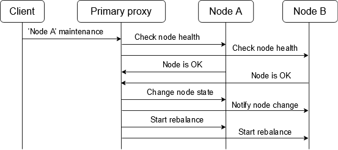
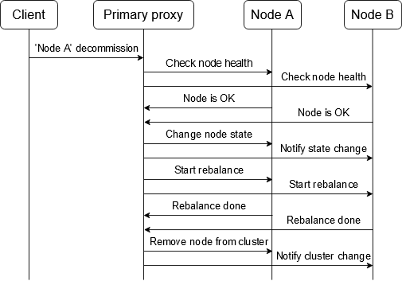
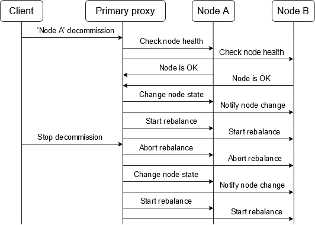

## Table of Contents

- [Putting a node in maintenance](#putting-a-node-in-maintenance)
- [Clearing maintenance state](#clearing-maintenance-state)
- [Removing a node from a cluster](#removing-a-node-from-a-cluster)
- [Interrupt node removal](#interrupt-node-removal)
- [Checking removal status](#checking-removal-status)

Sometimes a node has to be removed from a cluster - either temporarily (e.g., to perform maintenance tasks) or permanently. It is important to do the "removal" gracefully, via provided AIS APIs. In particular, if the node is a storage target, it contains user data that must be *rebalanced* to remaining clustered nodes.

Two kinds of node removal are supported:

- temporary removal, e.g. for node maintenance. In this case, the node remains in the cluster but it stops responding to client requests. Temporary removal comes in two flavors: `start-maintenance` that keeps the node running, and `shutdown` that stops the node;
- permanent removal, e.g. node decommission. This operation disables a node and starts moving all its objects to other targets. When rebalance finishes, the primary proxy automatically removes the node from the cluster. On leaving the cluster, the node erases its AIS metadata and optionally deletes all user data.

### Putting a node in maintenance



To take a node out of the cluster temporary while keeping it in the cluster list, put a node under maintenance (CLI):

```console
$ ais cluster membership start-maintenance 59262t8087
Node "59262t8087" is under maintenance
Started rebalance "g1", use 'ais show job xaction g1' to monitor progress
```

Alternative way is to shut down the node which additionally stops all AIS services on the node after putting it under maintenance:

```console
$ ais cluster membership shutdown 59262t8087
Node "59262t8087" is under maintenance
Started rebalance "g1", use 'ais show job xaction g1' to monitor progress
```

If the node is a target, after a quick preparation, the cluster starts rebalance. When the rebalance finishes, it is safe to turn the node off.

If the node does not contain any important data, rebalance can be skipped, so the node is safe to switch off in a short time after putting it under maintenance:

```console
$ ais cluster membership start-maintenance 59262t8087 --no-rebalance
Node "59262t8087" is under maintenance
```

### Clearing maintenance state

Once a node is put under maintenance, the cluster keeps it in this state until you notify the cluster that the node is ready to use.
If the node was shut down, you have to restart or power it on and wait until the node registers at the primary proxy beforehand.
After getting the notification, the cluster clears the maintenance state and starts rebalance:

```console
$ ais cluster membership stop-maintenance 59262t8087
Node "59262t8087" maintenance stopped
Started rebalance "g3", use 'ais show job xaction g3' to monitor progress
```

To skip automatic rebalance, provide flag `--no-rebalance`.
It is recommended to keep automatic rebalance running automatically, but in some cases it is safe to skip it:

- all buckets are empty
- maintenance was started with `--no-rebalance` and no object was added or updated during maintenance
- objects can be refetched from remote sources. E.g, all buckets are remote AIS, HTTP or Cloud ones. In this case, targets redownload missing objects. That can cost extra money for Cloud traffic
- you are going to stop maintenance for more than 1 node. So, all nodes except the last one are back to the cluster with the flag `--no-rebalance`, and the last node starts the automatic rebalance

### Removing a node from a cluster



To completely remove the node from the cluster, start the node decommissioning (CLI):

```console
$ ais cluster membership decommission 59262t8087
Node "59262t8087" is under maintenance
Started rebalance "g1", use 'ais show job xaction g1' to monitor progress
```

When the rebalance finishes, the cluster removes the node automatically from the list.
On unregistering, the node erases its AIS metadata.
Disabling rebalance runs quick preparations and removes the node from the cluster immediately:

```console
$ ais cluster membership decommission --no-rebalance 59262t8087
Node "59262t8087" removed from the cluster
```

Note that decommission cleans up all AIS metadata and stops the node. The shutdown only stops AIS services.
If the node is a target, the node will be shut down after the rebalance has finished. Otherwise, if the node is a proxy, the node will shut down immediately.

```console
$ ais cluster membership shutdown 59262t8087
Node "59262t8087" is being shut down
Started rebalance "g1", use 'ais show job xaction g1' to monitor progress
```

Note that removing a node with rebalance disabled can be interrupted. If a node is removed by mistake, you have to join it manually with `ais cluster membership join` command.

### Interrupt node removal



While rebalance is running, the removal operation can be interrupted to get the node back to the cluster.
Rebalance starts automatically when a node is a target and flag `--no-rebalance` is not set after the node is registered at the cluster and the cluster clears node's maintenance state.

```console
$ ais cluster membership stop-maintenance 59262t8087
Node "59262t8087" maintenance stopped
Started rebalance "g3", use 'ais show job xaction g3' to monitor progress
```

The node starts accepting all the requests after joining the cluster and after the cluster clears node's maintenance state. You do not have to wait until the rebalance is done.

### Checking removal status

Putting a node under maintenance does not do anything automatically after the rebalance finishes. Check the cluster health to be sure that it is safe to turn the node off. Besides checking xaction progress, the removal status can be monitored with `ais cluster status` command.

In the example below it is safe to turn off the node (the column `REBALANCE` states that the rebalance has already finished and the node is labeled `maintenance`):

```console
$ ais show cluster target
TARGET           MEM USED %      MEM AVAIL       CAP USED %      CAP AVAIL       CPU USED %      REBALANCE    UPTIME  STATUS
59262t8087       0.13%           31.28GiB        16%             2.435TiB        0.00%           finished     31m     maintenance
93683t8084       0.13%           31.28GiB        16%             2.435TiB        0.12%           finished     31m     online
```

For decommissioning nodes, the status looks this while the rebalance is running:

```console
$ ais show cluster target
TARGET           MEM USED %      MEM AVAIL       CAP USED %      CAP AVAIL       CPU USED %      REBALANCE    UPTIME  STATUS
59262t8087       0.13%           31.28GiB        16%             2.435TiB        0.00%           running      31m     decommission
93683t8084       0.13%           31.28GiB        16%             2.435TiB        0.12%           running      31m     online
```

On finishing the rebalance, the primary proxy removes the node automatically:

```console
$ ais show cluster target
TARGET           MEM USED %      MEM AVAIL       CAP USED %      CAP AVAIL       CPU USED %      REBALANCE    UPTIME
93683t8084       0.13%           31.28GiB        16%             2.435TiB        0.12%           running      31m
```
