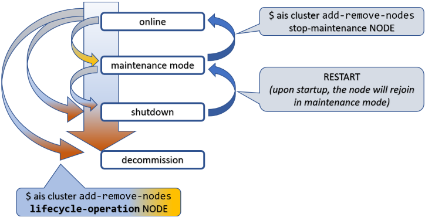

There's a set of topics in system management that can often be found under alternative subtitles:
"graceful termination and cleanup", "shutting down and restarting", "adding/removing members", "joining and leaving cluster", and similar.

Any discussion along those lines typically involves state transitions, so let's go ahead and name the states (and transitions).



To put things in perspective, this picture is about a node (not shown) in an aistore cluster (not shown). Tracking it from the top downwards, first notice a state called "maintenance mode". Maintenance node constitutes maybe the most gentle, if you will, way of removing a node from the operating cluster.

When in maintenance, the node stops keep-alive heartbeats but remains in the cluster map and remains connected. That is, unless you disconnect or shut it down manually (which would be perfectly fine and expected).

Next is "shutdown". Graceful shutdown can also be achieved in a single shot, as indicated by one of those curly arrows in the picture's left:
 "online" => "shutdown".

When in "shutdown", a node can easily get back and rejoin the cluster at any _later_ time. It'll take two steps, not one - see the blue arrows on the picture's right where RESTART must be understood as a deployment-specific operation (e.g., `kubectl run`).

Both "maintenance" and "shutdown" involve a certain intra-cluster operation called "global rebalance" (aka "rebalance").

But before we talk about it in any greater detail, let's finish with the node's lifecycle. The third and final special state is "decommission". Loosely synonymous with *cleanup* (a very thorough cleanup, as it were), "decommission" entails:

* migrating all user data the node is storing to other nodes that are currently "online" - the step that's followed by:
* partial or complete cleanup of the node in question, whereby the complete cleanup further entails:
* removing all AIS metadata, all configuration files, and - last but not least - user data in its entirety.

Needless to say, there's no way back out of "decommission" - the proverbial point of no return. To rejoin the cluster, a decommissioned node will have to be redeployed from scratch, but then it would be a totally different node, of course...

### Table of Contents
- [Cluster](#cluster)
- [Privileges](#privileges)
- [Rebalance](#rebalance)
- [Summary](#summary)
- [Usage](#usage)
- [References](#references)

## Cluster

There's one question that absolutely cannot wait: how to "terminate" or "cleanup" a cluster? Here's how:

```console
$ ais cluster decommission --rm-user-data --yes
```

The above command will destroy an existing cluster - completely and utterly, no questions asked. It can be conveniently used in testing/benchmarking situations or in any sort of non-production environment - see `--help` for details. It also executes very fast - Ctrl-C's unlikely to help in case of change-of-mind...

## Privileges

Full Disclosure: all lifecycle management commands and all associated APIs require administrative privileges. There are, essentially, three ways:

* deploy the cluster with authentication disabled:

```console
$ ais config cluster auth --json
    "auth": {
        "secret": "xxxxxxxx",
        "enabled": false
    }
```
* use integrated `AuthN` server that provides OAuth 2.0 compliant JWT and a set of [easy commands](/docs/cli/auth.md) to manage users and roles (with certain permissions to access certain clusters, etc.);
* outsource authorization to a separate, centralized (usually, LDAP-integrated) management system to manage existing users, groups, and mappings.

## Rebalance

Conceptually, aistore rebalance is similar to what's often called "RAID rebuild". The underlying mechanics would be very different but the general idea is the same: user data massively migrating from some nodes in a cluster (or disks in an array) to some other nodes (disks), and vice versa.

In aistore, all the migration (aka "rebalancing") that's taking in place is the system response to a lifecycle event that's already happened or is about to happen. In fact, it is the response to satisfy a singular purpose and a single location-governing rule that simply states: **user data must be _properly_ located**.

### Proper location

For any object in a cluster, its _proper_ location is defined by the current cluster map and locally - on each target node - by the (locally) configured target's mountpaths (disks).

In that sense, the "maintenance" state, for instance, has its _beginning_ - when the cluster starts rebalancing, and the post-rebalancing _end_, whereby the corresponding sub-state get recorded in a new version of the cluster map, which then gets safely distributed across all nodes, etc., etc.

Next section gives an example and clarifies "maintenance sub-states" - in color.

### Quick example

Given a 3-node single-gateway cluster, we go ahead and shut down one of the nodes:

```console
$ ais cluster add-remove-nodes shutdown <TAB-TAB>
p[MWIp8080]   t[ikht8083]   t[noXt8082]   t[VmQt8081]

$ ais cluster add-remove-nodes shutdown t[ikht8083] -y

Started rebalance "g47" (to monitor, run 'ais show rebalance').
t[ikht8083] is shutting down, please wait for cluster rebalancing to finish

Note: the node t[ikht8083] is _not_ decommissioned - it remains in the cluster map and can be manually
restarted at any later time (and subsequently activated via 'stop-maintenance' operation).
```

Once the command is executed, notice the following:

```console
$ ais show cluster
...
t[ikht8083][x]   -   -   -   -   maintenance
```

At first, `maintenance` will show up in red indicating a simple fact that data is expeditiously migrating from the node (which is about to leave the cluster).

> A visual cue, which is supposed to imply something like: "please don't disconnect, do not power off".

But eventually, if you run the command periodically:

```console
$ ais show cluster --refresh 3
```

or a few times manually - eventually `show cluster` will report that rebalance ("g47" in the example) has finished and the node `t[ikht8083]` - gracefully terminated. Simultaneously, `maintenance` in the `show` output will become non-red:

| when rebalancing | after |
| --- | --- |
| $${\color{red}maintenance}$$ | $${\color{cyan}maintenance}$$ |

The takeaway: global rebalance runs its full way _before_ the node in question is permitted to leave. If interrupted for any reason whatsoever (power-cycle, network disconnect, new node joining, cluster shutdown, etc.) - rebalance will resume and will keep going until the [governing condition](#proper-location) is fully and globally satisfied.

## Summary

| lifecycle operation | CLI |  brief description |
| --- | --- | -- |
| maintenance mode | `start-maintenance`  | The most lightweight way to remove a node. Stop keep-alive heartbeats, do not insist on metadata updates - ignore the failures. For advanced usage options, see `--help`. |
| shutdown | `shutdown` | Same as above, plus node shutdown (`aisnode` exit). |
| decommission | `decommission` | Same as above, plus partial (metadata only) or complete (both data and AIS metadata) cleanup. A decommissioned node is forever "forgotten" - removed from the cluster map. |
| remove node from cluster map | `ais advanced remove-from-smap` | Strictly intended for testing purposes and special use-at-your-own-risk scenarios. Immediately remove the node from the cluster and distribute updated cluster map with no rebalancing. |
| take node out of maintenance | `stop-maintenance`  | Update the node with the current cluster-level metadata, re-enable keep-alive, run global rebalance. Finally, when all succeeds, distribute updated cluster map (where the node shows up "online"). |
| join new node (ie., grow cluster) | `join` | Essentially, same as above: update the node, run global rebalance, etc. |

### Assorted notes

Normally, a starting-up AIS node (`aisnode`) will use its local [configuration](/docs/configuration.md) to communicate with any other node in the cluster and perform what's called [self-join](https://github.com/NVIDIA/aistore/blob/master/api/apc/actmsg.go). The latter does not require a `join` command or any other explicit administration.

Still, the `join` command can solve the case when the node is misconfigured. Secondly and separately, it can be used to join a standby node - a node that started in a `standby` mode, as per:

* [`aisnode` command line](/docs/command_line.md)

When rebalancing, the cluster remains fully operational and can be used to read and write data, list, create, and destroy buckets, run jobs, and more. In other words, none of the listed lifecycle operations requires downtime. The idea is that users never notice (and if the cluster has enough spare capacity - they won't).

## References

* [CLI: cluster management commands](/docs/cli/cluster.md)
  - [Joining](/docs/join_cluster.md)
  - [Leaving](/docs/leave_cluster.md)
* [Global Rebalance](/docs/rebalance.md)
* [AuthN](/docs/authn.md)
* [AIS on Kubernetes deployment: playbooks](https://github.com/NVIDIA/ais-k8s/tree/master/playbooks)
