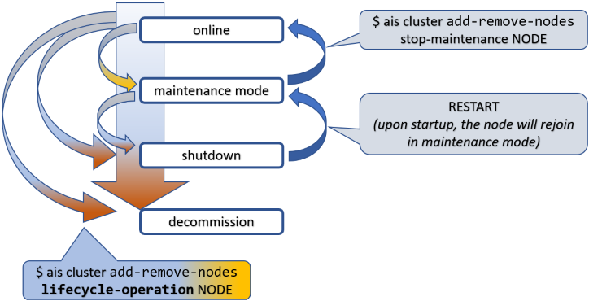

There's a set of system-management topics that often appear under alternative subtitles:
"graceful termination and cleanup", "shutting down and restarting", "adding and removing members", "joining and leaving cluster", and similar.

All of these topics involve state transitions, so let's start by naming the states and the transitions between them.



To put things in perspective, this picture is about a node (not shown) in an AIStore cluster (also not shown).

Tracking it from top to bottom, first notice the state called **maintenance mode**. This is the gentlest way to remove a node from an operating cluster. When in maintenance, the node stops keepalive heartbeats but remains in the cluster map and remains connected, unless you disconnect or shut it down manually, which is perfectly valid and often expected.

Next comes **shutdown**. Graceful shutdown can also be achieved in a single shot, as indicated by one of the arrows on the left:

`online => shutdown`

When in `shutdown`, the node can later return and rejoin the cluster. That takes two steps, not one: restart the node first, then take it out of maintenance. In the diagram, `RESTART` must be understood as a deployment-specific action such as `kubectl run`, restarting a systemd unit, or powering the machine back on.

Both `maintenance` and `shutdown` involve a certain intra-cluster operation called **global rebalance**.

The third and final special state is **decommission**. Loosely synonymous with cleanup - very thorough cleanup - decommission entails:

* migrating all user data currently stored on the node to other online nodes;
* partial or complete cleanup of the node itself; and
* removing AIS metadata, configuration files, and, optionally, user data in its entirety.

Needless to say, there's no simple way back out of `decommission` - the proverbial point of no return. To rejoin the cluster after a completed decommission, the node must be rejoined or redeployed, depending on how far the cleanup progressed and whether local AIS metadata and data were removed.

## Table of Contents

- [Joining a Cluster: Discovery URL](#joining-a-cluster-discovery-url)
- [Cluster](#cluster)
- [Privileges](#privileges)
- [Rebalance](#rebalance)
  - [Proper Location](#proper-location)
  - [Quick Example](#quick-example)
- [Putting a Node in Maintenance](#putting-a-node-in-maintenance)
  - [Skipping Rebalance](#skipping-rebalance)
- [Clearing Maintenance State](#clearing-maintenance-state)
- [Removing a Node from a Cluster](#removing-a-node-from-a-cluster)
- [Interrupting Node Removal](#interrupting-node-removal)
- [Checking Removal Status](#checking-removal-status)
- [Summary](#summary)
- [References](#references)

## Joining a Cluster: Discovery URL

AIStore clusters can be deployed with an arbitrary number of AIStore proxies (a.k.a. gateways). Each proxy implements RESTful APIs, both native and S3-compatible, and provides full access to user data stored in the cluster.

Each proxy collaborates with the others to perform majority-voted HA failovers; see [Highly Available Control Plane](/docs/ha.md). All _electable_ proxies are functionally equivalent. The one elected as the current _primary_ is, among other things, responsible for joining nodes to the running cluster.

To facilitate node joins in the presence of disruptive events such as:

* network failures; and/or
* partial or complete loss of local AIS metadata such as cluster maps,

AIStore uses the so-called *original* and *discovery* URLs in the cluster configuration. The latter is versioned, replicated, protected, and distributed solely by the elected primary.

> **March 2024 update:** starting with v3.23, the *original* URL does _not_ track the original primary. Instead, the current primary takes full responsibility for updating both URLs with a single purpose: optimizing time to join or rejoin the cluster.

When an HA event triggers automated failover, the role of primary is assumed by a different proxy, with the corresponding cluster map (Smap) update synchronized across all running nodes.

A new node, however, may still have configuration that refers to the old primary. The *original* and *discovery* URLs exist precisely to address that scenario:

```console
$ ais config cluster proxy --json
{
    "proxy": {
        "primary_url": "https://ais-proxy-15.ais-proxy.ais.svc.cluster.local:51082",
        "original_url": "https://ais-proxy-15.ais-proxy.ais.svc.cluster.local:51082",
        "discovery_url": "https://ais-proxy.ais.svc.cluster.local:51082",
        "non_electable": false
    }
}
```

## Cluster

There is one cluster-level lifecycle command that deserves to be called out separately:

```console
$ ais cluster decommission --rm-user-data --yes
```

The above command destroys an existing cluster - completely and utterly, no questions asked. It is useful in testing, benchmarking, and other non-production environments. See `--help` for details.

## Privileges

All lifecycle management commands and their associated APIs require administrative privileges.

Broadly, there are three ways to satisfy that requirement:

* deploy the cluster with authentication disabled:

```console
$ ais config cluster auth --json
{
    "auth": {
        "signature": {
            "key": "**********",
            "method": "hmac"
        },
        "required_claims": {
            "aud": null
        },
        "oidc": {
            "issuer_ca_bundle": "-",
            "allowed_iss": null
        },
        "cluster_key": {
            "enabled": false,
            "ttl": "0s",
            "nonce_window": "1m",
            "rotation_grace": "1m"
        },
        "enabled": false ### <<<<< authentication disabled
    }
}
```

* use the integrated `AuthN` server, which provides OAuth 2.0-compliant JWTs and a set of [CLI auth commands](/docs/cli/auth.md) to manage users, roles, and permissions; or
* outsource authorization to a separate centralized system, often LDAP-integrated, that manages existing users, groups, and mappings.

## Rebalance

Conceptually, AIStore rebalance is somewhat similar to what is often called a RAID rebuild. The underlying mechanics are different, but the high-level idea is similar: user data migrates from some nodes in a cluster to other nodes to restore the correct placement.

In AIStore, rebalancing is the system response to a lifecycle event that has already happened or is about to happen. Its singular purpose is to satisfy one governing rule:

**user data must be *properly* located**

### Proper Location

For any object in a cluster, its proper location is defined by the current cluster map and, locally on each target, by the configured target [mountpaths](/docs/terminology.md#mountpath).

In that sense, the `maintenance` state, for instance, has its beginning when the cluster starts rebalancing, and its post-rebalancing end when the corresponding sub-state is recorded in the next Smap version and safely distributed across all nodes.

### Quick Example

Given a 3-node single-gateway cluster, suppose we shut down one of the nodes:

```console
$ ais cluster add-remove-nodes shutdown <TAB-TAB>
p[MWIp8080]   t[ikht8083]   t[noXt8082]   t[VmQt8081]

$ ais cluster add-remove-nodes shutdown t[ikht8083] -y

Started rebalance "g47" (to monitor, run 'ais show rebalance').
t[ikht8083] is shutting down, please wait for cluster rebalancing to finish

Note: the node t[ikht8083] is _not_ decommissioned - it remains in the cluster map and can be manually
restarted at any later time (and subsequently activated via 'stop-maintenance' operation).
```

Once the command is executed, notice the following:

```console
$ ais show cluster
...
t[ikht8083][x]   -   -   -   -   maintenance
```

At first, `maintenance` will show up in red, indicating a simple fact: data is expeditiously migrating from the node that is about to leave the cluster.

> A visual cue that effectively says: please don't disconnect it yet, and do not power it off.

Eventually, if you run:

```console
$ ais show cluster --refresh 3
```

or simply check a few times manually, the output will report that rebalance (`g47` in this example) has finished and the node `t[ikht8083]` has gracefully left service. Simultaneously, `maintenance` in the `show` output becomes non-red:

| when rebalancing             | after                         |
| ---------------------------- | ----------------------------- |
| $${\color{red}maintenance}$$ | $${\color{cyan}maintenance}$$ |

The takeaway is simple: [global rebalance](/docs/rebalance.md) runs its full course *before* the node is permitted to leave cleanly. If interrupted for any reason - power cycle, network disconnect, another node joining, cluster shutdown, and so on - rebalance resumes and continues until the [governing condition](#proper-location) is globally satisfied.

## Putting a Node in Maintenance

To temporarily take a node out of the cluster, put it in maintenance mode. Nodes in maintenance remain in the cluster map but stop participating in normal request processing.

```console
$ ais cluster add-remove-nodes start-maintenance 59262t8087
Node "59262t8087" is in maintenance mode
Started rebalance "g1", use 'ais show job xaction g1' to monitor the progress
```

Alternatively, you can shut the node down as part of the same workflow:

```console
$ ais cluster add-remove-nodes shutdown 59262t8087
Node "59262t8087" is in maintenance mode
Started rebalance "g1", use 'ais show job xaction g1' to monitor the progress
```

If the node is a target, the cluster will rebalance after a short preparation phase. When the rebalance finishes, it is safe to power the node off.

### Skipping Rebalance

> **Advanced usage only:** `--no-rebalance` is not recommended for routine cluster operations.
> In normal operation, let AIS run rebalance automatically.
>
> The primary recommended use case is a controlled rolling-maintenance or rolling-upgrade workflow, where nodes are taken out of service and returned in a coordinated sequence. In Kubernetes deployments, this sequencing is typically handled automatically by the [AIS Kubernetes operator](https://github.com/NVIDIA/ais-k8s/tree/main/operator).

If you use `--no-rebalance`, the node enters maintenance immediately without waiting for data migration:

```console
$ ais cluster add-remove-nodes start-maintenance 59262t8087 --no-rebalance --yes

Node "59262t8087" is in maintenance
```

Keeping automatic rebalance enabled is strongly recommended, but there are cases where skipping it is safe:

* all buckets are empty;
* maintenance was started with `--no-rebalance` and no objects were added or updated during maintenance;
* all objects can be refetched from remote backends such as remote AIS, HTTP, or cloud buckets, understanding that this may incur extra cloud traffic charges; or
* multiple nodes are being returned from maintenance in sequence, in which case all but the last can use `--no-rebalance` and the last node can trigger a single rebalance for the entire batch.

The `--no-rebalance` flag is available for `start-maintenance`, `shutdown`, `stop-maintenance`, and `decommission`.

## Clearing Maintenance State

Once a node is in maintenance mode, the cluster keeps it there until you explicitly clear that state.

If the node was shut down, restart or power it on first and wait for it to register with the primary proxy. Then run:

```console
$ ais cluster add-remove-nodes stop-maintenance 59262t8087
Node "59262t8087" maintenance stopped
Started rebalance "g3", use 'ais show job xaction g3' to monitor the progress
```

To skip automatic rebalance, provide `--no-rebalance` (advanced usage only; see [Skipping Rebalance](#skipping-rebalance).

> In general, automatic rebalance should remain enabled. The same considerations listed under [Skipping Rebalance](#skipping-rebalance) apply here as well.

The node starts accepting requests again after it rejoins and the cluster clears its maintenance state. You do not have to wait for the rebalance to finish before using it again.

## Removing a Node from a Cluster

To permanently remove a node from the cluster, decommission it:

```console
$ ais cluster add-remove-nodes decommission 59262t8087
Node "59262t8087" is in maintenance
Started rebalance "g1", use 'ais show job xaction g1' to monitor the progress
```

When the rebalance finishes, the primary proxy removes the node automatically from the cluster map. On unregistering, the node erases its AIS metadata.

Skipping rebalance performs only the minimal preparation and removes the node immediately:

```console
$ ais cluster add-remove-nodes decommission --no-rebalance 59262t8087
Node "59262t8087" removed from the cluster
```

Note that `decommission` cleans up AIS metadata and stops the node. By contrast, `shutdown` only stops AIS services.

If the node is a target, shutdown takes full effect after the rebalance completes. If the node is a proxy, shutdown is immediate.

## Interrupting Node Removal

While rebalance is still running, a removal can be interrupted and the node returned to service.

```console
$ ais cluster add-remove-nodes stop-maintenance 59262t8087
Node "59262t8087" maintenance stopped
Started rebalance "g3", use 'ais show job xaction g3' to monitor the progress
```

This workflow applies to a node that is in maintenance or shutdown and to a decommission workflow that has not yet completed.

Once decommission finishes and the node has been removed and cleaned up, returning it to the cluster may require an explicit rejoin or a full redeployment, depending on the cleanup that was performed.

## Checking Removal Status

Putting a node in maintenance does **not** automatically power it off.

AIS runs a rebalance when a node enters maintenance mode. You should verify cluster state via `ais show cluster target` before deciding that it is safe to power the node off.

In the example below, the `REBALANCE` column shows `finished` and the node is labeled `maintenance` - it is safe to power it off:

```console
$ ais show cluster target
TARGET           MEM USED %      MEM AVAIL       CAP USED %      CAP AVAIL       CPU USED %      REBALANCE    UPTIME  STATUS
59262t8087       0.13%           31.28GiB        16%             2.435TiB        0.00%           finished     31m     maintenance
93683t8084       0.13%           31.28GiB        16%             2.435TiB        0.12%           finished     31m     online
```

For decommissioning nodes, the status looks like this while rebalance is still running:

```console
$ ais show cluster target
TARGET           MEM USED %      MEM AVAIL       CAP USED %      CAP AVAIL       CPU USED %      REBALANCE    UPTIME  STATUS
59262t8087       0.13%           31.28GiB        16%             2.435TiB        0.00%           running      31m     decommission
93683t8084       0.13%           31.28GiB        16%             2.435TiB        0.12%           running      31m     online
```

When rebalance finishes, the primary proxy removes the decommissioned node automatically:

```console
$ ais show cluster target
TARGET           MEM USED %      MEM AVAIL       CAP USED %      CAP AVAIL       CPU USED %      REBALANCE    UPTIME
93683t8084       0.13%           31.28GiB        16%             2.435TiB        0.12%           running      31m
```

## Summary

| lifecycle operation          | CLI                             | brief description                                                                                                                                                          |
| ---------------------------- | ------------------------------- | -------------------------------------------------------------------------------------------------------------------------------------------------------------------------- |
| maintenance mode             | `start-maintenance`             | The lightest way to remove a node from service. Stop keepalive heartbeats, do not insist on metadata updates, and ignore transient failures while the cluster transitions. |
| shutdown                     | `shutdown`                      | Same as above, plus node shutdown (`aisnode` exit).                                                                                                                        |
| decommission                 | `decommission`                  | Same as above, plus partial or complete cleanup. A decommissioned node is eventually removed from the cluster map.                                                         |
| remove node from cluster map | `ais advanced remove-from-smap` | Strictly intended for testing and special use-at-your-own-risk scenarios. Immediately remove the node from the cluster and distribute an updated Smap with no rebalancing. |
| take node out of maintenance | `stop-maintenance`              | Re-enable keepalive, update the node with current cluster metadata, run global rebalance, and return the node to `online`.                                                 |
| join new node                | `join`                          | Update the node, synchronize current cluster metadata, and run global rebalance as needed.                                                                                 |

### Assorted Notes

Normally, a starting AIS node (`aisnode`) uses its local [configuration](/docs/configuration.md) to contact the cluster and perform a self-join. That does not require an explicit `join` command or any separate administrative action.

Still, the `join` command is useful when the node is misconfigured. Separately, it can also be used to join a standby node - that is, a node started in standby mode; see [`aisnode` command line](/docs/command_line.md).

During rebalance, the cluster remains fully operational: users can read and write data, list, create, and destroy buckets, run jobs, and so on. In other words, none of the lifecycle operations described here requires downtime.

## References

* [CLI: cluster management commands](/docs/cli/cluster.md)
* [Global Rebalance](/docs/rebalance.md)
* [AuthN](/docs/authn.md)
* [AIS on Kubernetes deployment: playbooks](https://github.com/NVIDIA/ais-k8s/tree/main/playbooks)
