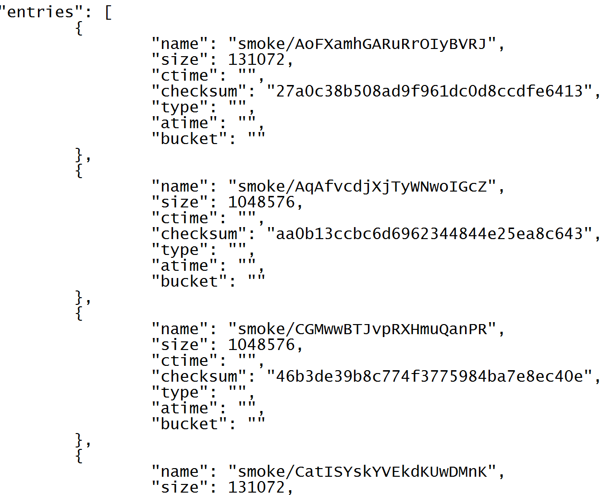

## Table of Contents
- [List Bucket](#list-bucket)
    - [properties-and-options](#properties-and-options)
    - [Example: listing local and Cloud buckets](#example-listing-local-and-cloud-buckets)
    - [Example: Listing all pages](#example-listing-all-pages)

## List Bucket

ListBucket API returns a page of object names and, optionally, their properties (including sizes, creation times, checksums, and more), in addition to a token that servers as a cursor or a marker for the *next* page retrieval.

### properties-and-options
The properties-and-options specifier must be a JSON-encoded structure, for instance '{"props": "size"}' (see examples). An empty structure '{}' results in getting just the names of the objects (from the specified bucket) with no other metadata.

| Property/Option | Description | Value |
| --- | --- | --- |
| props | The properties to return with object names | A comma-separated string containing any combination of: "checksum","size","atime","ctime","iscached","bucket","version","targetURL". <sup id="a6">[6](#ft6)</sup> |
| time_format | The standard by which times should be formatted | Any of the following [golang time constants](http://golang.org/pkg/time/#pkg-constants): RFC822, Stamp, StampMilli, RFC822Z, RFC1123, RFC1123Z, RFC3339. The default is RFC822. |
| prefix | The prefix which all returned objects must have | For example, "my/directory/structure/" |
| pagemarker | The token identifying the next page to retrieve | Returned in the "nextpage" field from a call to ListBucket that does not retrieve all keys. When the last key is retrieved, NextPage will be the empty string |
| pagesize | The maximum number of object names returned in response | Default value is 1000. GCP and local bucket support greater page sizes. AWS is unable to return more than [1000 objects in one page](https://docs.aws.amazon.com/AmazonS3/latest/API/RESTBucketGET.html). |\b

 <a name="ft6">6</a>: The objects that exist in the Cloud but are not present in the AIStore cache will have their atime property empty (""). The atime (access time) property is supported for the objects that are present in the AIStore cache. [↩](#a6)

### Example: listing local and Cloud buckets

To list objects in the smoke/ subdirectory of a given bucket called 'myBucket', and to include in the listing their respective sizes and checksums, run:

```shell
$ curl -X POST -L -H 'Content-Type: application/json' -d '{"action": "listobjects", "value":{"props": "size, checksum", "prefix": "smoke/"}}' http://localhost:8080/v1/buckets/myBucket
```

This request will produce an output that (in part) may look as follows:



For many more examples, please refer to the [test sources](../ais/tests/) in the repository.

### Example: Listing all pages

The following Go code retrieves a list of all of object names from a named bucket (note: error handling omitted):

```go
// e.g. proxyurl: "http://localhost:8080"
url := proxyurl + "/v1/buckets/" + bucket

msg := &api.ActionMsg{Action: ais.ActListObjects}
fullbucketlist := &ais.BucketList{Entries: make([]*ais.BucketEntry, 0)}
for {
    // 1. First, send the request
    jsbytes, _ := json.Marshal(msg)
    r, _ := http.DefaultClient.Post(url, "application/json", bytes.NewBuffer(jsbytes))

    defer func(r *http.Response){
        r.Body.Close()
    }(r)

    // 2. Unmarshal the response
    pagelist := &ais.BucketList{}
    respbytes, _ := ioutil.ReadAll(r.Body)
    _ = json.Unmarshal(respbytes, pagelist)

    // 3. Add the entries to the list
    fullbucketlist.Entries = append(fullbucketlist.Entries, pagelist.Entries...)
    if pagelist.PageMarker == "" {
        // If PageMarker is the empty string, this was the last page
        break
    }
    // If not, update PageMarker to the next page returned from the request.
    msg.GetPageMarker = pagelist.PageMarker
}
```

>> PageMarker returned as part of the pagelist *points* to the *next* page.
