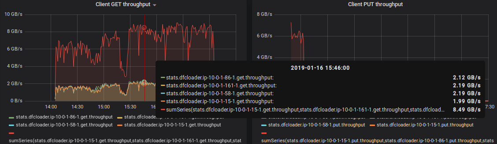

**August 2024 UPDATE**: added [complete reference](/docs/metrics-reference.md) that includes all supported metric names (both internal and visible externally), their respective types, and descriptions:

* [Reference: all supported metrics](/docs/metrics-reference.md)

## Introduction

AIStore tracks, logs, and reports a large and growing number of counters, latencies and throughputs including (but not limited to) metrics that reflect cluster recovery and global rebalancing, all [extended long-running operations](https://github.com/NVIDIA/aistore/blob/main/xact/README.md), and, of course, the basic read, write, list transactions and more.

Viewership is equally supported via:

1. System logs
2. [CLI](/docs/cli.md) and, in particular, [`ais show performance`](/docs/cli/performance.md) command
3. [Prometheus](/docs/prometheus.md)
4. Any [StatsD](https://github.com/etsy/statsd) compliant [backend](https://github.com/statsd/statsd/blob/master/docs/backend.md#supported-backends) including Graphite/Grafana

> For general information on AIS metrics, see [Statistics, Collected Metrics, Visualization](/docs/metrics.md).

> AIStore includes `aisloader` - a powerful tool that we use to simulate a variety of AI workloads. For numerous command-line options and usage examples, please see [`aisloader`](/docs/aisloader.md) and [How To Benchmark AIStore](/docs/howto_benchmark.md).

> Or, just run `make aisloader; aisloader` and see its detailed online help. Note as well that `aisloader` is fully StatsD-enabled and supports detailed protocol-level tracing with runtime on and off switching.

## Table of Contents
- [StatsD and Prometheus](#statsd-and-prometheus)
- [Conventions](#conventions)
  - [Proxy metrics: IO counters](#proxy-metrics-io-counters)
  - [Proxy metrics: error counters](#proxy-metrics-error-counters)
  - [Proxy metrics: latencies](#proxy-metrics-latencies)
  - [Target metrics](#target-metrics)
  - [AIS loader metrics](#ais-loader-metrics)
- [Debug-Mode Observability](#debug-mode-observability)

## StatsD and Prometheus

AIStore generates a growing number of detailed performance metrics. Other than AIS logs, the stats can be viewed via:

* StatsD/Grafana visualization
or
* Prometheus visualization

> [StatsD](https://github.com/etsy/statsd) publishes local statistics to a compliant backend service (e.g., [Graphite](https://graphite.readthedocs.io/en/latest/)) for easy and powerful stats aggregation and visualization.

> AIStore is a fully compliant [Prometheus exporter](https://prometheus.io/docs/instrumenting/writing_exporters/) that natively supports [Prometheus](https://prometheus.io/) stats collection. There's no special configuration - the only thing required to enable the corresponding integration is letting AIStore know whether to publish its stats via StatsD **or** Prometheus.

The StatsD/Grafana option imposes a certain easy-to-meet requirement on the AIStore deployment. Namely, it requires that StatsD daemon (aka service) is **deployed locally with each AIS target and with each AIS proxy**.

At startup AIStore daemons, both targets and gateways, try to UDP-ping their respective local [StatsD](https://github.com/etsy/statsd) daemons on the UDP port `8125` unless redefined via environment `AIS_STATSD_PORT`. You can disable StatsD reachability probing by setting another environment variable - `AIS_STATSD_PROBE` - to `false` or `no`.

If StatsD server is *not* listening on the local 8125, the local AIS target (or proxy) will then run without StatsD, and the corresponding stats won't be captured and won't be visualized.

> For details on all StatsD-supported backends, please refer to [this document](https://github.com/etsy/statsd/blob/master/docs/backend.md).

> For Prometheus integration, please refer to [this separate document](/docs/prometheus.md)

## Conventions

All AIS metric names (or simply, metrics) are logged and reported to the StatsD/Grafana using the following naming pattern:

`prefix.bucket.metric_name.metric_value|metric_type`, where `prefix` is one of:

* `aisproxy.<daemon_id>`
* `aistarget.<daemon_id>`
or
* `aisloader.<hostname>-<id>`

and `metric_type` is `ms` for time duration, `c` for a counter, and `g` for a gauge.

More precisely, AIS metrics are named and grouped as follows:

### Proxy metrics: IO counters

All collected/tracked *counters* are 64-bit cumulative integers that continuously increment with each event that they (respectively) track.

| Name | Comment |
| --- | --- |
| `aisproxy.<daemon_id>.get` | number of GET-object requests |
| `aisproxy.<daemon_id>.put` | number of PUT-object requests |
| `aisproxy.<daemon_id>.del` | number of DELETE-object requests |
| `aisproxy.<daemon_id>.lst` | number of LIST-objects requests |
| `aisproxy.<daemon_id>.ren` | ... RENAME ... |
| `aisproxy.<daemon_id>.pst` | ... POST ... |

### Proxy metrics: error counters

| Name | Comment |
| --- | --- |
| `aisproxy.<daemon_id>.err` | Total number of errors |
| `aisproxy.<daemon_id>.err.get` | Number of GET-object errors |
| `aisproxy.<daemon_id>.err.put` | Number of PUT-object errors |
| `aisproxy.<daemon_id>.err.head` | Number of HEAD-object errors |
| `aisproxy.<daemon_id>.err.delete` | Number of DELETE-object errors |
| `aisproxy.<daemon_id>.err.list` | Number of LIST-objects errors |
| `aisproxy.<daemon_id>.err.range` | ... RANGE ... |
| `aisproxy.<daemon_id>.err.post` | ... POST ... |

> For the most recently updated list of counters, please refer to [the source](/stats/common_stats.go)

### Proxy metrics: latencies

All request latencies are reported to **StatsD/Grafana in milliseconds**.

> **Note**: each `aisnode` (proxy and target) periodically logs the same latencies in microseconds with a (configurable) logging interval (default = 10s).

> Generally, AIStore logs can be considered a redundant source of information on system performance - the information that can be used either in addition to Graphite/Grafana or when the latter is not deployed or configured.

| Name | Comment |
| --- | --- |
| `aisproxy.<daemon_id>.get` | GET-object latency |
| `aisproxy.<daemon_id>.lst` | LIST-objects latency |
| `aisproxy.<daemon_id>.kalive` | Keep-Alive (roundtrip) latency |

### Target Metrics

AIS target metrics include **all** of the proxy metrics (see above), plus the following:

| Name | Comment |
| --- | --- |
| `aistarget.<daemon_id>.get.cold` | number of cold-GET object requests |
| `aistarget.<daemon_id>.get.cold.size` | cold GET cumulative size (in bytes) |
| `aistarget.<daemon_id>.lru.evict` | number of LRU-evicted objects |
| `aistarget.<daemon_id>.tx` | number of objects sent by the target |
| `aistarget.<daemon_id>.tx.size` | cumulative size (in bytes) of all transmitted objects |
| `aistarget.<daemon_id>.rx` |  number of objects received by the target |
| `aistarget.<daemon_id>.rx.size` | cumulative size (in bytes) of all the received objects |

> For the most recently updated list of counters, please refer to [the source](/stats/target_stats.go)

### AIS loader metrics

AIS loader generates metrics for 3 (three) types of requests:

* GET (object) - metric names are prefixed with `aisloader.<ip>.<loader_id>.get.`
* PUT (object) - metric names start with `aisloader.<ip>.<loader_id>.put.`
* Read cluster configuration - the prefix includes `aisloader.<ip>.<loader_id>.getconfig.`

All latency metrics are in milliseconds, all sizes are always in bytes.

#### GET object

> **Note**: in the tables below, traced intervals of time are denoted as **(from time, to time)**, respectively.

| Name | Comment |
| --- | --- |
| `aisloader.<hostname>-<id>.get.pending.<value>` | number of unfinished GET requests waiting in a queue (updated after every completed request) |
| `aisloader.<hostname>-<id>.get.count.1` | total number of requests |
| `aisloader.<hostname>-<id>.get.error.1` | total number of failed requests |
| `aisloader.<hostname>-<id>.get.throughput.<value>` | total size of received objects |
| `aisloader.<hostname>-<id>.get.latency.<value>` | request latency = (request initialized, data transfer successfully completes) |
| `aisloader.<hostname>-<id>.get.latency.proxyconn.<value>` | (request started, connected to a proxy) |
| `aisloader.<hostname>-<id>.get.latency.proxy.<value>` | (connected to proxy, proxy redirected) |
| `aisloader.<hostname>-<id>.get.latency.targetconn.<value>` | (proxy redirected, connected to target) |
| `aisloader.<hostname>-<id>.get.latency.target.<value>` | (connected to target, target responded) |
| `aisloader.<hostname>-<id>.get.latency.posthttp.<value>` | (target responded, data transfer completed) |
| `aisloader.<hostname>-<id>.get.latency.proxyheader.<value>` | (proxy makes a connection, proxy finishes writing headers to the connection) |
| `aisloader.<hostname>-<id>.get.latency.proxyrequest.<value>` | (proxy finishes writing headers, proxy completes writing request to the connection) |
| `aisloader.<hostname>-<id>.get.latency.proxyresponse.<value>` | (proxy finishes writing request to a connection, proxy gets the first bytes of the response) |
| `aisloader.<hostname>-<id>.get.latency.targetheader.<value>` | (target makes a connection, target finishes writing headers to the connection) |
| `aisloader.<hostname>-<id>.get.latency.targetrequest.<value>` | (target finishes writing headers, target completes writing request to the connection) |
| `aisloader.<hostname>-<id>.get.latency.targetresponse.<value>` | (target finishes writing request, proxy gets the first bytes of the response) |

#### PUT object

> **Note**: in the table, traced intervals of time are denoted as **(from time, to time)**:

| Name | Comment |
| --- | --- |
| `aisloader.<hostname>-<id>.put.pending.<value>` | number of unfinished PUT requests waiting in a queue (updated after every completed request) |
| `aisloader.<hostname>-<id>.put.count.1` | total number of requests |
| `aisloader.<hostname>-<id>.put.error.1` | total number of failed requests |
| `aisloader.<hostname>-<id>.put.throughput.<value>` | total size of objects PUT into a bucket |
| `aisloader.<hostname>-<id>.put.latency.<value>` | request latency = (request initialized, data transfer successfully complete) |
| `aisloader.<hostname>-<id>.put.latency.proxyconn.<value>` | (request started, connected to proxy) |
| `aisloader.<hostname>-<id>.put.latency.proxy.<value>` | (connected to proxy, proxy redirected) |
| `aisloader.<hostname>-<id>.put.latency.targetconn.<value>` | (proxy redirected, connected to target) |
| `aisloader.<hostname>-<id>.put.latency.target.<value>` | (connected to target, target responded) |
| `aisloader.<hostname>-<id>.put.latency.posthttp.<value>` | (target responded, data transfer completed) |
| `aisloader.<hostname>-<id>.put.latency.proxyheader.<value>` | (proxy makes a connection, proxy finishes writing headers) |
| `aisloader.<hostname>-<id>.put.latency.proxyrequest.<value>` | (proxy finishes writing headers, proxy completes writing request) |
| `aisloader.<hostname>-<id>.put.latency.proxyresponse.<value>` | (proxy finishes writing request, proxy gets the first bytes of the response) |
| `aisloader.<hostname>-<id>.put.latency.targetheader.<value>` | (target makes a connection, target finishes writing headers) |
| `aisloader.<hostname>-<id>.put.latency.targetrequest.<value>` | (target finishes writing headers, target completes writing request) |
| `aisloader.<hostname>-<id>.put.latency.targetresponse.<value>` | (target finishes writing request, proxy gets the first bytes of the response) |

#### Read cluster configuration

> **Note**: traced intervals of time are denoted as **(from time, to time)**:

| Name | Comment |
| --- | --- |
| `aisloader.<hostname>-<id>.getconfig.count.1` | total number of requests to read cluster settings |
| `aisloader.<hostname>-<id>.getconfig.latency.<value>` | request latency = (read configuration request started, configuration received) |
| `aisloader.<hostname>-<id>.getconfig.latency.proxyconn.<value>` | (read configuration request started, connection to a proxy is made) |
| `aisloader.<hostname>-<id>.getconfig.latency.proxy.<value>` | (connection to a proxy is made, proxy redirected the request) |

A somewhat outdated example of how these metrics show up in the Grafana dashboard follows:



## Debug-Mode Observability

For development and, more generally, for any non-production deployments AIS supports [building with debug](/Makefile), for instance:

```sh
$ MODE=debug make deploy
```

As usual, debug builds incorporate more runtime checks and extra logging. But in addition AIS debug build provides a special **API endpoint** at `hostname:port/debug/vars` that can be accessed (via browser or Curl) at any time to display the current values of:

* all stats counters (including error counters)
* all latencies including keepalive
* mountpath capacities
* mountpath (disk) utilizations
* total number of goroutines
* memory stats

and more.

> Notation `hostname:port` stands for TCP endpoint of *any* deployed AIS node, gateway or storage target.

Example output:

```console
$ curl hostname:port/debug/vars
{
"ais.ios": {"/ais/mp1:util%": 20, "/ais/mp2:util%": 23, "/ais/mp3:util%": 22, "/ais/mp4:util%": 25},
"ais.stats": {"kalive.ns": 735065, "lst.n": 45, "lst.ns": 2892015, "num-goroutines": 27, "put.n": 1762, "put.ns": 1141380, "put.redir.ns": 16596465, "up.ns.time": 30012389406},
"cmdline": ["/bin/aisnode","-config=.ais/ais.json","-local_config=.ais/ais_local.json","-role=target"],
"memstats": {"Alloc":43209256,"TotalAlloc":57770120,"Sys":75056128,"Lookups":0,"Mallocs":215893,"Frees":103090,"HeapAlloc":43209256, ...}
...
}
```
