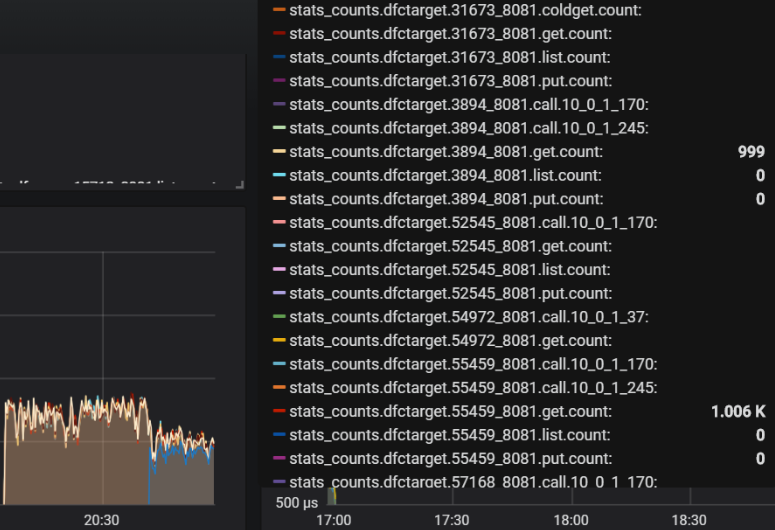

## Table of Contents
- [Background](#background)
- [Conventions](#conventions)
    - [Proxy metrics: IO counters](#proxy-metrics-io-counters)
    - [Proxy metrics: error counters](#proxy-metrics-error-counters)
    - [Proxy metrics: latencies](#proxy-metrics-latencies)
    - [Target metrics](#target-metrics)
    - [AIS loader metrics](#ais-loader-metrics)

## Background

AIStore generates a growing number of detailed performance metrics that can be viewed both via AIS logs and via StatsD/Grafana visualization.

> [StatsD](https://github.com/etsy/statsd) publishes local statistics to a compliant backend service (e.g., [Graphite](https://graphite.readthedocs.io/en/latest/)) for easy and powerful stats aggregation and visualization.

The StatsD/Grafana option imposes a certain easy-to-meet requirement on the AIStore deployment. Namely, it requires that StatsD daemon (aka service) is **deployed locally with each AIS target and with each AIS proxy**.

At startup AIStore daemons, both targets and gateways, try to UDP-ping their respective local [StatsD](https://github.com/etsy/statsd) daemons on the UDP port `8125` (which is currently fixed).

If StatsD daemon is *not* listening on the local 8125, the local AIS target (or proxy) will then run without StatsD, and the corresponding stats won't be captured and won't be visualized.

> For details on all StatsD-supported backends, prease refer to [this document](https://github.com/etsy/statsd/blob/master/docs/backend.md).

## Conventions

All AIS metric names (or simply, metrics) are logged and reported to the StatsD/Grafana using the following naming pattern:

`prefix.bucket.metric_name.metric_value|metric_type`, where `prefix` is one of:

* `aisproxy.<daemon_id>`
* `aistarget.<daemon_id>`
or
* `aisloader.<ip>.<loader_id>`

and `metric_type` is `ms` for time duration, `c` for a counter, and `g` for a gauge.

More precisely, AIS metrics are named and grouped as follows:

### Proxy metrics: IO counters

All collected/tracked *counters* are 64-bit cumulative integers that continuously increment with each event that they (respectively) track.

| Name | Comment |
| --- | --- |
| `aisproxy.<daemon_id>.get` | number of GET-object requests |
| `aisproxy.<daemon_id>.put` | number of PUT-object requests |
| `aisproxy.<daemon_id>.del` | number of DELETE-object requests |
| `aisproxy.<daemon_id>.lst` | number of LIST-bucket requests |
| `aisproxy.<daemon_id>.ren` | ... RENAME ... |
| `aisproxy.<daemon_id>.pst` | ... POST ... |

### Proxy metrics: error counters

| Name | Comment |
| --- | --- |
| `aisproxy.<daemon_id>.err` | Total number of errors |
| `aisproxy.<daemon_id>.err.get` | Number of GET-object errors |
| `aisproxy.<daemon_id>.err.put` | Number of PUT-object errors |
| `aisproxy.<daemon_id>.err.head` | Number of HEAD-object errors |
| `aisproxy.<daemon_id>.err.delete` | Number of DELETE-object errors |
| `aisproxy.<daemon_id>.err.list` | Number of LIST-bucket errors |
| `aisproxy.<daemon_id>.err.range` | ... RANGE ... |
| `aisproxy.<daemon_id>.err.post` | ... POST ... |

> For the most recently updated list of counters, please refer to [the source](../stats/common_stats.go)

### Proxy metrics: latencies

All request latencies are reported to **StatsD/Grafana in milliseconds**.

> Note that the same values are periodically (default=10s) **logged in microseconds**.

| Name | Comment |
| --- | --- |
| `aisproxy.<daemon_id>.get` | GET-object latency |
| `aisproxy.<daemon_id>.lst` | LIST-bucket latency |
| `aisproxy.<daemon_id>.kalive` | Keep-Alive (roundtrip) latency |

### Target Metrics

AIS target metrics include **all** of the proxy metrics (see above), plus the following:

| Name | Comment |
| --- | --- |
| `aistarget.<daemon_id>.get.cold` | number of cold-GET object requests |
| `aistarget.<daemon_id>.get.cold.size` | cold GET cumulative size (in bytes) |
| `aistarget.<daemon_id>.lru.evict` | number of LRU-evicted objects |
| `aistarget.<daemon_id>.tx` | number of objects sent by the target |
| `aistarget.<daemon_id>.tx.size` | cumulative size (in bytes) of all transmitted objects |
| `aistarget.<daemon_id>.rx` |  number of objects received by the target |
| `aistarget.<daemon_id>.rx.size` | cumulative size (in bytes) of all the received objects |

> For the most recently updated list of counters, please refer to [the source](../stats/target_stats.go)

A somewhat outdated example of how these metrics show up in the Grafana dashboard follows:

### AIS loader metrics

AIS loader generates metrics for 3 (three) types of requests:

* GET (object) - metric names are prefixed with `aisloader.<ip>.<loader_id>.get.`
* PUT (object) - metric names start with `aisloader.<ip>.<loader_id>.put.`
* Read cluster configuration - the prefix includes `aisloader.<ip>.<loader_id>.getconfig.`

All latency metrics are in milliseconds, all sizes are always in bytes.

#### GET object

> Note: in the tables below, traced intervals of time are denoted as **(from time, to time)**, respectively.

| Name | Comment |
| --- | --- |
| `aisloader.<ip>.<loader_id>.get.pending.<value>` | number of unfinished GET requests waiting in a queue (updated after every completed request) |
| `aisloader.<ip>.<loader_id>.get.count.1` | total number of requests |
| `aisloader.<ip>.<loader_id>.get.error.1` | total number of failed requests |
| `aisloader.<ip>.<loader_id>.get.throughput.<value>` | total size of received objects |
| `aisloader.<ip>.<loader_id>.get.latency.<value>` | request latency = (request initialized, data transfer successfully completes) |
| `aisloader.<ip>.<loader_id>.get.latency.proxyconn.<value>` | (request started, connected to a proxy) |
| `aisloader.<ip>.<loader_id>.get.latency.proxy.<value>` | (connected to proxy, proxy redirected) |
| `aisloader.<ip>.<loader_id>.get.latency.targetconn.<value>` | (proxy redirected, connected to target) |
| `aisloader.<ip>.<loader_id>.get.latency.target.<value>` | (connected to target, target responded) |
| `aisloader.<ip>.<loader_id>.get.latency.posthttp.<value>` | (target responded, data transfer completed) |
| `aisloader.<ip>.<loader_id>.get.latency.proxyheader.<value>` | (proxy makes a connection, proxy finishes writing headers to the connection) |
| `aisloader.<ip>.<loader_id>.get.latency.proxyrequest.<value>` | (proxy finishes writing headers, proxy completes writing request to the connection) |
| `aisloader.<ip>.<loader_id>.get.latency.proxyresponse.<value>` | (proxy finishes writing request to a connection, proxy gets the first bytes of the response) |
| `aisloader.<ip>.<loader_id>.get.latency.targetheader.<value>` | (target makes a connection, target finishes writing headers to the connection) |
| `aisloader.<ip>.<loader_id>.get.latency.targetrequest.<value>` | (target finishes writing headers, target completes writing request to the connection) |

#### PUT object

> Note: in the table, traced intervals of time are denoted as **(from time, to time)**:

| Name | Comment |
| --- | --- |
| `aisloader.<ip>.<loader_id>.put.pending.<value>` | number of unfinished PUT requests waiting in a queue (updated after every completed request) |
| `aisloader.<ip>.<loader_id>.put.count.1` | total number of requests |
| `aisloader.<ip>.<loader_id>.put.error.1` | total number of failed requests |
| `aisloader.<ip>.<loader_id>.put.throughput.<value>` | total size of objects PUT into a bucket |
| `aisloader.<ip>.<loader_id>.put.latency.<value>` | request latency = (request initialized, data transfer successfully complete) |
| `aisloader.<ip>.<loader_id>.put.latency.proxyconn.<value>` | (request started, connected to proxy) |
| `aisloader.<ip>.<loader_id>.put.latency.proxy.<value>` | (connected to proxy, proxy redirected) |
| `aisloader.<ip>.<loader_id>.put.latency.targetconn.<value>` | (proxy redirected, connected to target) |
| `aisloader.<ip>.<loader_id>.put.latency.target.<value>` | (connected to target, target responded) |
| `aisloader.<ip>.<loader_id>.get.latency.posthttp.<value>` | (target responded, data transfer completed) |
| `aisloader.<ip>.<loader_id>.put.latency.proxyheader.<value>` | (proxy makes a connection, proxy finishes writing headers) |
| `aisloader.<ip>.<loader_id>.put.latency.proxyrequest.<value>` | (proxy finishes writing headers, proxy completes writing request) |
| `aisloader.<ip>.<loader_id>.put.latency.proxyresponse.<value>` | (proxy finishes writing request, proxy gets the first bytes of the response) |
| `aisloader.<ip>.<loader_id>.put.latency.targetheader.<value>` | (target makes a connection, target finishes writing headers) |
| `aisloader.<ip>.<loader_id>.put.latency.targetrequest.<value>` | (target finishes writing headers, target completes writing request) |

#### Read cluster configuration

> Note: traced intervals of time are denoted as **(from time, to time)**:

| Name | Comment |
| --- | --- |
| `aisloader.<ip>.<loader_id>.getconfig.count.1` | total number of requests to read cluster settings |
| `aisloader.<ip>.<loader_id>.getconfig.latency.<value>` | request latency = (read configuration request started, configuration received) |
| `aisloader.<ip>.<loader_id>.getconfig.latency.proxyconn.<value>` | (read configuration request started, connection to a proxy is made) |
| `aisloader.<ip>.<loader_id>.getconfig.latency.proxy.<value>` | (connection to a proxy is made, proxy redirected the request) |
