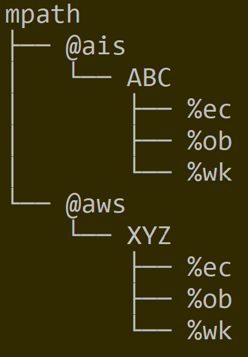
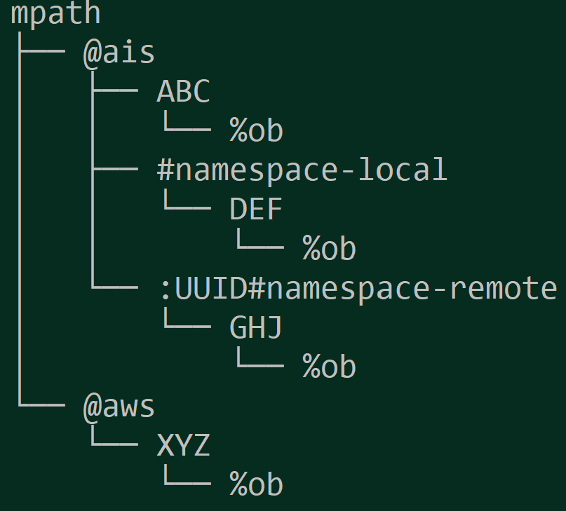

## On-Disk Layout

AIStore 3.0 introduces new on-disk layout that addresses several motivations including (but not limited to) the motivation to support multiple cloud backends. One of those Clouds can be (and starting with v3.0 **is**) AIStore itself with the immediate availability of AIS-to-AIS caching and a gamut of future capabilities: continuous data protection, DR, and more.

At a high level, with v3.0:

- in addition to checksum, all metadata (including object metadata) is versioned to provide for **backward compatibility** when (and *if*) there are any future changes;
- cluster-wide control structures -  in particular, cluster map and bucket metadata - are now uniformly GUID-protected and LZ4-compressed;
- bucket metadata is replicated, with multiple protected and versioned copies stored on data drives of **all** storage targets in a cluster.

In addition, release 3.0 adds configurable namespaces whereby users can choose to group selected buckets for the purposes of physical isolation from all other buckets and datasets, and/or applying common (for this group) storage management policies: erasure coding, n-way mirroring, etc. But more about it later.

Here's a simplified drawing depicting two [providers](providers.md), AIS and AWS, and two buckets, `ABC` and `XYZ`, respectively. In the picture, `mpath` is a single [mountpath](configuration.md) - a single disk **or** a volume formatted with a local filesystem of choice, **and** a local directory (`mpath/`):

Further, each bucket would have a unified structure with several system directories (e.g., `%ec` that stores erasure coded content) and, of course, user data under `%ob` ("object") locations.

Needless to say, the same exact structure reproduces itself across all AIS storage nodes, and all data drives of each clustered node.

With namespaces, the picture becomes only slightly more complicated. The following shows two AIS buckets, `DEF` and `GHJ`, under their respective user-defined namespaces called `#namespace-local` and `#namespace-remote`.  Unlike a local namespace of *this* cluster, the remote one would have to be prefixed with UUID - to uniquely identify another AIStore cluster hosting `GHJ` (in this example) and from where this bucket's content will be replicated or cached, on-demand or via Prefetch API and [similar](overview.md#existing-datasets).

### References

For the purposes of full disclosure and/or in-depth review, following are initial references into AIS sources that also handle on-disk representation of object metadata:

* [local object metadata (LOM)](/cluster/lom_xattr.go)

 and AIS control structures:

* [bucket metadata (BMD)](/ais/bucketmeta.go)
* [cluster map (Smap)](/ais/clustermap.go)

## System Files

In addition to user data, AIStore stores, maintains, and utilizes itself a relatively small number of system files that serve a variety of different purposes. Full description of the AIStore *persistence* would not be complete without listing those files (and their respective purposes) - for details, please refer to:

* [System Files](sysfiles.md)
