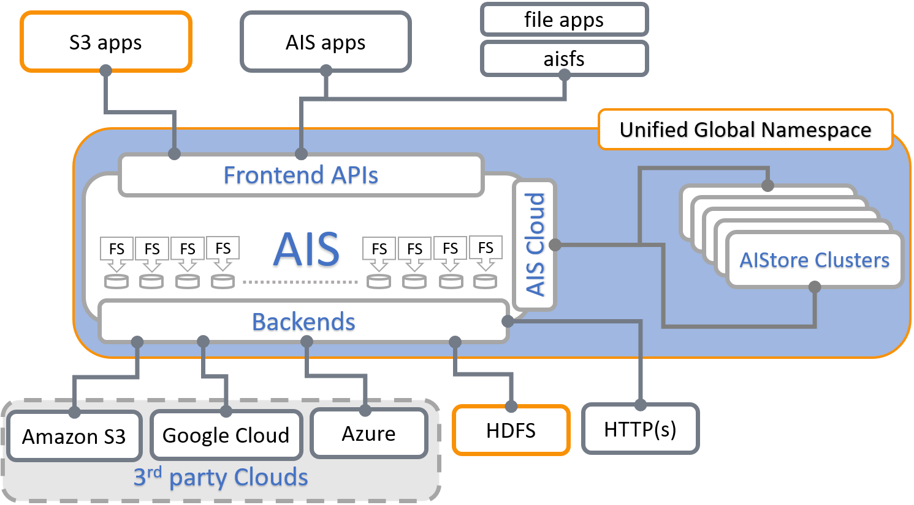

## Introduction

Training deep learning (DL) models on petascale datasets is essential for achieving competitive and state-of-the-art performance in applications such as speech, video analytics, and object recognition. However, existing distributed filesystems were not developed for the access patterns and usability requirements of DL jobs.

In this [white paper](https://arxiv.org/abs/2001.01858) we describe AIStore and components, and then compare system performance experimentally using image classification workloads and storing training data on a variety of backends. For details, please see:

* AIStore [white paper](https://arxiv.org/abs/2001.01858).
* IEEE BigData 2019 [poster](https://storagetarget.files.wordpress.com/2019/12/deep-learning-large-scale-phys-poster-1.pdf)

Also, for insights and specific requirements from a deep-learning perspective, please watch:

* [Introduction to Large Scale Deep Learning](https://www.youtube.com/watch?v=kNuA2wflygM&list=PL0dsKxFNMcX4XcB0w1Wm-pvSfQu-eWM26)

The rest of this document is structured as follows:

- [At-a-Glance](#at-a-glance)
- [ETL](#etl)
- [Recently Added](#recently-added)
- [Design Philosophy](#design-philosophy)
- [Key Concepts and Diagrams](#key-concepts-and-diagrams)
- [Traffic Patterns](#traffic-patterns)
- [Open Format](#open-format)
- [Existing Datasets](#existing-datasets)
- [Data Protection](#data-protection)
- [Scale-Out](#scale-out)
- [HA](#ha)
- [Other Services](#other-services)
- [dSort](#dsort)
- [CLI](#cli)
- [Python Client](#python-client)
- [AIS no-limitations principle](#ais-no-limitations-principle)


## At-a-Glance

Following is a high-level block diagram with an emphasis on supported (frontend and backend) APIs and the capability to scale-out horizontally. The picture also tries to make the point that AIStore aggregates arbitrary numbers of storage servers with local drives,  whereby each drive is formatted with a local filesystem (e. g., xfs or zfs).



## ETL

AIStore is a hyper-converged architecture tailored specifically to run AI apps. To that end, we are supporting [ETL offload](/etl/README.md): the capability to run custom extract-transform-load workloads close to data on (and by) the storage cluster:


For background and further references, see:

* [Extract, Transform, Load with AIStore](etl.md)
* [AIS-ETL introduction and a Jupyter notebook walk-through](https://www.youtube.com/watch?v=4PHkqTSE0ls)

## Recently Added

- (**new**) [AIS Kubernetes Operator](https://github.com/NVIDIA/ais-k8s)
- (**new**) DNS hostnames - public and intra-cluster networks;
- (**new**) HDFS backend;
- (**new**) Cluster and node shutdown and decommission (API, CLI);
- bucket ACLs, users and roles, bucket and cluster level permissions;
- [CLI](videos.md#cli-top-level-commands) (category, action, subject) auto-completions;
- (**new**) Metadata and system data versioning and backward compatibility;
- List objects v2: optimized `list-objects` to greatly reduce response times;
- (**new**) Query objects: extends `list-objects` with advanced filtering capabilities;
- (**new**) Downloader:  an option to keep AIS bucket in-sync with a (downloaded) destination;
- (**new**) Build-time option to run AIS cluster in a reverese-proxy mode;
- and more (for details, see https://github.com/NVIDIA/aistore/releases).

In addition to AIS (native) REST API and CLI with extended capabilities to manipulate distributed content, AIStore also supports a growing list of [Backend providers](providers.md).

Each specific capability is separately documented elsewhere. In particular, supported backend providers and *unified global namespace* are described [here](providers.md).

## Design Philosophy

It is often more optimal to let applications control how and whether the stored content is stored in chunks. That's the simple truth that holds, in particular, for AI datasets that are often pre-sharded with content and boundaries of those shards based on application-specific optimization criteria. More exactly, the datasets could be pre-sharded, post-sharded, and otherwise transformed to facilitate training, inference, and simulation by the AI apps.

The corollary of this statement is two-fold:

- Breaking objects into pieces (often called chunks but also slices, segments, fragments, and blocks) and the related functionality does not necessarily belong to an AI-optimized storage system per se;
- Instead of chunking the objects and then reassembling them with the help of cluster-wide metadata (that must be maintained with extreme care), the storage system could alternatively focus on providing assistance to simplify and accelerate dataset transformations.

Notice that the same exact approach works for the other side of the spectrum - the proverbial [small-file problem](https://www.quora.com/What-is-the-small-file-problem-in-Hadoop). Here again, instead of optimizing small-size IOPS, we focus on application-specific (re)sharding, whereby each shard would have a desirable size, contain a batch of the original (small) files, and where the files (aka samples) would be sorted to optimizes subsequent computation.

## Key Concepts and Diagrams

In this section: high-level diagrams that introduce key concepts and architecture, as well as possible deployment options.

AIS cluster *comprises* arbitrary (and not necessarily equal) numbers of **gateways** and **storage targets**. Targets utilize local disks while gateways are HTTP **proxies** that provide most of the control plane and never touch the data.

> The terms *gateway* and *proxy* are used interchangeably throughout this README and other sources in the repository.

Both **gateways** and **targets** are userspace daemons that join (and, by joining, form) a storage cluster at their respective startup times, or upon user request. AIStore can be deployed on any commodity hardware with pretty much any Linux distribution (although we do recommend 4.x kernel). There are no designed-in size/scale type limitations. There are no dependencies on special hardware capabilities. The code itself is free, open, and MIT-licensed.

The diagram depicting AIS clustered node follows below, and makes the point that gateways and storage targets can be colocated in a single machine (or a VM) but not necessarily:


AIS can be deployed as a self-contained standalone persistent storage cluster or a fast tier in front of any of the supported backends including Amazon S3 and Google Cloud (GCP). The built-in caching mechanism provides LRU replacement policy on a per-bucket basis while taking into account configurable high and low capacity watermarks (see [LRU](storage_svcs.md#lru) for details). AWS/GCP integration is *turnkey* and boils down to provisioning AIS targets with credentials to access Cloud-based buckets.

If (compute + storage) rack is a *unit of deployment*, it may as well look as follows:


Finally, AIS target provides a number of storage services with [S3-like RESTful API](http_api.md) on top and a MapReduce layer that we call [dSort](#dsort).


## Terminology

* [Backend Provider](providers.md) - an abstraction, and simultaneously an API-supported option, that allows to delineate between "remote" and "local" buckets with respect to a given AIS cluster.

* [Unified Global Namespace](providers.md) - AIS clusters *attached* to each other, effectively, form a super-cluster providing unified global namespace whereby all buckets and all objects of all included clusters are uniformly accessible via any and all individual access points (of those clusters).

* [Mountpath](configuration.md) - a single disk **or** a volume (a RAID) formatted with a local filesystem of choice, **and** a local directory that AIS utilizes to store user data and AIS metadata. A mountpath can be disabled and (re)enabled, automatically or administratively, at any point during runtime. In a given cluster, a total number of mountpaths would normally compute as a direct product of (number of storage targets) x (number of disks in each target).

## Traffic Patterns

In AIS, all inter- and intra-cluster networking is based on HTTP/1.1 (with HTTP/2 option currently under development).
HTTP(S) clients execute RESTful operations vis-à-vis AIS gateways and data then moves **directly** between the clients and storage targets with no metadata servers and no extra processing in-between:


> MDS in the diagram above stands for the metadata server(s) or service(s).

In the picture, a client on the left side makes an I/O request which is then fully serviced by the *left* target - one of the nodes in the AIS cluster (not shown).
Symmetrically, the *right* client engages with the *right* AIS target for its own GET or PUT object transaction.
In each case, the entire transaction is executed via a single TCP session that connects the requesting client directly to one of the clustered nodes.
As far as the datapath is concerned, there are no extra hops in the line of communications.

> For detailed traffic patterns diagrams, please refer to [this readme](traffic_patterns.md).

Distribution of objects across AIS cluster is done via (lightning fast) two-dimensional consistent-hash whereby objects get distributed across all storage targets and, within each target, all local disks.

## Open Format

AIS targets utilize local Linux filesystems including (but not limited to) xfs, ext4, and openzfs. User data is checksummed and stored *as is* without any alteration (that also allows us to support direct client <=> disk datapath). AIS on-disk format is, therefore, largely defined by local filesystem(s) chosen at deployment time.

Notwithstanding, AIS stores and then maintains object replicas, erasure-coded slices, bucket metadata - in short, a variety of local and global-scope (persistent) structures - for details, please refer to:

- [On-Disk Layout](on_disk_layout.md)

> **You can access your data with and without AIS, and without any need to *convert* or *export/import*, etc. - at any time! Your data is stored in its original native format using user-given object names. Your data can be migrated out of AIS at any time as well, and, again, without any dependency whatsoever on the AIS itself.**

> Your own data is [unlocked](https://en.wikipedia.org/wiki/Vendor_lock-in) and immediately available at all times.

## Existing Datasets

One common way to use AIStore includes the most basic step: populating it with an existing dataset, or datasets from remote buckets (AWS, Google Cloud, Azure, or HDFS) or any vanilla HTTP(S) resources. To this end, AIS provides 6 (six) easy ways ranging from the (conventional) on-demand caching to (advanced) *promoting* of colocated files and directories:

1. [Cold GET](#existing-datasets-cold-get)
2. [Prefetch](#existing-datasets-batch-prefetch)
3. [Internet Downloader](#existing-datasets-integrated-downloader)
4. [HTTP(S) Datasets](#existing-datasets-https-datasets)
5. [Promote (API and CLI)](#existing-datasets-promote-api-and-cli)
6. [Backend Bucket](bucket.md#backend-bucket)

In particular:

### Existing Datasets: Cold GET

If the dataset in question is accessible via S3-like object API, start working with it via GET primitive of the [AIS API](http_api.md). Just make sure to provision AIS with the corresponding credentials to access the dataset's bucket in the Cloud.

> As far as supported S3-like backends, AIS currently supports Amazon S3, Google Cloud, and Azure.

> AIS executes *cold GET* from the Cloud if and only if the object is not stored (by AIS), **or** the object has a bad checksum, **or** the object's version is outdated.

In all other cases, AIS will service the GET request without going to Cloud.

### Existing Datasets: Batch Prefetch

Alternatively or in parallel, you can also *prefetch* a flexibly-defined *list* or *range* of objects from any given remote bucket, as described in [this readme](batch.md).

### Existing Datasets: integrated Downloader

But what if the dataset in question exists in the form of (vanilla) HTTP/HTTPS URL(s)? What if there's a popular bucket in, say, Google Cloud that contains images that you'd like to bring over into your Data Center and make available locally for AI researchers?

For these and similar use cases we have [AIS Downloader](/docs/downloader.md) - an integrated tool that can execute massive download requests, track their progress, and populate AIStore directly from the Internet.

### Existing Datasets: HTTP(S) Datasets

AIS can also be designated as HTTP proxy vis-à-vis 3rd party object storages. This mode of operation requires:

1. HTTP(s) client side: set the `http_proxy` (`https_proxy` - for HTTPS) environment
2. Disable proxy for AIS cluster IP addresses/hostnames (for `curl` use option `--noproxy`)

Note that `http_proxy` is supported by most UNIX systems and is recognized by most (but not all) HTTP clients:

WARNING: Currently HTTP(S) based datasets can only be used with clients which support an option of overriding the proxy for certain hosts (for e.g. `curl ... --noproxy=$(curl -s G/v1/cluster?what=target_ips)`).
If used otherwise, we get stuck in a redirect loop, as the request to target gets redirected via proxy.

```console
$ export http_proxy=<AIS proxy IPv4 or hostname>
```

In combination, these two settings have an effect of redirecting all **unmodified** client-issued HTTP(S) requests to the AIS proxy/gateway with subsequent execution transparently from the client perspective. AIStore will on the fly create a bucket to store and cache HTTP(S) reachable files all the while supporting the entire gamut of functionality including ETL. Examples for HTTP(S) datasets can be found in [this readme](bucket.md#public-https-dataset)

### Existing Datasets: Promote (API and CLI)

Finally, AIS can *promote* files and directories to objects. The only requirement is that the files and directories in question are colocated within AIS storage target machines.

Let's consider a quick example. Say, some (or all) of the deployed storage nodes contain a directory called `/tmp/mydata`. By running the following [CLI](/docs/cli.md), we could make AIS objects (**one file = one object**) out of all files scattered across all nodes:

```console
$ ais object promote /tmp/mydata mybucket/ -r --keep=false
```

In this example, `mybucket` would be the designated (destination) bucket.

## Data Protection

AIS [supports](storage_svcs.md) end-to-end checksum protection, 2-way local mirroring, and Reed-Solomon [erasure coding](storage_svcs.md#erasure-coding) - thus providing for arbitrary user-defined levels of cluster-wide data redundancy and space efficiency.

## Scale-Out

The scale-out category includes balanced and fair distribution of objects where each storage target will store (via a variant of the consistent hashing) 1/Nth of the entire namespace where (the number of objects) N is unlimited by design.

> AIS cluster capability to **scale-out is truly unlimited**. The real-life limitations can only be imposed by the environment - capacity of a given Data Center, for instance.

Similar to the AIS gateways, AIS storage targets can join and leave at any moment causing the cluster to rebalance itself in the background and without downtime.

## HA

AIS features a [highly-available control plane](ha.md) where all gateways are absolutely identical in terms of their (client-accessible) data and control plane [APIs](http_api.md). Gateways can be ad hoc added and removed, deployed remotely and/or locally to the compute clients (the latter option will eliminate one network roundtrip to resolve object locations).

## Fast Tier
AIS can be deployed as a fast tier in front of existing Amazon S3 and Google Cloud (GCP) storage.

As a fast tier, AIS populates itself on demand (via *cold* GETs) and/or via its own *prefetch* API (see [List/Range Operations](batch.md#listrange-operations)) that runs in the background to download batches of objects.

## Other Services

The (quickly growing) list of services includes (but is not limited to):
* [health monitoring and recovery](/health/fshc.md)
* [range read](http_api.md)
* [dry-run (to measure raw network and disk performance)](performance.md#performance-testing)
* performance and capacity monitoring with full observability via StatsD/Grafana
* load balancing

> Load balancing consists in optimal selection of a local object replica and, therefore, requires buckets configured for [local mirroring](storage_svcs.md#read-load-balancing).

Most notably, AIStore provides **[dSort](/docs/dsort.md)** - a MapReduce layer that performs a wide variety of user-defined merge/sort *transformations* on large datasets used for/by deep learning applications.

## dSort

DSort “views” AIS objects as named shards that comprise archived key/value data. In its 1.0 realization, dSort supports tar, zip, and tar-gzip formats and a variety of built-in sorting algorithms; it is designed, though, to incorporate other popular archival formats including `tf.Record` and `tf.Example` ([TensorFlow](https://www.tensorflow.org/tutorials/load_data/tfrecord)) and [MessagePack](https://msgpack.org/index.html). The user runs dSort by specifying an input dataset, by-key or by-value (i.e., by content) sorting algorithm, and a desired size of the resulting shards. The rest is done automatically and in parallel by the AIS storage targets, with no part of the processing that’d involve a single-host centralization and with dSort stage and progress-within-stage that can be monitored via user-friendly statistics.

By design, dSort tightly integrates with the AIS-object to take full advantage of the combined clustered CPU and IOPS. Each dSort job (note that multiple jobs can execute in parallel) generates a massively-parallel intra-cluster workload where each AIS target communicates with all other targets and executes a proportional "piece" of a job. This ultimately results in a *transformed* dataset optimized for subsequent training and inference by deep learning apps.

## CLI

AIStore includes an easy-to-use management-and-monitoring facility called [AIS CLI](/docs/cli.md). Once [installed](/docs/cli.md#getting-started), to start using it, simply execute:

 ```console
$ export AIS_ENDPOINT=http://G
$ ais --help
 ```

where `G` (above) denotes a `hostname:port` address of any AIS gateway (for developers it'll often be `localhost:8080`). Needless to say, the "exporting" must be done only once.

One salient feature of AIS CLI is its Bash style [auto-completions](/docs/cli.md#ais-cli-shell-auto-complete) that allow users to easily navigate supported operations and options by simply pressing the TAB key:


AIS CLI is currently quickly developing. For more information, please see the project's own [README](/docs/cli.md).

## AIS no-limitations principle
There are **no** designed-in limitations on the:

* object sizes
* total number of objects and buckets in AIS cluster
* number of objects in a single AIS bucket
* numbers of gateways (proxies) and storage targets in AIS cluster

Ultimately, the limit on object size may be imposed by a local filesystem of choice and a physical disk capacity. While limit on the cluster size - by the capacity of the hosting AIStore Data Center. But as far as AIS itself, it does not impose any limitations whatsoever.
