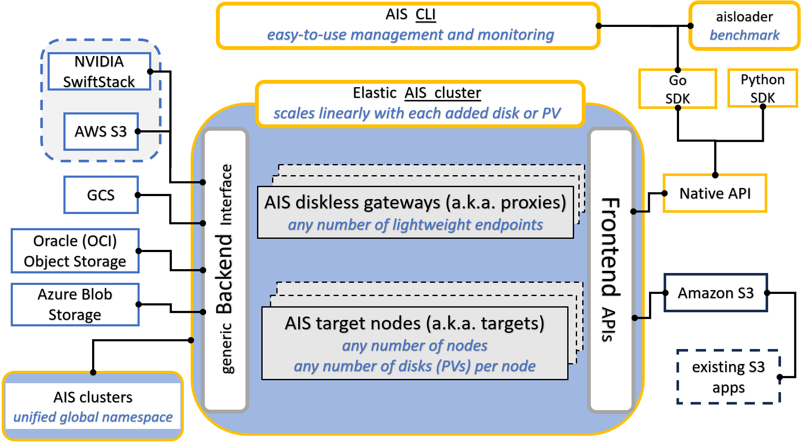
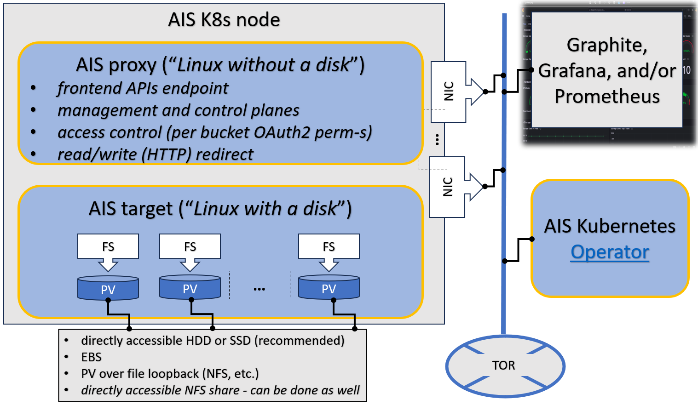
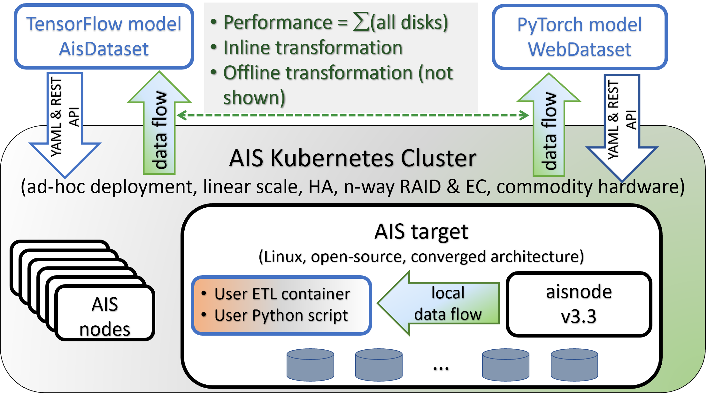

## Introduction

Training large models on petascale datasets is essential for achieving competitive and state-of-the-art performance in applications such as speech, video analytics, and object recognition. However, existing distributed filesystems were not designed for the access patterns and usability requirements of petascale AI jobs.

In this [original white paper](https://arxiv.org/abs/2001.01858) we describe AIStore (AIS) and components, and then compare system performance experimentally using image classification workloads and storing training data on a variety of backends.

The rest of this document is structured as follows:

- [At a glance](#at-a-glance)
- [Terminology](#terminology)
  - [Backend Provider](#backend-provider)
  - [Mountpath](#mountpath)
  - [Proxy](#proxy)
  - [Read-after-Write Consistency](#read-after-write-consistency)
  - [Xaction](#xaction)
  - [Shard](#shard)
  - [Target](#target)
  - [Unified Namespace](#unified-namespace)
  - [Write-through](#write-through)
- [Design Philosophy](#design-philosophy)
- [Original Diagrams](#original-diagrams)
- [CLI](#cli)
- [AIStore API](#aistore-api)
- [Traffic Patterns](#traffic-patterns)
- [Open Format](#open-format)
- [Existing Datasets](#existing-datasets)
- [Data Protection](#data-protection)
  - [Erasure Coding vs IO Performance](#erasure-coding-vs-io-performance)
- [Scale-Out](#scale-out)
- [Networking](#networking)
- [HA](#ha)
- [Sharding extensions: dSort and iShard](#sharding-extensions-dsort-and-ishard)
- [ETL](#etl)
- [_No limitations_ principle](#no-limitations-principle)

## At a glance

Following is a high-level **block diagram** with an emphasis on supported frontend and backend APIs, and the capability to scale-out horizontally. The picture also tries to make the point that AIS aggregates an arbitrary number of storage servers ([targets](#target)) with local or locally accessible drives, whereby each drive is formatted with a local filesystem of choice (e.g., xfs or zfs).



In any AIS cluster, there are **two kinds of nodes**: proxies (a.k.a. gateways) and targets (storage nodes):



Proxies provide access points ("endpoints") for the frontend API. At any point in time there is a single **primary** proxy that also controls versioning and distribution of the current cluster map. When and if the primary fails, another proxy is majority-elected to perform the (primary) role.

All user data is equally distributed (or [balanced](/docs/rebalance.md)) across all storage nodes ("targets"). Which, combined with zero (I/O routing and metadata processing) overhead, provides for linear scale with no limitation on the total number of aggregated storage drives.

## Terminology

> **Tip:** Terms are listed alphabetically so you can quickly jump to the one you need.
> Cross-links like **[Target](#target)** and **[Backend Provider](#backend-provider)** resolve within this page.

---

### Backend Provider
Backend provider (or simply **backend**) is an abstraction, and simultaneously an API-supported option that differentiates between "remote" (e.g., `s3://`) and "local" (`ais://`) buckets with respect to a given AIS cluster. AIS [supports multiple storage backends](images/supported-backends.png) including its own.

> See [providers](providers.md) for the current list of supported clouds and instructions on chaining AIS clusters.

---

### Mountpath
AIS target mountpath is a formatted disk (or RAID volume) **plus** a directory that AIS fully owns for storing user data and system metadata.

* One mountpath per physical disk/RAID (no sharing).
* Mountpath directories cannot be nested.
* Mountpaths can be **enabled / disabled** and **attached / detached** at runtime to replace faulted drives, expand or shrink capacity with no downtime.
* In a typical deployment, *total mountpaths = number of targets × disks-per-target*.

> **Note on Kubernetes deployments**: While AIStore natively supports hot-plugging mountpaths at runtime, this capability is limited in Kubernetes environments. Kubernetes (as of v1.33) does not support attaching new Persistent Volumes to running pods. In production Kubernetes deployments, adding new storage typically requires a controlled pod restart (meaning, zero-downtime is not possible without specialized extensions).

---

### Proxy
A disk-less **gateway** that exposes the AIS REST and S3-compatible APIs.

* Proxies never see or touch user data in flight.
* Exactly one proxy is elected **primary** (leader); only the primary can update cluster-level metadata including the cluster map.
* The terms *proxy* and *gateway* are interchangeable.
* For symmetry we usually deploy one proxy per target, but that is not a requirement.

---

### Read-after-Write Consistency
`PUT(object)` is a transaction. An object (or new version) becomes visible **only after** AIS has:

1. Written the first local replica and its metadata.
2. (For remote backends) completed remote `PUT` (using the vendor SDK), stored remote metadata (in-cluster), and optionally validated checksums.

Subsequent reads through **any** gateway always return the same content. Extra replicas or erasure-coded slices are created asynchronously.

The same guarantee applies to every _writing scenario_, including cold-GET request(s), bucket copies, transforms, archives, prefetches, large-blob downloads, renames, promotions, and more.

---

### Shard
In AIStore, sharding refers to the process of serializing original files and/or objects (such as images and labels) into larger-sized objects formatted as TAR, TGZ, ZIP, or TAR.LZ4 archives.

The benefits of serialization are well-established: iterable formats like TAR enable purely sequential I/O operations, significantly improving performance on local drives. In the context of machine learning, sharding enhances data shuffling and eliminates bias, allowing for global shuffling of shard names and the use of a shuffle buffer on the client side to ensure adequate randomization of training data.

Additionally, a shard is an object that can follow a specific convention, where related files (such as abc.jpeg, abc.cls, and abc.json) are packaged together in a single TAR archive. While AIS can read, write, and list any TAR, using this convention ensures that components necessary for ML training are kept together.

In short, sharding:
* Enables fully sequential I/O for high throughput.
* Ideal for ML workflows: global shuffling of shard names + client-side shuffle buffer eliminates bias.
* AIS can **read, write, append, and list** archives natively.
* Convention: related files (`abc.jpeg`, `abc.cls`, `abc.json`, …) live in the same shard so all components stay together.

Further reading:
* [Archive support](/docs/archive.md)
* [CLI archive command](/docs/cli/archive.md)
* [`ishard` tool](https://github.com/NVIDIA/aistore/blob/main/cmd/ishard/README.md)
* [Distributed Shuffle](/docs/cli/dsort.md)
* WebDataset format: [Hugging Face WebDataset docs](https://huggingface.co/docs/hub/datasets-webdataset)

---

### Target
A storage node in an AIS cluster.

* Stores user objects on one or more [mountpaths](#mountpath).

> In documentation and code, "target" always means "storage node in an AIS cluster."

---

### Unified Namespace
When AIS clusters are **attached** to each other they form a super-cluster with a single, global namespace: every bucket and object is reachable via any node in any member cluster.
Clients use a single endpoint and reference shared buckets with cluster-specific identifiers.

---

### Write-through
With remote backends, the remote `PUT` is part of the same write transaction that finalizes the first local replica.
If the remote `PUT` fails, the whole operation fails and AIS rolls back locally.

---

### Xaction
Xaction (*eXtended action*) is a supported batch job that executes asynchronously.

All xactions support uniform [API](#aistore-api) and [CLI](#cli) to start, stop, and wait for, as well as common (generic) and job-specific stats.

Common jobs include erasure coding (EC), n-way mirroring, resharding, transforming a given virtual directory, archiving ([sharding](#shard)) multiple objects, copying remote bucket, and more:

```console
$ ais show job --help
NAME:
   ais show job - Show running and/or finished jobs:

     archive        blob-download  cleanup     copy-bucket       copy-objects      delete-objects
     download       dsort          ec-bucket   ec-get            ec-put            ec-resp
     elect-primary  etl-bucket     etl-inline  etl-objects       evict-objects     evict-remote-bucket
     list           lru-eviction   mirror      prefetch-objects  promote-files     put-copies
     rebalance      rename-bucket  resilver    summary           warm-up-metadata
```

## Design Philosophy

It is often more optimal to let applications control how and whether the stored content is stored in chunks. That's the simple truth that holds, in particular, for AI datasets that are often pre-sharded with content and boundaries of those shards based on application-specific optimization criteria. More exactly, the datasets could be pre-sharded, post-sharded, and otherwise transformed to facilitate training, inference, and simulation by the AI apps.

The corollary of this statement is two-fold:

- Breaking objects into pieces (often called chunks but also slices, segments, fragments, and blocks) and the related functionality does not necessarily belong to an AI-optimized storage system per se;
- Instead of chunking the objects and then reassembling them with the help of cluster-wide metadata (that must be maintained with extreme care), the storage system could alternatively focus on providing assistance to simplify and accelerate dataset transformations.

Notice that the same exact approach works for the other side of the spectrum - the proverbial [small-file problem](https://www.quora.com/What-is-the-small-file-problem-in-Hadoop). Here again, instead of optimizing small-size IOPS, we focus on application-specific (re)sharding, whereby each shard would have a desirable size, contain a batch of the original (small) files, and where the files (aka samples) would be sorted to optimizes subsequent computation.

## Original Diagrams

AIS cluster *comprises* arbitrary (and not necessarily equal) numbers of **gateways** and **storage targets**. Targets utilize local disks while gateways are HTTP **proxies** that provide most of the control plane and never touch the data.

> The terms *gateway* and *proxy* are used interchangeably throughout this README and other sources in the repository.

Both **gateways** and **targets** are userspace daemons that join (and, by joining, form) a storage cluster at their respective startup times, or upon user request. AIStore can be deployed on any commodity hardware with pretty much any Linux distribution (although we do recommend 4.x kernel). There are no designed-in size/scale type limitations. There are no dependencies on special hardware capabilities. The code itself is free, open, and MIT-licensed.

AIS can be deployed as a self-contained standalone persistent storage cluster or a fast tier in front of any of the supported backends including Amazon S3 and Google Cloud (GCP). The built-in caching mechanism provides LRU replacement policy on a per-bucket basis while taking into account configurable high and low capacity watermarks (see [LRU](storage_svcs.md#lru) for details). AWS/GCP integration is *turnkey* and boils down to provisioning AIS targets with credentials to access Cloud-based buckets.

If (compute + storage) rack is a *unit of deployment*, it may as well look as follows:


Here's an older (and simpler) diagram that depicts AIS target node:


## CLI

AIS CLI is an integrated, easy-to-use management and monitoring tool. Once installed (e.g., see `./scripts/install_from_binaries.sh --help`), you can immediately start using it by executing:

> For more information on how to build, install, and get started with AIS CLI, please see [getting started](/docs/cli.md#getting-started).

```console
$ export AIS_ENDPOINT=http://ais-gateway:port
```

Here, `ais-gateway:port` represents the `<hostname:port>` address of any AIS gateway (for developers, this is often `localhost:8080`). Note that the "export" command only needs to be executed once.

Your first command could be:

```console
$ ais --help
```

One notable feature of AIS CLI is its Bash-style auto-completions), which allow users to easily navigate supported operations and options by simply pressing the TAB key:

```console
$ ais  <TAB-TAB>
advanced         bucket           download         help             performance      rmo              start
alias            cluster          dsort            job              prefetch         scrub            stop
archive          config           etl              log              put              search           storage
auth             cp               evict            ls               remote-cluster   show             tls
blob-download    create           get              object           rmb              space-cleanup    wait

$ ais cluster <TAB-TAB>
show                   rebalance              shutdown               reset-stats
remote-attach          set-primary            decommission           drop-lcache
remote-detach          download-logs          add-remove-nodes       reload-backend-creds
$ ais cluster

## and so on...
```

At the time of this writing, AIS CLI is at version (ais version) v1.17 and is actively being maintained, improved, and extended. For more information, please see the [CLI overview](/docs/cli.md).

## AIStore APIs

In addition to industry-standard [S3](/docs/s3compat.md), AIS provides its own (value-added) native API that can be (conveniently) called directly from Go and Python programs:

- [Go API](https://github.com/NVIDIA/aistore/tree/main/api)
- [Python API](https://github.com/NVIDIA/aistore/tree/main/python/aistore/sdk)
- [HTTP REST](/docs/http_api.md)

For Amazon S3 compatibility and related topics, see also:
  - [`s3cmd` client](/docs/s3compat.md#quick-start-with-s3cmd)
  - [S3 compatibility](/docs/s3compat.md)
  - [Presigned S3 requests](/docs/s3compat.md#presigned-s3-requests)
  - [Boto3 support](https://github.com/NVIDIA/aistore/tree/main/python/aistore/botocore_patch)

## Traffic Patterns

In AIS, all inter- and intra-cluster networking is based on HTTP/1.1 (with HTTP/2 option currently under development).
HTTP(S) clients execute RESTful operations vis-à-vis AIS gateways and data then moves **directly** between the clients and storage targets with no metadata servers and no extra processing in-between:


> MDS in the diagram above stands for the metadata server(s) or service(s).

In the picture, a client on the left side makes an I/O request which is then fully serviced by the *left* target - one of the nodes in the AIS cluster (not shown).
Symmetrically, the *right* client engages with the *right* AIS target for its own GET or PUT object transaction.
In each case, the entire transaction is executed via a single TCP session that connects the requesting client directly to one of the clustered nodes.
As far as the datapath is concerned, there are no extra hops in the line of communications.

> For detailed traffic patterns diagrams, please refer to [this readme](traffic_patterns.md).

Distribution of objects across AIS cluster is done via (lightning fast) two-dimensional consistent-hash whereby objects get distributed across all storage targets and, within each target, all local disks.

## Open Format

AIS targets utilize local Linux filesystems including (but not limited to) xfs, ext4, and openzfs. User data is checksummed and stored *as is* without any alteration (that also allows us to support direct client <=> disk datapath). AIS on-disk format is, therefore, largely defined by local filesystem(s) chosen at deployment time.

Notwithstanding, AIS stores and then maintains object replicas, erasure-coded slices, bucket metadata - in short, a variety of local and global-scope (persistent) structures - for details, please refer to:

- [On-Disk Layout](on_disk_layout.md)

> **You can access your data with and without AIS, and without any need to *convert* or *export/import*, etc. - at any time! Your data is stored in its original native format using user-given object names. Your data can be migrated out of AIS at any time as well, and, again, without any dependency whatsoever on the AIS itself.**

> Your own data is [unlocked](https://en.wikipedia.org/wiki/Vendor_lock-in) and immediately available at all times.

## Existing Datasets

Common ways to utilize AIStore entail populating an AIS cluster with existing datasets. These datasets can originate from various sources, including:

* remote buckets: AWS, Google Cloud, Azure, Oracle Cloud, and remote AIS clusters
* NFS or SMB shares
* local files and directories
* standard HTTP(S) locations.

### Example: user starts training

User starts training a model on a dataset called `s3://dataset`, with AIStore performing as a fast tier between the user's GPU nodes and AWS Cloud.

Regardless of whether the in-cluster part of the `s3://dataset` is complete or non-existent, after the first training epoch, the in-cluster content will fully synchronize with the remote dataset. This process is facilitated by a mechanism known as **cold GET**.

**Cold GET** is a compound transaction that involves three key operations: a remote GET, a local write with checksumming, and in-cluster redundancy. The primary goal of a cold GET is to perform this operation quickly and efficiently, minimizing the need to repeatedly read from the slower cloud storage. This ensures rapid data synchronization while maintaining data integrity and, of course, performance during subsequent access to the same data.

Overall, some of the ways to _get_ an existing dataset _into_ an AIS cluster include (but are not limited to):

1. [Cold GET](#existing-datasets-cold-get)
2. [Prefetch (ie, load data in advance for faster access)](#existing-datasets-batch-prefetch)
3. [Copy remote bucket](/docs/cli/bucket.md#copy-list-range-andor-prefix-selected-objects-or-entire-in-cluster-or-remote-buckets)
4. [Copy multiple remote objects](/docs/cli/bucket.md#copy-list-range-andor-prefix-selected-objects-or-entire-in-cluster-or-remote-buckets)
5. [Download very large objects (BLOBs)](/docs/cli/blob-downloader.md)
6. [Downloader](#existing-datasets-downloader)
7. [HTTP(S) Datasets](#existing-datasets-https-datasets)
8. [Promote local or shared files](#promote-local-or-shared-files)

> Note: The terms **in-cluster** and **cached** are used interchangeably in this documentation. However, it's important to note that AIS is not primarily a caching solution, although it can function as one when the LRU feature is enabled. AIS is designed for reliable storage, offering a comprehensive set of data protection features and configurable redundancy options on a per-bucket basis.

### Existing Datasets: Cold GET

If the dataset in question is accessible via S3-like object API, use one of the supported [APIs](#aistore-api) or CLI to read it. Just make sure to provision AIS with the corresponding credentials to access the dataset's bucket in the Cloud.

> As far as supported S3-like backends, AIS currently supports Amazon S3, Google Cloud, Microsoft Azure, and Oracle OCI.

> AIS executes *cold GET* from the Cloud if and only if the object is not stored (by AIS), **or** the object has a bad checksum, **or** the object's version is outdated.

In all other cases, AIS will service the GET request without going to Cloud.

### Existing Datasets: Batch Prefetch

Alternatively or in parallel, you can also *prefetch* a flexibly-defined *list* or *range* of objects from any given remote bucket, as described in [this readme](batch.md).

For CLI usage, see:

* [CLI: prefetch](/docs/cli/object.md#prefetch-objects)

### Existing Datasets: Downloader

But what if the dataset in question exists in the form of (vanilla) HTTP/HTTPS URL(s)? What if there's a popular bucket in, say, Google Cloud that contains images that you'd like to bring over into your Data Center and make available locally for AI researchers?

For these and similar use cases we have [AIS Downloader](/docs/downloader.md) - an integrated tool that can execute massive download requests, track their progress, and populate AIStore directly from the Internet.

### Promote local or shared files

AIS can also `promote` files and directories to objects. The operation entails synchronous or asynchronous massively-parallel downloading of any accessible file source, including:

- a local directory (or directories) of any target node (or nodes);
- a file share mounted on one or several (or all) target nodes in the cluster.

You can now use `promote` ([CLI](/docs/cli/object.md#promote-files-and-directories), API) to populate AIS datasets with **any external file source**.

Originally (experimentally) introduced in the v3.0 to handle "files and directories colocated within AIS storage target machines", `promote` has been redefined, extended (in terms of supported options and permutations), and completely reworked in the v3.9.

## Data Protection

AIS supports end-to-end checksumming and two distinct [storage services](storage_svcs.md) - N-way mirroring and erasure coding - providing for data redundancy.

The functionality that we denote as end-to-end checksumming further entails:

  - self-healing upon detecting corruption,
  - optimizing-out redundant writes upon detecting existence of the destination object,
  - utilizing client-provided checksum (iff provided) to perform end-to-end checksum validation,
  - utilizing Cloud checksum of an object that originated in a Cloud bucket, and
  - utilizing its version to perform so-called "cold" GET when object exists both in AIS and in the Cloud,

and more.

Needless to say, each of these sub-topics may require additional discussion of:

* [configurable options](configuration.md),
* [default settings](bucket.md), and
* the corresponding performance tradeoffs.

### Erasure Coding vs IO Performance

When an AIS bucket is EC-configured as (D, P), where D is the number of data slices and P - the number of parity slices, the corresponding space utilization ratio is not `(D + P)/D`, as one would assume.

It is, actually, `1 + (D + P)/D`.

This is because AIS was created to perform and scale in the first place. AIS always keeps one full replica at its [HRW location](traffic_patterns.md).

AIS will utilize EC to automatically self-heal upon detecting corruption (of the full replica). When a client performs a read on a non-existing (or not found) name, AIS will check with EC - assuming, obviously, that the bucket is erasure coded.

EC-related philosophy can be summarized as one word: **recovery**. EC plays no part in the fast path.

## Scale-Out

The scale-out category includes balanced and fair distribution of objects where each storage target will store (via a variant of the consistent hashing) 1/Nth of the entire namespace where (the number of objects) N is unlimited by design.

> AIS cluster capability to **scale-out is truly unlimited**. The real-life limitations can only be imposed by the environment - capacity of a given Data Center, for instance.

Similar to the AIS gateways, AIS storage targets can join and leave at any moment causing the cluster to rebalance itself in the background and without downtime.

## Networking

Architecture-wise, aistore is built to support 3 (three) logical networks:
* user-facing public and, possibly, **multi-home**) network interface
* intra-cluster control, and
* intra-cluster data

The way the corresponding config may look in production (e.g.) follows:

```console
$ ais config node t[nKfooBE] local h... <TAB-TAB>
host_net.hostname                 host_net.port_intra_control       host_net.hostname_intra_control
host_net.port                     host_net.port_intra_data          host_net.hostname_intra_data

$ ais config node t[nKfooBE] local host_net --json

    "host_net": {
        "hostname": "10.50.56.205",
        "hostname_intra_control": "ais-target-27.ais.svc.cluster.local",
        "hostname_intra_data": "ais-target-27.ais.svc.cluster.local",
        "port": "51081",
        "port_intra_control": "51082",
        "port_intra_data": "51083"
    }
```

The fact that there are 3 logical networks is not a limitation - i.e, not a requirement to have exactly 3 (networks).

Using the example above, here's a small deployment-time change to run a single one:

```console
    "host_net": {
        "hostname": "10.50.56.205",
        "hostname_intra_control": "ais-target-27.ais.svc.cluster.local",
        "hostname_intra_data": "ais-target-27.ais.svc.cluster.local",
        "port": "51081",
        "port_intra_control": "51081,   # <<<<<< notice the same port
        "port_intra_data": "51081"      # <<<<<< ditto
    }
```

Ideally though, production clusters are deployed over 3 physically different and isolated networks, whereby intense data traffic, for instance, does not introduce additional latency for the control one, etc.

Separately, there's a **multi-homing** capability motivated by the fact that today's server systems may often have, say, two 50Gbps network adapters. To deliver the entire 100Gbps _without_ LACP trunking and (static) teaming, we could simply have something like:

```console
    "host_net": {
        "hostname": "10.50.56.205, 10.50.56.206",
        "hostname_intra_control": "ais-target-27.ais.svc.cluster.local",
        "hostname_intra_data": "ais-target-27.ais.svc.cluster.local",
        "port": "51081",
        "port_intra_control": "51082",
        "port_intra_data": "51083"
    }
```

And that's all: add the second NIC (second IPv4 addr `10.50.56.206` above) with **no** other changes.

See also:

* [aistore configuration](configuration.md)

## HA

AIS features a [highly-available control plane](ha.md) where all gateways are absolutely identical in terms of their (client-accessible) data and control plane [APIs](#aistore-api).

Gateways can be ad hoc added and removed, deployed remotely and/or locally to the compute clients (the latter option will eliminate one network roundtrip to resolve object locations).

## Fast Tier
AIS can be deployed as a fast tier in front of any of the supported [backends](providers.md).

As a fast tier, AIS populates itself on demand (via *cold* GETs) and/or via its own *prefetch* API (see [List/Range Operations](batch.md#listrange-operations)) that runs in the background to download batches of objects.

## Sharding extensions: dSort and iShard

Distributed shuffle (codename dSort) “views” AIS data as named shards that comprise archived key/value data. The service supports tar, zip, tar-gzip, and tar-lz4 formats and a variety of built-in sorting algorithms; it is designed, though, to incorporate other popular archival formats including `tf.Record` and `tf.Example` ([TensorFlow](https://www.tensorflow.org/tutorials/load_data/tfrecord)) and [MessagePack](https://msgpack.org/index.html).

User runs dSort by specifying an input dataset, by-key or by-value (i.e., by content) sorting algorithm, and a desired size of the resulting shards. The rest is done automatically and in parallel by the AIS storage targets, with no part of the processing that’d involve a single-host centralization and with dSort stage and progress-within-stage that can be monitored via user-friendly statistics.

Each dSort job (note that multiple jobs can execute in parallel) generates a massively-parallel intra-cluster workload where each AIS target communicates with all other targets and executes a proportional "piece" of a job. This ultimately results in a *transformed* dataset optimized for subsequent training and inference by deep learning apps.

Initial Sharding (`ishard`) utility will generate WebDataset-formatted shards from the original file-based dataset without splitting computable samples. The ultimate goal is to allow users to treat AIStore as a vast data lake, where they can easily upload training data in its raw format, regardless of size and directory structure.

For more details, see:
* [dSort](/docs/dsort.md)
* [ishard](https://github.com/NVIDIA/aistore/blob/main/cmd/ishard/README.md)

## ETL

AIStore is a hyper-converged architecture tailored specifically to run [extract-transform-load](/ext/etl/README.md) workloads - run them close to data and on (and by) all storage nodes in parallel:



For background and further references, see:

* [Extract, Transform, Load with AIStore](etl.md)
* [AIS-ETL introduction and a Jupyter notebook walk-through](https://www.youtube.com/watch?v=4PHkqTSE0ls)

## _No limitations_ principle

There are **no** designed-in limitations on the:

* object sizes
* total number of objects and buckets in AIS cluster
* number of objects in a single AIS bucket
* numbers of gateways (proxies) and storage targets in AIS cluster
* object name lengths

Ultimately, the limit on object size may be imposed by a local filesystem of choice and a physical disk capacity. While limit on the cluster size - by the capacity of the hosting AIStore Data Center.

In v3.26, AIStore has removed the basename and pathname limitations.

> On a typical Linux system, you will find that the relevant header(s) define:

```console
#define NAME_MAX 255
#define PATH_MAX 4096
```

Starting v3.26, AIStore supports object names of any length. See also:

* [Examples using extremely long names](https://github.com/NVIDIA/aistore/blob/main/docs/long_names.md)
