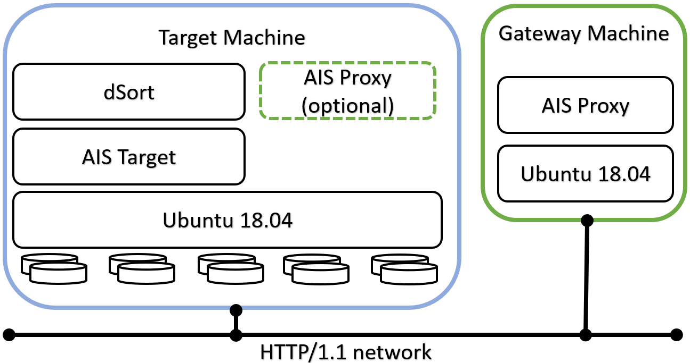
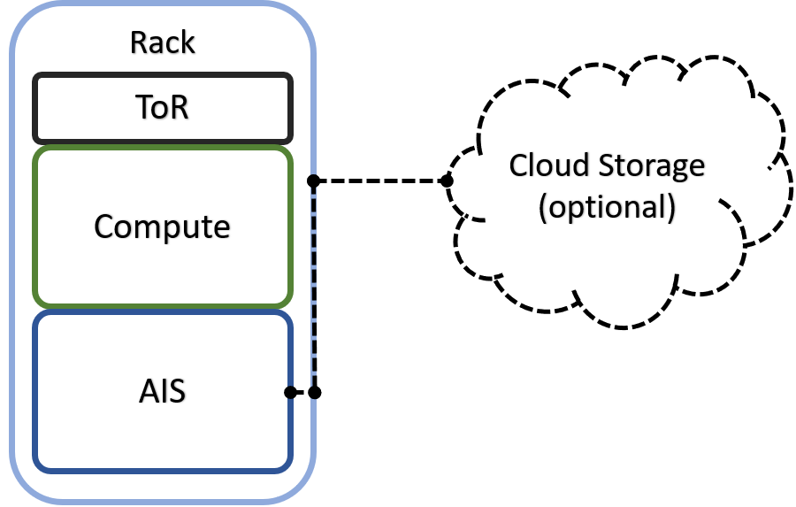
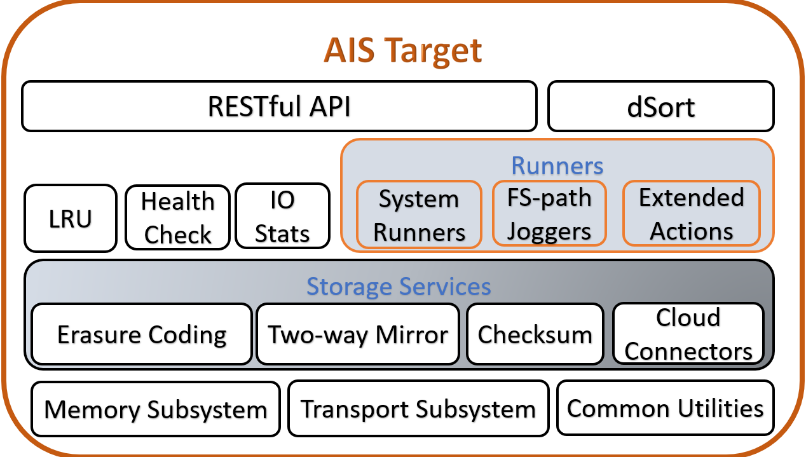
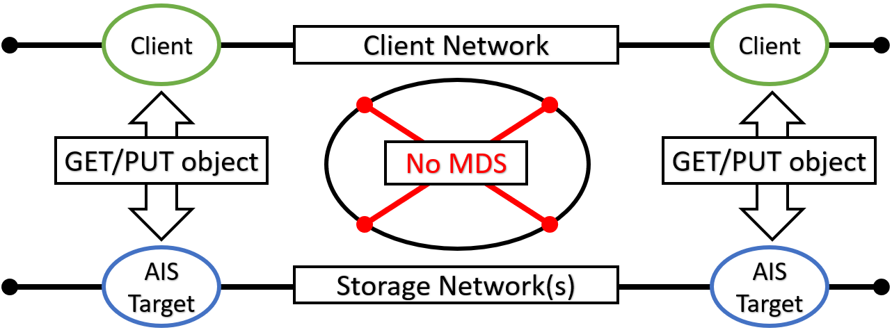

## Introduction

Training deep learning (DL) models on petascale datasets is essential for achieving competitive and state-of-the-art performance in applications such as speech, video analytics, and object recognition. However, existing distributed filesystems were not developed for the access patterns and usability requirements of DL jobs.

In this [white paper](https://arxiv.org/abs/2001.01858) we describe AIStore and components, and then compare system performance experimentally using image classification workloads and storing training data on a variety of backends. For details, please see:

* AIStore [white paper](https://arxiv.org/abs/2001.01858).
* IEEE BigData 2019 [poster](https://storagetarget.files.wordpress.com/2019/12/deep-learning-large-scale-phys-poster-1.pdf)

The rest of this document is structured as follows:

- [Design Philosophy](#ais-design-philosophy)
- [Key Concepts and Diagrams](#key-concepts-and-diagrams)
- [Datapath](#datapath)
- [Open Format](#open-format)
- [Existing Datasets](#existing-datasets)
- [Data Protection](#data-protection)
- [Scale-Out](#scale-out)
- [HA](#ha)
- [Fast Tier](#fast-tier)
- [Other Services](#other-services)
- [dSort](#dsort)
- [CLI](#cli)
- [Python Client](#python-client)
- [AIS Limitations](#ais-limitations)

## Design Philosophy
It is often more optimal to let applications control how and whether the stored content is stored in chunks. That's the simple truth that holds, in particular, for AI datasets that are often pre-sharded with content and boundaries of those shards based on application-specific optimization criteria. More exactly, the datasets could be pre-sharded, post-sharded, and otherwise transformed to facilitate training, inference, and simulation by the AI apps.

The corollary of this statement is two-fold:

- Breaking objects into pieces (often called chunks but also slices, segments, fragments, and blocks) and the related functionality does not necessarily belong to an AI-optimized storage system per se;
- Instead of breaking the objects in pieces (and then reassembling them with the help of a carefully maintained metadata), the storage system must better focus on providing assistance to simplify and accelerate dataset transformations.

## Key Concepts and Diagrams
In this section: high-level diagrams that introduce key concepts and architecture, as well as possible deployment options.

AIS cluster *comprises* arbitrary (and not necessarily equal) numbers of **gateways** and **storage targets**. Targets utilize local disks while gateways are HTTP **proxies** that provide most of the control plane and never touch the data.

> The terms *gateway* and *proxy* are used interchangeably throughout this README and other sources in the repository.

Both **gateways** and **targets** are userspace daemons that join (and, by joining, form) a storage cluster at their respective startup times, or upon user request. AIStore can be deployed on any commodity hardware with pretty much any Linux distribution (although we do recommend 4.x kernel). There are no designed-in size/scale type limitations. There are no dependencies on special hardware capabilities. The code itself is free, open, and MIT-licensed.

The diagram depicting AIS clustered node follows below, and makes the point that gateways and storage targets can be colocated in a single machine (or a VM) but not necessarily:



AIS can be deployed as a self-contained standalone persistent storage cluster and as a fast tier in front of existing Amazon S3 and Google Cloud (GCP) storage. The built-in caching mechanism provides LRU replacement policy on a per-bucket basis while taking into account configurable high and low capacity watermarks (see [LRU](storage_svcs.md#lru) for details). AWS/GCP integration is *turnkey* and boils down to provisioning AIS targets with credentials to access Cloud-based buckets.

If (compute + storage) rack is a *unit of deployment*, it may as well look as follows:



Finally, AIS target provides a number of storage services with [S3-like RESTful API](http_api.md) on top and a MapReduce layer that we call [dSort](#dsort).



> Terminology: AIS differentiates between **Cloud buckets** and ais buckets - the buckets that do not serve as a cache or tier in front of any 3rd party Cloud storage. Cloud-based and ais buckets support the same API. All the [supported storage services](storage_svcs.md) equally apply to both kinds of buckets with a few exceptions: as of v2.6, only ais buckets can be renamed.

> If (and only when) a cloud-based and an ais bucket share the same name and are simultaneously accessible, users can explicitly let AIS know via [the API](bucket.md) which bucket to use.

## Datapath
In AIS, all inter- and intra-cluster networking is based on HTTP/1.1 (with HTTP/2 option currently under development). HTTP(S) clients execute RESTful operations vis-à-vis AIS gateways and data then moves **directly** between the clients and storage targets with no metadata servers and no extra processing in-between:



> MDS in the diagram above stands for the metadata server(s) or service(s).

In the picture, a client on the left side makes an I/O request which is then fully serviced by the *left* target - one of the nodes in the AIS cluster (not shown). Symmetrically, the *right* client engages with the *right* AIS target for its own GET or PUT object transaction. In each case, the entire transaction is executed via a single TCP session that connects the requesting client directly to one of the clustered nodes. As far as the datapath is concerned, there are no extra hops in the line of communications.

> For detailed read and write sequence diagrams, please refer to [this readme](datapath.md).

Distribution of objects across AIS cluster is done via (lightning fast) two-dimensional consistent-hash whereby objects get distributed across all storage targets and, within each target, all local disks.

## Open Format

AIS targets utilize local Linux filesystems - examples including (but not limited to) xfs, ext4, and openzfs. User data is stored *as is* without any alteration. AIS on-disk format is, therefore, fully defined by the local filesystem chosen at AIS deployment time.

> **You can access your data with and without AIS, and without any need to *convert* or *export/import*, etc. - at any time! Your data is stored in its original native format using user-given object names. Your data can be migrated out of AIS at any time as well, and, again, without any dependency whatsoever on the AIS itself.**

> Your own data is [unlocked](https://en.wikipedia.org/wiki/Vendor_lock-in) and immediately available at all times.

## Existing Datasets

One common way to use AIStore includes the most basic step: populating it with an existing dataset, or datasets. To this end, AIS provides 5 (five) easy ways ranging from the (conventional) on-demand caching to (advanced) *promoting* of colocated files and directories:

1. [Cold GET](#existing-datasets-cold-get)
2. [Prefetch](#existing-datasets-batch-prefetch)
3. [Internet Downloader](#existing-datasets-internet-downloader)
4. [Reverse Proxy](#existing-datasets-reverse-proxy)
5. [Promote (API and CLI)](#existing-datasets-promote-api-and-cli)

In particular:

### Existing Datasets: Cold GET
If the dataset in question is accessible via S3-like object API, start working with it via GET primitive of the [AIS API](http_api.md). Just make sure to provision AIS with the corresponding credentials to access the dataset's bucket in the Cloud.

> As far as supported S3-like backends, AIS currently supports Amazon S3 and Google Cloud.

> AIS executes *cold GET* from the Cloud if and only if the object is not stored (by AIS), **or** the object has a bad checksum, **or** the object's version is outdated.

In all other cases, AIS will service the GET request without going to Cloud.

### Existing Datasets: Batch Prefetch

Alternatively or in parallel, you can also *prefetch* a flexibly-defined *list* or *range* of objects from any given Cloud bucket, as described in [this readme](batch.md).

### Existing Datasets: integrated Downloader

But what if the dataset in question exists in the form of (vanilla) HTTP/HTTPS URL(s)? What if there's a popular bucket in, say, Google Cloud that contains images that you'd like to bring over into your Data Center and make available locally for AI researchers?

For these and similar use cases we have [AIS Downloader](downloader/README.md) - an integrated tool that can execute massive download requests, track their progress, and populate AIStore directly from the Internet.

### Existing Datasets: Reverse Proxy

AIS can also be designated as HTTP proxy vis-à-vis 3rd party object storages. This mode of operation is limited to Google Cloud Storage (GCS) and requires:

1. HTTP(s) client side: set the `http_proxy` (`https_proxy` - for HTTPS) environment
2. AIS configuration: set `rproxy=cloud` in the [configuration](ais/setup/config.sh)

Note that `http_proxy` is supported by most UNIX systems and is recognized by most (but not all) HTTP clients:

```shell
$ export http_proxy=<AIS proxy IPv4 or hostname>
```

In combination, these two settings have an effect of redirecting all **unmodified** client-issued HTTP(S) requests to the AIS proxy/gateway with subsequent execution transparently from the client perspective.

Further details and examples are available [in this readme](rproxy.md).

### Existing Datasets: Promote (API and CLI)

Finally, AIS can *promote* files and directories to objects. The only requirement is that the files and directories in question are colocated within AIS storage target machines.

Let's consider a quick example. Say, some (or all) of the deployed storage nodes contain a directory called `/tmp/mydata`. By running the following [CLI](/cli/README.md), we could make AIS objects (**one file = one object**) out of all files scattered across all nodes:

```sh
$ ais promote /tmp/mydata mybucket/ -r
```

In this example, `mybucket` would be the designated (destination) bucket.

## Data Protection
AIS [supports](storage_svcs.md) end-to-end checksum protection, 2-way local mirroring, and Reed-Solomon [erasure coding](storage_svcs.md#erasure-coding) - thus providing for arbitrary user-defined levels of cluster-wide data redundancy and space efficiency.

## Scale-Out
The scale-out category includes balanced and fair distribution of objects where each storage target will store (via a variant of the consistent hashing) 1/Nth of the entire namespace where (the number of objects) N is unlimited by design.

> AIS cluster capability to **scale-out is truly unlimited**. The real-life limitations can only be imposed by the environment - capacity of a given Data Center, for instance.

Similar to the AIS gateways, AIS storage targets can join and leave at any moment causing the cluster to rebalance itself in the background and without downtime.

## HA
AIS features a [highly-available control plane](ha.md) where all gateways are absolutely identical in terms of their (client-accessible) data and control plane [APIs](http_api.md). Gateways can be ad hoc added and removed, deployed remotely and/or locally to the compute clients (the latter option will eliminate one network roundtrip to resolve object locations).

## Fast Tier
AIS can be deployed as a fast tier in front of existing Amazon S3 and Google Cloud (GCP) storage.

As a fast tier, AIS populates itself on demand (via *cold* GETs) and/or via its own *prefetch* API (see [List/Range Operations](batch.md#listrange-operations)) that runs in the background to download batches of objects.

## Other Services

The (quickly growing) list of services includes (but is not limited to):
* [health monitoring and recovery](health/fshc.md)
* [range read](http_api.md)
* [dry-run (to measure raw network and disk performance)](performance.md#performance-testing)
* performance and capacity monitoring with full observability via StatsD/Grafana
* load balancing

> Load balancing consists in optimal selection of a local object replica and, therefore, requires buckets configured for [local mirroring](storage_svcs.md#local-mirroring-and-load-balancing).

Most notably, AIStore provides **[dSort](dsort/README.md)** - a MapReduce layer that performs a wide variety of user-defined merge/sort *transformations* on large datasets used for/by deep learning applications.

## dSort

DSort “views” AIS objects as named shards that comprise archived key/value data. In its 1.0 realization, dSort supports tar, zip, and tar-gzip formats and a variety of built-in sorting algorithms; it is designed, though, to incorporate other popular archival formats including tf.Record and tf.Example ([TensorFlow](https://www.tensorflow.org/tutorials/load_data/tf-records)) and [MessagePack](https://msgpack.org/index.html). The user runs dSort by specifying an input dataset, by-key or by-value (i.e., by content) sorting algorithm, and a desired size of the resulting shards. The rest is done automatically and in parallel by the AIS storage targets, with no part of the processing that’d involve a single-host centralization and with dSort stage and progress-within-stage that can be monitored via user-friendly statistics.

By design, dSort tightly integrates with the AIS-object to take full advantage of the combined clustered CPU and IOPS. Each dSort job (note that multiple jobs can execute in parallel) generates a massively-parallel intra-cluster workload where each AIS target communicates with all other targets and executes a proportional "piece" of a job. Which ultimately results in a *transformed* dataset optimized for subsequent training and inference by deep learning apps.

## CLI

AIStore includes an easy-to-use management-and-monitoring facility called [AIS CLI](cli/README.md). Once [installed](cli/README.md#getting-started), to start using it, simply execute:

 ```sh
 $ export AIS_URL=http://G
 $ ais --help
 ```

where `G` (above) denotes a `hostname:port` address of any AIS gateway (for developers it'll often be `localhost:8080`). Needless to say, the "exporting" must be done only once.

One salient feature of AIS CLI is its Bash style **auto-completions** that allow users to easily navigate supported operations and options by simply pressing TAB key. For instance, when you type:

 ```sh
 $ ais s[TAB-TAB]
 ```

the tool will suggest the following "expansion" from which you can further choose by typing one or more letters and pressing the TAB key, etc.

 ```sh
$ ais s
set          set-copies   show         start        status       stop
 ```

AIS CLI is still at its early stage and will keep quickly developing. For more information, please see the project's own [README](cli/README.md).

## Python Client

AIStore provides an easy way to generate a python client package for simplified integration. The user can, after following a few simple steps, import the generated package and start communicating with AIS via its [RESTful API](http_api.md). The generated package will cover the entire functionality of the API.

> Background: [OpenAPI Generator](https://github.com/openapitools/openapi-generator) is a tool that generates python client packages for simplified integration with RESTful APIs. We use OpenAPI Generator to generate the python client package using the [OpenAPI Specification](https://swagger.io/docs/specification/about/) file located [here](openapi/openapi.yaml).

To get started with the python client package, you need to first generate the client package. These instuctions can also be found [here](openapi/README.md#how-to-generate-package).

1. Obtain the latest openapi-generator jar by running the following command:

    ```shell
    wget http://central.maven.org/maven2/org/openapitools/openapi-generator-cli/3.3.4/openapi-generator-cli-3.3.4.jar -O openapi-generator-cli.jar
    ```

2. Run the following commands:

    ```shell
    cd <path_to_repo>
    java -jar </path/to/openapi-generator-cli.jar> generate -i openapi/openapi.yaml -c openapi/config.json -g python -o ./python-client/
    ```

3. Install `pip` - a package management system used to install and manage software packages written in Python. Visit the [installation page](https://pip.pypa.io/en/stable/installing/) for instructions on how to install `pip`.

4. Install required Python packages using `pip` and requirement files located in `python-client` directory:

    ```shell
    pip install -r python-client/requirements.txt
    pip install -r python-client/test-requirements.txt
    ```

These steps should produce the python client package, which will be located [here](python-client).

Should you have any difficulty generating the python client package with these instructions, please open a ticket, and we will provide further assistance.

Once the package is generated, it can be installed as follows, these commands can also be found [here](openapi/README.md#how-to-install).

```shell
cd <path_to_repo>/python-client
pip uninstall ais_client #uninstalls any previous versions
pip install .
```

Now you're ready to import the package in python and use it to communicate with AIS.

For example, this script will display a map of your AIS cluster.

```shell
import ais_client
# Some aliases for functions in the package
openapi_models = ais_client.models
openapi_params = openapi_models.InputParameters
openapi_actions = openapi_models.Actions

configuration = ais_client.Configuration()
configuration.debug = False
proxy_url = 'localhost:8080' #Change this to the ip of any proxy in your AIS cluster, ex: 172.50.0.2:8080
configuration.host = 'http://%s/v1/' % proxy_url
proxyClient = ais_client.ApiClient(configuration)

daemon_api = ais_client.api.daemon_api.DaemonApi(proxyClient)
print(daemon_api.get(openapi_models.GetWhat.SMAP))
```

There's a lot more that the python client package can do. Be sure to read [the complete guide on using the package](openapi/README.md#how-to-use-package).

## AIS Limitations
There are **no** designed-in limitations on the:

* object sizes
* total number of objects and buckets in AIS cluster
* number of objects in a single AIS bucket
* numbers of gateways and storage targets in AIS cluster

Ultimately, the limit on object size may be imposed by a local filesystem of choice and a physical disk capacity. While limit on the cluster size - by the capacity of the hosting AIStore Data Center. But as far as AIS itself, it does not impose any limitations whatsoever.
