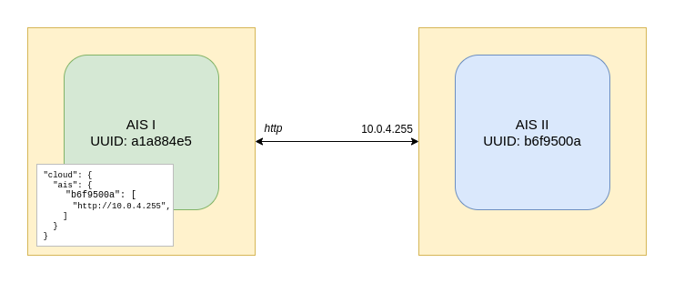

## Terminology

AIS supports *cloud* buckets provided by remote storages. A storage bucket that is visible/accessible/modifiable via AIS may originate in a 3rd party Cloud, or in another (remote) AIS cluster, or - the 3rd option - be created, filled-in, updated, and otherwise accessed inside this "local" AIS cluster. Respectively, there's a term and a notion of a [cloud provider](#supported-cloud-providers) realized via all relevant API calls.

In that precise sense, the term "ais bucket" is a **shortcut** to indicate a "local" bucket. It is difficult, though, without creating at least some confusion, to use the word "local" with respect to a content that may be distributed across thousands of storage nodes. That's why we stick with the terminology: *cloud buckets* vs *ais buckets*.

Needless to say that *cloud buckets* will often serve as a cache or a tier in front of remote AIS cluster or 3rd party Cloud storage.

Further, cloud-based and ais buckets support the same API. All the [supported storage services](storage_svcs.md) equally apply to both kinds of buckets with a few exceptions: e.g., only ais buckets can be renamed.

Finally, iff a cloud-based and an ais bucket share the same name and are simultaneously accessible, users can explicitly let AIS know - via `-provider` option and [the API](bucket.md) - which bucket to access.

## Supported Cloud Providers

AIS can be deployed as a fast tier in front of several storage backends. Supported cloud providers include: AIS (`ais`) itself, as well as AWS (`aws`), GCP (`gcp`), and all S3 and Google Cloud compliant storages.

* For additional information on working with buckets, please refer to [bucket readme](./bucket.md)
* For API reference, see [the RESTful API reference and examples](./http_api.md)
* For AIS command-line management, see [CLI](/cli/README.md)

### AIS <=> AIS

Remote AIS cluster is specified in the `cloud` section of the [configuration](./configuration.md).

Example:
```json
"cloud": {
  "ais": {
    "cluster-uuid": [
      "http://192.168.4.2:8080",
      "https://ais-cluster.example.org"
    ]
  }
}
```
Multiple remote AIS cluster URLs can be provided for the same usual reasons that include redundancy and (future) load balancing.
On failure to connect via any one of those multiple URLs AIS (client) cluster will retry with another URL.

`AIS` provider enables multi-tier architecture of AIS clusters (AIS behind AIS).



#### AWS

[Amazon Web Services Simple Storage System (AWS S3)](https://aws.amazon.com/s3/)

#### GCP

[Google Cloud Platform](https://cloud.google.com/)
