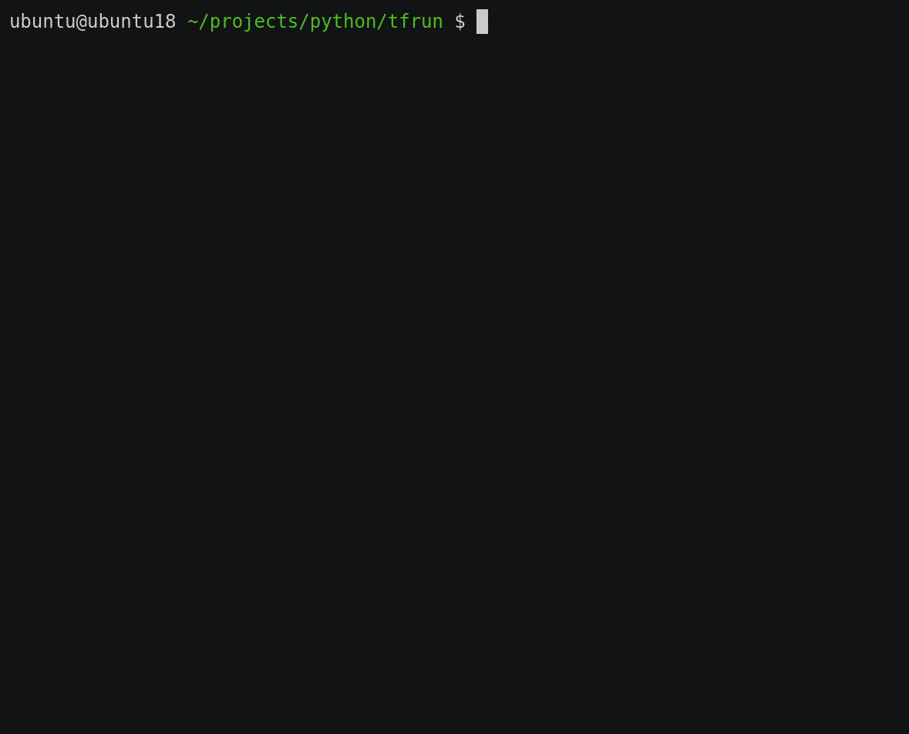

AIS supports Amazon S3 in 3 (three) distinct and different ways:

1. On the back, via [backend](providers.md) abstraction. Specifically for the S3 [backend](providers.md), the implementation currently utilizes [AWS SDK for Go v2](https://github.com/aws/aws-sdk-go-v2).
2. On the client-facing front, AIS provides S3 compatible API, so that existing S3 applications could use AIStore out of the box and without the need to change their (existing) code.
3. Similar to the option 2. but instead of instantiating, signing, and issuing requests to S3, AIS executes already signed S3 request ([presigned URLs](https://docs.aws.amazon.com/search/doc-search.html?searchPath=documentation-guide&searchQuery=presigned&this_doc_product=Amazon%20Simple%20Storage%20Service&this_doc_guide=User%20Guide). Elsewhere in the documentation and the source, we refer to this mechanism as a _pass-through_.

This document talks about the 2. and 3. - about AIS providing S3 compatible API to clients and apps.

There's a separate, albeit closely related, [document](/docs/s3cmd.md) that explains how to configure `s3cmd` and then maybe tweak AIStore configuration to work with it:

* [Getting Started with `s3cmd`](/docs/s3cmd.md) - also contains configuration, tips, usage examples and more.

For additional background, see:

* [High-level AIS block diagram](overview.md#at-a-glance) that shows frontend and backend APIs and capabilities.
* [Setting custom S3 endpoint](/docs/cli/bucket.md) can come in handy when a bucket is hosted by an S3 compliant backend (such as, e.g., minio).

## Table of Contents

- [Quick example using `aws` CLI](#quick-example-using-aws-cli)
  - [PUT(object)](#putobject)
  - [GET(object)](#getobject)
    - [Range Read](#range-read)
  - [HEAD(object)](#headobject)
- [Presigned S3 requests](#presigned-s3-requests)
  - [1. Enable presigned S3 requests](#1-enable-presigned-s3-requests)
  - [2. Create presigned S3 request](#2-create-presigned-s3-request)
  - [3. Execute presigned S3 request](#3-execute-presigned-s3-request)
  - [4. Finally, check the status](#4-finally-check-the-status)
  - [Using Go client to execute presigned S3 requests](#using-go-client-to-execute-presigned-s3-requests)
- [Quick example using Internet Browser](#quick-example-using-internet-browser)
- [`s3cmd` command line](#s3cmd-command-line)
- [ETag and MD5](#etag-and-md5)
- [Last Modification Time](#last-modification-time)
- [Multipart Upload using `aws`](#multipart-upload-using-aws)
- [More Usage Examples](#more-usage-examples)
  - [Create bucket](#create-bucket)
  - [Remove bucket](#remove-bucket)
  - [Upload large object](#upload-large-object)
- [TensorFlow Demo](#tensorflow-demo)
- [S3 Compatibility](#s3-compatibility)
  - [Supported S3](#supported-s3)
  - [Unsupported S3](#unsupported-s3)
- [Boto3 Compatibility](#boto3-compatibility)
- [Amazon CLI tools](#amazon-cli-tools)

## Quick example using `aws` CLI

The following was tested with an _older_ version of `aws` CLI, namely:

```console
$ aws --version
aws-cli/1.15.58 Python/3.5.2 Linux/5.4.0-124-generic botocore/1.10.57
```

You can create buckets and execute PUT/GET verbs, etc.

```console
$ aws --endpoint-url http://localhost:8080/s3 s3 mb s3://abc
make_bucket: abc
```

### PUT(object)

```console
# PUT using AIS CLI:
$ ais put README.md ais://abc

# The same via `aws` CLI:
$ aws --endpoint-url http://localhost:8080/s3 s3api put-object --bucket abc --key LICENSE --body LICENSE
$ ais ls ais://abc
NAME             SIZE
LICENSE          1.05KiB
README.md        10.44KiB
```

### GET(object)

```console
# GET using `aws` CLI:
$ aws --endpoint-url http://localhost:8080/s3 s3api get-object --bucket abc --key README.md /tmp/readme
{
    "ContentType": "text/plain; charset=utf-8",
    "Metadata": {},
    "ContentLength": 10689
}
$ diff -uN README.md /tmp/readme
```

#### Range Read

1. If needed: create a bucket (while making sure its checksum is the conventional MD5), and PUT an object:

```console
$ ais create ais://abc
$ ais bucket props set ais://abc checksum.type md5
$ ais put README.md ais://abc
```

2. Next, read an arbitrary range using `aws` CLI:

```console
$ aws s3api --endpoint-url http://localhost:8080/s3 get-object --bucket abc --key README.md --range bytes=0-99 README-partial.md
{
    "ContentLength": 100,
    "ETag": "\"2940e853a9b97580df19b76d10d3ea31\"",
    "Metadata": {},
    "ContentType": "application/octet-stream",
    "AcceptRanges": "bytes",
    "LastModified": "Tue, 08 Apr 2025 14:51:53 GMT",
    "ContentRange": "bytes 0-99/17242"
}
```

3. Finally, check the result:

```console
$ cat README-partial.md
**AIStore is a lightweight object storage system with the capability to linearly scale out with each$
```

### HEAD(object)

```console
# Get object metadata using `aws` CLI:
$ aws s3api --endpoint-url http://localhost:8080/s3 head-object --bucket abc --key LICENSE
{
    "Metadata": {},
    "ContentLength": 1075,
    "ETag": "f70a21a0c5fa26a93820b0bef5be7619",
    "LastModified": "Mon, 19 Dec 2022 22:23:05 GMT"
}
```

## Presigned S3 requests

AIStore also supports (passing through) [presigned S3 requests](https://docs.aws.amazon.com/search/doc-search.html?searchPath=documentation-guide&searchQuery=presigned&this_doc_product=Amazon%20Simple%20Storage%20Service&this_doc_guide=User%20Guide).

To use this _feature_, you need to enable it first - as follows:

### 1. Enable presigned S3 requests

```console
$ ais config cluster features S3-Presigned-Request
```

Rest of this section uses [curl](https://curl.se/); more (and easier to use) examples can be found at:

* [Assorted Curl](/docs/getting_started.md#curl)

### 2. Create presigned S3 request

Once we have our cluster configured to execute presigned requests we can then start creating them and sending to AIStore.

```console
$ aws s3 presign s3://bucket/test.txt

https://bucket.s3.us-west-2.amazonaws.com/test.txt?X-Amz-Algorithm=AWS4-HMAC-SHA256&X-Amz-Credential=AKIAEXAMPLE123456789%2F20210621%2Fus-west-2%2Fs3%2Faws4_request&X-Amz-Date=20210621T041609Z&X-Amz-Expires=3600&X-Amz-SignedHeaders=host&X-Amz-Signature=EXAMBLE1234494d5fba3fed607f98018e1dfc62e2529ae96d844123456
```

> [!NOTE] 
> In some cases signed request may be in form of `https://s3.us-west-2.amazonaws.com/bucket/test.txt?...` (`path` style) and not `https://bucket.s3.us-west-2.amazonaws.com/test.txt?...` (`virtual-hosted` style).
> If your requests are signed this way, they might fail when sending to AIStore as it has no way of knowing which style was used to sign, and it always assumes the `virtual-hosted` style by default.
> To fix this you need to provide `ais-s3-signed-request-style: path` header to instruct AIStore to use `path` style.

### 3. Execute presigned S3 request

Let's assumes that there's S3 bucket called `s3://bucket`, and we have read/write access to it.

Further, `https://localhost:8080` address (below) simply indicates [Local Playground](/docs/getting_started.md#local-playground) and must be understood as a demonstration-only placeholder for an _arbitrary_ AIStore endpoint (`AIS_ENDPOINT`).

```console
$ curl -L -X PUT -d 'testing 1 2 3' "https://localhost:8080/s3/bucket/test.txt?X-Amz-Algorithm=AWS4-HMAC-SHA256&X-Amz-Credential=AKIAEXAMPLE123456789%2F20210621%2Fus-west-2%2Fs3%2Faws4_request&X-Amz-Date=20210621T041609Z&X-Amz-Expires=3600&X-Amz-SignedHeaders=host&X-Amz-Signature=EXAMBLE1234494d5fba3fed607f98018e1dfc62e2529ae96d844123456"
```

(as it was pointed in previous step, you might need to pass `-H "ais-s3-signed-request-style: path"` option in case your requests were signed with `path` style)

At this point, AIStore will send the presigned (PUT) URL to S3 and, if successful, store the object in cluster.

**NOTE:** when using HTTPS (as in: `AIS_USE_HTTPS`) and having AIS deployed with a self-signed TLS certificate you may get the following `curl` failure:

```sh
curl: (60) SSL certificate problem: unable to get local issuer certificate
More details here: https://curl.se/docs/sslcerts.html
```

In this case, simply ask it to skip checking, e.g.: `echo insecure >> ~/.curlrc`

### 4. Finally, check the status

Finally (and optionally), let's check the status of the new object - `s3://bucket/test.txt`, in this case:

```console
$ ais bucket ls s3://bucket
NAME          SIZE   CACHED  STATUS
test.txt      13B    yes     ok
```

### Using Go client to execute presigned S3 requests

In the previous section, we used `curl` client. Of course, it is also possible to achieve the same using many other HTTP clients - for instance, Go.

In Go, you will need to define a custom `RoundTripper` that changes URL from S3 to AIStore, e.g.:

```go
type customTransport struct {
	rt http.RoundTripper
}

func (t *customTransport) RoundTrip(req *http.Request) (*http.Response, error) {
	bucket := strings.Split(req.URL.Host, ".")[0]
	req.URL.Host = "localhost:8080" // <--- CHANGE THIS.
	req.URL.Path = "/s3/" + bucket + req.URL.Path
	return t.rt.RoundTrip(req)
}

...

func main() {
	customClient := &http.Client{...}
	s3Client := s3.New(s3.Options{HTTPClient: customClient})
	getOutput, err := s3Client.GetObject(context.Background(), &s3.GetObjectInput{
		Bucket: aws.String("bucket"),
		Key:    aws.String("test.txt"),
	})
	...
}
```

## Quick example using Internet Browser

AIStore gateways provide HTTP/HTTPS interface, which is also why it is maybe sometimes convenient (and very fast) to use your Browser to execute `GET` type queries.

Specifically - since in this document we are talking about s3-compatible API - here's an example that utilizes `/s3` endpoint to list all buckets:

```xml
<ListBucketResult xmlns="http://s3.amazonaws.com/doc/2006-03-01">
  <Owner>
     <ID>1</ID>
     <DisplayName>ListAllMyBucketsResult</DisplayName>
  </Owner>
<Buckets>
  <Bucket>
    <Name>bucket-111</Name>
    <CreationDate>2022-08-23T09:16:40-04:00</CreationDate>
    <String>Provider: ais</String>
  </Bucket>
  <Bucket>
    <Name>bucket-222</Name>
    <CreationDate>2022-08-23T13:47:00-04:00</CreationDate>
    <String>Provider: ais</String>
  </Bucket>
  <Bucket>
  <Name>bucket-222</Name>
    <CreationDate>2022-08-23T13:21:21-04:00</CreationDate>
    <String>Provider: aws (WARNING: {bucket-222, Provider: ais} and {bucket-222, Provider: aws} share the same name)</String>
  </Bucket>
  <Bucket>
    <Name>bucket-333</Name>
    <CreationDate>2022-08-23T13:26:32-04:00</CreationDate>
    <String>Provider: gcp</String>
  </Bucket>
</Buckets>
</ListBucketResult>
```

> Notice the "sharing the same name" warning above. For background, please refer to [backend providers](/docs/providers.md).

> In re `/s3 endpoint` mentioned above, the corresponding request URL in the browser's address bar would look something like `ais-gateway-host:port/s3`.

## `s3cmd` Command Line

For a detailed `s3cmd` setup guide, please refer to this [documentation](/docs/s3cmd.md).

Below is a table outlining some key `s3cmd` options that can be particularly useful when working with AIStore:

| Option | Description | Example |
| --- | --- | --- |
| `--host` | Set the AIS cluster endpoint | `--host=10.10.0.1:51080/s3` |
| `--host-bucket` | Define the URL path for accessing a bucket in the AIS cluster | `--host-bucket="10.10.0.1:51080/s3/"` |
| `--no-ssl` | Use HTTP instead of HTTPS | |
| `--no-check-certificate` | Disable certificate verification (useful for self-signed certificates) | |
| `--region` | Specify the region for a bucket | `--region=us-west-1` |

## ETag and MD5

When you are reading an object from Amazon S3, the response will contain [ETag](https://developer.mozilla.org/en-US/docs/Web/HTTP/Headers/ETag).

Amazon S3 ETag is the object's checksum. Amazon computes those checksums using `md5`.

On the other hand, the default checksum type that AIS uses is [xxhash](http://cyan4973.github.io/xxHash/).

Therefore, it is advisable to:

1. keep in mind this dichotomy, and
2. possibly, configure AIS bucket in question with `md5`.

Here's a simple scenario:

Say, an S3-based client performs a GET or a PUT operation and calculates `md5` of an object that's being GET (or PUT). When the operation finishes, the client then compares the checksum with the `ETag` value in the response header. If checksums differ, the client raises the error "MD5 sum mismatch."

To enable MD5 checksum at bucket creation time:

```console
$ ais create ais://bck --props="checksum.type=md5"
"ais://bck2" bucket created

$ ais show bucket ais://bck | grep checksum
checksum         Type: md5 | Validate: ColdGET
```

Or, you can change bucket's checksum type at any later time:

```console
$ ais bucket props ais://bck checksum.type=md5
Bucket props successfully updated
"checksum.type" set to:"md5" (was:"xxhash")
```

Please note that changing the bucket's checksum does not trigger updating (existing) checksums of *existing* objects - only new writes will be checksummed with the newly configured checksum.

## Last Modification Time

AIS tracks object last *access* time and returns it as `LastModified` for S3 clients. If an object has never been accessed, which can happen when AIS bucket uses a Cloud bucket as a backend one, zero Unix time is returned.

Example when access time is undefined (not set):

```console
# create AIS bucket with AWS backend bucket (for supported backends and details see docs/providers.md)
$ ais create ais://bck
$ ais bucket props ais://bck backend_bck=aws://bckaws
$ ais bucket props ais://bck checksum.type=md5

# put an object using native ais API and note access time (same as creation time in this case)
$ ais put object.txt ais://bck/obj-ais

# put object with s3cmd - the request bypasses ais, so no access time in the `ls` results
$ s3cmd put object.txt s3://bck/obj-aws --host=localhost:51080 --host-bucket="localhost:51080/s3/%(bucket)"

$ ais ls ais://bck --props checksum,size,atime
NAME            CHECKSUM                                SIZE            ATIME
obj-ais         a103a20a4e8a207fe7ba25eeb2634c96        69.99KiB        08 Dec 20 11:25 PST
obj-aws         a103a20a4e8a207fe7ba25eeb2634c96        69.99KiB

$ s3cmd ls s3://bck --host=localhost:51080 --host-bucket="localhost:51080/s3/%(bucket)"
2020-12-08 11:25     71671   s3://test/obj-ais
1969-12-31 16:00     71671   s3://test/obj-aws
```

> See related: [multipart upload](https://github.com/NVIDIA/aistore/blob/main/ais/test/scripts/s3-mpt-large-files.sh) test and usage comments inline.

## Multipart Upload using `aws`

Example below reproduces the following [Amazon Knowledge-Center instruction](https://aws.amazon.com/premiumsupport/knowledge-center/s3-multipart-upload-cli/).

> Used `aws-cli/1.15.58 Python/3.5.2 Linux/5.15.0-46-generic botocore/1.10.57`

> Compare with (user-friendly and easy-to-execute) multipart examples from the [s3cmd companion doc](/docs/s3cmd.md).

But first and separately, we create `ais://` bucket and configure it with MD5:

```console
$ ais create ais://abc
"ais://abc" created (see https://github.com/NVIDIA/aistore/blob/main/docs/bucket.md#default-bucket-properties)
$ ais bucket props set ais://abc checksum.type=md5
Bucket props successfully updated
"checksum.type" set to: "md5" (was: "xxhash")
```

Next, the uploading sequence:

```console
# 1. initiate multipart upload
$ aws s3api create-multipart-upload --bucket abc --key large-test-file --endpoint-url http://localhost:8080/s3                                   {
    "Key": "large-test-file",
    "UploadId": "uu3DuXsJG",
    "Bucket": "abc"
}
```

```console
# 2. upload the first part (w/ upload-id copied from the previous command)
$ aws s3api upload-part --endpoint-url http://localhost:8080/s3 --bucket abc --key large-test-file --part-number 1 --body README.md --upload-id uu3DuXsJG
{
    "ETag": "9bc8111718e22a34f9fa6a099da1f3df"
}
```

```console
# 3. upload the second, etc. parts
$ aws s3api upload-part --endpoint-url http://localhost:8080/s3 --bucket abc --key large-test-file --part-number 2 --body LICENSE --upload-id uu3DuXsJG
{
    "ETag": "f70a21a0c5fa26a93820b0bef5be7619"
}
```

```console
# 4. list active upload by its ID (upload-id)
$ aws s3api list-parts --endpoint-url http://localhost:8080/s3 --bucket abc --key large-test-file --upload-id uu3DuXsJG                          {
    "Owner": null,
    "StorageClass": null,
    "Initiator": null,
    "Parts": [
        {
            "PartNumber": 1,
            "ETag": "9bc8111718e22a34f9fa6a099da1f3df",
            "Size": 10725
        },
        {
            "PartNumber": 2,
            "ETag": "f70a21a0c5fa26a93820b0bef5be7619",
            "Size": 1075
        }
    ]
}
```

And finally:

```console
# 5. complete upload, and be done
$ aws s3api complete-multipart-upload --endpoint-url http://localhost:8080/s3 --bucket abc --key large-test-file --multipart-upload file://up.json  --upload-id uu3DuXsJG
{
    "Key": "large-test-file",
    "Bucket": "abc",
    "ETag": "799e69a43a00794a86eebffb5fbaf4e6-2"
}
$ s3cmd ls s3://abc
2022-08-31 20:36        11800  s3://abc/large-test-file
```

Notice `file://up.json` in the `complete-multipart-upload` command. It simply contains the "Parts" section(**) copied from the "list active upload" step (above).

> (**) with no sizes

See https://aws.amazon.com/premiumsupport/knowledge-center/s3-multipart-upload-cli for details.


## More Usage Examples

Use any S3 client to access an AIS bucket. Examples below use standard AWS CLI. To access an AIS bucket, one has to pass the correct `endpoint` to the client. The endpoint is the primary proxy URL and `/s3` path, e.g, `http://10.0.0.20:51080/s3`.

### Create bucket

```shell
# check that AIS cluster has no buckets, and create a new one
$ ais ls ais://
AIS Buckets (0)
$ s3cmd --host http://localhost:51080/s3 s3 mb s3://bck1
make_bucket: bck1

# list buckets via native CLI
$ ais ls ais://
AIS Buckets (1)
```

### Remove bucket

```shell
$ s3cmd --host http://localhost:51080/s3 s3 ls s3://
2020-04-21 16:21:08 bck1

$ s3cmd --host http://localhost:51080/s3 s3 mb s3://bck1
remove_bucket: aws1
$ s3cmd --host http://localhost:51080/s3 s3 ls s3://
```

### Upload large object

In this section, we use all 3 (three) clients:

1. `s3cmd` client pre-configured to communicate with (and via) AIS
2. `aws` CLI that sends requests directly to AWS S3 standard endpoint (with no AIS in-between)
3. and, finally, native AIS CLI

```shell
# 1. Upload via `s3cmd` => `aistore`

$ s3cmd put $(which aisnode) s3://abc --multipart-chunk-size-mb=8
upload: 'bin/aisnode' -> 's3://abc/aisnode'  [part 1 of 10, 8MB] [1 of 1]
 8388608 of 8388608   100% in    0s   233.84 MB/s  done
...
 8388608 of 8388608   100% in    0s   234.19 MB/s  done
upload: 'bin/aisnode' -> 's3://abc/aisnode'  [part 10 of 10, 5MB] [1 of 1]
 5975140 of 5975140   100% in    0s   233.39 MB/s  done
```

```shell
# 2. View object metadata via native CLI
$ ais show object s3://abc/aisnode --all
PROPERTY         VALUE
atime            30 Aug 54 17:47 LMT
cached           yes
checksum         md5[a38030ea13e1b59c...]
copies           1 [/tmp/ais/mp3/11]
custom           [source:aws ETag:"e3be082db698af7c15b0502f6a88265d-16" version:3QEKSH7LowuRB2OnUHjWCFsp58aZpsC2]
ec               -
location         t[MKpt8091]:mp[/tmp/ais/mp3/11, nvme0n1]
name             s3://abc/aisnode
size             77.70MiB
version          3QEKSH7LowuRB2OnUHjWCFsp58aZpsC2
```

```shell
# 3. View object metadata via `aws` CLI => directly to AWS (w/ no aistore in-between):
$ aws s3api head-object --bucket abc --key aisnode
{
    "LastModified": "Tue, 20 Dec 2022 17:43:16 GMT",
    "ContentLength": 81472612,
    "Metadata": {
        "x-amz-meta-ais-cksum-type": "md5",
        "x-amz-meta-ais-cksum-val": "a38030ea13e1b59c529e888426001eed"
    },
    "ETag": "\"e3be082db698af7c15b0502f6a88265d-16\"",
    "AcceptRanges": "bytes",
    "ContentType": "binary/octet-stream",
    "VersionId": "3QEKSH7LowuRB2OnUHjWCFsp58aZpsC2"
}
```

```shell
# 4. Finally, view object metadata via `s3cmd` => `aistore`
$ s3cmd info s3://abc/aisnode
s3://abc/aisnode (object):
   File size: 81472612
   Last mod:  Fri, 30 Aug 1754 22:43:41 GMT
   MIME type: none
   Storage:   STANDARD
   MD5 sum:   a38030ea13e1b59c529e888426001eed
   SSE:       none
   Policy:    none
   CORS:      none
   ACL:       none
```

## TensorFlow Demo

Setup `S3_ENDPOINT` and `S3_USE_HTTPS` environment variables prior to running a TensorFlow job. `S3_ENDPOINT` must be primary proxy hostname:port and URL path `/s3` (e.g., `S3_ENDPOINT=10.0.0.20:51080/s3`). Secure HTTP is disabled by default, so `S3_USE_HTTPS` must be `0`.

Example running a training task:

```
S3_ENDPOINT=10.0.0.20:51080/s3 S3_USE_HTTPS=0 python mnist.py
```

TensorFlow on AIS training screencast:



## S3 Compatibility

AIStore fully supports [Amazon S3 API](https://docs.aws.amazon.com/s3/index.html) with a few exceptions documented and detailed below. The functionality has been tested using native Amazon S3 clients:

* [TensorFlow](https://docs.w3cub.com/tensorflow~guide/deploy/s3)
* [s3cmd](https://github.com/s3tools/s3cmd)
* [aws CLI](https://aws.amazon.com/cli)

Speaking of command-line tools, in addition to its own native [CLI](/docs/cli.md) AIStore also supports Amazon's `s3cmd` and `aws` CLIs. Python-based Amazon S3 clients that will often use Amazon Web Services (AWS) Software Development Kit for Python called [Boto3](https://github.com/boto/boto3) are also supported - see a note below on [AIS <=> Boto3 compatibility](#boto3-compatibility).

By way of quick summary, Amazon S3 supports the following API categories:

- Create and delete a bucket
- HEAD bucket
- Get a list of buckets
- PUT, GET, HEAD, and DELETE objects
- Get a list of objects in a bucket (important options include name prefix and page size)
- Copy object within the same bucket or between buckets
- Multi-object deletion
- Get, enable, and disable bucket versioning

and a few more. The following table summarizes S3 APIs and provides the corresponding AIS (native) CLI, as well as [s3cmd](https://github.com/s3tools/s3cmd) and [aws CLI](https://aws.amazon.com/cli) examples (along with comments on limitations, if any).

> See also: a note on [AIS <=> Boto3 compatibility](#boto3-compatibility).

### Supported S3

| API | AIS CLI and comments | [s3cmd](https://github.com/s3tools/s3cmd) | [aws CLI](https://aws.amazon.com/cli) |
| --- | --- | --- | --- |
| Create bucket | `ais create ais://bck` (note: consider using S3 default `md5` checksum - see [discussion](#object-checksum) and examples below) | `s3cmd mb` | `aws s3 mb` |
| Head bucket | `ais bucket show ais://bck` | `s3cmd info s3://bck` | `aws s3api head-bucket` |
| Destroy bucket (aka "remove bucket") | `ais bucket rm ais://bck` | `s3cmd rb`, `aws s3 rb` ||
| List buckets | `ais ls ais://` (or, same: `ais ls ais:`) | `s3cmd ls s3://` | `aws s3 ls s3://` |
| PUT object | `ais put filename ais://bck/obj` | `s3cmd put ...` | `aws s3 cp ..` |
| GET object | `ais get ais://bck/obj filename` | `s3cmd get ...` | `aws s3 cp ..` |
| GET object(range) | `ais get ais://bck/obj --offset 0 --length 10` | **Not supported** | `aws s3api get-object --range= ..` |
| HEAD object | `ais object show ais://bck/obj` | `s3cmd info s3://bck/obj` | `aws s3api head-object` |
| List objects in a bucket | `ais ls ais://bck` | `s3cmd ls s3://bucket-name/` | `aws s3 ls s3://bucket-name/` |
| Copy object in a given bucket or between buckets | S3 API is fully supported; we have yet to implement our native CLI to copy objects (we do copy buckets, though) | **Limited support**: `s3cmd` performs GET followed by PUT instead of AWS API call | `aws s3api copy-object ...` calls copy object API |
| Last modification time | AIS always stores only one - the last - version of an object. Therefore, we track creation **and** last access time but not "modification time". | - | - |
| Bucket creation time | `ais bucket show ais://bck` | `s3cmd` displays creation time via `ls` subcommand: `s3cmd ls s3://` | - |
| Versioning | AIS tracks and updates versioning information but only for the **latest** object version. Versioning is enabled by default; to disable, run: `ais bucket props ais://bck versioning.enabled=false` | - | `aws s3api get/put-bucket-versioning` |
| ACL | Limited support; AIS provides an extensive set of configurable permissions - see `ais bucket props ais://bck access` and `ais auth` and the corresponding documentation | - | - |
| Multipart upload(**) | - (added in v3.12) | `s3cmd put ... s3://bck --multipart-chunk-size-mb=5` | `aws s3api create-multipart-upload --bucket abc ...` |

> (**) With the only exception of [UploadPartCopy](https://docs.aws.amazon.com/AmazonS3/latest/API/API_UploadPartCopy.html) operation.

### Unsupported S3

* Amazon Regions (us-east-1, us-west-1, etc.)
* Retention Policy
* CORS
* Website endpoints
* CloudFront CDN
* S3 ACLs (table above)

## Boto3 Compatibility

Arguably, extremely few HTTP client-side libraries do _not_ follow [HTTP redirects](https://www.rfc-editor.org/rfc/rfc7231#page-54), and Amazon's [botocore](https://github.com/boto/botocore), used by [Boto3](https://github.com/boto/boto3), just happens to be one of those (libraries).

AIStore provides a patch to modify `botocore` and `boto3` behavior, making them compatible with AIStore’s redirect-based load balancing.

To use `boto3` or `botocore` with AIStore, refer [here](/python/aistore/botocore_patch/README.md) for detailed instructions.

## Amazon CLI tools

As far as existing Amazon-native CLI tools, `s3cmd` would be the preferred and recommended option. Please see [`s3cmd` readme](/docs/s3cmd.md) for usage examples and a variety of topics, including:

- [`s3cmd` Configuration](/docs/s3cmd.md#s3cmd-configuration)
- [Getting Started](/docs/s3cmd.md#getting-started)
  - [1. AIS Endpoint](/docs/s3cmd.md#1-ais-endpoint)
  - [2. How to have `s3cmd` calling AIS endpoint](/docs/s3cmd.md#2-how-to-have-s3cmd-calling-ais-endpoint)
  - [3. Alternatively](/docs/s3cmd.md#3-alternatively)
  - [4. Note and, possibly, update AIS configuration](/docs/s3cmd.md#4-note-and-possibly-update-ais-configuration)
  - [5. Create bucket and PUT/GET objects using `s3cmd`](/docs/s3cmd.md#5-create-bucket-and-putget-objects-using-s3cmd)
  - [6. Multipart upload using `s3cmd`](/docs/s3cmd.md#6-multipart-upload-using-s3cmd)

