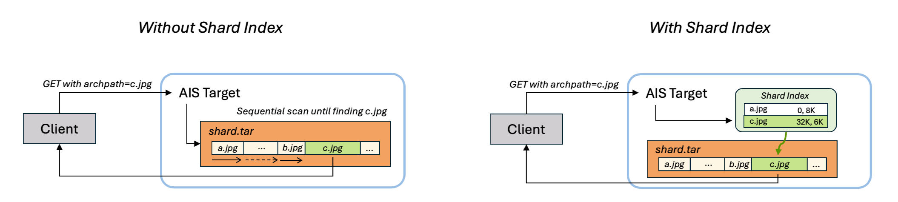

# Shard Index

Shard index lets AIS locate and read archived files in TAR objects by offset, avoiding a sequential archive scan.

Use it when a bucket stores dataset TARs and clients repeatedly fetch individual archived files via `archpath`, for example training samples in GetBatch or regular object GET requests.

The same client request works with or without an index; the difference is the target-side read path:



## Table of Contents

- [Motivation](#motivation)
- [Quick start](#quick-start)
- [How it works](#how-it-works)
- [Build indexes](#build-indexes)
- [Read indexed shards](#read-indexed-shards)
- [Summarize coverage](#summarize-coverage)
- [Staleness and cleanup](#staleness-and-cleanup)

## Motivation

Without a shard index, reading `samples/000123.jpg` from `shard-000042.tar` requires archive traversal: AIS must sequentially scan through the TAR object until it finds the requested archived file.

With a shard index, AIS loads compact metadata for `shard-000042.tar`, finds the archived file's offset and size, seeks directly to it, and reads only the requested bytes.

This matters most when:

- each TAR object contains many small files
- each request needs only a few files from each TAR object
- the same TAR objects are read repeatedly
- requests use regular object GET or [GetBatch](/docs/get_batch.md) with `archpath`

## Quick start

Create or upload TAR objects, build indexes, check coverage, and read archived files normally:

```console
# Generate toy TAR objects.
$ ais archive gen-shards "ais://dataset/shards/shard-{0001..0100}.tar" \
  --fcount 4096 \
  --fsize 1024 \
  --output-template "sample-{0001..4096}.bin"

# Build shard indexes for those TAR objects.
$ ais bucket shard-index build ais://dataset --prefix shards/ --wait

# Check shard-index coverage.
$ ais bucket shard-index summary ais://dataset --prefix shards/

# Read one archived file; AIS uses the index when valid.
$ ais get ais://dataset/shards/shard-0001.tar /tmp/sample.bin --archpath sample-0001.bin
```

## How it works

A shard index is the associated metadata stored in the system bucket; it makes the source TAR searchable without changing the TAR itself. In summary output, only TAR objects with valid indexes are counted as shards.

For each indexed TAR object, AIS stores:

- archived file names
- byte offsets and sizes inside the TAR
- source object size
- source object checksum

Indexes are stored in the [AIS system bucket](/docs/bucket.md#system-buckets):

```text
ais://.sys-shardidx
```

The read path is transparent:

1. A client requests an archived file using `archpath`.
2. AIS checks whether the source TAR has a valid shard index.
3. If the index is valid, AIS reads the archived file by direct offset lookup.
4. If no valid index is available, AIS falls back to the normal archive traversal path.

The client request does not change when an index exists. The index is a performance feature, not a separate data-access API.

## Build indexes

Use `ais bucket shard-index build` to build indexes for TAR objects in a bucket:

```console
$ ais bucket shard-index build ais://dataset --prefix shards/ --wait
```

Common forms:

```console
# Index all TAR objects in the bucket.
$ ais bucket shard-index build ais://dataset

# Index only TAR objects under a prefix.
$ ais bucket shard-index build ais://dataset --prefix shards/

# Same prefix selection using embedded bucket path syntax.
$ ais bucket shard-index build ais://dataset/shards/

# Run with explicit worker count.
$ ais bucket shard-index build ais://dataset --prefix shards/ --num-workers 16

# Wait for the build job to finish.
$ ais bucket shard-index build ais://dataset --prefix shards/ --wait
```

The build job:

- walks the selected bucket/prefix
- skips non-TAR objects
- builds one index per TAR object
- verifies existing indexes unless `--skip-verify` is used
- rebuilds stale or invalid indexes

Monitor running and completed indexing jobs with:

```console
$ ais show job shard-index ais://dataset --all
```

### Fast reruns

`--skip-verify` is a fast rerun mode:

```console
$ ais bucket shard-index build ais://dataset --prefix shards/ --skip-verify
```

When this option is set, AIS trusts source objects that already say they have a shard index and skips loading the stored index to verify staleness. Use it only when you know the indexed TAR objects have not changed.

## Read indexed shards

Shard indexes are used automatically by regular GET and GetBatch when the request specifies `archpath`.

### Regular GET

Use regular object GET with `--archpath`:

```console
$ ais get ais://dataset/shards/shard-000042.tar /tmp/sample.jpg --archpath samples/000123.jpg
```

Or use the archive convenience form:

```console
$ ais archive get ais://dataset/shards/shard-000042.tar/samples/000123.jpg /tmp
```

The equivalent HTTP request is a normal object GET with the `archpath` query parameter:

```console
$ curl -L "$AIS_ENDPOINT/v1/objects/dataset/shards/shard-000042.tar?provider=ais&archpath=samples/000123.jpg" \
  --output /tmp/sample.jpg
```

### GetBatch

GetBatch uses the same `archpath` field per input object:

```json
{
  "mime": ".tar",
  "in": [
    {"objname": "shards/shard-000042.tar", "archpath": "samples/000123.jpg"},
    {"objname": "shards/shard-000043.tar", "archpath": "samples/000124.jpg"}
  ],
  "strm": true
}
```

With valid shard indexes, each archived-file lookup becomes direct random access into its TAR object. Without indexes, the same request still works, but AIS must scan the archive to locate each `archpath`.

## Summarize coverage

Use `ais bucket shard-index summary` to see how many local TAR objects are indexed:

```console
$ ais bucket shard-index summary ais://dataset --prefix shards/
BUCKET         TAR OBJECTS  TAR SIZE  SHARDS  SHARD SIZE  NOT INDEXED  ARCHIVED OBJECTS  STALE  INVALID
ais://dataset  100          600MiB    95      570MiB      5            389120            0      0
```

Columns:

| Column | Meaning |
|--------|---------|
| `TAR OBJECTS` | local TAR objects matching the bucket/prefix |
| `TAR SIZE` | total size of those TAR objects |
| `SHARDS` | TAR objects with a valid shard index |
| `SHARD SIZE` | total size of valid indexed TAR objects |
| `NOT INDEXED` | `TAR OBJECTS - SHARDS` |
| `ARCHIVED OBJECTS` | archived-file entries across valid indexes |
| `STALE` | TAR objects whose stored index no longer matches the source object |
| `INVALID` | TAR objects whose stored index exists but cannot be loaded |

To print progress while the summary job is running:

```console
$ ais bucket shard-index summary ais://dataset --prefix shards/ --refresh 1s
```

To start the summary asynchronously and poll by job ID:

```console
$ ais bucket shard-index summary ais://dataset --prefix shards/ --dont-wait
Job shard-summary[abcDEF123] has started. To monitor, run 'ais bucket shard-index summary ais://dataset abcDEF123 --dont-wait'

$ ais bucket shard-index summary ais://dataset abcDEF123 --dont-wait
```

The summary command reports local in-cluster TAR objects. It is intended to answer: "How many TAR objects in this bucket/prefix are already usable as indexed shards?"

## Staleness and cleanup

Each index records the source TAR object's size and checksum at build time.

When AIS loads an index, it compares that recorded metadata with the current source object metadata:

- if size and checksum still match, the index is valid
- if either changed, the index is stale
- if the index object cannot be decoded, the index is invalid

Staleness most commonly happens when a TAR object is overwritten after its index was built.

The normal build path verifies existing indexes and rebuilds stale or invalid ones on a best-effort basis. If a TAR object is busy or cannot be read, AIS skips it and continues. The read path will not use a stale index; it falls back to archive traversal if a valid index is not available.

When a source object that has a shard index is removed, AIS removes the corresponding index object from `.sys-shardidx` as part of the same cleanup path. Space cleanup can also remove stale internal system-bucket entries.

## See also

- [Archives](/docs/archive.md)
- [GetBatch](/docs/get_batch.md)
- [CLI: bucket shard-index](/docs/cli/bucket.md#build-and-summarize-shard-indexes)
- [System buckets](/docs/bucket.md#system-buckets)
