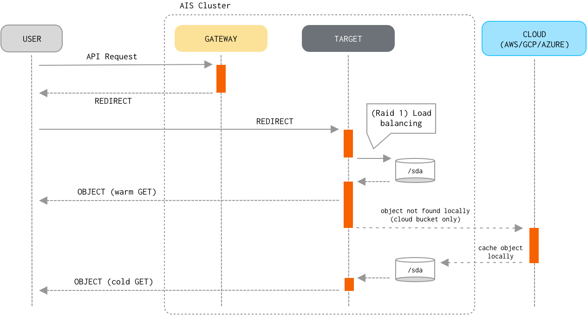
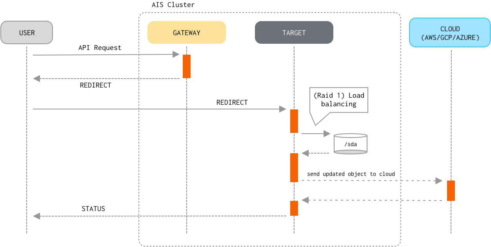
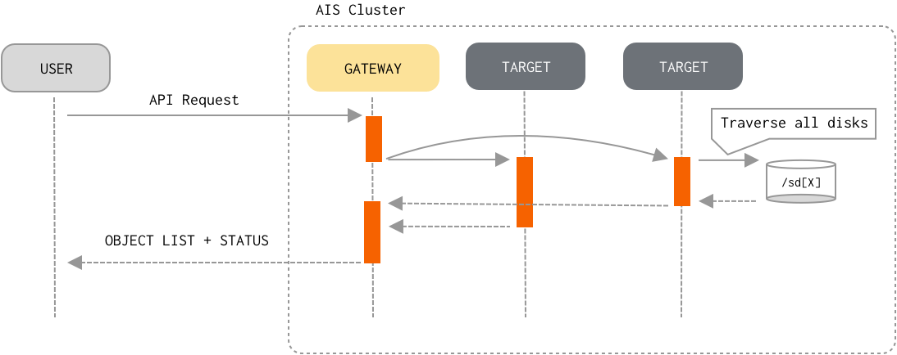

## Table of Contents

- [Read and Write Traffic Patterns](#read-and-write-traffic-patterns)
  - [Read](#read)
  - [Write](#write)
- [List Objects](#list-objects)

## Read and Write Traffic Patterns

`GET object` and `PUT object` are by far the most common operations often "responsible" for more 90% (and sometimes more than 99%) of the entire traffic load. As far as I/O processing pipeline, the first few steps of the GET and, respectively, PUT processing are very similar:

1. A client sends a `GET` or `PUT` request to any of the AIStore proxies/gateways.
2. The proxy determines the storage target it must redirect the request to, the steps including:
    1. Extract bucket and object names from the request.
    2. Select a storage target as an HRW function of the `(cluster map, bucket, object)` triplet, where HRW stands for [Highest Random Weight](https://en.wikipedia.org/wiki/Rendezvous_hashing);
       note that since HRW is a consistent hashing mechanism, the output of the computation will be (consistently) the same for the same `(bucket, object)` pair and cluster configuration.
    3. Redirect the request to the selected target.
3. The target parses the bucket and object from the (redirected) request and determines whether the bucket is an AIS bucket or provided by one of the supported 3rd party backends.
4. The target then determines a `mountpath` (and therefore, a local filesystem) that will be used to perform the I/O operation.
   This time, the target computes HRW (configured mountpaths, bucket, object) on the input that, in addition to the same `(bucket, object)` pair includes all currently active/enabled mountpaths.
5. Once the highest-randomly-weighted `mountpath` is selected, the target then forms a fully-qualified name to perform the local read/write operation.
   For instance, given a `mountpath = /a/b/c`, the fully-qualified name may look as `/a/b/c/@<provider>/<bucket_name>/%<content_type>/<object_name>`.

Beyond these 5 (five) common steps the similarity between `GET` and `PUT` request handling ends, and the remaining steps include:

### Read

5. If the object already exists locally (i.e., belongs to an AIS bucket, or the most recent version of a Cloud-based object is cached and resides on a local disk), the target optionally validates the object's checksum and version.
   This type of `GET` is often referred to as a "warm `GET`".
6. Otherwise, the target performs a "cold `GET`" by downloading the latest version of the object from the Cloud.
   The target caches downloaded cloud object locally on the disk, so the next request will retrieve the object without requesting the cloud.
7. Finally, the target delivers the object to the client.

> Consistency of the Read operation (vs Write/Delete/Append) is properly enforced.

### Write

5. If the object already exists locally and its checksum matches the checksum provided in the request, processing stops because the object hasn't changed.
6. The target streams the object contents from an HTTP request to a temporary work file.
7. Upon receiving the last byte of the object, the target calculates the checksum of the received stream of bytes and compares checksums to ensure data integrity (done only when checksum has been included in the request).
   In case the checksums don't match, the target discards the object and returns an error to the client.
8. When the object streaming has finished, the target sends the new version of the object to the Cloud.
9. The target then renames the temporary work file to the fully-qualified name, writes extended attributes (which include versioning and checksum), and commits the PUT transaction.

> Consistency of the Write operation (vs Read/Delete/Append) is properly enforced.

## List Objects

In contrast with the Read and Write datapath, `list-objects` flow "engages" all targets in the cluster (and, effectively, all clustered disks). To optimize (memory and networking-wise) and speed-up the processing, AIS employs a number of (designed-in) caching and buffering techniques:

1. Client sends an API request to any AIStore proxy/gateway to receive a new *page* of listed objects (a typical page size is 1000 - for a remote bucket, 10K - for an AIS bucket).
2. The proxy then checks if the requested page can be served from:
   1. A *cache* - that may have been populated by the previous `list-objects` requests.
   2. A *buffer* - when targets send more `list-objects` entries than requested proxy *buffers* the entries and then uses those *buffers* to serve subsequent requests.
3. Otherwise, the proxy broadcasts the requests to all targets and waits for their responses.
3. Upon request, each target starts traversing its local mountpaths.
   To further optimize time on restarting traversal of the objects upon *next page* request, each target resumes its traversal from the last object that was returned in response to the *previous page* request.
   The target does it by keeping active thread which stops (produced enough entries) and starts (more entries needed) when requested.
4. Finally, the proxy combines all the responses and returns the list to the client.
   The proxy also *buffers* those `list-objects` entries that do not fit one page (which is limited in size - see above).
   The proxy may also *cache* the entries for reuse across multiple clients and requests.

