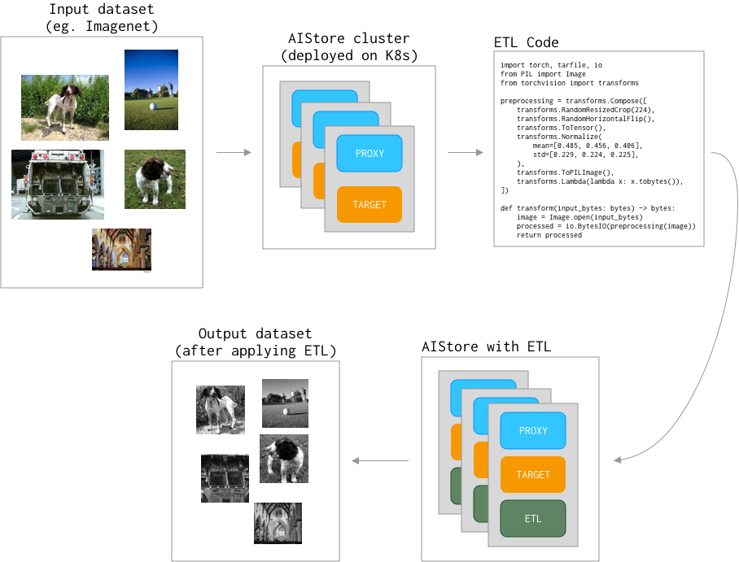

# PyTorch ImageNet preprocessing with ETL

In this example, we will see how to use ETL to preprocess the images of ImageNet which then can be used for training.
The following GIF presents the whole operation:


## Overview

This tutorial consists of couple steps:
1. Prepare AIStore cluster.
2. Prepare dataset.
3. Prepare transform code (ETL).
4. Transform dataset on AIStore cluster with ETL.

Here is a general overview of these steps:



## Prerequisites

* AIStore cluster deployed on Kubernetes. We recommend following guide below.
  * [Deploy AIStore on local Kuberenetes cluster](https://github.com/NVIDIA/ais-k8s/blob/master/operator/README.md)
  * [Deploy AIStore on the cloud](https://github.com/NVIDIA/ais-k8s/blob/master/terraform/README.md)

## Prepare dataset

Before we start writing code, let's put an example tarball file with ImageNet images to the AIStore.
The tarball we will be using is `n02085620.tar` (saved as `raw-train.tar`) from [ILSVRC2012_img_train_t3.tar](http://www.image-net.org/challenges/LSVRC/2012/dd31405981ef5f776aa17412e1f0c112/ILSVRC2012_img_train_t3.tar).

```console
$ tar -tvf raw-train.tar | head -n 5
-rw-r--r--  0 aditya86 users   27024 Jul  4  2012 n02085620_10074.JPEG
-rw-r--r--  0 aditya86 users   34446 Jul  4  2012 n02085620_10131.JPEG
-rw-r--r--  0 aditya86 users   12891 Jul  4  2012 n02085620_10621.JPEG
-rw-r--r--  0 aditya86 users   34837 Jul  4  2012 n02085620_1073.JPEG
-rw-r--r--  0 aditya86 users   18126 Jul  4  2012 n02085620_10976.JPEG
$ ais bucket create ais://imagenet
"ais://imagenet" bucket created
$ ais object put raw-train.tar imagenet
PUT "raw-train.tar" into bucket "imagenet"
```

## Prepare ETL code

As we have ImageNet prepared now we need an ETL code that will do the transformation.
Here we will use `python3` runtime to install `torch` and `torchvision` packages.

Our transform code will look like this (`code.py`):
```python
import torch, tarfile, io
from PIL import Image
from torchvision import transforms

def img_to_bytes(img):
    buf = io.BytesIO()
    img = img.convert('RGB')
    img.save(buf, format='JPEG')
    return buf.getvalue()

preprocessing = transforms.Compose([
    transforms.RandomResizedCrop(224),
    transforms.RandomHorizontalFlip(),
    transforms.ToTensor(),
    transforms.Normalize(mean=[0.485, 0.456, 0.406], std=[0.229, 0.224, 0.225]),
    transforms.ToPILImage(),
    transforms.Lambda(img_to_bytes),
])

def transform(input_bytes: bytes) -> bytes:
    input_tar = tarfile.open(fileobj=io.BytesIO(input_bytes))

    output_bytes = io.BytesIO()
    output_tar = tarfile.open(fileobj=output_bytes, mode="w|")

    for member in input_tar:
        image = Image.open(input_tar.extractfile(member))
        processed = preprocessing(image)

        member.size = len(processed)
        output_tar.addfile(member, io.BytesIO(processed))

    output_tar.close()
    return output_bytes.getvalue()
```

The idea here is that we unpack the tarball, process each image and save it into transformed output tarball.

To make sure that the code runs we need to specify required dependencies (`deps.txt`):
```
torch==1.6.0
torchvision==0.7.0
```

## Transform dataset

Now we can build the ETL:
```console
$ ais etl init code --from-file=code.py --deps-file=deps.txt --runtime=python3
JGHEoo89gg
$ ais etl object JGHEoo89gg imagenet/raw-train.tar preprocessed-train.tar
$ tar -tvf preprocessed-train.tar | head -n 5
-rw-r--r--  0 aditya86 users  150528 Jul  4  2012 n02085620_10074.JPEG
-rw-r--r--  0 aditya86 users  150528 Jul  4  2012 n02085620_10131.JPEG
-rw-r--r--  0 aditya86 users  150528 Jul  4  2012 n02085620_10621.JPEG
-rw-r--r--  0 aditya86 users  150528 Jul  4  2012 n02085620_1073.JPEG
-rw-r--r--  0 aditya86 users  150528 Jul  4  2012 n02085620_10976.JPEG
```

As expected, the size of the new tarball images has been standardized as all images have the same resolution (`224*224*3=150528`).
