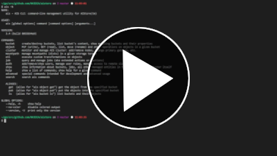
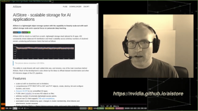

# Table of contents

- [CLI](#cli)
  - [Top-level Commands](#top-level-commands)
  - [Getting Started](#getting-started)
- [Deployment: Google Cloud](#deployment-google-cloud)
- [Minimal All-In-One Standalone Docker](#minimal-all-in-one-standalone-docker)
- [Extract, Transform, Load](#extract-transform-load)
- [S3 and TensorFlow: TF Training](#s3-and-tensorflow-tf-training)
- [Developer Playground](#developer-playground)

# CLI

## Top-level Commands

## Getting Started

")

# Deployment: Google Cloud

# Minimal All-In-One Standalone Docker

* [README](/deploy/prod/docker/single/README.md)
* [Quick Start: Ephemeral Storage](https://youtu.be/ndeCy2gy7vU)
* [Quick Start: Persistent Storage](https://youtu.be/1AN-RYpW3bs)

# Extract, Transform, Load

This section comprises a number of videos illustrating different aspects of the AIS-ETL extension. A good place to start, though, would be the following [comprehensive introduction and a Jupyter notebook walk-through](https://www.youtube.com/watch?v=4PHkqTSE0ls):

")

## ETL init with code: ImageNet Transformation

## ETL init with spec: MD5 Computation

# S3 and TensorFlow: TF Training

# Developer Playground

")
