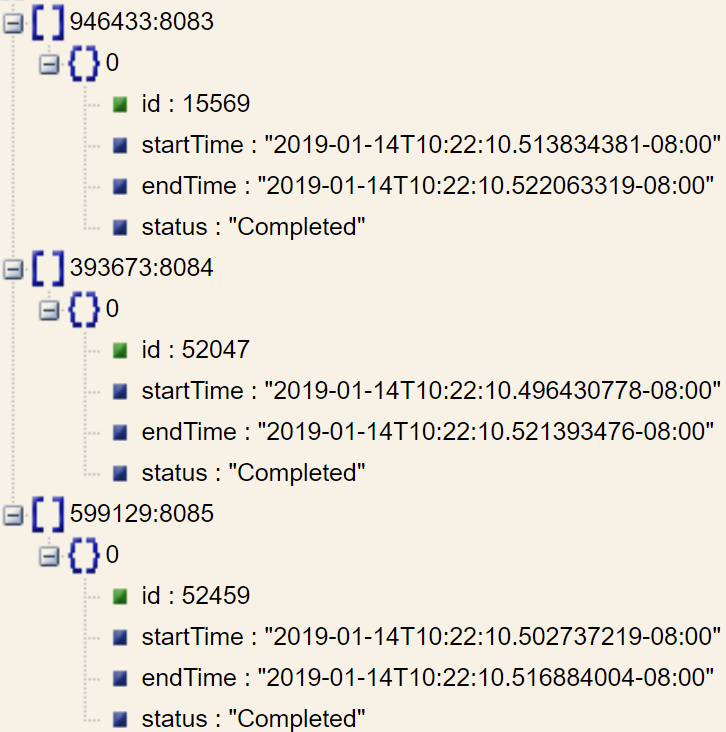

## Table of Contents
- [Extended Actions (xactions)](#extended-actions-xactions)

## Extended Actions (xactions)

Extended actions (xactions) are batch operations that may take seconds, sometimes minutes or even hours, to execute. Xactions run asynchronously, have one of the enumerated kinds, start/stop times, and xaction-specific statistics. Xactions start running based on a wide variety of runtime conditions that include:

* periodic (defined by a configured interval of time)
* resource utilization (e.g., usable capacity falling below configured watermark)
* certain type of workload (e.g., PUT into a mirrored or erasure-coded bucket)
* user request (e.g., to reduce a number of local object copies in a given bucket)
* adding or removing storage targets (the events that trigger cluster-wide rebalancing)
* adding or removing local disks (the events that cause local rebalancer to start moving stored content between *mountpaths* - see [Managing filesystems](/docs/configuration.md#managing-filesystems))
* and more.

Further, to reduce congestion and minimize interference with user-generated workload, extended actions (self-)throttle themselves based on configurable watermarks. The latter include `disk_util_low_wm` and `disk_util_high_wm` (see [configuration](/ais/setup/config.sh)). Roughly speaking, the idea is that when local disk utilization falls below the low watermark (`disk_util_low_wm`) extended actions that utilize local storage can run at full throttle. And vice versa.

The amount of throttling that a given xaction imposes on itself is always defined by a combination of dynamic factors. To give concrete examples, an extended action that runs LRU evictions performs its "balancing act" by taking into account remaining storage capacity _and_ the current utilization of the local filesystems. The two-way mirroring (xaction) takes into account congestion on its communication channel that callers use for posting requests to create local replicas. And the `atimer` - extended action responsible for [access time updates](/atime/atime.go) - self-throttles based on the remaining space (to buffer atimes), etc.

Supported extended actions are enumerated in the [user-facing API](/cmn/api.go) and include:

* Cluster-wide rebalancing (denoted as `ActGlobalReb` in the [API](/cmn/api.go)) that gets triggered when storage targets join or leave the cluster;
* LRU-based cache eviction (see [LRU](/docs/storage_svcs.md#lru)) that depends on the remaining free capacity and [configuration](/ais/setup/config.sh);
* Prefetching batches of objects (or arbitrary size) from the Cloud (see [List/Range Operations](/docs/batch.md));
* Consensus voting (when conducting new leader [election](/docs/ha.md#election));
* Erasure-encoding objects in a EC-configured bucket (see [Erasure coding](/docs/storage_svcs.md#erasure-coding));
* Creating additional local replicas, and
* Reducing number of object replicas in a given locally-mirrored bucket (see [Storage Services](/docs/storage_svcs.md));
* and more.

The picture illustrates results of a generic query that checks whether the (in this example) LRU-based cache eviction has already finished in a cluster containing 3 storage targets (which it has, as per the "status" field below):



The query itself looks as follows:

```shell
$ curl -X GET http://localhost:8080/v1/cluster?what=xaction&props=lru
```

>> As always, `localhost:8080` above (and throughout this entire README) serves as a placeholder for the _real_ gateway's hostname/IP address.

The corresponding [RESTful API](/docs/http_api.md) includes support for querying absolutely all xactions including global-rebalancing and prefetch operations:

```shell
$ curl -X GET http://localhost:8080/v1/cluster?what=xaction&props=rebalance
$ curl -X GET http://localhost:8080/v1/cluster?what=xaction&props=prefetch
```

At the time of this writing, unlike all the rest xactions global-rebalancing and prefetch queries provide [extended statistics](/stats/xaction_stats.go) on top and in addition to the generic "common denominator" mentioned and illustrated above.
