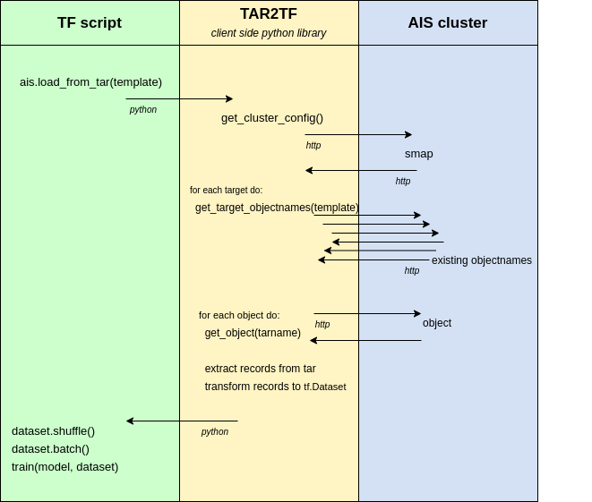

# TAR2TF - AIS python client

This client provides an easy way to interact with AIS cluster to create TensorFlow datasets.

### Start

```console
$ ./setup.sh
$ source venv/bin/activate
$ ais create bucket $BUCKET

...
Put small tars from gsutil ls gs://lpr-gtc2020 into $BUCKET
and adjust imagenet.py with your $BUCKET and objects template
...

$ python examples/imagenet_in_memory.py
```

### Functions
```python
def AisDataset(bucket_name, proxy_url, val_op, label_op)
```

Create AisDataset object

`bucket_name` - name of an AIS bucket

`proxy_url` - url of AIS cluster proxy

`conversions` - list of Conversions from `tar2tf.ops`. Describes transformations made on tar-record. See tar2tf.ops section for more.

`selections` - list of length 2 of Selections from `tar2tf.ops`. Describes how to transform tar-record entry into datapoint. See tar2tf.ops section for more.


```python
def load(template, **kwargs)
```

Transform tars of images from AIS into TensorFlow compatible format.

`template` - `string` - object names of tars. Bash range syntax like `{0..10}` is supported. 

`remote_exec` - `bool` - specify is conversions and selections should be executed in the cluster.  
If `remote_exec == True`, but remote execution of one of conversions is not supported, `remote_exec` becomes disabled.
If `remote_exec` not provided, it will be automatically detected if remote execution is possible.

`output_shapes` - `list of tf.TensorShape` - resulting objects' shapes

`output_types` - `list of tf.DType` - resulting objects' types

`shuffle_tar` - `bool` - shuffle records within tar file. Supported only when remote execution is enabled.

`num_workers` - `number` - number of workers concurrently downloading objects from AIS cluster

`path` - `string` or `string generator` - destination where TFRecord file or multiple files should be saved to. 
If `path` provided, remote execution is not enabled.
Accepted: string, string with "{}" format template or generator. 
If `max_shard_size` is specified multiple files destinations might be needed.
If `path` is string default path indexing will be applied.
If `path` is string with "{}" consecutive numbers starting with 1 will be put into `path`.
If `path` is generator consecutive yielded values will be used.  
Generated TFRecord files paths are returned from `load`.

If empty or None, all operations are made in memory or executed remotely and `tf.data.Dataset` is returned.

`record_to_example` (optional) - `function` - should specify how to translate tar record.
Argument of this function is representation of single tar record: python `dict`. 
Tar record is an abstraction for multiple files with exactly the same path, but different extension. 
The argument of function will have `__key__` entry which value is path to record without an extension.
For each extension `e`, dict with have an entry `e` with value the same as contents of relevant file.  

If default `record_to_example` was used, `default_record_parser` function should be used to
parse `TFRecord` to `tf.Dataset` interface.




### tar2tf.ops

`ops` module is used to describe tar-record to datapoint transformation.

#### Conversions

Conversions are transformations applied to each tar record.

##### `Convert`

`tar2tf.ops.Convert(ext_name, dst_type)`

Converts inner type of `ext_name` entry image into `dst_type`.

*Remote execution supported.*

##### `Decode`

`tar2tf.ops.Decode(ext_name)`

Decodes image from format BMP, JPEG, or PNG. Fails for other formats.

*Remote execution supported.*

##### `Resize`

`tar2tf.ops.Resize(ext_name, dst_size)`

Resizes `ext_name` image into new size `dst_size`.

*Remote execution supported.*

##### `Rotate`

`tar2tf.ops.Rotate(ext_name, [angle])`

Rotates `ext_name` image `angle` degrees clockwise. If `angle == 0` or not provided, random rotation is applied.

*Remote execution supported.*

##### `Func`

`tar2tf.ops.Func(f)`

The most versatile operations from tar2tf.ops. Takes function `f` and calls it with `tar_record`.

##### Selections

Selections select entries from tar record to be either values or labels in dataset.

##### `Select`

`tar2tf.ops.Select(ext_name)`

The simplest of tar2tf.ops. Returns value from tar record under `ext_name` key.

##### `SelectJSON`

`tar2tf.ops.SelectJSON(ext_name, nested_path)`

Similar to `Select`, but is able to extract deeply nested value from JSON format.
`nested_path` can be either string/int (for first level values) or list of string/int (for deeply nested).
Reads value under `ext_name`, treats it as a JSON, and returns value under `nested_path`.

##### `SelectList`

`tar2tf.ops.SelectList(list of Selection)`

Returns an object which is a list of provided Selections

##### `SelectDict`

`tar2tf.ops.SelectDict(dict of Selection)`

Returns an object which is a dict of provided Selections


### Examples

#### Create dataset with remote transformations
```python
ais = AisDataset(BUCKET_NAME, PROXY_URL, [Decode("jpg"), Resize("jpg", (32,32))], ["jpg", "cls"])
train_dataset = ais.load(
    "train-{0..3}.tar.gz",
    num_workers=4,
    remote_exec=True,
).shuffle().batch(BATCH_SIZE)
test_dataset = ais.load("train-{4..7}.tar.gz").batch(BATCH_SIZE)
# ...
model.fit(train_dataset, epochs=EPOCHS)
```

#### The same as above, but remote execution is automatically detected
```python
ais = AisDataset(BUCKET_NAME, PROXY_URL, [Decode("jpg"), Resize("jpg", (32,32))], ["jpg", "cls"])
train_dataset = ais.load(
    "train-{0..3}.tar.gz",
    num_workers=4,
).shuffle().batch(BATCH_SIZE)
test_dataset = ais.load("train-{4..7}.tar.gz").batch(BATCH_SIZE)
# ...
model.fit(train_dataset, epochs=EPOCHS)
```


#### Create in-memory dataset from tars with names `"train-{0..7}.tar.gz"` in bucket `BUCKET_NAME`.
```python
# Create in-memory TensorFlow dataset
ais = AisDataset(BUCKET_NAME, PROXY_URL)
train_dataset = ais.load("train-{0..3}.tar.gz").shuffle().batch(BATCH_SIZE)
test_dataset = ais.load("train-{4..7}.tar.gz").batch(BATCH_SIZE)
# ...
model.fit(train_dataset, epochs=EPOCHS)
```

#### The same as above, but with 4 workers fetching dataset from the cluster.
```python
# Create in-memory TensorFlow dataset
ais = AisDataset(BUCKET_NAME, PROXY_URL)
train_dataset = ais.load(
    "train-{0..3}.tar.gz",
    num_workers=4,
    remote_exec=False,
).shuffle().batch(BATCH_SIZE)
test_dataset = ais.load(
    "train-{4..7}.tar.gz",
    num_workers=4,
    remote_exec=False,
).batch(BATCH_SIZE)
# ...
model.fit(train_dataset, epochs=EPOCHS)
```

#### Create TensorFlow dataset with intermediate storing `TFRecord` in filesystem.
```python
ais = AisDataset(BUCKET_NAME, PROXY_URL)

records = ais.load(
    "train-{0..3}.tar.gz",
    path="train.record",
)
train_dataset = tf.data.TFRecordDataset(filenames=records)
                       .map(default_record_parser)
                       .shuffle(buffer_size=1024)
                       .batch(BATCH_SIZE)
# ...
model.fit(train_dataset, epochs=EPOCHS)
```

#### Create TensorFlow dataset with intermediate storing `TFRecord` in filesystem with limited TFRecord size.
```python
ais = AisDataset(BUCKET_NAME, PROXY_URL)

filenames = ais.load(
    "train-{0..3}.tar.gz",
    path="train-{}.record",
    max_shard_size="100MB",
)
train_dataset = tf.data.TFRecordDataset(filenames=filenames)
                       .map(default_record_parser)
                       .shuffle(buffer_size=1024)
                       .batch(BATCH_SIZE)
# ...
model.fit(train_dataset, epochs=EPOCHS)
```

#### Create TensorFlow dataset in memory with custom tar-record to datapoint translation.
```python
# Create in-memory TensorFlow dataset
# decoded and resized "jpg", applies function f
# datapoint value from "jpg", label from "cls"
ais = AisDataset(BUCKET_NAME, PROXY_URL, [Decode("jpg"), Resize("jpg", (32,32)), Func(f)], ["jpg", "cls"])
train_dataset = ais.load("train-{0..3}.tar.gz"
).shuffle().batch(BATCH_SIZE)
test_dataset = ais.load("train-{4..7}.tar.gz").batch(BATCH_SIZE)
# ...
model.fit(train_dataset, epochs=EPOCHS)
```

#### Create TensorFlow dataset in memory with custom tar-record to datapoint translation.
```python

# Create in-memory TensorFlow dataset
ais = AisDataset(
    BUCKET_NAME,
    PROXY_URL,
    [Decode("jpg"), Resize("jpg", (32,32)), Func(f)],
    ["jpg", "cls"]
)
train_dataset = ais.load("train-{0..3}.tar.gz").shuffle().batch(BATCH_SIZE)
test_dataset = ais.load("train-{4..7}.tar.gz").batch(BATCH_SIZE)
test_dataset = ais.load("train-{4..7}.tar.gz").batch(BATCH_SIZE)
# ...
model.fit(train_dataset, epochs=EPOCHS)
```