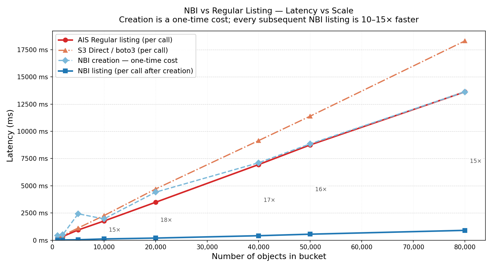

# NBI Latency-vs-Scale Benchmark

Measures listing latency of [Native Bucket Inventory (NBI)](../../../../docs/nbi.md) against two baselines — AIS regular listing and direct S3 access via boto3 — across bucket sizes from 1K to 80K objects.

## Background

| Path | How it works |
|---|---|
| **AIS Regular** | Client sends one request to the AIS proxy. One designated target walks `ListObjectsV2` sequentially (1000 keys/page) and returns the aggregated result. |
| **NBI creation** | A one-time job that walks S3 (same as Regular) and writes the full bucket namespace as binary inventory chunks on each target's local disk. |
| **NBI listing** | Subsequent listings read the pre-built inventory chunks from local disk — no S3 calls. |
| **S3 Direct** | Client calls boto3 `ListObjectsV2` in a pagination loop directly against S3 (MaxKeys=1000, same page size as AIS). |

## Setup

### 1. Connect to the cluster

```bash
export AIS_ENDPOINT=http://<proxy>:51080
ais show cluster
```

### 2. Generate source objects (one-time)

Objects are 1-byte files uploaded via `aisloader` to an S3-backed bucket. The subdirectory prefix isolates each scale point so they can coexist in the same bucket.

```bash
for subdir in 1k 2k 5k 10k 20k 40k 50k 80k; do
    count=$(echo $subdir | sed 's/k/*1000/' | bc)
    aisloader -bucket=my-bucket -provider=aws \
        -subdir=bench/${subdir} \
        -pctput=100 -maxputs=${count} \
        -minsize=1 -maxsize=1 \
        -numworkers=16 -cleanup=false -skiplist \
        -duration=10m
done
```

Or run each prefix individually:

```bash
aisloader -bucket=my-bucket -provider=aws -subdir=bench/1k  -pctput=100 -maxputs=1000  -minsize=1 -maxsize=1 -numworkers=16 -cleanup=false -skiplist -duration=10m
aisloader -bucket=my-bucket -provider=aws -subdir=bench/2k  -pctput=100 -maxputs=2000  -minsize=1 -maxsize=1 -numworkers=16 -cleanup=false -skiplist -duration=10m
aisloader -bucket=my-bucket -provider=aws -subdir=bench/5k  -pctput=100 -maxputs=5000  -minsize=1 -maxsize=1 -numworkers=16 -cleanup=false -skiplist -duration=10m
aisloader -bucket=my-bucket -provider=aws -subdir=bench/10k -pctput=100 -maxputs=10000 -minsize=1 -maxsize=1 -numworkers=16 -cleanup=false -skiplist -duration=10m
aisloader -bucket=my-bucket -provider=aws -subdir=bench/20k -pctput=100 -maxputs=20000 -minsize=1 -maxsize=1 -numworkers=16 -cleanup=false -skiplist -duration=10m
aisloader -bucket=my-bucket -provider=aws -subdir=bench/40k -pctput=100 -maxputs=40000 -minsize=1 -maxsize=1 -numworkers=16 -cleanup=false -skiplist -duration=10m
aisloader -bucket=my-bucket -provider=aws -subdir=bench/50k -pctput=100 -maxputs=50000 -minsize=1 -maxsize=1 -numworkers=16 -cleanup=false -skiplist -duration=10m
aisloader -bucket=my-bucket -provider=aws -subdir=bench/80k -pctput=100 -maxputs=80000 -minsize=1 -maxsize=1 -numworkers=16 -cleanup=false -skiplist -duration=10m
```

### 3. Install dependencies

```bash
pip install aistore boto3
```

### 4. Run the benchmark

```bash
python3 bench.py
```

Flags:

| Flag | Default | Description |
|---|---|---|
| `--endpoint` | `$AIS_ENDPOINT` | AIS proxy URL |
| `--bucket` | `my-bucket` | S3 bucket name |
| `--provider` | `aws` | backend provider |
| `--runs` | `20` | listing repetitions per scale point |

## Results



```
==========================================================================================================================
NBI latency-vs-scale  (20 runs each)
==========================================================================================================================
Objects     Creation           --- Regular (ms) ---                 --- NBI (ms) ---                   --- S3 Direct (ms) ---          Speedup
                           p50      p95      p99       sd       p50      p95      p99       sd       p50      p95      p99       sd    (R/N)
--------------------------------------------------------------------------------------------------------------------------
 1K             472ms       179      429      429       90        25      110      110       20       259      302      302       21     7.2x
 2K             559ms       321      603      603       97        32      106      106       21       548      604      604       38     9.9x
 5K            1094ms       826     1190     1190      103        60      135      135       29      1343     1640     1640       88    13.8x
10K            1934ms      1766     2201     2201      160       164      199      199       39      3100     4842     4842      608    10.7x
20K            3455ms      3541     3978     3978      194       271      394      394       38      5475     6140     6140      277    13.1x
40K            6578ms      7249     8075     8075      460       577      682      682       61     11246    14341    14341     1089    12.6x
50K            7978ms      9110    10072    10072      592       674      841      841       69     13873    21246    21246     1770    13.5x
80K           13375ms     14724    15973    15973      633      1244     1367     1367       61     22180    28541    28541     1731    11.8x
==========================================================================================================================
```
