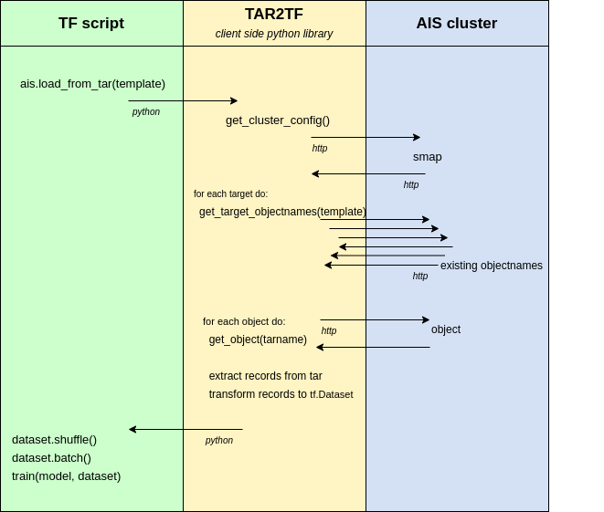

# TAR2TF - AIS python client

This client provides an easy way to interact with AIS cluster to create TensorFlow datasets.

### Start

```console
$ ./setup.sh
$ source venv/bin/activate
$ ais create bucket $BUCKET

...
Put small tars from gsutil ls gs://lpr-gtc2020 into $BUCKET
and adjust imagenet.py with your $BUCKET and objects template
...

$ python examples/imagenet_in_memory.py
```

### Functions
```python
def AisDataset(bucket_name, proxy_url, val_op, label_op)
```

Create AisDataset object

`bucket_name` - name of an AIS bucket

`proxy_url` - url of AIS cluster proxy

`val_op` - one of `tar2tf.ops`. Describes how to transform tar-record into datapoint value. See tar2tf.ops section for more.

`label_op` - one of `tar2tf.ops`. Describes how to transform tar-record into datapoint label. See tar2tf.ops section for more.

`num_workers` - number of workers which are downloading tars from AIS cluster


```python
def load_from_tar(template, [path])
```

Transform tars of images from AIS into TensorFlow compatible format.

`template` - object names of tars. Bash range syntax like `{0..10}` is supported.  

`path` - destination where TFRecord file or multiple files should be saved to. 
Accepted: string, string with "{}" format template or generator. 
If `max_shard_size` is specified multiple files destinations might be needed.
If `path` is string default path indexing will be applied.
If `path` is string with "{}" consecutive numbers starting with 1 will be put into `path`.
If `path` is generator consecutive yielded values will be used.  
Generated TFRecord files paths are returned from `load_from_tar`

If empty or None, all operations are made in memory and `tf.data.Dataset` is returned.

`record_to_example` (optional) - should specify how to translate tar record.
Argument of this function is representation of single tar record: python `dict`. 
Tar record is an abstraction for multiple files with exactly the same path, but different extension. 
The argument of function will have `__key__` entry which value is path to record without an extension.
For each extension `e`, dict with have an entry `e` with value the same as contents of relevant file.  

If default `record_to_example` was used, `default_record_parser` function should be used to
parse `TFRecord` to `tf.Dataset` interface.

`output_types`, `output_shapes` - specify when using custom `val` and `label` in `AisDataset` constructor



### tar2tf.ops

`ops` module is used to describe tar-record to datapoint transformation.
`Operation` object should be created and provided as an argument to `AisDataset` constructor.

#### List of available tar2tf.ops operations

##### list of tar2tf.ops

Returns `dict` of results tar2tf.ops, where dict key is `ext_name` of each `tar2tf.ops`.
If two `tar2tf.ops` with the same `ext_name` given, only one of them will be included in the result.
List has to be shallow, meaning list of tar2tf.ops can't include list of tar2tf.ops, only singletons.

##### `Func`

`tar2tf.ops.Func(f, [ext_name])`

The most versatile operations from tar2tf.ops. Takes function `f` and calls it with `tar_record`.
`ext_name` is required when using inside of list of tart2tf.ops.

##### `Select`

`tar2tf.ops.Select(ext_name)`

The simplest of tar2tf.ops. Returns value from tar record under `ext_name` key.

##### `SelectJSON`

`tar2tf.ops.SelectJSON(ext_name, nested_path)`

Similar to `Select`, but is able to extract deeply nested value from JSON format.
`nested_path` can be either string/int (for first level values) or list of string/int (for deeply nested).
Reads value under `ext_name`, treats it as a JSON, and returns value under `nested_path`.

##### `Decode`

`tar2tf.ops.Decode(ext_name)`

Decodes image from format BMP, JPEG, or PNG. Fails for other formats.

##### `Convert`

`tar2tf.ops.Convert(what, dst_type)`

Converts inner type of `what` object (for example decoded image) into `dst_type`.

###### Example

`Convert(Decode("img"), tf.float32)`

##### `Resize`

`tar2tf.ops.Resize(what, dst_size)`

Resizes `what` object into new size `dst_size`.

### Examples

#### Create in-memory dataset from tars with names `"train-{0..7}.tar.gz"` in bucket `BUCKET_NAME`.
```python
# Create in-memory TensorFlow dataset
ais = AisDataset(BUCKET_NAME, PROXY_URL)
train_dataset = ais.load_from_tar("train-{0..3}.tar.gz").shuffle().batch(BATCH_SIZE)
test_dataset = ais.load_from_tar("train-{4..7}.tar.gz").batch(BATCH_SIZE)
# ...
model.fit(train_dataset, epochs=EPOCHS)
```

#### The same as above, but with 4 workers fetching dataset from the cluster.
```python
# Create in-memory TensorFlow dataset
ais = AisDataset(BUCKET_NAME, PROXY_URL, num_workers=4)
train_dataset = ais.load_from_tar("train-{0..3}.tar.gz").shuffle().batch(BATCH_SIZE)
test_dataset = ais.load_from_tar("train-{4..7}.tar.gz").batch(BATCH_SIZE)
# ...
model.fit(train_dataset, epochs=EPOCHS)
```

#### Create TensorFlow dataset with intermediate storing `TFRecord` in filesystem.
```python
ais = AisDataset(BUCKET_NAME, PROXY_URL)

ais.load_from_tar("train-{0..3}.tar.gz", path="train.record")
train_dataset = tf.data.TFRecordDataset(filenames=["train.record"])
                       .map(default_record_parser)
                       .shuffle(buffer_size=1024)
                       .batch(BATCH_SIZE)
# ...
model.fit(train_dataset, epochs=EPOCHS)
```

#### Create TensorFlow dataset with intermediate storing `TFRecord` in filesystem with limited TFRecord size.
```python
ais = AisDataset(BUCKET_NAME, PROXY_URL)

filenames = ais.load_from_tar("train-{0..3}.tar.gz", path="train-{}.record", max_shard_size="100MB")
train_dataset = tf.data.TFRecordDataset(filenames=filenames)
                       .map(default_record_parser)
                       .shuffle(buffer_size=1024)
                       .batch(BATCH_SIZE)
# ...
model.fit(train_dataset, epochs=EPOCHS)
```

#### Create TensorFlow dataset in memory with custom tar-record to datapoint translation.
```python

# Create in-memory TensorFlow dataset
# values: decoded "jpg", labels: value of "cls"
ais = AisDataset(BUCKET_NAME, PROXY_URL, Decode("jpg"), Select("cls"))
train_dataset = ais.load_from_tar("train-{0..3}.tar.gz")
).shuffle().batch(BATCH_SIZE)
test_dataset = ais.load_from_tar("train-{4..7}.tar.gz").batch(BATCH_SIZE)
test_dataset = ais.load_from_tar("train-{4..7}.tar.gz").batch(BATCH_SIZE)
# ...
model.fit(train_dataset, epochs=EPOCHS)
```

#### Create TensorFlow dataset in memory with custom tar-record to datapoint translation.
```python

# Create in-memory TensorFlow dataset
ais = AisDataset(
    BUCKET_NAME,
    PROXY_URL,
    # values: "jpg" decoded, converted to tf.float32, resized and joined with "lab1" into dict
    [Resize(Convert(Decode("jpg"), tf.float32), (224, 224)), Select("lab1")],
    # labels: extracted "cls"
    Select("cls")
)
train_dataset = ais.load_from_tar("train-{0..3}.tar.gz")).shuffle().batch(BATCH_SIZE)
test_dataset = ais.load_from_tar("train-{4..7}.tar.gz").batch(BATCH_SIZE)
test_dataset = ais.load_from_tar("train-{4..7}.tar.gz").batch(BATCH_SIZE)
# ...
model.fit(train_dataset, epochs=EPOCHS)
```

The idea is to move as many python code into cluster workload.
The next steps are:
1. Move extracting of tars into `TFRecord` to cluster and define the semantics.
Right now it's all python so there's no translation, but there must be one.
2. Add shuffling of data in the cluster
3. Add augmenting of data in the cluster
